# FireShield Plus Conventional Fire Alarm Control Panels  

# Overview  

The FireShield Plus fire alarm family consists of 5 and 10 zone conventional fire alarm control panels, an integrated DACT/Dialer, serial annunciator modules, and serial remote relay modules. All of these components are microprocessor-controlled. The FireShield Plus family is ideal for both new and retrofit installations alike.  

FireShield Plus incorporates features designed to simplify installation, operation and maintenance. These include front panel programming, one person walk testing, and selectable IDC and NAC types. In addition, when used with EDWARDS CleanMe® -compatible smoke detectors, FireShield Plus provides analog type features such as remote maintenance alert and automatic drift compensation that reduce false alarms and simplify maintenance calls.  

FSP502 and FSP1004 panels support Class A operation by combining pairs of on-board initiating curcuits (IDCs) or notification circuits (NACs) to provide the necessary Class A circuits. For example, the FSP1004 comes factory set to support 10 Class B IDCs and four NACs. But it can be field-configured to provide five Class A IDCs, no Class B IDCs, and two Class A NACs – or any other combination of circuits that fall within the circuit-pairing parameters.  

<html><body><table><tr><td>FSP1004</td><td>FSP502</td></tr><tr><td>ClassBIDCs Up to 10</td><td>Up to 5</td></tr><tr><td>ClassAIDCs Up to 5</td><td>Up to 2</td></tr><tr><td>ClassBNACs Up to 4</td><td>Up to 2</td></tr><tr><td>ClassANACs Up to 2</td><td>1</td></tr><tr><td>NACPower 3.5amps</td><td>3.5amps</td></tr><tr><td>Auxiliarypower 0.5amps</td><td>0.5amps</td></tr></table></body></html>

Note:	Class A operation will reduce the number of available Class B IDCs and/or NACs, depending on the panel configuration. See Specifications on page 5 for details.  

# Standard Features  

•	 Available in 5 and 10 IDC models   
•	 IDC or NAC pairs convertible to single Class A circuits (10 and 5 IDC panels only) CleanMe® provides remote annunciation if a detector drifts out of UL/ULC limits reducing the chance of a false alarm   
•	 Combination Waterflow and Supervisory IDCs reduces wire and zone counts NACs programmable by zone and individually selectable for Genesis, continuous, temporal outputs, or coded   
•	 Front panel programmable simplifies installation and servicing   
•	 Optional fully integrated DACT/Dialer for PC programming   
•	 Genesis option allows precision synchronization and audible silence over two wires without additional modules   
•	 On-board relays for Alarm, Supervisory and Trouble Optional serial bus relay modules are programmable for common or zone activation Optional serial bus remote annunciator family   
•	 One person walk-test (audible or silent)   
•	 Expandable power supply on 10 IDC panel reduces booster power costs   
•	 Trim ring available for semi-flush mounting   
•	 Supports 2M, “EC”, 6200, 400, 500 and 700 series detectors  

# Application  

FireShield Plus provides smoke and fire detection, occupant notification and off-premises signaling for small- to medium-sized buildings.  

Each IDC can be configured for either Class B or Class A operation and one of eight operating modes:  

•	 Alarm –with or without smoke detector verification including discrimination of contact devices   
•	 Waterflow Alarm;   
•	 Waterflow Alarm/Supervisory (Combination IDC);   
•	 Supervisory (Latching/non-latching);   
•	 Monitor (non alarm or supervisory)   
•	 Signal Silence   
•	 Drill   
•	 Cross zoning  

NACs may also be configured for either Class B or Class A operation. Additionally, NACs can be individually configured for one of six outputs. These are Genesis, Genesis (A/V silenceable), Continuous, Temporal, Coded, and City Tie.  The Genesis selection allows independent horn control over two wires and provides precision synchronization for Genesis devices, all without the need for a Genesis Signal Master accessory.  

When configured for Genesis notification appliances, FireShield Plus’s Alarm Silence function will silence connected Genesis audible appliances but Genesis strobes will remain active until the panel is reset. When Genesis Mode is selected, both the horns and strobes on Genesis and Enhanced Integrity notification appliances will be synchronized across all NACs.  

Note:	 zones may be selected for either latching or non-latching operation.  

# Detectors with intelligent features at a conventional price  

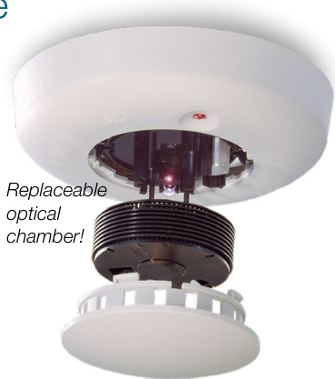  

When combined with EDWARDS CleanMe® -compatible smoke detectors, FireShield Plus provides intelligent features at a conventional price.  If a CleanMe® detector drifts out of the UL/ULC sensitivity range, EDWARDS's patented remote maintenance reporting sends an alert to the FireShield Plus control panel. This feature reduces the chance of a false alarm and simplifies service calls. In addition, CleanMe® -compatible smoke detectors have built-in drift compensation that extends the time between cleanings. If cleaning is ever necessary, it is literally a snap with EDWARDS's exclusive replaceable optical chamber.  

# Panel LED Display  

The following system LEDs display the panel’s status:  

•	 Alarm – panel is in the alarm state;   
•	 Trouble – panel is in the trouble state;   
•	 Supervisory – panel is in the supervisory state;   
•	 Power – indicates the status of the AC power source;   
•	 Disable – indicates when any IDC, NAC, relay or the DACT is disabled;   
•	 Annunciator Trouble – indicates trouble on the remote annunciator bus;   
•	 Battery Trouble – indicates battery or charging problems;   
•	 Ground Fault – indicates a short between any panel circuit and ground;   
•	 Walk Test – indicates that one or more IDCs are in the walk test mode;   
•	 Alarms Silenced – indicates that the panel is in the alarm state with one or more NACs silenced.   
•	 Waterflow – indicates that one or more circuits have detected an active waterflow switch.   
•	 Service Detector – indicates the presence of a dirty detector.   
•	 Remote Disconnect – indicates off site communication has been disabled.  

# Each IDC has a disable switch and three LEDs:  

•	 Alarm – red – indicates that the IDC is in the alarm state; •	 Trouble – yellow – indicates that the IDC is in the trouble state or is disabled (when flashing); •	 Supervisory/Monitor – yellow – indicates that the IDC is in the supervisory state or the monitor state (when flashing).  

Each NAC also has a disable switch and a trouble/disable LED.  

# Status indication with the DACT/Dialer installed  

The dialer’s LCD display provides two lines $\times16$ characters of text.  For programming, the top line displays the programming step and the lower line displays the selected option. All system events are displayed on the LCD with custom zone messages. During normal operation, the LCD will display any off-normal condition present in the panel.  

# IP and Cellular Communications  

Several popular third-party IP/Cellular communicators have been tested with the FSP conventional control panels and are compatibility listed to UL864. The IP/Cellular communicators meet NFPA72 2013 edition requirements for sole or secondary transmission paths. Using IP/Cellular communicators can reduce the cost of ownership by eliminating POTS lines. Please see the FSP conventional control panel compatibility documentation part number 3101019-EN for a full list of compatible communicators.  

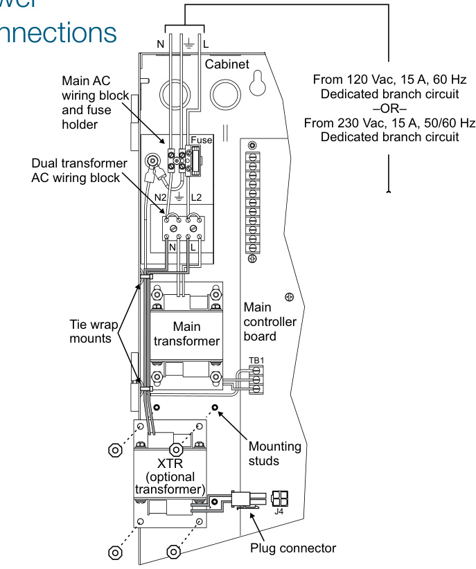  

# Options  

# Off-premise communication  

A fully integrated FireShield Plus DACT/dialer is available for reporting events to a monitoring facility. The DACT also supports uploading or downloading of system configuration, status and event history.  The DACT is programmable for either single or dual line operation. It also supports split and dual reporting for two digital alarm receivers.  

The DACT brings additional features to the panel including a 32-character alphanumeric LCD display, local or remote PC programming and an event history log.  

# Remote Annunciators and Relays  

The serial bus standard on all FireShield Plus models is another installation time-saver. This circuit allows the connection of Remote System Indicators (FSRSI), Remote Zone Indicators (FSRZI-A, FSRZI-SA) and Remote Relay Modules (FSRRM24) over a four-wire (data and power) circuit. Annunciator and relay modules can be installed up to 1,000 feet from the panel on 18-gauge wire.  

Modules are also available for City Tie (CTM) and Reverse Polarity (RPM) connections.  

# DACT/Dialer  

# Remote Relay Module  

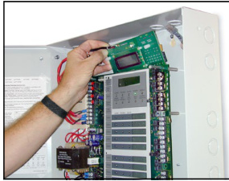  

The DACT/Dialer installs behind the front panel display.  

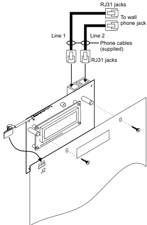  

The optional DACT/Dialer is a multifunction module that provides communications, modem capability, and LCD display functions. Its primary function is as a Digital Alarm Communicator Transmitter (DACT). As a DACT, it transmits event messages to a Digital Alarm Communicator Receiver (DACR) at a monitoring facility. The monitoring facility then notifies the fire department and other responsible parties of the event. Programmable options include single or dual line operation, and split or dual reporting to two DACRs.  

Note: All panel versions are available with factory installed DACT. See order table for ordering information.  

The DACT module can also be used as a modem to connect the panel to both local and remote computers for uploading and downloading of configuration data (programming), panel status and event history. For security, the modem can be configured to accept programming on incoming calls or it can be required to call a preprogrammed number before accepting downloads and sending uploads.  

The DACT module can be configured to work as all of the above, or as only an LCD display or LCD display and modem.  

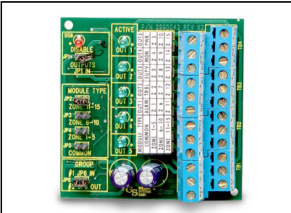  

The Remote Relay Module mounts on a plastic track inside an MFC-A cabinet.  

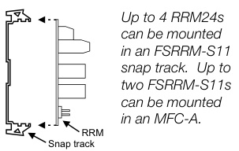  

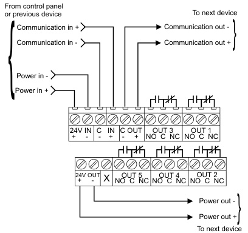  

The Remote Relay Module (FSRRM24) is one component of the system that sets FireShield Plus apart from other panels in its class. This module has five Form C relays rated at 1 amp each. It can be configured to function in either a zone relay mode or a common system mode.  

When configured in the zone relay mode, relays energize when the associated IDC is active. The module can be configured for activation by IDCs 1 through 5 or IDCs 6 through 10. One relay is automatically associated with each IDC.  

When configured in the common mode, relays energize or deenergize when the panel changes state. One relay is available for each of the following functions: Alarm, Supervisory, Trouble, Power Loss, Monitor.  

The FSRRM24 mounts on a plastic snap track and can be installed in an MFC-A or other listed fire alarm enclosure. The panel will support two RRMs of each configuration for a total of six on the 10-zone panel.  

# Remote Annunciators  

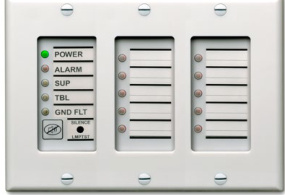  

The FireShield Plus family has several remote annunciation options. The serial remote annunciator bus can be run up to 1000 feet $(305\;\mathsf{m})$ on untwisted non-shielded 18-gauge cable. Serial annunciator models round out the family to provide a range of features and functions. As many as three annunciator modules may be mounted in a standard electrical box, sharing an attractive trim plate that blends with any decor.  

The FSRSI can be installed alone or with one or more FSRZIs.  The FSRSI and FSRZI-A require trim plates (ordered separately). These are available in one, two or three gang models. Each panel will support two FSRSIs.  

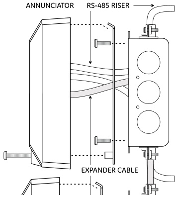  

# Remote System Indicator  

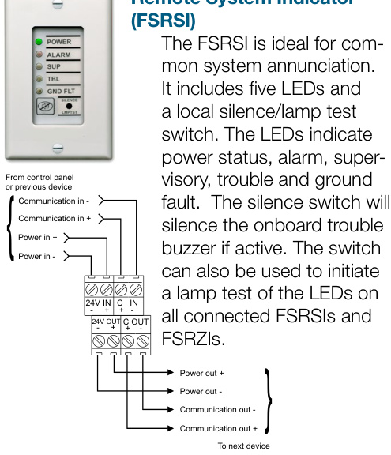  

# Remote Zone Indicator (FSRZI-A)  

The FSRZI-A is used to indicate zones in the alarm state. It contains five red LEDs. Depending on the jumper setting selected, the LEDs will indicate either IDCs 1 through 5 or IDCs 6 through 10. The panel can support two modules programmed for each selection.  

# Remote Zone Indicator (FSRZI-SA)  

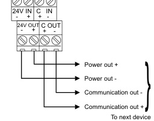  

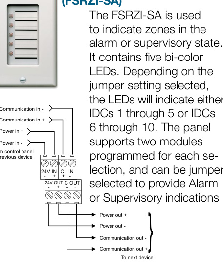  

# FSRA10, FSRA10C Remote LED annunciators  

The FSRA10 is a remote annunciator with capacity for up to ten zones. It includes ten bi-color LEDs  (red/yellow) for indicating active zones, and ten yellow LEDs for indicating zone troubles. The (C) option adds common control switches. Both versions mount to standard North American 4-inch square electrical boxes.  A surface box is also available.  

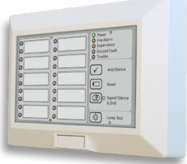  

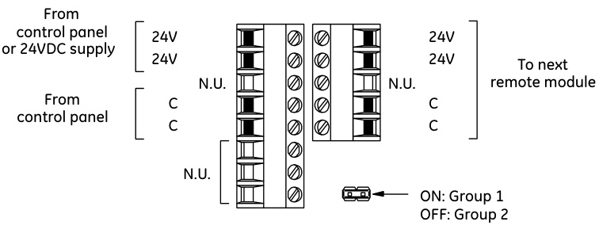  
FSRA10, FSRA10C Wiring  

# FSUIM Graphic Driver/Interface  

The FSUIM is a universal interface module that can be used by FireShield to drive graphic annunciators. It also allows FireShield control panels to control, or be controlled by, other control panels. The FSUIM provides five supervised switch inputs and nine dry contact relay outputs. Nine LEDs provide visual confirmation when each relay is energized. The FSUIM is shipped with a plastic snap track for mounting in an MFC-A cabinet or other listed fire alarm enclosure.  

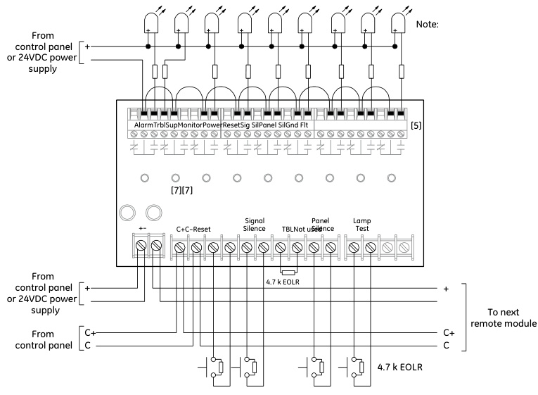  

<html><body><table><tr><td>General</td><td colspan="3"></td></tr><tr><td>Agency Listings</td><td colspan="3">UL864 (S3000),ULC-S527,CSFM,FDNY</td></tr><tr><td colspan="4"></td></tr><tr><td>Remote Annunciators</td><td colspan="2">FSRSI Remote System Indicator</td><td>FSRZI-A/FSRZI-SA Remote Zone Indicator</td></tr><tr><td>Maximum per System</td><td colspan="2">All panels: 2</td><td>10 zone panel: 4 5 zone panel: 2</td></tr><tr><td>Current Requirements</td><td>Standby: 17 mA Alarm: 56 mA</td><td>Standby: 8 mA</td><td>Alarm 76 mA</td></tr><tr><td>Voltage Range</td><td colspan="2">Minimum:18.8 Vdc;Maximum:27.3 Vdc</td></tr><tr><td>Maximum Circuit Capacitance</td><td colspan="2">0.03 μF</td></tr><tr><td>Maximum Circuit Resistance WireSize</td><td colspan="2">13 Ohms 18 -12 AWG (0.75 mm2 - 2.5 mm2)</td></tr><tr><td colspan="3">Mounting ANSI/NEMAOS1-19961-3gangelectricalbox</td></tr><tr><td colspan="3">Operating Environment Temperature: 32 - 120° F (0 - 49° C); Humidity: 93% RH, non-condensing</td></tr><tr><td colspan="3"></td></tr><tr><td></td><td>Configured for Zone Mode</td><td>Configured for Common Mode</td></tr><tr><td>RemoteRelayModule-FSRRM24</td><td>10 zone panel:4;5 zone panel:2</td><td>All panels: 2</td></tr><tr><td>Maximum per system</td><td>Standby: 10 mA; Alarm:70 mA</td><td>Standby:26 mA;Alarm:70 mA</td></tr><tr><td>Current Requirements</td><td colspan="2">Minimum: 18.8 Vdc; Maximum: 27.3 Vdc</td></tr><tr><td>Voltage Range</td><td colspan="2">1 A @ 30 Vdc</td></tr><tr><td>Contact Rating</td><td colspan="2"></td></tr><tr><td>Maximum Circuit Capacitance</td><td colspan="2">0.03 μF</td></tr><tr><td>Maximum Circuit Resistance Wire Size</td><td colspan="2">13 Ohms 18-12AWG (0.75mm2-2.5 mm2)</td></tr><tr><td>Mounting</td><td colspan="2">Single FSRRM24 mounts in plastic track (included) or up to four FSRRM24s in an FSRRM-S11 11" track ordered separately. FSRRM24s should be installed in an MFC-A or other listed fire alarm</td></tr><tr><td></td><td colspan="2">enclosure.</td></tr><tr><td>Operating Environment Dimensions</td><td colspan="2">Temperature: 32 - 120° F (0 - 49° C); Humidity: 93% RH, non-condensing 2-3/4"Wx3-3/8"H×1-1/2"D(65.9 mm W×85.7 mm H×38.1mm D)</td></tr><tr><td colspan="3"></td></tr><tr><td colspan="4">F-Series Remote Annunciators FSRA10 FSRA10C Compatibility 10-Zone Panels only</td></tr><tr><td colspan="4"></td></tr><tr><td></td><td colspan="2">No Yes</td></tr><tr><td>Common Controls Dimensions</td><td colspan="2">5-5/8"x 8%2"×1 %2" in(14.3 cm× 21.4 cm x 3.8 cm)</td></tr><tr><td>Mounting</td><td colspan="2">NorthAmerican 4-inch square electrical box or listed enclosure</td></tr><tr><td>Power Wiring</td><td colspan="2">18 to 12 AWG (0.75 to 2.50 sq mm)</td></tr><tr><td>Data Wiring</td><td colspan="2">18 to 12 AWG (0.75 to 2.50 sq mm) twisted pair (6 twists per foot minimum)</td></tr><tr><td></td><td colspan="2">18.8 to 27.3 Vdc</td></tr><tr><td rowspan="2">Operating voltage</td><td colspan="2">Supply must be UL/ULC listed for fire protective signaling systems. Do not use FACP accessory power outputs that are interrupted when the panel is reset.</td></tr><tr><td colspan="2">17 mA</td></tr><tr><td>Standby current Alarm current</td><td colspan="2">98 mA</td></tr><tr><td>Operating environment</td><td colspan="2"></td></tr><tr><td>FSUIM Universal Input Module</td><td colspan="2"></td></tr><tr><td colspan="3">Mounting MFC-Acabinetorlistedfirealarmenclosure</td></tr><tr><td>Wire size</td><td colspan="2">12 to 18 AWG (0.75 to 2.5 sq mm)</td></tr><tr><td>Operating voltage</td><td colspan="2">21.2 to 27.3 Vdc</td></tr><tr><td>Circuit capacitance</td><td colspan="2">0.03 μF, max.</td></tr><tr><td></td><td colspan="2">13 ohms, max.</td></tr><tr><td>Circuit resistance</td><td colspan="2"></td></tr><tr><td>Switch inputs</td><td colspan="2">Quantity: 5 End-of-line resistor: 4.7 k ohms V2 W</td></tr><tr><td>Relay outputs</td><td colspan="2">Quantity: 9 Type: Common Style: Form C</td></tr><tr><td></td><td colspan="2">30 Vdc at 1 A (resistive load)</td></tr><tr><td>Contact rating</td><td colspan="2"></td></tr><tr><td>Standby Curent</td><td colspan="2">53 mA</td></tr><tr><td>Alarm Current</td><td colspan="2">114 mA</td></tr><tr><td>Operating environment </td><td colspan="2">Temperature: 0 to 49 °C (32 to 120 °F); Humidity: 0 to 93% RH, noncondensing at 32 °C (90 °F)</td></tr></table></body></html>  

<html><body><table><tr><td colspan="2">Control Panels</td><td colspan="5">FSP1004</td><td colspan="3">FSP502</td></tr><tr><td colspan="2">Initiating Device Circuits - IDCs</td><td>Class B 10</td><td>8</td><td>6</td><td>4</td><td>2</td><td>0</td><td>5</td><td>3 1</td></tr><tr><td colspan="2">(Available combinations shown at right)</td><td>Class A</td><td>0 1</td><td></td><td>2 3</td><td>4</td><td>5</td><td>0</td><td>1 2</td></tr><tr><td colspan="2">Notification Appliance Circuits - NACs</td><td>Class B</td><td>4 2</td><td>2</td><td></td><td>0</td><td></td><td>2 0</td><td></td></tr><tr><td colspan="2">(Available combinations shown at right)</td><td>Class A 0</td><td>1</td><td>1</td><td></td><td>2</td><td>0</td><td>1</td><td></td></tr><tr><td colspan="2">Power Supply</td><td colspan="7">4.25 amps expandable to 7.5 amps 4.25 amps total</td></tr><tr><td colspan="2">NAC Voltage Rating</td><td colspan="5">24 Vfwr</td><td colspan="2"></td></tr><tr><td colspan="2">Maximum NAC current</td><td colspan="5">2.0 amps each， 3.5 amps total 7.0 amps w/ optional transformer</td><td colspan="3">2.0 amps each 3.5 amps total</td></tr><tr><td colspan="2">AC Input 120 Vac 60 Hz... 230 Vac 50/60Hz...</td><td colspan="5">2.2 amps w/ optional transformer 1.1 amps w/ optional transformer</td><td></td><td colspan="2">1.25 amps 0.6 amps</td></tr><tr><td colspan="2">BasePanel CurrentDraw Standby... Alarm...</td><td colspan="5">128 mA</td><td></td><td colspan="2">104 mA</td></tr><tr><td colspan="2">Panel Battery Charge Capacity</td><td colspan="5">242 mA</td><td></td><td colspan="2">224 mA Up to 24 Ah, 10 Ah max in</td></tr><tr><td colspan="2">(sealed lead acid only) Auxiliary Current</td><td colspan="5">Up to two 24 Ah batteries, 18 Ah in cabinet</td><td>0.5 amps max. May be programmed as resettable.</td><td colspan="2">cabinet *</td></tr><tr><td colspan="2">Auxiliary Output</td><td colspan="5"></td><td>24 Vdc regulated</td><td colspan="2"></td></tr><tr><td colspan="2">IDC Alarm Current</td><td colspan="5">3.0 mA (Consult detector compatibility list p/n 3101019-EN for maximum detectors per circuit)</td><td></td><td colspan="2"></td></tr><tr><td colspan="2">IDC Circuit</td><td colspan="5"></td><td>Maximum loop resistance: 13 Ohms; Maximum loop capacitance: 0.03 μF</td><td colspan="2"></td></tr><tr><td colspan="2">IDC Operating Voltage</td><td colspan="5"></td><td>16.9 to 29 Vdc</td><td colspan="2"></td></tr><tr><td colspan="2">UL Detector ID</td><td colspan="5"></td><td>100</td><td colspan="2"></td></tr><tr><td colspan="2">Alarm Contact (normally open Form C)</td><td colspan="5"></td><td colspan="4">30 Vdc @ 1 A (resistive load)</td></tr><tr><td colspan="2">Trouble Contact (Form C) Supervisory Contact (normally openForm C)</td><td colspan="5"></td><td colspan="4">30 Vdc @ 1 A (resistive load)</td></tr><tr><td colspan="2">Operating Environment</td><td colspan="5">30 Vdc @ 1 A (resistive load)</td><td colspan="4">Temperature: 32 - 120° F (0 - 49° C); Humidity: 5 - 93% RH,non-condensing</td></tr><tr><td colspan="2">Terminals (wire gauge)</td><td colspan="5"></td><td colspan="4"></td></tr><tr><td colspan="2">Asynchronous Serial Communications</td><td colspan="5"></td><td colspan="4">18 -12 AWG (0.75 mm2 - 2.5 mm2)</td></tr><tr><td colspan="2">Agency Listings</td><td colspan="5"></td><td colspan="4">Maximumresistance:13 Ohms;Maximum capacitance:0.03μF</td></tr><tr><td colspan="2"></td><td colspan="5"></td><td colspan="4">UL864 (S3000),ULC-S527,CSFM</td></tr></table></body></html>

\* If larger batteries are required, use an external battery cabinet.  

DACT – F-DACT (mounts in panel)   

<html><body><table><tr><td></td><td></td></tr><tr><td>Receivers</td><td>Supportstworeceiverswithtwophonenumberseach</td></tr><tr><td>CommunicationsProtocol</td><td>ContactID(SIADC-05),4/2(SIADC-02P3)</td></tr><tr><td>Programming</td><td>FrontpanelcontrolsorPCwithappropriatesoftware</td></tr><tr><td>Telephonelineconnection</td><td>TwoRJ31X(plug-to-plug)cordssuppliedwithDACT</td></tr><tr><td>Telephonelines</td><td>Twooroneloopstartlinesonthepublicswitchedtelephonenetwork.PulseorDTMF.</td></tr><tr><td>Telephonewallconnector</td><td>RJ31X/CA31Xequiv.orRJ38X/CA38Xequiv.</td></tr><tr><td>CommunicationsCompliance</td><td></td></tr><tr><td>OperatingEnvironment</td><td>Temperature:32-120°F(0-49°C);Humidity:93%RH,non-condensing</td></tr><tr><td>Currentrequirements</td><td>Standby:65mA;Alarm:107mA</td></tr><tr><td>AgencyListings</td><td>UL864 (S3000),ULC-S527,CSFM</td></tr></table></body></html>  

# Dimensions  

<html><body><table><tr><td>Model</td><td>D1*</td><td>D2</td><td>D3</td><td>D4</td><td>D5*</td></tr><tr><td>Five-zone</td><td>19.5 in (49.5 cm)</td><td>3.75 in (9.5 cm)</td><td>9.13 in (23.2 cm)</td><td>10.5 in (26.67 cm)</td><td>14.23in (36.14 cm)</td></tr><tr><td>Ten-zone</td><td>30 in (76.2 cm)</td><td>3.75 in (9.5 cm)</td><td>7.75 in (19.7 cm)</td><td>21.27 in (54.0 cm)</td><td>15.0 in (38.1 cm)</td></tr></table></body></html>

\*Add 1½ inches (3.81 cm) to D1 and D5 dimensions for trim kit.  

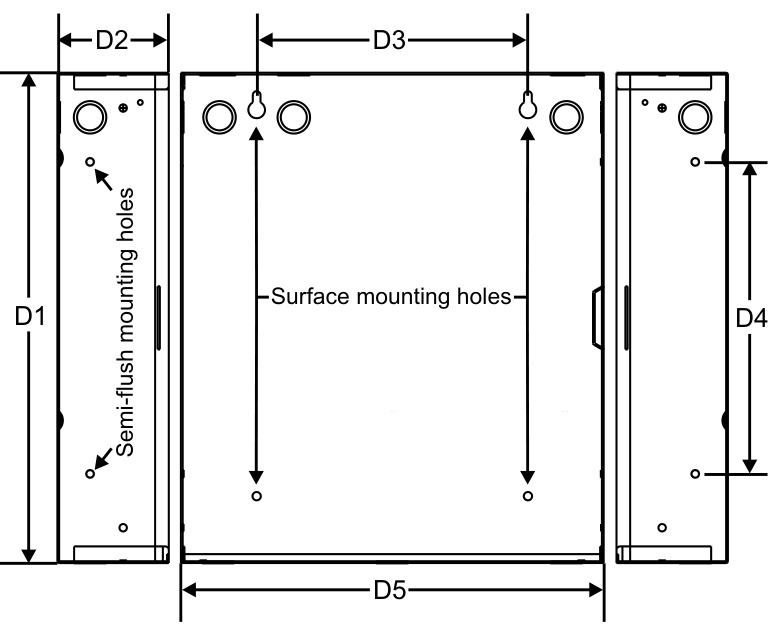  

<html><body><table><tr><td colspan="3">ControlPanels</td></tr><tr><td>FSP1004*</td><td>(PairsofIDCsandNACsconvertibletosingleClassAcircuits),120Vac</td><td>30.5 (13.8)</td></tr><tr><td>FSP1004-2</td><td>ConventionalFireAlarmControlPanel-1OClassBIDCsand4ClassBNACs</td><td>30.5 (13.8)</td></tr><tr><td>FSP502*</td><td>ConventionalFireAlarmControlPanel-5ClassBIDCsand2ClassBNACs (PairsofIDCsandNACsconvertibletosingleClassAcircuits),120Vac</td><td>18.5 (8.4)</td></tr><tr><td>FSP502-2</td><td>ConventionalFireAlarmControlPanel-5ClassBIDCsand2ClassBNACs (PairsofIDCsandNACsconvertibletosingleClassAcircuits),23OVac.Greycabinet</td><td>18.5 (8.4)</td></tr><tr><td>F-TRIM35*</td><td>Semi-flushtrimringforFSP302andFSP502</td><td>1.7 (0.8)</td></tr><tr><td>F-TRIM10*</td><td>Semi-flushtrimringforFSP1o04</td><td>2.2 (1.0)</td></tr></table></body></html>

\* Insert “G” for Gray cabinet or “R” for Red cabinet. Insert “F” for French language (grey cabinets, not available on 220v versions). Insert “GD” or “RD” for red and gray cabinets with dialer installed.  

<html><body><table><tr><td colspan="3">Relatedltems</td></tr><tr><td>F-XTR120</td><td>ExpanderTransformer, ；120Vac-ForFSP1004*only</td><td>4.0 (1.8)</td></tr><tr><td>F-XTR23O</td><td>ExpanderTransformer,230Vac-ForFSP1004*-2 only</td><td>4.0 (1.8)</td></tr><tr><td rowspan="2">EOL3.6-1.1</td><td>RequiredULlistedEndofLineResistors-One3.6KOhmandone1.1KOhm.</td><td>0.1 (0.5)</td></tr><tr><td>Onerequired for eachIDCconfigured as combination waterflow and supervisory.</td><td></td></tr><tr><td>EOL-P1</td><td>RequiredULClistedEndofLineResistorPlate-includesone1.1K,3.6Kand4.7KOhmresistor</td><td>1.0 (0.5)</td></tr></table></body></html>  

Off Premises Communications   

<html><body><table><tr><td>F-DACT Digital Communicator/Modem/LCD module (Mounts in control panel)</td><td>1.0 (0.5)</td></tr><tr><td>F-DACT1</td><td></td></tr><tr><td>RPM ReversePolarityModule</td><td>3.0 (1.36)</td></tr><tr><td>CTM</td><td>CityTieModule(Requires4”squareor2-gangNorthAmericanelectricalbox) 1.0 (0.5)</td></tr></table></body></html>  

Remote Annunciation   

<html><body><table><tr><td></td><td></td></tr><tr><td>FSRSI trouble sounder and silence/lamp test switch. Single gang trim plate included, multi-gang plates ordered Remote Zone Indicator - Includes red LEDs for five IDCs. Single gang trim plate included, multi-gang plates</td><td>0.3 (0.1) 0.3 (0.1)</td></tr><tr><td>FSRZI-A</td><td>ordered separately. Mounts in single or multi-gang North American electrical box. Remote Zone Indicator - Includes LEDs for five IDCs. Single gang trim plate included, multi-gang plates ordered</td></tr><tr><td>FSRZI-SA separately. Mounts in single or multi-gang North American electrical box. Jumper selected Alarm (red) or Supervisory (amber) indications.</td><td>0.3 (0.1)</td></tr><tr><td>FSAT1 AnnunciatorTrimPlate,1gang</td><td>0.1 (0.05)</td></tr><tr><td>FSAT2 AnnunciatorTrimPlate,2gang</td><td>0.1 (0.05)</td></tr><tr><td>FSAT3 AnnunciatorTrimPlate,3gang</td><td>0.1 (0.05) 0.1 (0.05)</td></tr><tr><td>FSAT4 AnnunciatorTrimPlate,4gang</td><td></td></tr><tr><td>FSRA10</td><td></td></tr><tr><td>FSRA10C Single Unit 10 zone remote annunciator for FSP1004 (with common controls)- Insert "F" after p/n for French language option FSUIM</td><td></td></tr></table></body></html>  

Remote Relay Module   

<html><body><table><tr><td rowspan="2">FSRRM24</td><td>0.4(0.2) RequiresMFC-Aorotherlistedfirealarmenclosure.</td></tr><tr><td></td></tr><tr><td>FSRRM-S11 11"Mounting track.Holdsup to 4FSRRM24s.</td><td>0.4(0.2)</td></tr></table></body></html>  

Accessories   

<html><body><table><tr><td>Part Description Number</td><td>Ship Wt. Ib. (kg-)</td></tr><tr><td></td><td></td></tr><tr><td>Cabinets</td><td></td></tr><tr><td>MFC-A</td><td>Multi-functionCabinet (fire alarm accessory enclosure) 7.0 (3.2)</td></tr></table></body></html>  

<html><body><table><tr><td colspan="2">Batteries</td></tr><tr><td>12V4A 4.5AhSealedLeadAcidBattery-12Vdc(2required)</td><td>5 (2.27)</td></tr><tr><td>12V6A5</td><td>7.2 AhSealedLeadAcidBattery-12Vdc (2required) 6 (2.72)</td></tr><tr><td>12V10A</td><td>11 Ah Sealed Lead Acid Battery - 12 Vdc (2 required) 10 (4.45)</td></tr><tr><td>12V17A</td><td>18AhSealed LeadAcidBattery-12Vdc(2required) 13 (5.90)</td></tr><tr><td>12V24A</td><td>26AhSealedLeadAcidBattery-12Vdc(2required) 20 (9.07)</td></tr></table></body></html>  

Programming Tools   

<html><body><table><tr><td>FA-CU</td><td>Fire alarm configuration utility.This CU is availablefor download from the myEDDlEwebsiteonly.Visithttps://myeddie.edwardsutcfs.com.</td></tr></table></body></html>  