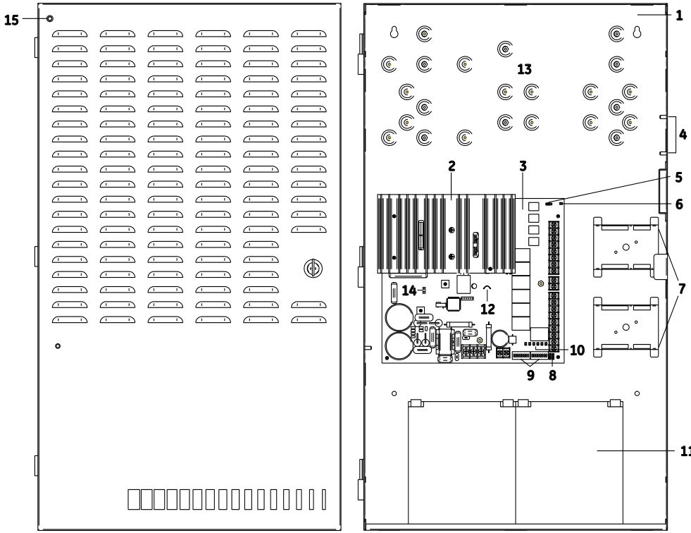
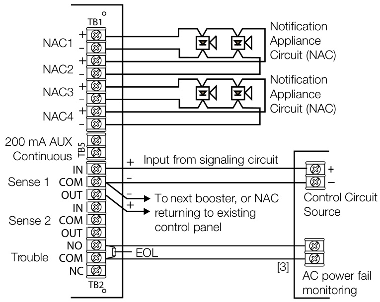
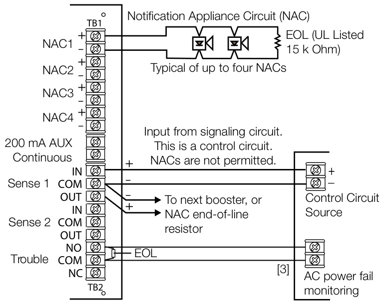
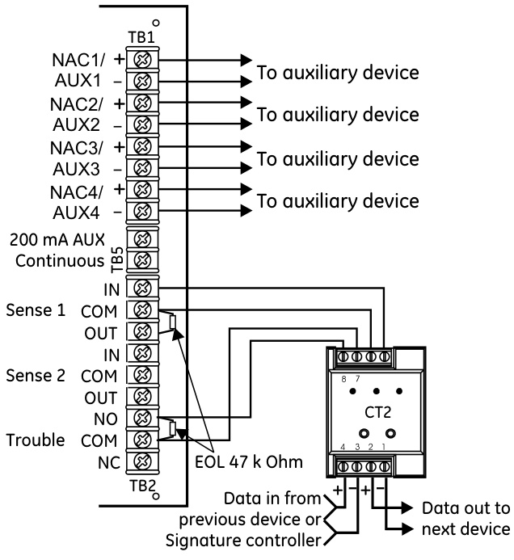
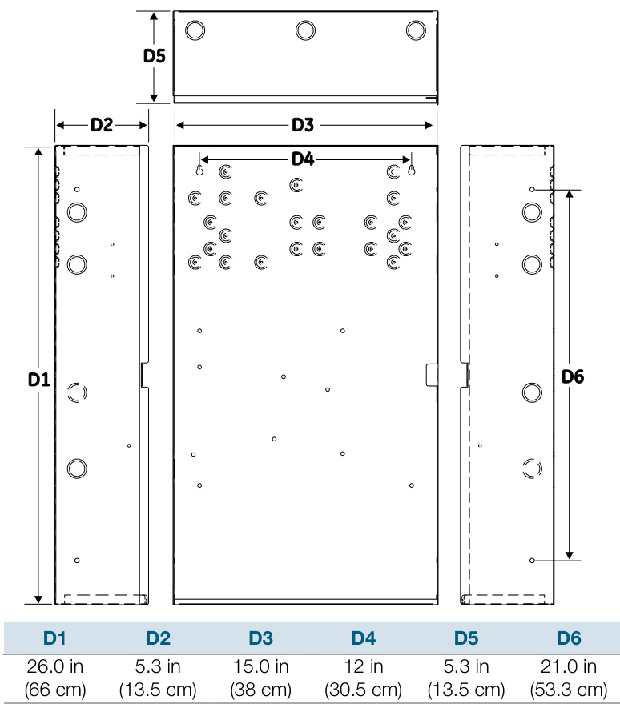

# Auxiliary Power Supplies APS6A, APS10A  

# Overview  

The Auxiliary Power Supply (APS) is a UL 864, 9th Edition listed power supply. It is a 24 Vdc filtered-regulated, and supervised unit that can easily be configured to provide additional notification appliance circuits (NACs) or auxiliary power for Mass Notification/ Emergency Communication (MNEC), as well as life safety, security, and access control applications.  

The APS contains the circuitry to monitor and charge internal or external batteries. Its steel enclosure has room for up to two 24 ampere-hour batteries. For access control-only applications, the APS can support batteries totaling up to 65 ampere-hours in an external enclosure. The APS has four Class B (convertible to two Class A) NACs. These can be activated in one or two groups from the APS’s unique dual input circuits. The APS has a doormounted AC power indicator LED.  

The APS also has room for and can power a number of different modules.  These can be Signature AA-30 or AA-50 dual-channel audio amplifiers, SIGA-UIO modules and/or SIGA-RELs.  A MN-BKRT3 can also be installed.  This bracket can accommodate an MN-NETSW1 Ethernet network switch, an MN-FVPN VoIP moduleand a MN-COM1S Communications module  

The APS is available in 6.5 or 10 ampere models. Each output circuit is has a capacity of three amperes; total current draw cannot exceed the unit’s rating.  

# Features  

Allows for reliable filtered and regulated power to be installed   
where needed   
Cost effective system expansion Provides for Genesis and Enhanced Integrity notification appliance synchronization   
•Supports coded output operation   
•Self-restoring overcurrent protection   
•Multiple signal rates   
•Can be cascaded or controlled independently   
•Easy field configuration   
•On-board diagnostic LEDs identify wiring or internal faults   
•Standard EDWARDS keyed lockable steel cabinet with removable door   
•110 and 230 Vac models available   
•Accommodates 18 to 12 AWG wire sizes   
•Optional tamper switch   
•Dual battery charging rates Optional earthquake hardening: OSHPD seismic pre-approval for component Importance Factor 1.5  

The APS meets current UL requirements and is listed as under the following standards:   

<html><body><table><tr><td>Standard(cCN) Description</td></tr><tr><td colspan="2">UL8649thed.ition(UOXX)FireAlarmSystems</td></tr><tr><td>UL636 (ANET, UEHX7)</td><td>HoldupAlarmUnitsandSystems</td></tr><tr><td>UL609(AOTX,AOTX7)</td><td>LocalBurglarAlarmUnitsandSystems</td></tr><tr><td>UL294 (ALVY, UEHX7)</td><td>AccessControlSystems</td></tr><tr><td>UL365(APAW,APAW7)</td><td>PoliceStationConnectedBurglarAlarmUnitsandSystems</td></tr><tr><td></td><td>UL1076(APOU,APOU7）ProprietaryBurglarAlarmSystemUnits</td></tr><tr><td>UL1610(AMCX)</td><td>CentralStationAlarmUnit</td></tr><tr><td>ULC-S527(UOXXC)</td><td>Control Units,FireAlarm(Canada)</td></tr><tr><td>ULC-S303(AOTX7)</td><td>Local Burglar Alarm Units and Systems (Canada)</td></tr><tr><td>C22.2No.205</td><td>SignalingEquipment(Canada)</td></tr></table></body></html>  

# Application  

The APS provides additional power and circuits for notification appliances and other 24 Vdc loads. It is listed for indoor dry locations and can easily be installed where needed.  

Fault conditions are indicated on the on-board diagnostic LEDs, opening the BPS input sense circuit and the trouble relay (if programmed). While this provides indication to the host system, the APS can still be activated upon command. A separate AC Fail contact is available on the APS circuit board, which can be programmed for trouble or AC Fail. There are seven on-board diagnostic LEDs: one for each NAC fault, one for battery fault, one for ground fault, and one for AC power.  

The unique dual-input activation circuits of the APS can be activated by any voltage from 6 to 45 VDC (filtered-regulated) or 11 to 33 Vdc (full-wave rectified, unfiltered). The first input circuit can be configured to activate 1-4 of the four possible outputs. The second input circuit can be configured to control circuits 3 and 4. When outputs are configured for auxiliary operation, these circuits can be configured to stay on or automatically deactivate 30 seconds after AC power is lost. This feature makes these circuits ideal for door holder applications. The APS also has a separate 200 mA 24 Vdc output that can be used to power internal activation modules.  

APS NACs can be configured for a 3-3-3 temporal or continuous output. California temporal rate outputs are also available on certain models. This makes the APS ideal for applications requiring signaling rates that are not available from the main system.  

In addition to the internally generated signal rates, the APS can also be configured to follow the coded signal rate of the main system NACs. This allows for the seamless expansion of existing NACs.  

At the top of the steel enclosure, the APS has space and mounting bosses for:  

Up to two SIGA-AA30 or SIGA-AA50 dual-channel audio amplifiers  

•	 One MN-BRKT3 with one MN-NETSW1 Ethernet switch, one MN-FVPN VoIP module, and one MN-COM1S communication module •	 One SIGA-UIO6 or SIGA-UIO6R module motherboard •	 Up to two SIGA-UIO2R module motherboards •	 Up to two SIGA-REL releasing modules •	 Up to two SIGA MP2L mounting plates modules  

The above devices are in addition to the three factory-installed Signature module mounting brackets to the right of the APS circuit board.  

# Engineering Specification  

Supply, where needed, EDWARDS APS Series Auxiliary Power Supplies (APS) that are interconnected to and supervised by the main system. The APS shall function as a stand-alone auxiliary power supply with its own fully-supervised battery compliment. The APS battery compliment shall be sized to match the requirements of the main system. The APS shall be capable of supervising and charging batteries having the capacity of 24 ampere-hours for Mass Notification/Emergency Communication (MNEC), life safety and security applications, and the capacity of 65 ampere-hours for access control applications.  

<<The APS shall be capable of installation for a seismic component Importance Factor of $1.5.>>$ The APS shall provide a minimum of four independent, fully supervised Class B circuits that can be field configurable for notification appliance circuits or auxiliary 24 Vdc power circuits. APS NACs shall be convertible to a minimum of two Class A NACs. Each APS output circuit shall be rated at 3 amperes at 24 VDC. Each output circuit shall be provided with automatically restoring overcurrent protection. The APS shall be operable from the main system NAC and/or EDWARDS Signature Series control modules. APS NACs shall be configurable for continuous, 3-3-3 temporal or optionally, California rate. Fault conditions on the APS shall not impede operation of main system NAC. The APS shall be provided with ground fault detection circuitry and a separate AC fail relay.  

# Cabinet Layout  

  

1 Enclosure: Houses the electronics and two standby batteries   
2 Heat sink: Distributes heat away from the circuit board   
3 Circuit board: Provides connections for all circuits   
4 Tamper switch standoffs: 3-TAMP mounting standoffs   
5 Jumper JP3: Ground fault enable or disable option   
6 AC LED: AC power on   
7 Mounting brackets: Option module mounting brackets   
8 Jumpers JP1 and JP2: Class A or Class B NAC option   
9 DIP switches: Two eight-position DIP switches used for configuration   
10	 Circuit LEDs: NAC, battery, and ground fault trouble LEDs   
11	 Batteries: Up to two 12 V 24 Ah batteries fit in the enclosure. For larger batteries, use an external battery cabinet (BC-1 or BC-2).   
12	 Jumper JP4: Battery charging jumper   
13	 Option module (SIGA-REL, SIGA-UIO6/6R/2, SIGAMP2L) and MN-BRKT3 mounting area   
14	 Remote LED wiring harness connection   
15	 Remote LED: Indicates AC power is on  

# NAC Class A wiring  

# NAC Class B wiring  

Connect one NAC circuit to one NAC output, either NAC1 or NAC3. Terminate the circuit at the NAC2 or NAC4 terminal screw, respectively.  

  

Connect a single NAC circuit to one NAC output. Terminate the circuit with a $15~\mathsf{k}$ Ohm EOL resistor.  

  

# NAC wiring notes:  

1.	 A trouble on the APS is sensed on the existing control panel’s NAC circuit causing a NAC trouble on that panel. This removes the need to separately monitor the trouble contact except for AC power failure (see [3] below). In an alarm condition, the APS allows NAC current to move downstream to devices connected to the existing control panel’s NAC circuit.   
2.	 Refer to the connected control panel’s documentation for more details on NAC wiring.   
[3]	 The AC power failure panel connection annunciates at the panel but does not report off premises for a predetermined time period in U.S. fire applications.  

# Trouble relay wiring with four AUX circuits  

When all four NAC/AUX circuits are configured as AUX circuits and DIP switch SW2-6 is ON, a SIGA-CT2 module must be used to monitor the sense 1 trouble contacts and the trouble relay.  

  

# Dimensions  

  

Specifications   

<html><body><table><tr><td>Model</td><td>6.5 amp APS</td><td>10 amp APS</td></tr><tr><td>AC Line Voltage</td><td>120VACor220-240VAC50/60Hz 390 watts</td><td>120VACor220-240VAC50/60Hz 580 watts</td></tr><tr><td>Sense voltage (input)</td><td colspan="2">6 to 45 Vdc, 11 to 33 Vrms (FWR and unfiltered DC)</td></tr><tr><td>Sense current (input)</td><td colspan="2">6mA@24Vdc,3mA@12Vdc,12mA@45Vdc</td></tr><tr><td>Input Current</td><td colspan="2">3mA @ 12Vdc, 6mA @ 24Vdc</td></tr><tr><td>(from an existing NAC) Booster Internal</td><td colspan="2">70mA+35mAforeach circuitsettoAUX</td></tr><tr><td>Supervisory Current BoosterInternalAlarm</td><td colspan="2">270mA</td></tr><tr><td>Current</td><td colspan="2"></td></tr><tr><td>NAC/AUX output voltage NAC/AUX output current</td><td colspan="2">19.1 to 26.85 Vdc 3.0 A max. per circuit (10 A or 6.5 A max. total for all NACs)</td></tr><tr><td></td><td colspan="2">(10 A or 6.5 A max. total for all AUXs) [2]</td></tr><tr><td>NAC/AUX class</td><td colspan="2">Class B or Class A</td></tr><tr><td>Wiresize</td><td colspan="2">18 to 12 AWG (0.75 to 2.5 sq mm)</td></tr><tr><td>NAC EOL</td><td colspan="2">UL: 15 k Ohm (P/N EOL-15) ULC: Use P/N EOL-P1 and select the 15 k Ohm resistor</td></tr><tr><td>Auxiliary output (continuous)</td><td colspan="2">1 dedicated 200 mA auxiliary output, not supervised by APS, included in total current</td></tr><tr><td>Common trouble relay</td><td colspan="2">Form C, 1 A, 30 Vdc (resistive)</td></tr><tr><td>Battery requirements [1]</td><td colspan="2">6.5 to24 Ahfor fire and up to 65Ah for security applications Under 10 Ah, cut JP4. 10 Ah or above, do not cut JP4.</td></tr><tr><td>Battery charger current limit</td><td colspan="2">1.2 A when the battery jumper wire is cut 2.1 A when the battery jumper wire is not cut</td></tr><tr><td>Operating environment Temperature</td><td colspan="2">32 to 120 F(0 to 49°C)</td></tr><tr><td>Humidity</td><td colspan="2">0 to 93% RH, noncondensing</td></tr><tr><td>Ground fault impedance</td><td colspan="2">10 k Ohm</td></tr><tr><td>Intended installation</td><td colspan="2">Indoor-dry</td></tr><tr><td>environment</td><td colspan="2"></td></tr></table></body></html>

[1] The maximum battery size the panel can charge is 24 Ah (12V24A or equivalent) for fire and security applications. [2] The maximum current is 8 amps for auxiliary circuits that operate when the panel is in standby.  

# Ordering Information  

<html><body><table><tr><td>CatalogNumber</td><td>Description</td><td>Shipping Wt. Ib (kg)</td></tr><tr><td>APS6A</td><td>6.5AmpAuxiliaryPower Supply</td><td rowspan="3">26 (11.8)</td></tr><tr><td>APS6A/230</td><td>6.5 Amp Auxiliary Power Supply (220V)</td></tr><tr><td>APS10A</td><td>10 Amp Auxiliary Power Supply</td></tr><tr><td>APS10A/230</td><td>10 Amp Auxiliary Power Supply (220V)</td></tr><tr><td colspan="2"></td></tr><tr><td>Related Equipment</td><td></td></tr><tr><td>MN-BRKT3</td><td></td></tr><tr><td>BC-1EQ APSEQ</td><td>SeismicKit forBC-1.OrderBC-1separately.See note3. SeismickitforAPS6AorAPS10AuxiliaryPowerSupplies.</td></tr><tr><td></td><td>See note 3</td></tr><tr><td>12V6A5</td><td>12 V, 7.2 Amp Hour Battery, two required 3.4 (1.6)</td></tr><tr><td>12V10A</td><td>12 V, 10 Amp Hour Battery, two required 9.5 (4.3)</td></tr><tr><td>12V17A</td><td>12V,18AmpHourBattery,tworequired 13 (5.9)</td></tr><tr><td>12V24A</td><td>12 V, 24 Amp Hour Battery, two required 20 (9.07)</td></tr><tr><td>12V40A</td><td>12 V, 40 Amp Hour Battery, two required (see notes 1,2) 32 (14.5)</td></tr><tr><td>12V50A</td><td>12 V, 50 Amp Hour Battery, two required (see notes 1, 2) 40 (18.14)</td></tr><tr><td>12V65A</td><td>12 V, 65 Amp Hour Battery, two required (see notes 1, 2) 49 (22.2)</td></tr><tr><td>3-TAMP</td><td>Tamper switch 1.0 (0.6)</td></tr><tr><td>BC-1</td><td>Battery Cabinet (up to 2 - 40 Amp Hour Batteries) 58 (26.4)</td></tr></table></body></html>  