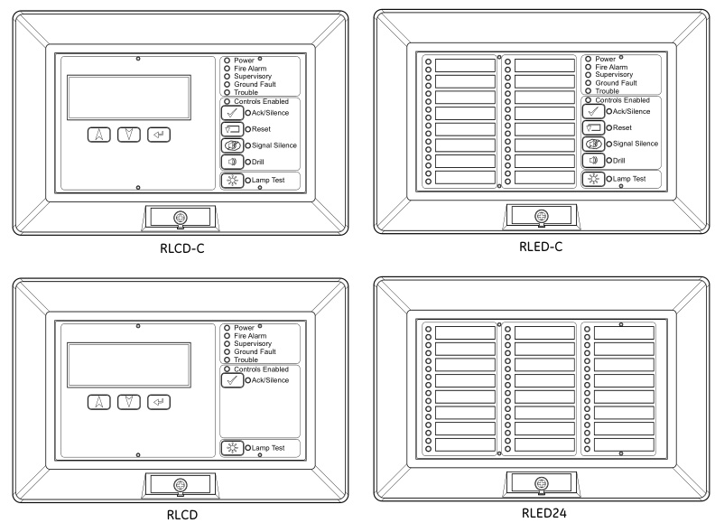
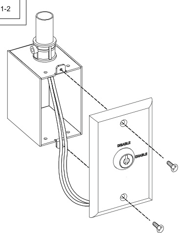
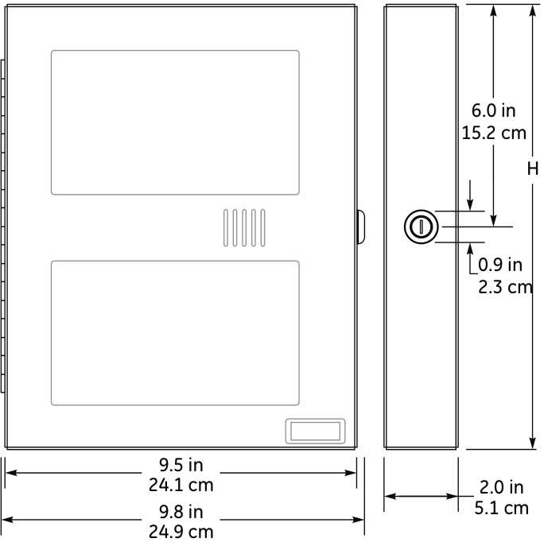

# R-Series Remote Annunciators RLCD, RLCD-C, RLED, RLED-C, RLED24, GCI  

# Overview  

EDWARDS R-Series Annunciators are high-performance remote annunciators that provide status indication and common controls for compatible fire alarm control panels, including iO-Series small analog fire alarm systems. This family of annunciators offers LCD or LED annunciation. Models are available with and without common controls.  

There are three R-Series annunciator models, plus an LED-based expander. Up to two expanders can be connected to any annunciator. The expander includes 24 pairs of LEDs that extend the capabilities of any of the annunciators.  

All annunciator models include status LEDs and an internal buzzer. Two models have an LCD text display, and one has 16 pairs of LEDs for zone annunciation. LCD models feature a large back-lit, four by twenty character per line, super-twist liquid crystal display.  

R-Series annunciators and expanders are mounted on a standard 4-inch square electrical box, using the included mounting ring. They can also be surface mounted in locking steel enclosures. Three different enclosures are available.  

A keyswitch and graphic annunciator interface is available for R-Series annunciator applications. The keyswitch enables or disables common controls. The graphic annunciator interface cards supports 32 LEDs and 16 switches on the graphic panel display.  

# Features  

•	 LCD models feature large $4\times20$ character backlit LCD display   
•	 LED models provide 16 pairs of LEDs for zone annunciation   
•	 Available expander extends capability with 24 pairs of LEDs   
•	 Up to two expanders may be wired to each annunciator   
•	 Status LEDs and internal buzzer standard on all models   
•	 Common controls available for LED and LCD display models   
•	 Available keyswitch for disabling common controls   
•	 Standard 4-inch square electrical box mounting   
•	 Class B or Class A RS485 wiring standard   
•	 One-, two-, and three-position enclosures available   
•	 Graphic Annunciator interface, includes common control, indicators and 32 LEDS   
•	 No programing required, set the address and unit receives all information from panel  

# Application  

R-Series annunciators communicate with the FACP on tChontroels  EnaRbledS‑485 data riser. This can be configured for Class A or Class B communication. Annunciators do not provide ground fault isolation.  

These annunciators are stand-alone units that can be powered by the FACP or by an approved power supply.  

  

<html><body><table><tr><td>Featuresby model</td><td>RLCD</td><td>RLCD-C</td><td>RLED-C</td><td>RLED24</td></tr><tr><td>Reset</td><td>√</td><td>√</td><td></td><td>二</td></tr><tr><td>Ack/Silence</td><td></td><td></td><td></td><td></td></tr><tr><td>Fire Alarm</td><td>√</td><td></td><td>√</td><td></td></tr><tr><td>Supervisory</td><td></td><td></td><td></td><td></td></tr><tr><td>Ground Fault</td><td>√</td><td></td><td>√</td><td></td></tr><tr><td>Trouble</td><td></td><td></td><td></td><td></td></tr><tr><td>Controls Enabled</td><td>√</td><td>√</td><td>√</td><td></td></tr><tr><td>Ack/Silence</td><td></td><td></td><td></td><td></td></tr><tr><td>Reset</td><td></td><td></td><td></td><td></td></tr><tr><td>Signal Silence</td><td></td><td></td><td></td><td></td></tr><tr><td>Drill</td><td></td><td></td><td>√</td><td>二</td></tr><tr><td>Lamp Test</td><td></td><td></td><td></td><td>二</td></tr><tr><td>LCD Display</td><td>√</td><td></td><td></td><td></td></tr><tr><td>Zone Active LEDs</td><td></td><td></td><td>16 *</td><td>24 **</td></tr><tr><td>Zone Trouble LEDs</td><td></td><td></td><td>16</td><td>24</td></tr><tr><td colspan="5">*zones13-16maybeselected asSupervisory onI064 **zones 13-16 and 29-32 may be selected as Supervisory on iO1000</td></tr></table></body></html>  

# Graphic Annunciator Interface  

The GCI  Graphic Annunciator Driver is an interface card that connects the fire alarm control panel to the display panel of an LED-based graphic annunciator.  

The annunciator card supports 32 LEDs and 16 switches on the graphic panel display. It includes status LEDs and an internal buzzer.  

The graphic interface is supplied with snap track mounting. It is attached to a plastic mounting rail that requires two EIA panels.  

The annunciator communicates with the FACP on the RS‑485 data riser. This can be configured for Class A or Class B communication. The annunciator does not provide ground fault isolation. It is a stand-alone unit that can be powered by the FACP or by an approved power supply.  

Graphic Annunciator Interface Specifications   

<html><body><table><tr><td>Alarmcurrent</td><td>146 mA at 24 Vdc (with 36 LEDs ON)</td></tr><tr><td>Standby current</td><td>36 mA at 24 Vdc (with no LEDs ON)</td></tr><tr><td>Maximum current</td><td>10 mA per LED</td></tr></table></body></html>  

# Annunciator Wiring  

Annunciator, Class A  

<html><body><table><tr><td>FACP</td><td rowspan="3"></td><td>Annunciator</td><td rowspan="3"></td><td>Annunciator</td></tr><tr><td>RS-485 CH1 + CH1 - CH2 + CH2-</td><td></td></tr><tr><td rowspan="5">CH1 (+) IN CH1 () IN</td><td rowspan="2"></td><td> CH1 (+) IN</td></tr><tr><td></td><td> CH1 (-) IN</td></tr><tr><td>CH1 (+) OUT</td><td></td></tr><tr><td>CH1 () OUT</td><td> CH1 (+) OUT</td></tr><tr><td></td><td> CH1 (-)OUT</td></tr><tr><td rowspan="5"></td><td rowspan="3">CH2 () IN</td><td>CH2 (+) IN</td><td> CH2 (+) IN</td></tr><tr><td></td><td> CH2 (-) IN</td></tr><tr><td></td><td> CH2 (+) OUT</td></tr><tr><td rowspan="3"></td><td>CH2 (+) OUT CH2 (-) OUT</td></tr><tr><td></td><td> CH2 (-) OUT</td></tr><tr><td>24V (+) IN 24V () IN</td><td>24V (+) IN 24V (-) IN</td></tr><tr><td rowspan="4">LISTED24VDC SUPPLY 24 VDC + 24VDC-</td><td rowspan="4">C 24V () OUT</td><td rowspan="2">24V (+) OUT</td><td></td></tr><tr><td> 24V (+) OUT</td></tr><tr><td></td><td> 24V (-) OUT</td></tr><tr><td>GROUND</td><td>GROUND</td></tr></table></body></html>  

Annunciator, Class B  

<html><body><table><tr><td rowspan="4">FACP RS-485</td><td></td><td></td><td rowspan="8"></td><td></td><td></td></tr><tr><td></td><td>Annunciator</td><td></td><td>Annunciator</td></tr><tr><td></td><td></td><td></td><td></td></tr><tr><td></td><td>> CH1 (+)IN</td><td></td><td>CH1 (+) IN CH1 (-) IN</td></tr><tr><td rowspan="4">CH1 + CH1 -</td><td></td><td>CH1 (-)IN</td><td></td></tr><tr><td></td><td>CH1 (+) OUT</td><td></td></tr><tr><td>CH1 (-) OUT</td><td></td><td>CH1 (+)OUT CH1 (-)OUT</td></tr><tr><td>CH2 (+) IN</td><td></td><td> CH2 (+) IN</td></tr><tr><td>LISTED24VDC SUPPLY</td><td></td><td>CH2 (-) IN CH2 (+) OUT</td><td></td><td>CH2 (-) IN CH2 (+) OUT</td></tr><tr><td rowspan="4">24 VDC + 24 VDC-</td><td></td><td> CH2 (-) OUT</td><td></td><td> CH2 (-) OUT</td></tr><tr><td></td><td> 24V (+) IN</td><td></td><td> 24V (+) IN</td></tr><tr><td></td><td> 24V ()IN</td><td></td><td> 24V () IN</td></tr><tr><td></td><td>24V (+) OUT 24V () OUT GROUND</td><td></td><td>24V (+) OUT 24V (-) OUT GROUND</td></tr></table></body></html>  

Expander   

<html><body><table><tr><td colspan="2" rowspan="2">Annunciator</td><td rowspan="2"></td><td colspan="3">First Expander</td><td rowspan="2"></td><td colspan="2">Second Expander</td></tr><tr><td>IN</td><td>OUT</td><td></td><td>IN</td><td>OUT</td></tr><tr><td>OUT V(-)</td><td></td><td></td><td>V (-)</td><td>V（-）</td><td></td><td>（一</td><td>V（-）</td><td></td></tr><tr><td>V(+)</td><td></td><td></td><td></td><td>V(+)</td><td>V（+）</td><td></td><td></td><td>V（+）</td></tr><tr><td>F</td><td></td><td></td><td>F</td><td>F</td><td></td><td></td><td></td><td>F</td></tr><tr><td>E</td><td></td><td></td><td>E</td><td>E</td><td></td><td></td><td></td><td>E</td></tr><tr><td>D</td><td></td><td></td><td>D</td><td></td><td>D</td><td></td><td>D</td><td>D</td></tr><tr><td>C</td><td></td><td></td><td></td><td>C</td><td>C</td><td></td><td>C</td><td>C</td></tr><tr><td>B</td><td></td><td></td><td></td><td>B</td><td>B</td><td></td><td>B</td><td>B</td></tr><tr><td>A</td><td></td><td></td><td></td><td>A</td><td>A</td><td></td><td></td><td>A</td></tr><tr><td></td><td></td><td></td><td></td><td></td><td></td><td></td><td></td><td></td></tr></table></body></html>  

# Remote Keyswitch  

<html><body><table><tr><td>Annunciator</td><td></td><td>LSRA-RK</td></tr><tr><td rowspan="2">KEYSWITCH (-) KEYSWITCH (+)</td><td></td><td>TB1-1</td></tr><tr><td></td><td>TB1-2</td></tr></table></body></html>  

  

<html><body><table><tr><td>KeyswitchSpecifications</td></tr><tr><td>Maximum 5Vdc voltage</td></tr><tr><td>Maximum 200 mA current</td></tr><tr><td>Mounting 2-1/2 in (64 mm) deep1-gangbox</td></tr><tr><td>Termination Screwterminals</td></tr><tr><td>Maximum 12AWG wiresize (2.5 mm sq)</td></tr><tr><td>Contact Normallyopen configuration</td></tr></table></body></html>  

# Annunciator Connections  

  

<html><body><table><tr><td colspan="2">DIP switchsettings</td></tr><tr><td>Switch</td><td>Descriptionandvalues</td></tr><tr><td>S1toS5 Network address</td><td>Theannunciatornetworkaddress(inbinary). The factory setting isfor address 2. Examples:10000=101000=211000=300100=4</td></tr><tr><td>S6Network baudrate</td><td>OFF=9600baud(factorydefaultsetting) ON=38,400baud</td></tr><tr><td>S7toS8</td><td>Notused</td></tr></table></body></html>  

# Annunciator Mounting  

  

# Annunciator Enclosures  

The RA Remote Annunciator Enclosures provide secure, surface mounted protection for annunciators and extenders. Each consists of a back plate, hinged cover, and key lock.  

The enclosures are 16-gauge welded steel with a white, painted finish. Each enclosure includes a security lock and two keys. The two- and three-position enclosures have wiring channels for correct routing of interconnections.  

The enclosures attach to a standard electrical box, and provide a mounting lip that takes the place of the integral mounting ring supplied with the annunciators and expanders.  

  

  

<html><body><table><tr><td colspan="2">Dimensions (Hx I Wx D)</td></tr><tr><td>RA-ENC1</td><td>6.3 x 9.8 x 2.0 in (16.0 x 24.9 x 5.1 cm)</td></tr><tr><td>RA-ENC2</td><td>12.0 x 9.8 x 2.0 in (30.5 x 24.9 x 5.1 cm)</td></tr><tr><td>RA-ENC3</td><td>17.7x9.8x2.0 in (45.0x24.9 9×5.1cm</td></tr></table></body></html>

Note: Allow approximately 2 inches $(50\;\mathsf{c m})$ ) clearance on both sides of the enclosure, to permit inserting and removing the $\mathsf{k e y,}$ and opening the door through 90 degrees.  

Specifications   

<html><body><table><tr><td></td><td>RLCD-C</td><td>RLCD</td><td>RLED-C</td><td>RLED24</td></tr><tr><td>Operatingvoltage</td><td colspan="4">24 VDC, continuous.</td></tr><tr><td>Standby current</td><td>99 mA</td><td>98 mA</td><td>28 mA</td><td>6 mA</td></tr><tr><td>Alarm current</td><td>115 mA</td><td>113 mA</td><td>62 mA</td><td>34 mA</td></tr><tr><td>RS-485communications</td><td colspan="4">ClassAorClassB,9600baud</td></tr><tr><td>Data wiring</td><td colspan="4">18 to 14 AWG (1.0 to 2.5 sq mm) twisted pair(6 twists per foot minimum). Maximum wire run is 4,000 ft. (1,219 m)</td></tr><tr><td>Remotekeyswitchcircuit</td><td colspan="4">5VDCat1mA,power-limited,unsupervised</td></tr><tr><td>Ground fault impedance</td><td colspan="4">0</td></tr><tr><td>Power wiring</td><td colspan="4">18 to 14 AWG (1.0 to 2.5 sq.mm)</td></tr><tr><td>Display area</td><td colspan="4">4 lines of 20 characters each</td></tr><tr><td>Dimensions (H x W x D)</td><td colspan="4">5-5/8 x 8-1/2 x 1-1/2 in. (14.3 × 21.4 x 3.8 cm)</td></tr><tr><td>Mounting</td><td colspan="4">NorthAmerican4-inchsquareelectrical boxor listed enclosure</td></tr><tr><td>Agency Listing</td><td colspan="4">UL, ULC</td></tr><tr><td>Operating environment</td><td colspan="4">Temperature:32to120°F(0 to49°C)Humidity:0 to93%RH, noncondensingat90°F(32°C)</td></tr></table></body></html>  

# Ordering Information  

<html><body><table><tr><td>Part</td><td>Description</td></tr><tr><td colspan="2">RemoteAnnunciators</td></tr><tr><td>RLCD</td><td>LCD text annunciator without common controls.English.</td></tr><tr><td>RLCD-R</td><td>LCD text annunciator without common controls. English. Red.</td></tr><tr><td>RLCDF</td><td>LCD text annunciator without common controls.French.</td></tr><tr><td>RLCD-C</td><td>LCD text annunciator with common controls. English.</td></tr><tr><td>RLCD-CR</td><td>LCD text annunciator with common controls.English.Red.</td></tr><tr><td>RLCD-CF</td><td>LCD text annunciator with common controls. French.</td></tr><tr><td>RLED-C</td><td>16-pair LEDzone annunciator with common controls.English.</td></tr><tr><td>RLED-CR</td><td>16-pair LED zone annunciator with common controls. English.Red.</td></tr><tr><td>RLED-CF</td><td>16-pair LED zone annunciator with common controls. French.</td></tr><tr><td colspan="2">Remote Expanders</td></tr><tr><td>RLED24</td><td></td></tr><tr><td>RLED24R</td><td>24-pairLEDzoneexpanderwithexpandercable and zone card insert.Red.</td></tr><tr><td colspan="2">Enclosures</td></tr><tr><td>RA-ENC1</td><td>One-position enclosure for Remote Annunciator.</td></tr><tr><td>RA-ENC2</td><td>Two-position enclosure for Remote Annunciator and one Remote Expander, including one interconnection cable.</td></tr><tr><td>RA-ENC3</td><td>including two interconnection cables.</td></tr><tr><td>LSRA-SB</td><td>SurfaceMount Box-for singleR Series annunciator.</td></tr><tr><td colspan="2">GraphicAnnunciatorDrivers</td></tr><tr><td>GCI</td><td>supv zones as well as inputs for common switches.Provided with a snap track for mounting in custom graphic enclosures.</td></tr><tr><td colspan="2">Accessories</td></tr><tr><td>RKEY Unlock).</td><td colspan="2">Remotekey switch on plate for enabling or disabling common controls (Lock/</td></tr><tr><td>27193-16</td><td colspan="2">Electrical box, surface mount, white, single-gang, for RKEY.</td></tr></table></body></html>  