# EST3X LifeSafety Control System  

# Description  

EST3X represents the latest generation of life safety control panels for mid to large sized applications. With large multi-message displays and innovative controls, intuitive interfaces, and bold colored cabinets — these systems capture the imagination, and catch the eye. But behind the LCD display is where they really shine.  

New microprocessors and chipsets take full advantage of the latest advances in computing technology, leading to smarter, faster, higher-capacity processing and more efficient designs. EST3X’s patented Voltage Boost  technology, for example, delivers consistent voltage – even at low battery power – resulting in lighter cable requirements and/or longer runs. That saves time and money.  

Meanwhile, advanced communications provide integrated IP communications via existing Ethernet networks directly to subscribed central stations. Email and text messaging options enrich this advanced communication environment with instant notification — anywhere, any time.  

High performance processing also leads to powerful networking features and versatile digital audio functionality. The wide range of EST3X configurations include standalone operation, networking with up to 64 nodes, or integration with an EST3 network comprising as many as 64 nodes — complete with mass notification capabilities and display of security events.  

EST3X sets a new standard in front-panel life safety control interfaces. Its exclusive SpeedTouch  rotary control offers nimble forward and back scrolling through events and options, while a mere tap of the control selects items with a clean fluidity of motion. Its extra-large  backlit display reveals up to eight concurrent messages, and switch/LED strips provide ample space for meaningful custom labels. And for end users, large tactile control buttons instill confidence and promote quick response when time is of the essence.  

# Standard Features  

Up to six intelligent analog loops hosting as many as 1,500 Signature Series devices per panel   
Optional integrated eight-channel digital audio   
10 amp power supply with universal 94 to 264 Vac input voltage   
•	 Patented Voltage Boost™ technology delivers consistent voltage — even at low battery power   
•	 Four built-in 3-amp notification/auxiliary circuits   
Large 24-line by 40-character backlit LCD   
Simplified operation with the SpeedTouch  rotary control   
•	 65 amp hour battery charger   
•	 64-node network nodes using copper and/or fiber   
•	 Supports up to 30 R-Series remote annunciators   
Part of an end-to-end audio solution suitable for low frequency signaling in sleeping areas   
Space for up to three additional option cards such as extra SLC loops, amplifiers, or dialer/modem Optional Ethernet Interfaces for central station communication, email, and diagnostics   
•	 1,100 event history log Optional earthquake hardening: OSHPD seismic pre-approval for component Importance Factor 1.5   
UL2572 Listed for Mass Notification, UL864 UUKL Listed for Smoke Control, UL864 Listed for releasing applications using SIGA-REL  

# Application  

Application flexibility is where EST3X’s computing power is put to best use. This generation of control panels is equally at home as the center of a simple single-building standalone system as it is when part of a sophisticated life safety network serving thousands of points across multiple buildings. Optional voice evacuation bridges the gap left by other mid-range systems.  

# Strong Networking  

Networking is among EST3X’s strong suits. Highly efficient RS485 connectivity, plus fiber-optic communications deliver faster response times and more sophisticated diagnostic capabilities, while cost-effective remote annunciation solutions keep basic monitoring and control always within reach.  

A simple EST3X network can comprise up to 64 nodes – enough to serve the needs of most campuses and larger buildings. Its ability to join an EST3 network with as many as 64 nodes extends EST3X’s reach into mass notification applications, security reporting, as well as making it an ideal candidate for retrofits.  

# High Capacity Audio  

EST3X features a full eight channels of integrated digital audio with up to two minutes of on-board programmable message storage. An optional high quality paging microphone gives live access to local, as well as remote, audio functions. Auxiliary inputs are available for mass notification operations, and ZA Series amplifiers may be mounted directly on the EST3X rail assem  

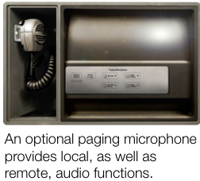  

# High Fidelity Audio Approved for Sleeping Areas  

EST3X is part of an end-to-end low frequency/high fidelity solution listed to UL 464 and UL 864. Its audio system approved for code-compliant 520 Hz signaling in sleeping areas when used in conjunction with:  

•a factory-supplied 520 Hz audio file one or more of the following amplifiers: 3-ZA20A, 3-ZA20B, 3-ZA40A, 3-ZA40B, 3-ZA95, SIGA-AA30, SIGA-AA50, 1B3- 125, or 1B3-250 one or more Genesis High Fidelity speakers  

Consult the EST3X Compatibility List for details.  

# Scalable IP and Cellular Communications  

Several popular third-party IP/Cellular communicators have been tested with the EST3X control panel and are compatibility listed to UL864. The IP/Cellular communicators meet NFPA72 2013 edition requirements for sole or secondary transmission paths. Using IP/ Cellular communicators can reduce the cost of ownership by eliminating POTS lines. Please see the EST3X control panel compatibility documentation part number 3101801-EN for a full list of compatible communicators.  

# Seamless System Integration  

EST3X borrows much from it’s larger sibling, the venerable EST3 Life Safety Platform. And for good reason: by integrating with the EST3 networking and computing environment, an EST3X control panel can serve as a cost-effective remote node for extinguishing, smoke control, or even mass notification functions — all within the same compliance framework.  

Retrofits and expansions benefit enormously from this arrangement, but programming and equipment management for new installations is equally efficient as a result of these shared resources. EST3X will accommodate up to three EST3 modules on its own rail assembly, giving it access to such proven EST3 successes as zoned amplifiers, conventional device circuits, modem communicators, and RS-485 functions. Meanwhile, installers familiar with EST3 configuration will find that the two systems share many of the same programming and diagnostic conventions.  

# Local and Remote Annunciation  

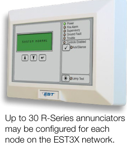  

Up to 30 R-Series LCD, LED annunciators and driver interface cards may be configured for each node on the EST3X network. No additional nodes are required for annunciation purposes. In addition, EST3X supports EST3 network annunciators, while GCI and GCIX driver interface cards provide cost-effective graphic annunciation solutions. And all annunciator inputs and outputs are easily programmable through the rules and labels function of EST3X’s Software Definition Utility.  

# Power to Count On  

EDWARDS’ patented Voltage Boost™ technology delivers a consistent 22.5 Vdc – even at low battery power. This means lighter gauge cable can be used for equivalent distances compared with conventional power supplies, or longer wire runs on the same gauge cable. Either way, this breakthrough technology saves time and equipment costs, making EST3X not only a high-performance solution — but a cost-effective one as well.  

EST3X’s four on-board Notification Appliance Circuits are fully synchronized to UL 1971 standards — without the need for external modules or other electronics. It’s ample 10-amp power supply is finely tuned to get the most out of EDWARDS’ widely-acclaimed low profile Genesis notification appliances.  

# Dimensions  

The backbox is designed for semiflush or surface mounting. Conduit and nail knockouts, keyhole style mounting holes, and wide wiring troughs facilitate efficiency during installation.  

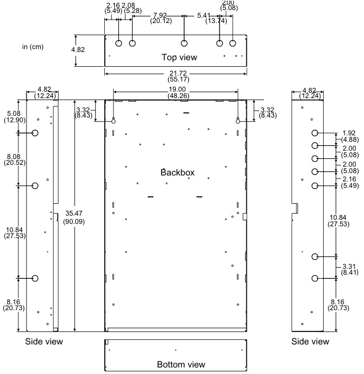  
Note: Add 0.25 in $(0.64\,\mathsf{c m})$ ). to height and width dimensions to allow for knockouts when framing in the backbox for semiflush mounting.  

# System Layout  

# Wiring  

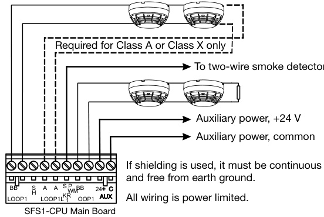  
Signature (initiating) Data Circuit  

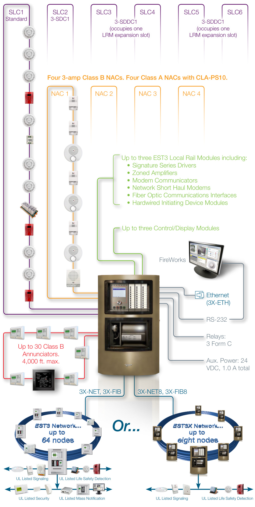  
Up to six intelligent analog loops hosting as many as 250 devices each.  

# Notification Appliance Circuits  

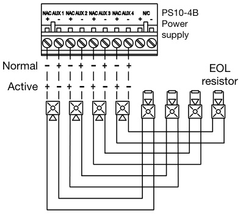  
Wiring is supervised and power limited. TB2 terminal marking indicates signal polarity when the circuit is active. Polarity reverses when the circuit is active. For proper circuit supervision, break the wire run at each notification appliance and install the EOL resistor at the end of the circuit. Do not loop wires around notification appliance terminals.  

#  Network data circuit  

<html><body><table><tr><td>OUT NETWORK IN A BB</td><td>AUDIO AUDIO AUDIO AUDIO T A IN A OUT B IN B OUT</td></tr><tr><td></td><td colspan="3">UOZ x BUS BUS</td></tr><tr><td></td><td colspan="3">SFS1-CPUMainBoard</td></tr><tr><td rowspan="2"></td><td></td><td></td><td>RS-485 A Tonext</td><td rowspan="2">RS-485 B</td></tr><tr><td></td><td></td><td></td></tr><tr><td colspan="2">ClassAorClass</td><td>X</td><td></td><td>network node</td><td></td></tr></table></body></html>  

#  Network data circuit, Class B audio  

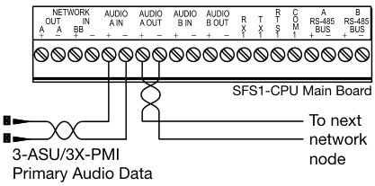  

#  Network data circuit, Class A or Class X audio  

<html><body><table><tr><td</table></body></html>  

# Main Component Assembly  

EST3X systems are designed for quick assembly and easy access in the field. Components are modular and require no special tools to service or replace.  

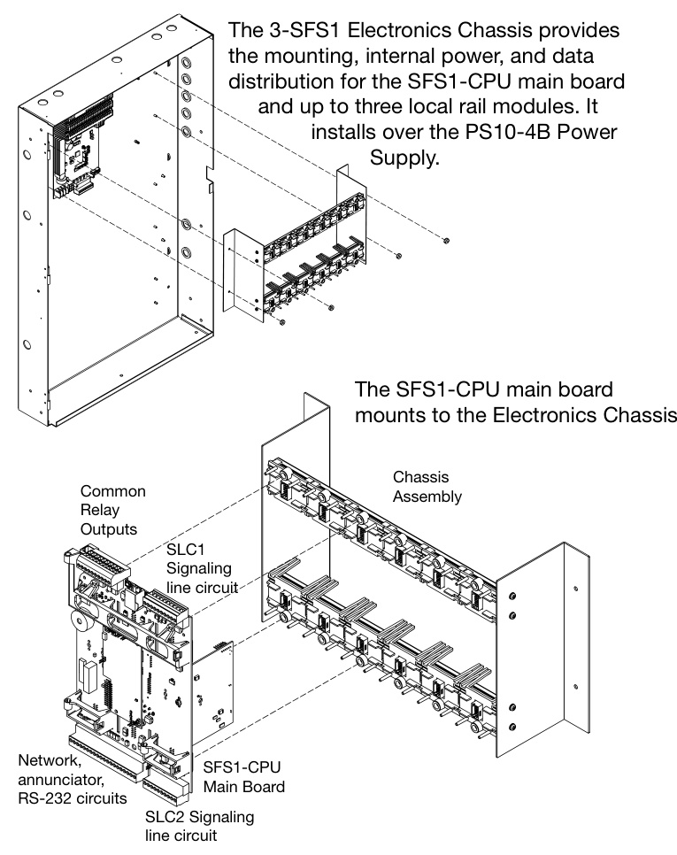  

# SFS1-CPU Main Board  

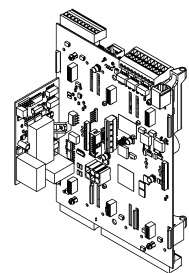  

The SFS1-CPU main board processes all information from modules installed within the cabinet as well as data received from other panels over the network data riser. When a network card is installed, the CPU employs a command set to determine its type.  

SFS1-CPU Specifications   

<html><body><table><tr><td>Voltage</td><td>24 VDC</td></tr><tr><td>Current</td><td></td></tr><tr><td>Standby</td><td>115mA at 24 VDC</td></tr><tr><td>Alarm</td><td>115 mA at 24 VDC</td></tr><tr><td>Relay outputs</td><td></td></tr><tr><td>Quantity</td><td>3 (alarm, supervisory, and trouble)</td></tr><tr><td>UL type</td><td>Common</td></tr><tr><td>Contact arrangement</td><td>Form C</td></tr><tr><td>Rating</td><td>30 VDC at 1 A resistive</td></tr><tr><td>AUX power outputs</td><td></td></tr><tr><td>Quantity</td><td>2</td></tr><tr><td>Voltage</td><td>24 VDC, resettable or continuous</td></tr><tr><td>Current</td><td>1.0 A each circuit, 1.0 A total</td></tr><tr><td>Data network (RS-485)</td><td></td></tr><tr><td>Nodes</td><td>2 to 64 (requires optional network card)</td></tr><tr><td>Performance class</td><td>Class A, Class X, or Class B</td></tr><tr><td>Wire type</td><td>Twisted pair, 6 twists per foot, min.</td></tr><tr><td>Circuit length Circuit resistance</td><td>5,000 ft. (1,524 m) between any three panels</td></tr><tr><td>Circuit capacitance</td><td>90 Ω, max. 0.3 μF, max.</td></tr><tr><td>Serial Port (RS-232)</td><td></td></tr><tr><td colspan="2">Theon-boardserialportsupportscommunicationtotheFireWorks graphical users interface or the FSB-PC series of protocols converters</td></tr><tr><td>forancillarycommunicationstoBMSsystems.</td><td></td></tr><tr><td></td><td>Circuit length20 ft. (6 m) max.</td></tr><tr><td>Circuit resistance</td><td>13 Ω,max.</td></tr><tr><td>Circuit capacitance</td><td>0.7 μF, max.</td></tr><tr><td>Annunciator port (RS-485)</td><td></td></tr><tr><td>Performance class</td><td>ClassBandRedundantClassB</td></tr><tr><td>Baud rate</td><td>9600and38400</td></tr><tr><td>Wire type</td><td>Twisted pair, 6 twists per foot, min.</td></tr><tr><td>Circuit length</td><td>4,000 ft. (1,219 m)</td></tr><tr><td>Circuit resistance</td><td>90 Ω, max.</td></tr><tr><td>Circuit capacitance</td><td>0.3 μF, max.</td></tr><tr><td>Signaling line circuit</td><td></td></tr><tr><td>Quantity</td><td>2 (second SLC requires optional 3-SDC1 card)</td></tr><tr><td>Performance class</td><td>Class A,Class X, or Class B</td></tr><tr><td>Circuit capacity</td><td>125 detectors,125 single address modules</td></tr><tr><td>Circuit resistance</td><td>100 Ω, max.</td></tr><tr><td>Circuit capacitance</td><td>0.5 μF, max.</td></tr><tr><td>Wire size</td><td>18 to 12 AWG (0.75 mm2 to 2.50 mm2)</td></tr><tr><td>Ground fault</td><td></td></tr><tr><td>impedance</td><td>10 kQ</td></tr><tr><td>Operating environment</td><td></td></tr><tr><td>Temperature</td><td>32to120°F(0to49°C)</td></tr><tr><td>Relative humidity</td><td>0 to 93% noncondensing</td></tr><tr><td>Notes</td><td></td></tr><tr><td>power supplies.</td><td>For battery calculations, standby and alarm currents include allisted primary functionalityandcannotbeusedforreportingtroublesoffpremisesperUL</td></tr></table></body></html>  

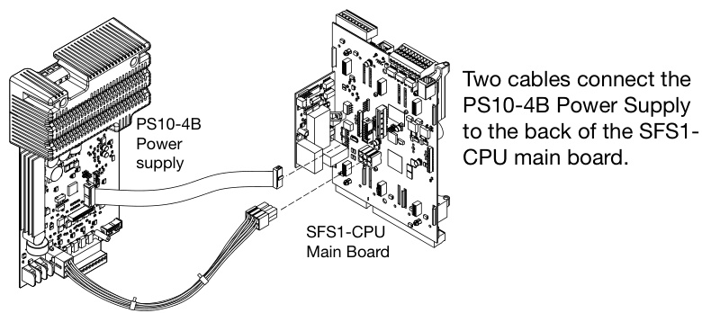  

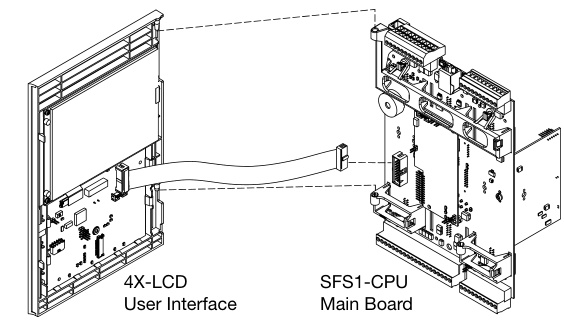  
The 4X-LCD assembly mounts to hinge pins on the CPU and connects with a single ribbon cable.  

# PS10-4B Power Supply Card  

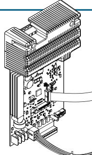  

The PS10-4B Power Supply Card provides the required power and related supervision functions for the control panel, as well as filtered, regulated power to the rail chassis modules. It also provides 24 VDC for operating ancillary equipment.  

PS10-4B Specifications   

<html><body><table><tr><td>Mains voltage</td><td>94to264VAC,50/60Hz</td></tr><tr><td colspan="2">AC Input Current</td></tr><tr><td>Standby</td><td>1.5 amps</td></tr><tr><td>Alarm</td><td>3.0 amps</td></tr><tr><td></td><td></td></tr><tr><td>Brownout level</td><td>93 VRMS</td></tr><tr><td>Battery charging capacity</td><td>65 Ah max. Voltage 24vdc</td></tr><tr><td>TotalPower Standby Current</td><td>88mA</td></tr><tr><td>Alarm Current</td><td>169mA</td></tr><tr><td>Supply Ratings</td><td>Current 10 amps (UL), 9.0amps (ULC)</td></tr><tr><td>Notification appliance/Auxiliary power circuits</td><td></td></tr><tr><td colspan="2">UL rating</td></tr><tr><td>Quantity 4</td><td></td></tr><tr><td>Circuit configuration</td><td>Class B1</td></tr><tr><td>Output voltage</td><td>Special:24 Vdc</td></tr><tr><td>Output current</td><td>Regulated:24 Vdc Special: 3 amps</td></tr><tr><td>EOLR Wiring</td><td>Regulated: 1.5 amps 15 kQ (UL P/N EOL-15, ULC P/N EOL-P1)</td></tr><tr><td colspan="2">Mains input2  Supervised, non power-limited</td></tr><tr><td>Battery input</td><td>tSupervised,non power-limited</td></tr><tr><td></td><td></td></tr><tr><td>NAC outputs</td><td>Supervised, power-limited 18 to 12 AWG (0.75 mm2 to 2.50 mm2)</td></tr><tr><td colspan="2">Wire size</td></tr><tr><td>Ground fault impedance</td><td>10 kQ</td></tr><tr><td>Operating environment</td><td></td></tr><tr><td colspan="2"></td></tr><tr><td>Temperature</td><td>32 to 120 F(0 to 49 °C)</td></tr><tr><td>Relative humidity</td><td>0 to 93% noncondensing</td></tr></table></body></html>

1Class A when a CLA-PS10 Class A adapter card is installed. 2 Connect the mains supply using a dedicated branch.  

# 3-SDC1 Signature Data Circuit Card  

Each 3-SDC1 Signature Data Circuit Card provides one Class A or Class B signaling line circuit (SLC1) that supports up to 125 Signature Series detectors and 125 Signature Series module addresses. These modules also provide connection for powering conventional two-wire smoke detector circuits on Signature Series modules.  

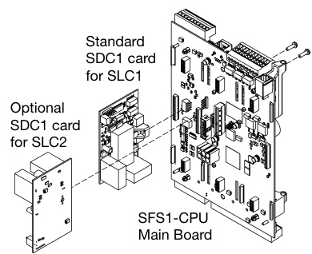  

EST3X comes standard with one 3-SDC1 card installed as SLC1. An optional second 3-SDC1 card may be installed to provide SLC2, thus doubling system signaling line capacity.  

# 3-SDC1 Specifications  

<html><body><table><tr><td>Voltage 24VDC</td></tr><tr><td>Operating currentwithfully loaded loop Standby3-SSDC1144mA;3-SDDC1264 mA</td></tr><tr><td>Alarm 3-SSDC1204 mA;3-SDDC1 336 mA</td></tr><tr><td>Smoke power 19.95 VDC max.1 Circuit</td></tr><tr><td>Configuration ClassB,ClassA,or ClassX Capacity 125SignatureSeriesdetectors and125</td></tr><tr><td>SignatureSeriesmodulesperSLC Resistance 100Qwith250devices</td></tr><tr><td>Capacitance 0.5 μF max.</td></tr><tr><td>Wiresize 12 AWG (1.5 mm2) max. Termination Removableplug-interminalstripsontheSFS1-CPU</td></tr><tr><td>mainboardandSignaturemodule Operatingenvironment Temperature32 to 120 °F (0 to 49°C) Relativehumidity0to93%noncondensing Forspecialapplications</td></tr></table></body></html>  

# 4X-LCD  

# User Interface  

Included in the EST3X basic package, the 4XLCD provides the user interface for the EST3X system. It connects to the SFS1-CPU main board with a ribbon cable, and attaches to the CPU via hinges. Only one display module is required to provide a point of control for the entire network. Additional displays can be added to any EST3X panel in the network to provide additional points of control.  

4X-LCD Specifications   

<html><body><table><tr><td colspan="2">Operatingcurrent</td></tr><tr><td>Standby Alarm</td><td>55mA 66mA</td></tr><tr><td>LCDdisplay</td><td>Backlitliquidcrystaldisplay240x320pixels 24linesof40characters</td></tr><tr><td>Operatingenvironment Temperature</td><td>32to120°F(0to49°C）</td></tr><tr><td>Relativehumidity</td><td>0to93%noncondensing</td></tr></table></body></html>  

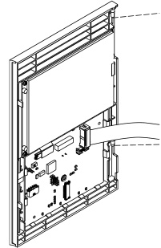  

# SFS1 LED Control/ Display Module  

The SFS1 LED Control/Display Module provides additional operator interface capability for the SFS1 system. It can be mounted on any of the three rightmost local rail modules on the 3-SFS1 electronics chassis. Inserts are provided for labeling switches and LEDs.  

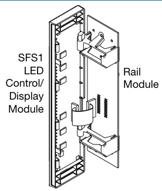  

SFS1 Specifications   

<html><body><table><tr><td colspan="2">Voltage 24VDC</td></tr><tr><td colspan="2"></td></tr><tr><td>Operatingcurrent Standby</td><td>2.0mAplus1.5mAforeachactiveLED</td></tr><tr><td>Alarm</td><td>2.0 mA plus1.5mA foreach activeLED</td></tr><tr><td>Operatingenvironment</td><td></td></tr><tr><td>Temperature</td><td>32to120°F(0to49°C)</td></tr><tr><td>Relativehumidity</td><td></td></tr><tr><td></td><td>Oto93%noncondensing</td></tr></table></body></html>  

# 3X-FIB fiber optic network module  

The 3X-FIB fiber optic network module gives an EST3X panel the ability to network 64 EST3X panels, or interface with an EST3 network. Class A, Class X and Class B connections are supported. The module consists of the adapter card and electronics card.  

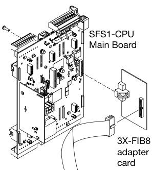  

The 3X-FIB supports the following fiber optic transceivers:  

# 3X-FIB8 fiber optic network module  

The 3X-FIB8 fiber optic network module gives an EST3X panel the ability to network up to eight EST3X nodes. Class A, Class X  and Class B connections are supported. The module consists of the adapter card and electronics card.  

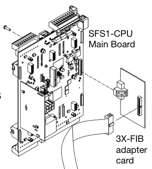  

The 3-FIB8 supports the following fiber optic transceivers:  

<html><body><table><tr><td>Model</td><td>Description</td></tr><tr><td>SMXLO2</td><td>Standardoutputsingle modefiber optictransceiver</td></tr><tr><td>SMXHI2</td><td>High output single modefiberoptictransceiver</td></tr><tr><td>MMXVR</td><td>Standardoutputmultimodefiberc optictransceiver</td></tr></table></body></html>  

The 3X-FIB provides terminals for connecting a 24 VDC backup power source to maintain data transmissions in the event the panel is powered down.  

Note: All networked panels must have the 3X-FIB network card installed.  

3X-FIB Specifications   

<html><body><table><tr><td>Voltage</td><td>19.2 to 27.6 VDC (24 VDC nominal)</td></tr><tr><td colspan="2">Fiber optics network and audio</td></tr><tr><td>Budget</td><td></td></tr><tr><td>SMXLO2</td><td> 15 dBm between two interfaces</td></tr><tr><td>SMXHI2</td><td>25 dBm max. and 8 dBm min.10 dBm</td></tr><tr><td></td><td>between two interfaces</td></tr><tr><td>MMXVR</td><td>50/125,62.5/125,or100/140 forMMXVR</td></tr><tr><td colspan="2">Cable type</td></tr><tr><td>Connectors</td><td>50/125,62.5/125,or100/140for</td></tr><tr><td>SMXLO2, SMXHI2</td><td>Type Duplex SC</td></tr><tr><td>MMXVR</td><td>Type ST</td></tr><tr><td colspan="2">Networkdatacircuit</td></tr><tr><td>Circuit configuration</td><td>Class B, Class A or Class X</td></tr><tr><td>Datarate</td><td>19.2 K, 38.4 kbps</td></tr><tr><td>lsolation</td><td>Isolated from previous panel CPU when using</td></tr><tr><td colspan="2">copper. Total isolation when using fiber optics. Digitized audio data circuit</td></tr><tr><td>Circuit configuration</td><td>Class B,Class A or Class X</td></tr><tr><td>Data rate 327 kbps lsolation</td><td>Isolated from previous panel CPU when using</td></tr><tr><td colspan="2">copper. Total isolation when using fiber optics. Copper wired network data circuit segment</td></tr><tr><td>Circuit Length5</td><td>5,000 ft. (1,524 m) max. between any three</td></tr><tr><td>Resistance</td><td>panels 90 Ω max.</td></tr><tr><td>Capacitance </td><td>0.3 μF max.1</td></tr><tr><td>Wire type</td><td>TwistedPair,18AWG(0.75mm2)min.</td></tr><tr><td colspan="2">Operating environment</td></tr><tr><td colspan="2">32.to.120°E(0.to.49°C)</td></tr></table></body></html>  

Relative humidity 0 to $93\%$ noncondensing  

1Include shield capacitance, if shielding is used.  

<html><body><table><tr><td>Model</td><td>Description</td></tr><tr><td>SMXLO2</td><td>Standardoutputsingle modefiber optictransceiver</td></tr><tr><td>SMXHI2</td><td>Highoutputsingle modefiber optictransceiver</td></tr><tr><td>MMXVR</td><td>Standardoutputmultimodefiberoptictransceiver</td></tr></table></body></html>  

The 3X-FIB8 provides terminals for connecting a 24 VDC backup power source to maintain data transmissions in the event the panel is powered down.  

Note: All networked panels must have the 3X-FIB8 network card installed.  

3X-FIB8 Specifications   

<html><body><table><tr><td>Voltage</td><td></td><td>19.2 to27.6VDC (24VDCnominal)</td></tr><tr><td colspan="3">Fiber optics network and audio</td></tr><tr><td>Budget</td><td>SMXLO2</td><td>15 dBmbetween two interfaces</td></tr><tr><td></td><td>SMXHI2</td><td>25 dBm max.and 8 dBm min. 10 dBm</td></tr><tr><td></td><td></td><td>betweentwointerfaces</td></tr><tr><td></td><td>MMXVR</td><td>50/125,62.5/125,or100/140forMMXVR</td></tr><tr><td colspan="3">Cable type</td></tr><tr><td>Connectors</td><td></td><td>50/125,62.5/125,or100/140for</td></tr><tr><td>SMXLO2, SMXHI2</td><td></td><td>Type Duplex SC</td></tr><tr><td></td><td>MMXVR</td><td>Type ST</td></tr><tr><td colspan="3">Networkdata circuit</td></tr><tr><td>Circuit configuration</td><td></td><td>Class B, Class A or Class X</td></tr><tr><td></td><td>Data rate</td><td>19.2 K, 38.4 kbps</td></tr><tr><td></td><td>Isolation</td><td> Isolated from previous panel CPU when using</td></tr><tr><td colspan="3">copper. Total isolation when using fiber optics. Digitized audio data circuit</td></tr><tr><td>Circuit configuration</td><td></td><td>Class B, Class A or Class X</td></tr><tr><td></td><td>Data rate</td><td>327 kbps</td></tr><tr><td></td><td>lsolation</td><td>1Isolated from previous panel CPU when using copper. Total isolation when using fiber optics.</td></tr><tr><td colspan="3">Copper wired network data circuit segment Circuit</td></tr><tr><td></td><td></td><td>Length 5,000 ft. (1,524 m) max. between any three</td></tr><tr><td>Resistance</td><td></td><td>panels 066</td></tr><tr><td>Capacitance 0.3 μF max.1</td><td></td><td></td></tr><tr><td></td><td></td><td>Wire type Twisted Pair, 18 AWG (0.75 mm2) min.</td></tr><tr><td colspan="3">Copper wired audio data circuit</td></tr><tr><td>Circuit</td><td></td><td></td></tr><tr><td></td><td>Length </td><td>5,000 ft. (1,524 m) max. between any three panels</td></tr><tr><td></td><td>Resistance</td><td>'x  06</td></tr><tr><td></td><td>Capacitance</td><td>0.09 μF, max1</td></tr><tr><td></td><td>Wire type</td><td>Twisted pair, 18 AWG (0.75 mm2) min.</td></tr><tr><td>Operating environment</td><td></td><td></td></tr><tr><td></td><td>Temperature</td><td>32 to 120 F(0 to 49℃)</td></tr><tr><td>Relative humidity</td><td></td><td>0 to 93% noncondensing</td></tr></table></body></html>

1Include shield capacitance, if shielding is used.  

# 3X-NET Network Adapter Card  

The 3X-NET network adapter card gives an SFS1-CPU main board the ability to network up to 64 nodes on an EST3 network. The card supports Class B, Class A, and Class X wiring.  

The 3X-NET adapter card provides two independent RS 485 circuits: one for network data communications and one for digital audio communications.  

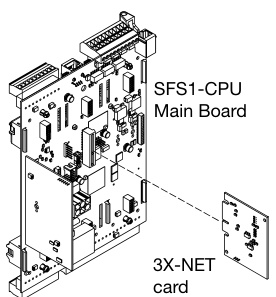  

3X-NET Specifications   

<html><body><table><tr><td>Voltage</td><td>24VDC</td></tr><tr><td>Operating Current Standby 98 mA at 24 VDC</td><td></td></tr><tr><td></td><td>Alarm98mA at 24VDC</td></tr><tr><td>Circuit configuration</td><td></td></tr><tr><td>Networkdata</td><td>Class A,Class X,or Class B</td></tr><tr><td>Networkaudio Isolation</td><td>Class A,Class X,or Class B</td></tr><tr><td>Networkdata Network audio</td><td>NetworkAportnot isolated;NetworkBport isolated</td></tr><tr><td></td><td>AudioA IN andAudioB INisolated AudioAOUTand AudioBOUTnot isolated</td></tr><tr><td>Wiresize</td><td>Twistedpair1 18AWG (0.75 mm) min.</td></tr><tr><td>Circuit length</td><td>5,000 ft.(1,524 m) between any three panels</td></tr><tr><td>Circuitresistance</td><td>90 Q max.</td></tr><tr><td>Circuit capacitance</td><td>Data:0.3μF max.;Audio 0.09 μF max.</td></tr><tr><td>Operatingenvironment Temperature</td><td></td></tr><tr><td></td><td>32to120°F(0to49°C)</td></tr><tr><td>Relativehumidity0to93%noncondensing 1Sixtwistsperfootminimum</td><td></td></tr></table></body></html>  

# 3X-NET8 network card  

The 3X-NET8 RS-485 network card gives an SFS1-CPU main board the ability to network through dedicated copper wire up to eight EST3X control panels. The card supports Class B, Class A, or Class X wiring.  

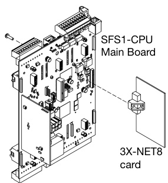  

Note: All networked panels must have a 3X-NET8 network card installed.  

# 3X-ETH Ethernet Adapter Cards  

Three optional Ethernet adapter cards are available for EST3X applications. Each of these provide specific features such as panel programming, diagnostics, and status monitoring, as well as central station connectivity, and email or emailto-text messaging capability.  

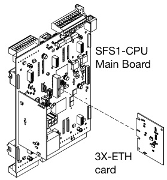  

<html><body><table><tr><td>Supported Icommunications</td><td>ETH1</td><td>ETH2</td><td>ETH3</td></tr><tr><td>CUcommunicationswiththePanelfor ProgrammingandDiagnosticFunctions</td><td></td><td></td><td></td></tr><tr><td>FireWorks S(ECP/IP) Gateway Communications</td><td></td><td></td><td></td></tr><tr><td>IP DialerCommunications</td><td></td><td></td><td></td></tr><tr><td>EmailandTextCommunications</td><td></td><td></td><td></td></tr></table></body></html>  

3X-NET8 Specifications   

<html><body><table><tr><td>Voltage 24VDC</td></tr><tr><td>Operating Current Standby 98 mA at 24 VDC</td></tr><tr><td>Alarm 98mAat24VDC Circuit configuration</td></tr><tr><td>Network data ClassA,ClassX,andClassB lsolation</td></tr><tr><td>Network data Network A port not isolated, Network B port isolated</td></tr><tr><td>Wire size Twisted pair1 18 AWG (0.75 mm) min.</td></tr><tr><td>Circuit length 5,000 ft. (1,524 m) between any three panels Circuitresistance 90 Ω max.</td></tr><tr><td>Circuit</td></tr><tr><td>0.3 μF max. capacitance</td></tr><tr><td>Operating environment</td></tr><tr><td>32to120F(0 to49°C) Temperature 0 to 93% noncondensing</td></tr><tr><td>Relative humidity 1Sixtwistsperfootmin.</td></tr></table></body></html>  

Each EST3X control panel supports up to eight IP services, which can provide con  
nection to any combination of the following functions: Programming FireWorks Graphical User Interfaces IP Dialer (IP-DACT) Email  

Each EST3X network supports up to: 10 ECP Connections, and; 100 Dialer Accounts, and; 100 Email Accounts (up to 20 email addresses per account).  

See Ordering Information for adapter card functional descriptions  

3X-ETH1, 3X-ETH2, 3X-ETH3 Specifications   

<html><body><table><tr><td>Ethernet 10/100Base-T</td></tr><tr><td>Voltage 24VDC</td></tr><tr><td>Operatingcurrent</td></tr><tr><td>Standby 42mAat24VDC Active 42 mA at24 VDC</td></tr><tr><td>Connectionmode Autonegotiation</td></tr><tr><td>Wireruns Distance 200 ft.(60 m)max. Type Cat 5</td></tr><tr><td>Connector RJ-45 Operatingenvironment</td></tr><tr><td>Temperature 32to120°F(0to49°C)</td></tr><tr><td>Relativehumidity 0to93%noncondensing</td></tr><tr><td></td></tr><tr><td>1Paneltocommunicationequipment</td></tr></table></body></html>  

3X-PMI Paging Microphone Interface The 3X-PMI Paging Microphone Interface provides controls for emergency voice/alarm communications. It consists of an audio mounting bracket, EAEC Emergency Audio Evacuation Controller card, audio enclosure, and paging microphone.  

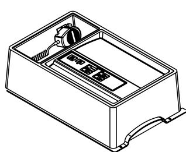  

3X-PMI Paging Microphone Interface Specifications   

<html><body><table><tr><td>Voltage Current Standby 23mA</td><td>24VDC</td></tr><tr><td>Alarm</td><td>29mA</td></tr><tr><td>Groundfaultimpedance</td><td>10 kQ</td></tr><tr><td>Wiresize</td><td>18 to12AWG (0.75 to2.50mm2)</td></tr><tr><td>Audiochannels Audioinputs</td><td>8 simultaneous</td></tr><tr><td>Local microphone Remotemicrophone</td><td>lsolatedandsupervised Isolatedandsupervised</td></tr><tr><td>Remote audio EAECcommunication</td><td>Isolated and supervised SeetheEAECEmergencyAudio</td></tr><tr><td></td><td>EvacuationControlInstallationSheet (P/N 3101789)</td></tr><tr><td>Messages</td><td></td></tr><tr><td></td><td></td></tr><tr><td>Storage Length</td><td>2 min.total 39 sec.max.</td></tr></table></body></html>  

SFS1-CPU   

<html><body><table><tr><td colspan="2">Common</td></tr><tr><td>PagingVolume ReadyToPage Paging Microphone</td><td>Indicatesrelativesignalstrengthduring active page Flashesduringpreannouncement tone,steadywhenreadytopage</td></tr><tr><td>All Call AllCallMinus PageToEvac</td><td>Activates/deactivatespagetoallareas Activates/deactivatespagetoareas notreceivingEVACorAlertmessage Activates/deactivatespagetoareas</td></tr><tr><td>Page To Alert</td><td>currentlyreceivingtheEVACmessage Activates/deactivatespagetoareas</td></tr><tr><td></td><td>currentlyreceivingtheAlertmessage</td></tr><tr><td></td><td></td></tr><tr><td>Operating environment</td><td></td></tr><tr><td></td><td></td></tr><tr><td>Temperature Relativehumidity</td><td>32to120°F(0 to49°C) 0to93%noncondensing</td></tr></table></body></html>  

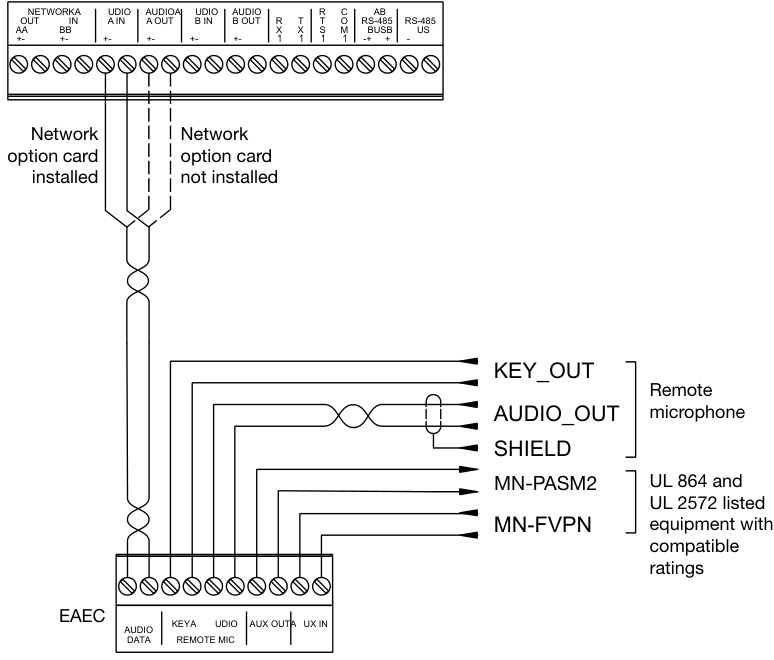  

# CLA-PS10 Class A Adapter Card  

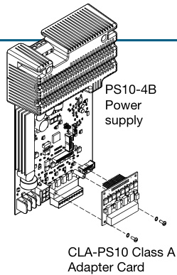  

The CLA-PS10 Class A Adapter Card is an optional card used to convert the four Class B notification appliance/auxiliary power circuits on the power supply card to Class A.  

# CLA-PS10 Specifications  

<html><body><table><tr><td>Voltage 24VDC</td></tr><tr><td>Notificationappliance/Auxiliarypowercircuits ULrating SpecialapplicationorRegulated Quantity 4</td></tr><tr><td>Performanceclass ClassA Output current Special3.0A;Regulated:1.5Aeachcircuit</td></tr><tr><td>EOLR 15 kQ (UL P/N EOL-15, ULC P/N EOL-P1)</td></tr><tr><td>Wiring Supervised,power-limited Wiresize 18 to12AWG(0.75mm2to2.50mm2)</td></tr><tr><td>Operatingenvironment</td></tr><tr><td>Temperature32to120°F(0 to49°C)</td></tr><tr><td>Relativehumidity0 to93%noncondensing</td></tr></table></body></html>  

Intelligent Analog Control Panels   

<html><body><table><tr><td>Model</td><td>DoorColor</td><td>Language</td><td>Description</td></tr><tr><td>3X-SFS1B</td><td>Bronze</td><td rowspan="3">English</td><td rowspan="3">FACP,completesystemwithuserinterface,CPU,oneloopwithsecond loopexpansion,threeoptioncard</td></tr><tr><td>3X-SFS1R</td><td>Red</td></tr><tr><td>3X-SFS1Bi</td><td></td></tr><tr><td>3X-SFS1Ri</td><td>Bronze Red</td><td rowspan="3">Selectable Flushtrimring</td></tr><tr><td>TRIM6</td><td></td></tr><tr><td></td><td></td></tr></table></body></html>  

<html><body><table><tr><td colspan="2"></td></tr><tr><td colspan="2">Network communication option cards</td></tr><tr><td>3X-NET8 3X-NET</td><td>RS485,eight node max.Class A,X or B network.Use on3-SFS systems only.</td></tr><tr><td></td><td>RS485, eight node max. Class A, X or B network. Use on 3-SFS systems only.</td></tr><tr><td>3X-FIB8</td><td>Fiber, 8 node max. Uses MMXVR, SMXHI2, SMXLO2. Use on 3-SFS systems only.</td></tr><tr><td>3X-FIB</td><td>FibermotherboardforconnectiontoEST3systems.UsedwithMMXVR,SMXHI2andSMXLO2.</td></tr><tr><td>SMXLO2</td><td>Standard output single mode fiber optic transceiver</td></tr><tr><td>SMXHI2</td><td>High output single mode fiber optic transceiver</td></tr><tr><td>MMXVR</td><td>Standard output multimode fiber optic transceiver</td></tr><tr><td colspan="2"></td></tr><tr><td></td><td>Communication Options(See 3X-ETH installation sheet P/N 3101794-EN for details on wiring specific applications.)</td></tr><tr><td>3X-ETH1</td><td>Ethernet Adapter, 10/100. Provides Ethernet connection from system to 3-SDU for remote programming and diagnostics, and to FireWorks computer graphics workstation.</td></tr><tr><td>3X-ETH2 3X-ETH3</td><td>EthernetAdapter,10/100.Provides thefunctionsof ETH1plusIPforcentral stationcommunications. Ethernet adapter card. Provides the functions of the 3X-ETH2 plus the added capability of sending email messages as well as SMS</td></tr><tr><td></td><td>text messages by means of email-to-text.</td></tr><tr><td colspan="2"></td></tr><tr><td>FrontPanel LED/Switch display modules</td><td></td></tr><tr><td>4X-12/S1GY</td><td>LED Display/Control Module - 12 Switches, 1 Green, 1 YELLOW LED per switch.</td></tr><tr><td>4X-12/S1RY 4X-12SR</td><td>LED Display/Control Module - 12 Switches, 1 RED, 1 YELLOW LED per switch.</td></tr><tr><td>4X-12RY</td><td>LED Display/Control Module - 12 Switches with 12 RED LEDs.</td></tr><tr><td>4X-24Y</td><td>LED Display Module - 12 pairs of LEDs (1 Red; 1 Yellow) LED Display Module-24YELLOW</td></tr><tr><td>4X-24R</td><td>LED Display Module - 24 RED</td></tr><tr><td>4X-6/3S1G2Y</td><td>LED/Switch Module - six groups of three Switches with one LEDeach.</td></tr><tr><td>4X-6/3S1GYR</td><td>LED/Switch Module - six groups of three Switches with one LED each.</td></tr><tr><td>4X-4/3SGYWR</td><td>LED/Switch Module, four groups of three switches and four LEDs. LED colors: Green, Red, Yellow and White.</td></tr><tr><td>4X-LKF</td><td>Label Kit, French</td></tr><tr><td colspan="2">Option Cards and Interfaces</td></tr><tr><td colspan="2">3X-PMI Paging Microphone Interface. See Note 1.</td></tr><tr><td>3-SSDC1 Single Signature Driver Controller, c/w one 3-SDC1</td><td></td></tr><tr><td>3-SDDC1</td><td>Dual Signature Driver Controller, c/w two 3-SDC1s</td></tr><tr><td>3-SDC1</td><td>Signature Device Card - expands the 3X base panel to two loops</td></tr><tr><td>3-SDC1-HC</td><td>3-SDC1-HC used with circuits thatcontain more than90 isolators.</td></tr><tr><td>3-ZA20A</td><td>20WattZonedAmplifierw/ClassA/BAudio&ClassA/B24VDCoutputs</td></tr><tr><td>3-ZA20B</td><td>20WattZonedAmplifierw/ClassBAudio&ClassB24VDCoutputs</td></tr><tr><td>3-ZA40A</td><td>40Watt Zoned Amplifier w/Class A/BAudio&ClassA/B 24VDC outputs</td></tr><tr><td>3-ZA40B</td><td>40WattZonedAmplifierw/ClassBAudio&ClassB24VDCoutputs</td></tr><tr><td>3-MODCOM</td><td>Modem/Dialer (DACT)</td></tr><tr><td>3-AADC1</td><td>AddressableAnalog Module</td></tr><tr><td>3-IDC8/4</td><td>Initiating Device Circuit Module</td></tr><tr><td>3-LDSM</td><td>LED Display Support Module. Provides interface for one LED/Switch display module.</td></tr><tr><td></td><td>Mounts in an option card slot where no Option cards are installed.</td></tr><tr><td>3-OPS</td><td>Off Premises Signaling module</td></tr><tr><td>CLA-PS10</td><td>ClassAAdapter,PS10NACs</td></tr><tr><td>CDR-3</td><td>PSNI Coder Module</td></tr><tr><td>GCI</td><td>Graphic Annunciator Driver Master, provides outputs for 32 LEDs and connection to common control switches and LEDs for R-Series annunciators.</td></tr><tr><td>GCIX</td><td>Graphic Annunciator Driver Expander, provides outputs for 48 LEDs and inputs for 24 switches.</td></tr></table></body></html>

Note 1:  For ULC 11th edition multiple command center applications  add MCC to the PMI SKUs as shown,   (3X-PMIMCC, 3X-PMIMCC-FR).  

<html><body><table><tr><td colspan="2">Accessories</td></tr><tr><td>PS10-4B</td><td>PowerSupply,Replacement</td></tr><tr><td>SFS1-ELEC</td><td>BaseElectronics,replacement</td></tr><tr><td>4X-LCD</td><td>Mainuserinterfaceassembly,monochrome.Eightline1/4VGALCD,fourcontrols plusrotaryknob.Englishlanguage.</td></tr><tr><td>4X-LCD-LC</td><td>Mainuserinterfaceassembly,monochrome.EightLine1/4VGALCD,fourcontrols plusRotaryknob.Insertablelanguage,shippedwithEnglishinserts.Orderalternate languagesseparately.</td></tr><tr><td>4X-DR 4X-CAB6D</td><td>Blankhingedlocalrailmoduledoor</td></tr><tr><td>4X-CAB6DR</td><td>Replacementdoor,bronze</td></tr><tr><td>CAB6B</td><td>Replacementdoor,red</td></tr><tr><td>CAB6BEQ</td><td>Backbox,black</td></tr><tr><td></td><td>SeismichardeningKitforbatteriesupto17Ah.</td></tr></table></body></html>

Note: For earthquake anchorage, including detailed mounting weights and center of gravity detail, please refer to Seismic Application Guide 3101676-EN. Approval of panel anchorage to site structure may require local AHJ, structural, or civil engineer review.  