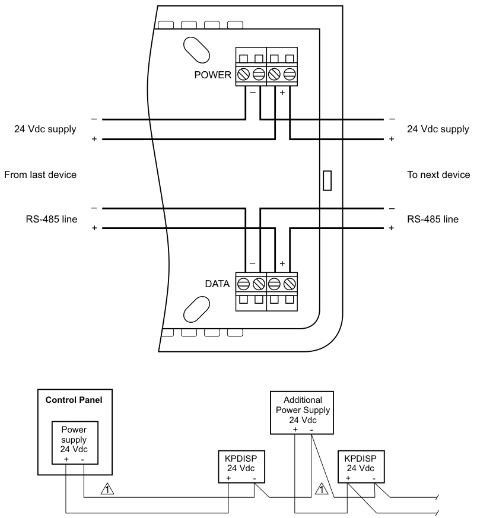

# Life Safety Keypad/Display KPDISP  

# Overview  

The KPDISP is a combination keypad and dot-matrix display designed for use with the EST3 integrated system. The unit features a large LCD display and telephone-style keypad housed in an attractive Cycoloy  case. A removable cover is provided to prevent accidental keypad activation and protect against dirt.  

The KPDISP transmits and receives information from/to the EST3 system. Communications between the KPDISP and the EST3 are fully supervised, providing the ultimate in reliability. KPDISP data is stored in non-volatile memory. Power to the KPDISP is provided by the EST3, ensuring a reliable, supervised and backed-up power source.  

The KPDISP supports bilingual operation, and can be programmed to automatically display the language of the user.  

The display is backlit, and lights whenever a key is pushed. An automatic timer extinguishes the light after a brief delay. The keypad features tactile and audible feedback and is backlit at all times. To aid in locating the keypad in the dark, the back lighting is visible even with the cover closed.  

# Standard Features  

•	 Listed for fire alarm (life safety) applications   
•$128\times64$ backlit dot matrix LCD display Telephone style keypad with tactile & audible feedback   
•Aesthetically pleasing design   
•Removable protective cover   
•200 users and 9999 pin codes   
•	 Supports bilingual operation Integral help function   
•	 Menu driven   
•	 Non-volatile memory   
•	 Electronic addressing  

# Application  

The KPDISP is a full-function life safety annunciator used to display fire alarm events. It’s unobtrusive design blends with any decor, while its pass code function permits only authorized users to retrieve system information.  

Each of up to 200 authorized users is assigned a pass code consisting of a unique three-digit number and a four-digit PIN number. Duplicate PINs are permitted by the KPDISP, so a user can pick a number that is easy for them to remember.  

All operations are menu-driven. In the event of a problem, contextsensitive help is readily available using a dedicated HELP button.  

# Installation  

The KPDISP is designed to facilitate installation in a wide variety of indoor applications. The unit can be mounted directly on a wall or using a $4^{\ast}$ or 100mm square or 2-gang electrical box. To ensure reliability, terminal blocks are provided for all wiring. One pair carries data in and out of the unit, while the second pair provides power. These specially-designed terminal blocks provide unique features aimed at maintaining system operation during commissioning or servicing. Should a KPDISP be removed from its rear mounting plate, the terminals automatically provide continuity to downstream devices. This helps ensure continued communication with the control panel, despite the removal of a KPDISP from the communication wiring path. The unit features electronic addressing so there are no jumpers or switches to set in the unit.  

# Engineering Specification  

# Typical Wiring  

  
1 Minus common from control panel must be maintained.  

Provide where indicated remote fire annunciators. The remote annunciator shall provide a back lit LCD display as well as back lighting of function keys.  

The display shall be capable of bi-lingual operation under the direction of the system controller and/or user password.  

The unit shall feature a backlit $128\times64$ dot matrix LCD readout. The keypad shall provide both tactile and audible user feedback to facilitate entry of information. User entries shall be menu driven, and capable of executing system commands. A context sensitive help system shall be available to the user at any time.  

All keypad/display addressing shall be electronic, jumpers or DIP switches shall not be considered as equivalent to electronic addressing. All data within the unit shall be stored in non-volatile memory to prevent data loss. The unit shall be constructed of a thermoplastic housing with integral (removable) cover, and be suitable for mounting directly on a finished wall or standard $4^{\mathfrak{m}}$ square or 2-gang electrical boxes. All wiring terminations shall be to an integral terminal strip.  

<html><body><table><tr><td>AgencyListings</td><td>OL,ULC.SeeNote1.</td></tr><tr><td>CircuitConfiguration</td><td>ClassAorClassB</td></tr><tr><td>PowerRequirements</td><td>24Vdc@38mA</td></tr><tr><td>WireSize</td><td>14AWG（1.5mm2)-22AWG(0.25mm2)</td></tr><tr><td>Dimensions(HWD)</td><td></td></tr><tr><td>Finish</td><td>Whitehigh-impactCycoloy?</td></tr><tr><td>Communications</td><td>RS-485</td></tr><tr><td>SupportedLanguages</td><td></td></tr><tr><td>OperatingEnvironment</td><td>0°Cto49°CComplete(32°Fto120°F)@0to93%RH,Non-condensing</td></tr><tr><td>Mounting</td><td>4"or100mmsquareor2-gangelectricalboxes</td></tr><tr><td>Users</td><td>200max.perKPDISP</td></tr></table></body></html>

Note 1:   
The EST3 is modularly listed under the following standards: UL 864 categories: UOJZ, UOXX, UUKL and SYZV, UL 294 category ALVY, UL 609 category AOTX, UL 636 category ANET, UL 1076 category APOU, UL 365 category APAW, UL 1610 category AMCX, UL 1635 category AMCX ULC-S527, ULC-S301, ULC-S302, ULC-S303, ULC-S304, ULC-S306, ULC/ORD-C1076, ULC/ORD-C693. Please refer to EST3 Installation and Service Manual for complete system requirements.  

# Ordering Information  

<html><body><table><tr><td>Catalog Number</td><td>Description</td><td>Shipping Wt., Ib (kg)</td></tr><tr><td>KPDISP</td><td>KeypadDisplay</td><td>1 (0.45)</td></tr><tr><td>KPDISP-CF</td><td>ConfigurationSoftwareCDROM</td><td></td></tr></table></body></html>  