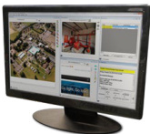

# FireWorks Incident Management Platform  

# Overview  

FireWorks is an incident management command and control platform that comprises hardware, software, and networking components that together provide a powerful and cohesive Mass Notification and Life Safety solution. Sophisticated networking technology allows it to integrate seamlessly with EDWARDS life safety solutions, yet FireWorks remains fully interoperable with third-party equipment, making it ideal for system upgrades or new installations alike.  

FireWorks can automatically trigger programmed responses to facility events, or it can act as an operator interface for manual control. The FireWorks user interface provides a clear, concise, and coordinated view of any situation by presenting information strategically.  

Five configurable graphical viewports offer simultaneous insight into different aspects of an incident, while the underlying software dynamically manages content in each viewport based on real-time events and user interaction. Facility maps, live video feeds, audio channels, protocol information, and fingertip control over vital equipment all come together instantly within view of an operator facing events that require solid information and split-second timing.  

Supporting every FireWorks workstation is a sophisticated network backbone—strong enough to handle coordinated critical control functions from as many as fifty client workstations and many other devices, yet flexible enough to manage integration with third-party mass notification systems.  

Redundant server options eliminate risk of communications breakdowns by providing alternate data paths that regenerate communications in the event of signal loss. FireWorks can operate on an existing local area network, or provide facility access from anywhere in the world via secured Virtual Private Network (VPN) connections.  

# Standard Features  

•	 Widely listed to prevailing Mass Notification and Life Safety standards Readily adopted for standalone or remote applications Listed for UUKL Graphical FSCS Applications Cost-effective and scalable graphical smoke control station   
Dynamic event-driven user interface Easy-to-follow notification and control protocols   
Software-only standalone versions Cost-effective annunciation where agency listings are not required   
Highly Sensitive Smoke Detector (HSSD) support Full command and control integration with VESDAnet detectors   
•	 FW-FAST Automatic System Configuration Generate interactive floorplans from engineering drawings and EDWARDS SDU files.   
•	 Email event notification to multiple recipients Instant communication with off-site personnel   
•	 Powerful HTTP/HTTPS communication engine Compatible with DRMNS and many other third-party systems   
•	 Password-defined user access and event filtering Control who sees what   
Use native graphic formats to create event maps Import most standard graphic formats—no conversion required   
Multi-lingual operation Supports English, Spanish, Portuguese, and French   
•	 Remote real-time WebClient Access system information from anywhere in the world  

# Application  

# Scalable Third-party Integration  

FireWorks is equipped with a powerful HTML/HTTP/HTTPS/XML Command Processor that supports integration for Distributed Recipient Mass Notification Systems (DRMNS) and many other third-party systems. It can also receive information from third-party systems by way of the FW-DARCOM (with Bosch D6600) option and/or with the MN-NETRLY4 input/output modules.  

FireWorks systems can send certain UL 2572 V1, Technical Category TC1, TC2, TC3 and TC4 outputs to third-party systems by way of the MN-FVPN VoIP, MN-NETRLY4 and/or SignatureSeries modules. The EDWARDS APS6A can be easily configured to support most third-party interfaces.  

# Dynamic Viewports  

# Image Viewport:  

Displays images relevant to the occurrence. Any event, any device, or any combination of devices and events can retrieve instant graphical information that is relevant to the occurrence and can be understood Event List Viewport: Upon receipt of a change of state, the event information is displayed in the Event List Viewport. If several events are received, all events are displayed in the Event List viewport  

  

# Flexible Email Messaging  

To enhance off-premise notification, FireWorks supports connection to a Simple Mail Transfer Protocol (SMTP) mail server, allowing event information to be emailed. This provides the ability to get event information automatically, efficiently and inexpensively to the people who need to know about events in facilities.  

Email messages can be configured based on individual events, event categories and more. Certain people can receive all system events, others can receive only alarm conditions, while still others can receive only specific events—the options are easy to configure and also to change.  

# Valuable Reporting Functions  

FireWorks report functionality allows the system administrator or other authorized user to create and retrieve panel reports. Reports include Panel Status, Disabled Points and Sensitivity. Meanwhile, a full history report generator allows the review of historical panel events.  

the system to have anywhere from two to five viewports visible  

overview of the event’s location in the context of its surroundings and the entire facility.  

tion, the Browser Viewport can be configured to automatically connect to emergency information sites, network accessible building automation, video streams, and other thirdparty systems.  

how to respond to the selected event, and also to acknowledge that these instructions have been carried out.  

FireWorks has a versatile Devices Test Report. This report allows for devices that have been tested as part of a Service Group to be included in a National Fire Protection Association (NFPA) Fire Alarm And Signaling Code (NFPA 72) formatted report.  

# Powerful Network Capabilities  

Up to 15 Graphical Command/Control   
WorkStations with Non-Redundant   
Server option   
Up to 50 Graphical Command/Control   
WorkStations with Redundant Server   
option   
Up to 15 concurrent Text-Only   
WebClient clients  

Up to 125 EST3(X) panel network nodes, with each system node having up to 64 networked panels for a total of 8,000 EST3(X) control panels. Each EST3 control panel can support up to 2,500 individual addressable points, this yields an addressable point count for FireWorks of 20,000,000 unique points just from EST3/3X systems. Up to 750 MN-FVPN Voice overInternet Protocol (VoIP) or MN-NETRLY4 Input/Output modulesUp to 1,000 iO Series panel connections via IPMON with up to 1000 points per system for up to 1,000,000 points from iO systems. DACR accounts with FW-DARCOM and Bosch D660 are limited by Bosch software options. Up to 20 VESDAnet networks with each network having up to 61 detectors in life safety mode (1,220 detectors) or 100 detectors in process monitoring mode (2,000 detectors)  

  
Redundant Network: up to 50 Client Workstations   
Non-redundant Network: up to 15 Client Workstations  

Utilizes Microsoft configuration requirements   
•System will support up to 50 client workstations System will have Primary, Backup, and Witness servers with automatic transfer from Primary to Backup Servers require a quorum to operate   
•Each EST3(X) Panel network requires one MN-COM1S to connect to thePrimary Server and one MN-COM1S to connect to the Backup Server All connections are supervised and will post faults across the network The network must have a dedicated VLAN with priority signaling Network switches must have UPS power   
Utilizes Microsoft configuration   
requirements   
System will support up to   
15 client workstations   
Each EST3 network requires one   
MN-COM1S to connect  
to the system server   
All connections are supervised and   
will post faults across the network   
The network must have a dedicated   
VLAN with priority signaling   
Network switches must   
have UPS power Large network capacity for global and enterprise-wide connectivity Compatible with third-party networks   
•UL/ULC Listed for Mass Notification and Security applications Easy-to-navigate event-driven viewport display Software-only versions do not require UL listed hardware Internet/WAN connectivity   
•Monitor and control for single or multi-line networks   
•HTTP/HTTPS communications engine   
•Automatic email notification to multiple recipients   
•Context-sensitive event action instructions   
•Create event maps with standard graphic formats Digital Alarm Receiver connectivity  

  

  
Example UL Listed Mass Notification: Scalable Third-party Integration  

# FW-FAST: Automatic System Configuration  

FireWorks Assimilation Systems Technology can significantly reduce the time and expense of programming or modifying a FireWorks system database. This unique and powerful option reads properly formatted AutoCAD and EDWARDS System Definition Utility (SDU) files to automatically create floorplans with device locations, and panel renderings with pseudo point touchsensitive areas. Floorplans and panel renderings can then easily be inserted into the FireWorks system.  

# FW-HSSX1: Aspirated Detection Interface  

FireWorks Highly Sensitive Smoke Detector (HSSD) interface provides UL Listed/FM Approved digital command/control integration with Xtralis VESDA® Series smoke detectors for very early fire detection. FireWorks can respond to individual sector/pipe conditions, detector events, as well as minor and major faults across 20 VESDA nodes encompassing as many as 2,000 VESDA detectors. It can also reset and perform certain other control functions of the VESDAnet detectors.  

  

# FW-DARCOM: Third-party Interoperability  

This option allows for a FireWorks system to support Digital Alarm Communicator Receiver (DACR) operation. The DACR can be any Bosch D6600 DACR that can receive Security Industry Association (SIA) Contact ID or 4/2, or the cost-effective IPMON1000 option. The FW-DARCOM option with the D6600 allows FireWorks to receive, display and process information from most third-party fire alarm and/or security panels.  

# IPMON1000: Life Safety Integration  

When used in conjunction with FW-DARCOM software, this option supports digital connection to up to a total of 1,000 EDWARDS iO Series control panels for receive-only Contact ID operation. Each individual zone or addressable device can display on the FireWorks system.  

# WebClients: Global VPN Communications  

FireWorks systems support an optional real-time WebClient remote read-only text viewing feature that can be accessed from anywhere in the world via a secured Virtual Private Network (VPN) connection, or local network connection. WebClient events mirror the FireWorks system Event List and Event Action viewports. These events are prioritized and color-coded for easy identification by type and source. Events may also be filtered at the Web Client, and sound files can be added per alarm, supervisory, trouble or monitor event category.  

Any number of remote web clients can be deployed by FireWorks. The number of concurrent connections possible is determined by the package option. The WebClient can also run many reports for the remote workstation and print them to a local printer or output them to a .csv file.  

# Workstations  

The FireWorks FW-UL6W Workstation is a UL 864/ULC S527 Listed and FM Approved hardened industrial workstation that can be used for any Workstation or Witness Server application. FW-UL6W is also UL 864 UUKL/ UUKL7 listed for graphical FSCS functionality. The FW-UL6W cannot be used as a  

Redundant or Non-Redundant System Server. The FW-UL6W has the following specifications:  

•	 i7 4770S processor   
•	 3.9 GHz   
•	 8 MB Cache   
•QPI speed of 5 GT/S   
•4 core, multi-threaded to 8   
•32 GB RAM   
•Standard RAID 1 (dual) 500 GB Solid State Drives   
•2 Network Interface Ports  

# Servers  

The FireWorks FW-UL6S Server is a UL 864/ ULC S527 Listed and FM Approved hardened industrial workstation that can be used for any FireWorks—Server, Workstation or Witness  

Server. FW-UL6S is also UL 864 UUKL/UUKL7 listed for graphical FSCS functionality. The FW-UL6S has the following specifications:  

•	 Dual Xeon capable   
•Standard single processor Xeon 2680   
•3.6 GHz   
•QPI speed of 8 GT/S   
•10 core, multi-threaded to 20   
•25 MB Cache   
•128 GB RAM per processor   
•Standard RAID 1 (dual) 500 GB Solid State Drives Standard Hot-swappable dual power supplies Standard 3 HDMI video ports   
4 Network Interface Ports  

  

# Monitors  

The FireWorks solution family offers 2 UL/ULC Listed/FM Approved monitor options, $22"$ and $42"$ touchscreens. Each FireWorks Workstation can support multiple monitors.  

The FW-22LCDWTS is a touch screen unit with:  

  

  

Up to $1680\times1050$ WSXGA video •Built-in speakers •DVI/VGA input •Desktop mounting  

The FW-42LCDWTS is a touch screen unit with:  

Up to $1920\times1080$ video   
•	 Built-in speakers   
•	 DVI/VGA input Single or dual horizontal or vertical wall-mounting options  

FireWorks can operate on dedicated (recommended) or non-dedicated Ethernet networks.  

EDWARDS offers one of the most robust and powerful UL/ULC Listed/FM Approved Managed Ethernet Networking solutions available. MN-FNS Series Managed Ethernet Solutions are powered by Cisco® technologies. Layer 2 and Layer 3 switches/ routers are available, along with interface modules that support single or multimode fiber optic media. Class B, Class X, Mesh and Hybrid topologies are fully supported.  

  

UL/ULC Listed/FM Approved MN-FVPN Voice over Internet Protocol (VoIP), MN-NETRLY4 input/output and MN-COM1S CommunicationModules are all supported by the FireWorks platforms.  

The FW-UL6W and FW-UL6S have been investigated against, and found to be in compliance with, the following standards:  

  

FireWorks, along with the EST3(X), can control the crystal-clear and powerful HyperSpike High and Medium Power Speaker Arrays.  

See DATA SHEET E85001-0637 for more information.  

  

# Agency Listing  

Always consult the latest Agency Standards, Consensus Standards/Codes and with the Local Authority Having Jurisdiction for system application and installation requirements.  

See Ordering Information List for FireWorks Hardware Accessory information and descriptions.  

•	 CAN/ULC-S303-M91 Standard for Local Burglar Alarm Units and Systems, 1st edition   
•	 CAN/ULC-S527-11 Standard for Control Units for Fire Alarm Systems, 2nd edition   
•	 CAN/ULC-S559-04 Standard for Equipment for Fire Signal Receiving Centres and Systems, 1st edition   
•	 CSA C22.1-12 Canadian Electrical Code, Part 1   
•	 UL 365 Standard for Police Station Connected Burglar Alarm Units and Systems, 4th edition   
•	 UL 609 Standard for Local Burglar Alarm Units and Systems, 11th edition   
•	 UL 636 Standard for Holdup Alarm Units and Systems, 10th edition   
•	 UL 864 Standard for Control Units and Accessories for Fire Alarm Systems, 10th edition   
•	 UL 1076 Standard for Proprietary Burglar Alarm Units and Systems, 5th edition   
•	 UL 1610 Standard for Central-Station BurglarAlarm Units, 3rd edition   
•	 UL 1635 Standard for Digital Alarm Communicator System Units, 3rd edition   
•	 UL 2017 Standard for General-Purpose Signaling Devices and Systems, 2nd edition   
•	 UL 2572 Standard for Mass Notification Systems, 1st edition   
•	 NFPA 11 Standard for Low-Expansion Foam Systems, 2010 edition   
•	 NFPA 11A Standard for Medium- and High-Expansion Foam Systems, 2010 edition   
•	 UL 864 UUKL/UUKL7 Graphical Firefighter Smoke Control Station   
•	 UL 864 BSIU Building System Information Unit (FW-UL6W only)   
•	 NFPA 12 Standard on Carbon Dioxide Extinguishing Systems, 2011 edition   
•	 NFPA 12A Standard on Halon 1301 Fire Extinguishing Systems, 2009 edition   
•	 NFPA 12B Standard on Halogenated Fire Extinguishing Agent Systems Halon 1211   
•	 NFPA 13 Standard for the Installation of Sprinkler Systems, 2013 edition   
•	 NFPA 15 Standard for Water Spray Fixed Systems for Fire Protection, 2012 edition   
•	 NFPA 16 Standard for the Installation of Foam-Water Sprinkler and Foam-Water Spray Systems, 2011 edition   
•	 NFPA 17 Standard for Dry Chemical Extinguishing Systems, 2013 edition   
•	 NFPA 17A Standard for Wet Chemical Extinguishing Systems, 2013 edition   
•	 NFPA 70 National Electrical Code   
•	 NFPA 72 National Fire Alarm Signaling Code   
•	 NFPA 2001 Standard on Clean Agent Fire Extinguishing Systems, 2012 edition   
•	 FM 3010 Approval Standard for Fire Alarm Signaling Systems, 2010 edition   
•	 UL 2572 security and data protection   
•	 For UL 2572 first edition applications only:   
•	 Approved Security Function for FIPS PUB 140-2: No encryption employed   
•	 Communication Security: Level 1   
•	 Stored Data Security: Level 0   
•	 Access Control Security: Level 2   
•	 Physical Security: Level 1   
•	 Audit Control: Not provided  

<html><body><table><tr><td colspan="2">SystemSoftware</td></tr><tr><td>FW-CGS</td><td>StandaloneFireWorks Color GraphicsSoftwarePIN letter.Allowsfull5viewportdisplay. Includes FW-FIREKEYUSB. No common control.</td></tr><tr><td>FW-CGSUL</td><td>StandaloneFireWorksColorGraphicsSoftwarePIN letter.Allowsfull5viewport display. IncludesFW-FIREKEYUSB.Withcommoncontrol.</td></tr><tr><td>FW-NCZZFP</td><td>Non-Redundant Server Client license. One Hasp PIN Code.Requires one newFW-CGSUL base package, orderedseparately.</td></tr><tr><td>FW-NSZ5FP</td><td>5 seat non-redundant server. One HaspPIN codes for server only. Order Workstation Client licenses separately. Requires one new FW-CGSUL base package, ordered separately.</td></tr><tr><td>FW-NS15FP</td><td>15 seat non-redundant server.One HaspPIN code for serveronly.OrderWorkstationClientlicensesseparately. RequiresonenewFW-CGSULbasepackage,ordered separately.</td></tr><tr><td>FW-RCZZFP</td><td>RedundantServerClient license.Requiresonenew FW-CGSUL base package, ordered separately. 5seatredundantserverfornewinstallations.</td></tr><tr><td>FW-RSZ5FP</td><td>Three Hasp PIN codes, two Microsoft SQL licenses forserversonly.OrderWorkstationClientlicenses separately.Requires one newFW-CGSUL base package, ordered separately.</td></tr><tr><td>FW-RS15FP</td><td>15seatredundantserverfornewinstallations. ThreeHaspPIN codes,and twoMicrosoftSQL licenses forservers only.OrderWorkstationClient licenses separately.RequiresonenewFW-CGSULbase package, ordered separately.</td></tr><tr><td>FW-RS25FP</td><td>25seatredundantserverfornewinstallations ThreeHaspPINcodes and twoMicrosoftSQLlicenses forservers only.OrderWorkstationClient licenses separately.Requires onenewFW-CGSULbase package,orderedseparately.</td></tr><tr><td>FW-RS50FP</td><td>50seatredundantserverfornewinstallationskit. ThreeHaspPINcodesand twoMicrosoftSQLlicenses forservers only.OrderWorkstationClient licenses separately.RequiresonenewFW-CGSULbase package,orderedseparately.</td></tr></table></body></html>  

Upgrade Software   

<html><body><table><tr><td>FW-NCZZWP</td><td>UpgradeexistingFW-CGSULlicensetoNon-Redundant Clientlicense.OneHaspPINCode.</td></tr><tr><td>FW-NCZZXP</td><td>UpgradeexistingFW-CGSlicensetoNon-Redundant Client license. One Hasp PIN Code. Includes one FW-CGSULbasepackage.</td></tr><tr><td>FW-RCZZUP</td><td>Upgrade existing Non-Redundant Server Client to Redundant Server Client upgrade. One Hasp PiN code.</td></tr><tr><td>FW-RCZZWP</td><td>UpgradeexistingFW-CGSULlicensetoRedundant ServerClientlicense.OneHaspPINCode.</td></tr><tr><td>FW-RSZ5UP</td><td>Upgradeexisting5Seatnon-redundantserverto5 seatredundantservercluster.TwoHaspPiNcodes andtwoMicrosoftSQLlicensesforserversonly.Order WorkstationClientlicensesseparately.</td></tr><tr><td>FW-RS15UP</td><td>Upgradeexisting15Seatnon-redundantserverto15 seatredundantservercluster.TwoHaspPINcodes andtwoMicrosoftSQLlicensesforserversonly.Order WorkstationClient licensesseparately.</td></tr></table></body></html>  

<html><body><table><tr><td colspan="2">FireWorksSoftware-Options</td></tr><tr><td>85012-0019</td><td>FireWorksSoftwareDVDonly.</td></tr><tr><td>FW-1S</td><td>OneSeatWebClient.</td></tr><tr><td>FW-4S</td><td>Four Seat WebClient (Requires FW-1S).</td></tr><tr><td>FW-10S</td><td>TenSeat WebClient (Requires FW-1S &FW-4S).</td></tr><tr><td>FW-DARCOM</td><td>PinCodeforCommunication toDACRsand/or IPMON1000.</td></tr><tr><td>FW-FAST</td><td>Pin Code for FireWorks Assimilation System Technology (FAST)AutoCAD?readerandpanelbuildingoption for FireWorksServerorStand-alone system.Reads AutoCAD ? files and correlates with project SDU to createor updateFireWorksdatabase.</td></tr><tr><td>FW-HSSD5</td><td>PinCodeforSingleVESDAHLI InterfacesoftwarePIN code. Enables connection of one (1) to five (5) VESDA HLI (FW-HSSX1)to FireWorks as nodes.Requires oneFW-HSSX1HighLevelInterfaceforeachVESDA networkifusingStadaloneorNonRedundantServer andtwoifusingRedundantFireWorksServers.Each servermusthave it'sownseparateFw-HSSX1.</td></tr><tr><td>FW-HSSD20</td><td>PinCodeforSingleVESDAHLI Interfacesoftware PINcode.Enables connectionofone(1)totwenty (20)VESDA HLI(FW-HSSX1)toFireWorks asnodes. RequiresoneFW-HSSX1HighLevel Interfaceforeach VESDAnetwork if usingStadaloneor NonRedundant Server and two if using Redundant FireWorks Servers. Eachservermusthaveit'sownseparateFW-HSSX1.</td></tr><tr><td></td><td>Pin Code for IP Monitoring for 10o0 connections to iO FW-DARCOM.</td></tr></table></body></html>  

Servers, Workstations   

<html><body><table><tr><td>FW-UL6S</td><td>FireWorksServerorWorkstation.SingleXeonprocessor, 128GBServerRAM.Windows7ProfessionalOS(64</td></tr><tr><td></td><td>bit). 3 HDMI Vide0 outputs.With RAID1500GB array (dualdrives)anddualpowersupplies.</td></tr><tr><td>FW-UL6W</td><td>FireWorksWorkstation.Singlei7Intelprocessor.32 GBRAM.Windows7ProfessionalOS(64Bit).RAID1 configurationwithdual500GBSSD.Singlepowersupply.</td></tr></table></body></html>  

<html><body><table><tr><td colspan="2">Servers,WorkstationsOptions</td></tr><tr><td>FW-HSSX1</td><td>FireWorkstoVESDAHighLevelInterfaceModule withenclosure.RequiresFW-HSSD5orFW-HSSD20 software.UL/ULCforcommand/control.Maximum 61VESDAdetectorsforLifeSafetyapplicationsorup to1ooVESDAdetectorsforprocesscontrol(non-Life Safety)perFW-HSSX1.24VDC.</td></tr><tr><td>FW-SP4I</td><td>IsolatedSerialPortcardforFW-UL6WWorkstations Providesfourserialports.Cannotbeusedon FW-UL6SServers.</td></tr><tr><td>FW-ULVID3</td><td>FireWorksFW-UL6SServervideocardwith3HDMl ports.Maximum2 perworkstation or server.</td></tr><tr><td>PT-1S</td><td>SystemPrinter-DeskTopStyle.</td></tr></table></body></html>  

<html><body><table><tr><td colspan="2">Servers, Workstations Installation Accessories</td></tr><tr><td>BP1</td><td>Blank Panel for 19 inch Enclosure, 1 panel space - 1.75 inch x 19 inch.</td></tr><tr><td>BP2</td><td>Blank Panel for 19 inch Enclosure, 2 panel spaces - 3.5 inch x 19 inch.</td></tr><tr><td>BP3</td><td>Blank Panel for 19 inch Enclosure, 3 panel spaces - 5.25 inch x 19 inch.</td></tr><tr><td>BP6</td><td>BlankPanel for 19 inch Rack/w 2.5FPspaces, 6 panel spaces - 10.5 inch x 19 inch.</td></tr><tr><td>FW-RACKKB</td><td>Keyboard Rack mount kit - Black- 2 ElA panel spaces required.</td></tr><tr><td>FW-RACKPC</td><td>Workstation Rack mount kit for FW-UL6 - Black.</td></tr><tr><td>FW-UL6CC1</td><td>FireWorksFW-UL6WWorkstationorFW-UL6SServer computercablecoverkit.RequiredforUL1076 (Security) Listed installations.</td></tr><tr><td>MFC-A</td><td>Fire Control Accessory, Multi-Function Enclosure, 8" X 14" X 3.5", Red.</td></tr><tr><td>RKU-61-24B</td><td>19 inch Black Rack Mount Cabinet, 24" deep for FW-UL6S or FW-UL6W .</td></tr><tr><td>VP-1</td><td>VentilationPanel 1-3/4".</td></tr><tr><td>VP-3</td><td>Ventilation Panel 3-1/2".</td></tr></table></body></html>  

<html><body><table><tr><td colspan="2">onitors,MonitorAccessorles 22"16:9LCD115Vac1680x1050resolutioncapacitive</td></tr><tr><td>standcablesetanddriverdisk.</td><td></td></tr><tr><td></td><td>FW-42LCDHMK142"wallmountbracketkit-singledisplay,horizontal.</td></tr><tr><td></td><td></td></tr><tr><td></td><td></td></tr><tr><td>FW-42LCDWTS setanddriverdisk.Requiresmountingbracketkit.</td><td>42"16:9LCD115Vac1920x1080resolutionsurface acousticwaveSAWtouchscreen.Comeswithcable</td></tr></table></body></html>  

<html><body><table><tr><td colspan="2">NetworkModules,Accessories</td></tr><tr><td>MN-ABPM</td><td>Audio Bridge, panel mount - Mounts on MN-BRKT1 or MN-BRKT3.</td></tr><tr><td>MN-COM1S</td><td>UL864ListedFireWorksCommunicationsEthernet Port, Command & Control. Comes with power and RS232datacables.</td></tr><tr><td>MN-FVPN</td><td>VoiceOver InternetProtocol (VolP)encoder/decoder, includespowerandaudiocable.</td></tr><tr><td>MN-NETRLY4</td><td>Ethernet controllable multi I/O module. 4 unsupervised inputs & 4 unsupervised outputs.Comes with one MN-NRKB1.</td></tr><tr><td>MN-NRBK1</td><td>Replacement mounting bracket with end caps for single MN-NETRLY4.</td></tr><tr><td>MN-NRMP</td><td>Mounting plate to allow up to 2 MN-NETRLY4 modules to be mounted on a MN-BRKT1 bracket.</td></tr><tr><td>MN-PASM2</td><td>Preamp audio supervision module.Provides Form C dry contactfor audioormodulefailure.</td></tr><tr><td>MN-TK10</td><td>10 Position, 4 pole terminal kit for use with MN-NETRLY4 or MN-FVPN.</td></tr></table></body></html>  

<html><body><table><tr><td colspan="2">UpgradeKitsand ReplacementParts</td></tr><tr><td>FW- HD5RAIDW7</td><td>Replacement hard drive (blank) for FWUL5RAIDW7 computer. Does not include OS or other software. UL/ULC Listed.</td></tr><tr><td>FW- UL5RAIDUKW7</td><td>Upgrade Kit to migrate FWUL5RAIDPC toWindows 7 Ultimate64-bit.IncludesWindows 7 Ultimate64-bit license,2pre-loaded500GBhard drives,22GB(total 4 GB) memory module and instructions. Must remove existing 1G memory modules from FWUL5RAID. UL/ULC Listed.</td></tr><tr><td>FWUL5RAM2G</td><td>Additional/replacement2GBRAMmoduleand instructionsforuseinFWUL5,FWUL5RAID, FWUL5W7orFWUL5RAIDW7computersonly. Cannotbeusedwith1GBmodules.Maximum42GB RAM (8 GB total) on motherboard. UL/ULC Listed.</td></tr><tr><td>FWHD5W7</td><td>Replacementharddrive(blank)forFWUL5W7 computer.DoesnotincludeOSorothersoftware. UL/ULC Listed.</td></tr><tr><td>FWUL5UKW7</td><td>UpgradeKit to migrate FWUL5 PC toWindows 7 Ultimate 64-bit. Includes Windows 7 Ultimate 64-bit license,1 pre-loaded Hard 500 GB drives,2 2GB (total 4 GB) memory module and instructions. Must remove existing 1G memory modules from FWUL5. UL/ULC Listed.</td></tr><tr><td>PCCA5</td><td>AC cable conduit Adapter forUL5</td></tr><tr><td>FW-NCCA5</td><td>Networkconduitadapter.UsewithFW-NICprovides connectionforEthernetcableconduit.</td></tr><tr><td>FW-NIC</td><td>ULULCListedEthernet100Base-TXNetwork Interface Card.</td></tr></table></body></html>  