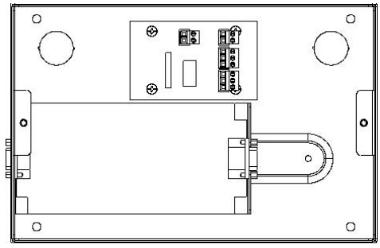
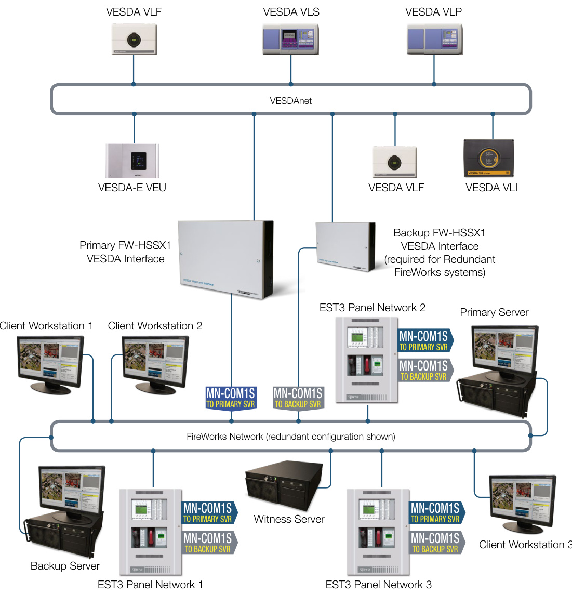

# FireWorks VESDA Interface FW-HSSX1  

# Description  

The FireWorks-VESDA Interface is a High Level Interface (HLI) that integrates a new or existing VESDAnet network with EDWARDS life safety systems via the FireWorks Incident Management Platform. The interface acts as a supervised conduit for information exchange between supported VESDA devices on the VESDAnet network and the FireWorks platform.  

This two-way communication provides FireWorks with real-time access to the status of networked VESDA detectors, and also the ability to control and reset these devices.  

All VESDAnet detector events are automatically reported to the FireWorks system, and each event can have FireWorks programming associated with it. Status changes are reported to FireWorks within a few seconds of a detector reaching an alarm condition.  

The FireWorks-VESDA Interface is a breakthrough solution that saves time and money. Instead of relay arrangements that require extra hardware, wiring, and programming to achieve communications with VESDA devices, the FW-HSSX1 acts as a communications gateway that is both simpler to install, yet offers more robust functionality.  

A single interface module supports up to 100 VESDA detectors for process control, or 61 VESDA detectors for life safety applications. FireWorks supports up to 20 interface modules, offering scalability of up to 2,000 VESDA detectors on a FireWorks system.  

# Standard Features  

Comprehensive and fully detailed event information   
56 detector events and 105 sector events can be brought into FireWorks – more detail than relays and other interfaces.   
Programmable event response   
FireWorks can be programmed to trigger event responses based on VESDA status changes.   
Saves time and money   
Makes complex arrangements of relays and wiring   
unnecessary.   
Scalable Investment   
Provides direct access to as many as 2,000 VESDA detectors on a single FireWorks system.   
Early Detection and Response   
Brings the high sensitivity and installation benefits of aspirated detection to FireWorks network applications.   
Integrated Life Safety   
UL 864/ULC S527 Listed, FM Approved, CSFM Listed.   
Enables “Big Picture” Incident Management   
VESDA integration promotes situational awareness in the early stages of incident development, allowing response protocols to be deployed rapidly and effectively.   
Versatile Solution   
Supports multiple VESDAnet family detectors.   
Responsive Command and Control   
Data transfer allows quick and specific status updates, plus device control through FireWorks.   
Reliable Operation   
Fully supervised with ground fault detection.  

# Application  

The FW-HSSX1 FireWorks-VESDA Interface is ideal for the integration of new or existing VESDA smoke detection networks with the FireWorks Incident Management Platform. With the early response characteristics of aspirated detection, FireWorks is better able to manage incidents in their early stages.  

High-value and critical operations facilities such as data centers, electrical vaults, and manufacturing facilities are well suited to aspirating smoke detection.  

New applications designed to include VESDA detection will benefit from FireWorks Incident Management and its situational awareness strengths. This takes into account information from many different sources and geographic locations to provide a big picture solution that may be missed with the information from the VESDAnet alone. In other words, the whole is greater than the sum of its parts.  

With the FireWorks/VESDA integration, the solution yields a UL/ ULC Listed/FM Approved end-to-end system.  The system can be easily be configured to activate notification appliances or perform other functions based on inputs from the VESDAnet detectors.  

Note:	 When using the EDWARDS/Xtralis integration solution with existing VESDAnets that have VLP, VLS and/or VLC class detectors, each detector must be retrofitted with a VESDA XXX-YYY ground isolation kit and equipped with transient protection.  

# Supported Functionality  

•Alarm Status   
•Fault Status   
•Smoke Level   
•Detailed Fault Information   
•Alarm Thresholds   
•Detector Control including Reset, Disable, Silence, Alarm Test and Normalize Operational Status for processes such as Normalization and AutoLearn  

# Mounting  

The FW-HSSX1 FireWorks-VESDA Interface is built into a NEMA 1 metal enclosure allowing for easy installation.  Wiring lands on removable terminal strips.  The FW-HSSX1 also has a ground fault enable/disable jumper.  

  

# Specifications  

<html><body><table><tr><td>PowerConsumption 1.68 W (Quiescent)</td></tr><tr><td>Supply Voltage</td><td>24VDC</td></tr><tr><td>CurrentConsumption</td><td>70 mA (Quiescent)</td></tr><tr><td>Protocol Support</td><td>VESDAVLP,VLS,VLC,VLF,VLI andVFT-15detectors; VESDA-E,andVEUdetectors</td></tr><tr><td>NumberofDetectors Supported</td><td></td></tr><tr><td>For Life Safety ForProcessControl</td><td>Up to61per InterfaceModule Up to 100per Interface Module</td></tr><tr><td>Dimensions (WHD)</td><td>11 in. x7.3 in. x 2.2 in.</td></tr><tr><td>Weight</td><td>(280mm×185mm×55mm)</td></tr><tr><td>Supplied With</td><td>4.4 lbs (2.0 kg) VESDAlinkRS-2329-wayserialcable</td></tr><tr><td>AgencyListings</td><td>UL8649thEdition,ULCS527,FM Approved,CSFMApproved</td></tr></table></body></html>  

  

# Ordering Information  

<html><body><table><tr><td>FW-HSSX1</td><td>command/control.Maximum61VESDAdetectorsforLifeSafetyapplicationsorupto100VESDAdetectorsforprocesscontrol(non- LifeSafety)perFW-HSSX1.24VDC.</td></tr><tr><td>FW-HSSD5</td><td>VESDAHLI InterfacesinglesoftwarePINcode add-on.Enablesconnectionofone(1)tofive(5)VESDAHLI(FW-HSSX1)toFireWorks asnodes.RequiresoneFW-HSSX1HighLevelInterfaceforeachVESDAnetworkifusingStandaloneorNonRedundantServerand twoifusingRedundantFireWorksServers.EachservermusthaveitsownseparateFW-HSSX1.</td></tr><tr><td>FW-HSSD2O</td><td>VESDAHLIInterfacesinglesoftwarePINcodeadd-on.Enablesconnectionofone(1)totwenty(2O)VESDAHLI(FW-HSSX1)to FireWorksasnodes.RequiresoneFW-HSSX1HighLevelInterfaceforeachVESDAnetworkifusingStandaloneorNonRedundant</td></tr></table></body></html>  

Accessories   

<html><body><table><tr><td>MN-COM1S</td><td>UL864ListedFireWorksCommunicationsEthernetPort,Command&Control.ComeswithpowerandRS232datacables.</td></tr><tr><td></td><td>MN-FNS4C2F34FastEthernet(RJ45),2GBSFP,Layer3Lite.24VDC.</td></tr><tr><td></td><td>MN-FNS8C2F38FastEthernet(RJ45),2GBComboSFP/RJ45,Layer3Lite.24VDC.</td></tr><tr><td>MN-BRKT3</td><td>MN-FVPmountingbracketforAPS-(6)(1o)Apowersupplies</td></tr><tr><td>APS6A</td><td></td></tr></table></body></html>  