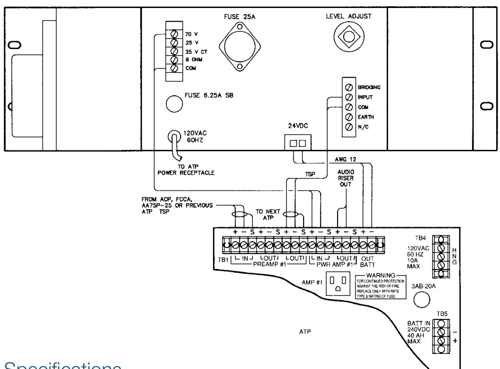

# Audio Power Amplifier, 250 Watts Model 1B3-250  

# Overview  

The 1B3-250 Power Amplifier is rated at 250 Watts continuous (RMS) power and it contains circuitry for 24 Vdc backup. The Amplifier mounts in a standard 19 in (483mm) rack. Output Voltage may be 25 or 70 VRMS. Supply Voltage is 120/240 V, 50/60 Hz, or optionally 24-28 Vdc. The Amplifier contains electronic protection safeguards against overloads or shorted output. A thermal overload protection circuit is also included that opens the primary power circuit if the unit overheats. Both protection circuits are selfrestoring. The system may in­corporate a Standby Amplifier as a backup against any unit failure.  

# Standard Features  

•	 24 Vdc battery backup   
•Broad frequency response   
•Low distortion   
•Thermal circuit breaker   
•Electronic protection UL listed under standards 1711,1480, and 813   
•ULC listed  

# Application  

The 1B3-250 Power Amplifier is used in Banked Amplifier Sys tems. The system supports up to six audio channels.  

# Engineering Specifications  

The Power Amplifier shall be EDWARDS 1B3-250 or an approved equivalent, and it shall be capable of delivering 250 Watts continuous (RMS) power with less than $0.5\%$ harmonic distor­tion in the $45\mapsto$ to $20\;\mathsf{k H z}$ bandwidth (measurements are made at the 70.7V tap). The frequency response shall be $20\;\mathsf{H}\mathsf{Z}$ to $20\ k\mathsf{H z}(+\mathsf{O},$ -1 dB) per EIA Standard SE-101A. The sig­nal-to-noise ratio shall be greater than -90 dB below rated output for the $20\;\mathsf{H}\mathsf{Z}$ to $20\;\mathsf{k H z}$ bandwidth. Input sensitivity shall be 1 VRMS at $1\mathsf{\sf~k H z}$ for rated out put, and input impedance shall be 75k Ohms. The output load (voltage) shall be 20 Ohms (70.7 V), 2.5 Ohms (25 V), and 8 Ohms (44.7 V), and there shall be a 25 Volt center tap. Output regulation shall be better than 1 dB (zero load to full load). A rear-mounted input level con­trol shall be provided.  

The Amplifier shall have an electronic protection circuit as a safeguard against damage caused by overloads or shorted output. A thermal overload protection circuit shall be provided on the heatsink to open the primary power circuit and illumi­nate a thermal overload LED whenever the amplifier over­heats. Both protective circuits shall be self-restoring. The normal power source shall be 120/240 V 50/60 Hz, and the system shall draw 5.8 Amps at 120 Vdc power required shall be 22 Amps at rated output.  

Terminations shall be screw terminal strips with barriers on the output. The Power Amplifier shall be 5-1/4 in (133mm) high, 19 in (483mm) wide, 15 in (381mm) deep, and be finished in charcoal baked enamel. Net weight shall not exceed 50 lbs $(22.5\,\mathsf{k g})$ . The Amplifier shall be acceptable for Fire Protec­tive Signalling Systems, approved and tested under UL Stan­dards 1711, 1480, and 813. The amplifier shall be listed by ULC.  

# Connection Diagram  

  

# Specifications  

<html><body><table><tr><td>Power Output</td><td>250Wattscontinuous (RMS)</td></tr><tr><td>Harmonic Distortion</td><td>Less than.5%45 to 20kHz at rated output</td></tr><tr><td>FrequencyResponse</td><td>20 to 20kHz(+0,-1 dB) per EIA Standard SE-101-A</td></tr><tr><td>Signal to Noise Ratio</td><td></td></tr><tr><td>Input Sensitivity</td><td>1VRMS at1kHzforrated output</td></tr><tr><td>Input Impedance</td><td>75k Ohms</td></tr><tr><td>Output Load (Voltage)</td><td>40 Ohms (70.7 V) balanced 2.5 Ohms (25V)balanced 25Vcentertap8Ohms(31.6V)balanced</td></tr><tr><td>Output Regulation</td><td>Betterthan1dB,zeroloadtofull load</td></tr><tr><td>Controls</td><td>Input level control,rear panel</td></tr><tr><td>Terminations</td><td>Screwterminal strips,barriers on output</td></tr><tr><td>Indicators</td><td>LEDpower,LEDThermal Overload</td></tr><tr><td>PowerSource</td><td>120/240Volts,50/60Hz;24-28Vdc</td></tr><tr><td>ACPower Required</td><td>5.8 Amps (120 V) / 2.9 Amps (240 V),0.22 Amps at idle</td></tr><tr><td>DCPower Required</td><td>22.0 Amps at rated output</td></tr><tr><td>Fuse</td><td>6.25Amp,slowblow;25Amp(DC)</td></tr><tr><td>Finish</td><td>Charcoal,bakedenamel</td></tr><tr><td>Dimensions</td><td>5-1/4 in (133mm) high,19 in (483mm) wide,15 in (381 mm) deep</td></tr></table></body></html>  

# Ordering Information  

<html><body><table><tr><td>CatalogNumber</td><td>Description</td><td>ShippingWeight</td></tr><tr><td>1B3-250</td><td>AudioPowerAmplifier,250Watts</td><td>50 Ibs (22.5 kg)</td></tr></table></body></html>  