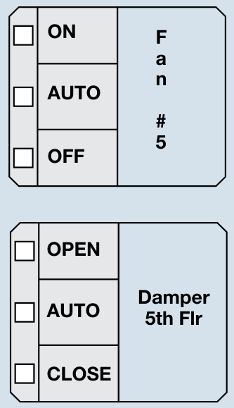
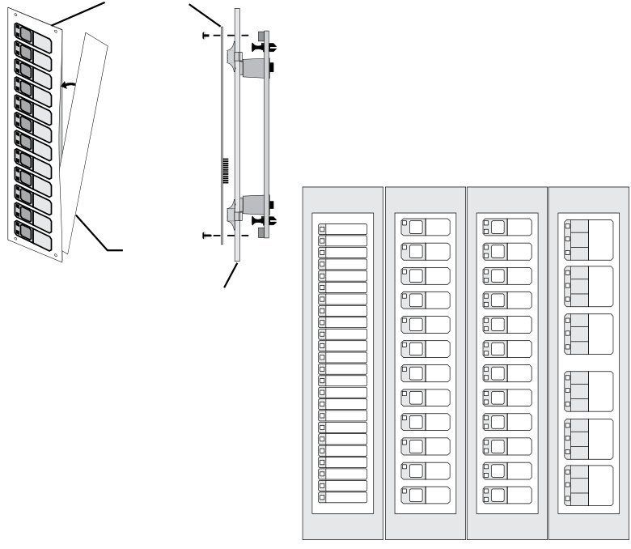
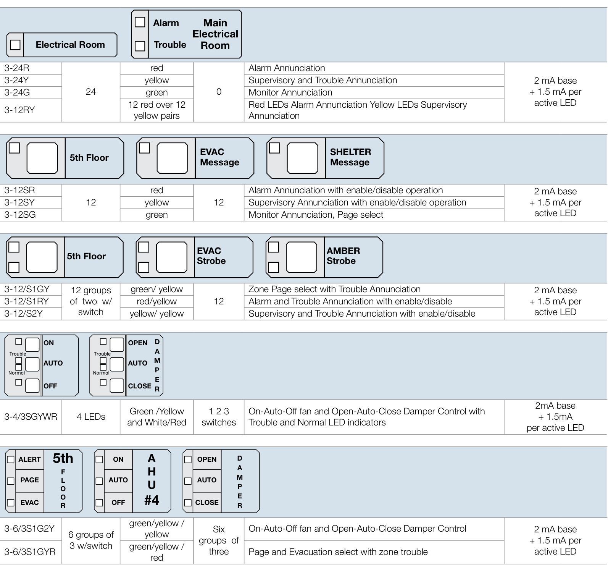

# Control Display Modules 3-LDSM, 3-24x series, 3-12xx series, 3-6/3S1xxx series  

# Overview  

The EST3 Control Display modules provide the emergency user with the simplest of interfaces, lights and switch control. The Control Display modules install over local rail modules. The local rail modules supply the power and drivers via a ribbon cable connection to the control display modules. The displays mount over any local rail module maximizing the flexibility of design layout. When a display module is required where no local rail module exists, an LED Display Support Module 3-LDSM mounts to the local rail providing support for one Control Display Module.  

Surface mount technology used to minimize space, also reduces the power requirements of display modules. Slide-in labels keep the control display modules flexible and allow labeling for local languages.  

Module lamp test can be programmed to any spare control switch or a local node lamp test is initiated by simultaneously operating the Alarm Silence and Trouble Silence switches on the 3-CPU.  

# Standard Features  

Programmable LED flash rates Membrane style tactile pushbuttons   
•Software supported for toggle, and latching interlock switch action   
•Slide in labels Lamp test  

# Application Notes  

Control Display Modules come in a variety of types providing operational flexibility. There are five types of display modules available with EST3.  

Typically alarm zone annunciation appears on any of the first four module types shown. The first module supports simple zone annunciation; the second, zone annunciation with zone disable; the third, alarm and trouble zone annunciation, the fourth alarm and trouble zone annunciation with zone disable.  From a simple one LED annunciation point to higher functionality, EST3 fills the requirements.  

# Simple Control Examples  

The fifth module is very adaptable to system requirements for audio or remote equipment control. Each module contains 18 LEDs and 18 switches. Each group of three switches has a latchinginterlock to support operations that must be kept separated. The interlock is under software control so only one switch is active at a given time. EST3 software makes meeting the wide variety of applications needed with today’s codes and building system operations easy.  

  

For fan control the emergency user assumes control of the remote device by selecting “On”  

or “Off.” Programming of the switches to multiple relays keeps operational design choices open. The user returns the system control of the remote device to the Life Safety system by simply pressing Auto. The Auto LED programs to its related switch and gives positive feed back to the user by turning on yellow when the system has active control of remote devices.  

Individual switch LEDs are also programmable. As an example the “Open” or “On” LED (green) could program to follow its related switch or, program to follow a remote monitor input and provide positive feedback of the remote devices control status. If budget restrictions prevent “sail type” positive feedback, EDWARDS’s unique command processing satisfy requirements for positive feedback of HVAC control systems. Any switch command will send a signal to the 3-CPU for processing. While in this state the LED associated with the switch will flash. Once the command has been received by a remote Signature Series Module, the module (since it is intelligent with its own microprocessor) will issue a “Processed” command back to the 3-CPU which will latch the LED associated with the switch “ON” steady. This same process is used for all audio speaker selections ensuring the circuit is connected. A variety of switch and associated LED colors are available to meet the demands of the specifiers application.  

Life Safety Systems are generally passive requiring only occasional operation. Yet, in an emergency the user must be able to identify system operation and status quickly and easily. LCD displays are excellent for identifying specific information, but even a large LCD can not display overall “system” status as effectively as LEDs and Switches. The EST3 Control Display modules are designed to provide simple identification and operation of system functions for the emergency user. They provide positive feedback of control activity with unrivaled selection of display configurations and mounting location options.  

# Installation and Mounting  

  

# Engineering Specification  

The Life Safety system shall incorporate annunciation of Alarm, Supervisory, Trouble and Monitor operations.  Annunciation must be through the use of LED display strips complete with a means to custom label each LED as to its function. Where applicable control of remote smoke control devices must be made available at the control center. Switches with LEDs must provide positive feed back to the operator of remote equipment status. Where voice audio is required a means of paging individual zones must be made. The status of each paging zone must be annunciated. It must be possible to selectively page into specific zones. It shall be possible to manipulate the evacuation of the building from the main control center. It must be possible for the emergency operator to put specific zones into evacuation manually.  

<html><body><table><tr><td>Catalog Number</td><td>Numberof LEDS</td><td>LEDColors</td><td>Switches</td><td>Applications</td><td>Standby Current</td><td>Alarm Current</td></tr><tr><td>3-LDSM</td><td>N/A</td><td>N/A</td><td>N/A</td><td>ProvidesinterfaceforoneControlDisplayModule</td><td>5 mA</td><td></td></tr></table></body></html>  

  
Notes: 1) 	All Control Display Modules are UL and ULC listed. 2) 	All Control Display Modules mount over one Local Rail Module. If no local rail module exists the 3-LDSM mounts to local rail and supports one control display module.  

# Ordering Information  

<html><body><table><tr><td>Catalog Description Number</td><td></td><td>Shipping Weight 0.45lb</td></tr><tr><td>3-LDSM</td><td>LED Display Support Module. Add suffix “-E" for EN54 compliant versions.</td><td rowspan="9">(.2kg)</td></tr><tr><td>3-24R</td><td>24 Red LEDDisplayModule. Add suffix “-E" for EN54 compliant versions.</td></tr><tr><td>3-24Y</td><td>24 Yellow LED Display Module. Add suffix “-E" for EN54 compliant versions.</td></tr><tr><td>3-24G</td><td>24 Green LED Display Module. Add suffix “-E" for EN54 compliant versions.</td></tr><tr><td>3-12SR</td><td>12 switcheswith 12 Red LEDDisplay/Control Module. Add suffix “-E" for EN54 compliant versions.</td></tr><tr><td>3-12SY</td><td>12switcheswith12YellowLEDDisplay/Control Module. Add suffix “-E" for EN54 compliant versions.</td></tr><tr><td>3-12SG</td><td>12 switches with 12 GreenLEDDisplay/Control Module. Add suffix “-E" for EN54 compliant versions. 12 Red LED and 12 Yellow LED Display Module.</td></tr><tr><td>3-12RY</td><td>Add suffix “-E" for EN54 compliant versions. 12 switches with one Green and oneYellow LED per switch Display/</td></tr><tr><td>3-12/S1GY</td><td>0.35lb Control Module. (.12kg) Add suffix “-E" for EN54 compliant versions.</td></tr><tr><td>3-12/S1RY</td><td>12 switches with one Red and one Yellow LED per switch Display/ Control Module. Add suffix “-E" for EN54 compliant versions.</td></tr><tr><td>3-12/S2Y</td><td>12 switches with two Yellow LEDs per switch Display/Control Module.</td></tr><tr><td>3-6/3S1G2Y</td><td>Six groups of three switches. Each switch with one LED. LEDs provided Green, Yellow, Yellow. Add suffix “-E" for EN54 compliant versions.</td></tr><tr><td>3-4/3SGYWR</td><td>12 switches in four groups of three switches, switch one with a green LED, switch two with yellow and white LEDs and switch three with a red LED.</td></tr><tr><td>3-6/3S1GYR</td><td>Six groups of three switches. Each switch with one LED. LEDs provided Green,Yellow,Red. Add suffix “-E" for EN54 compliant versions.</td></tr></table></body></html>  