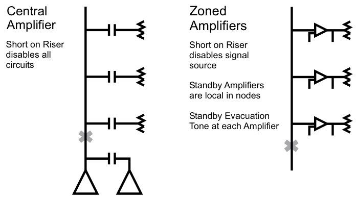
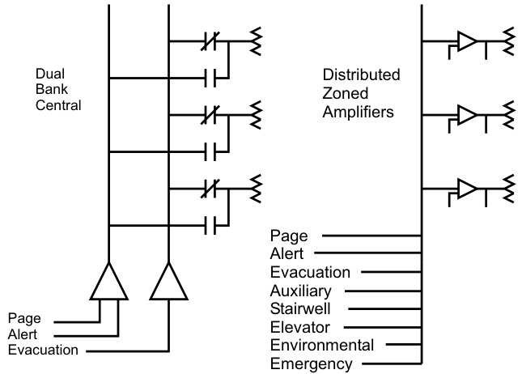
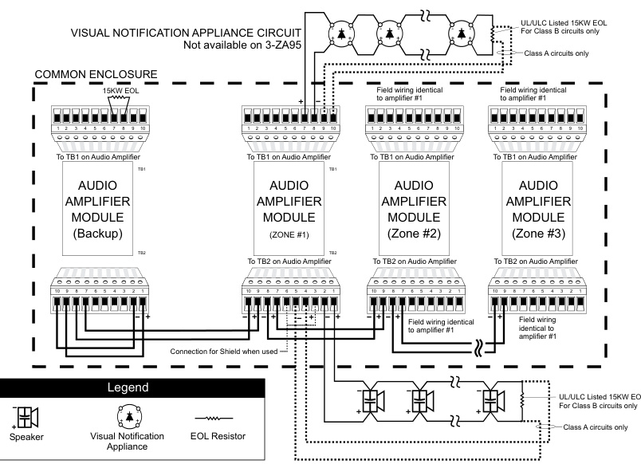

# Zoned Audio Amplifiers 3-ZA20A, 3-ZA20B, 3-ZA40A, 3-ZA40B, 3-ZA95  

# Overview  

The EST3 audio amplifiers take full advantage of proven digital technology to deliver highly intelligible voice audio for evacuation and Mass Notification/Emergency Communication (MNEC) purposes. Digital messages generated by the Audio Source Unit (ASU) and live paging messages are multiplexed into eight separate channels transmitted over fiber optic cable or a single twisted pair of wires. Each zoned amplifier contains integrated demultiplexing circuitry that allows any one of the eight digital audio channels to place messages or signals on the amplifier’s built-in speaker circuit.  

Audio channel selection is network software controlled, and audio amplifiers mount in the same enclosures as other EST3 equipment. Power for the amplifiers comes from standard system power supplies through the local rail. Field wiring connects to removable terminal blocks on the amplifier module. Amplifiers support either $25\;\mathrm{V}_{\mathrm{RMS}}$ or $70\;\mathrm{V}_{\mathrm{RMS}}$ power limited speaker circuits. For visual signaling, each 20 or 40 watt amplifier comes standard with one 24 Vdc power limited Notification Appliance Circuit.  

# Standard Features  

Three Sizes Available   
-20 Watts   
-40 Watts   
-95 Watts   
Simultaneous eight channel digital audio   
- Superior sound quality   
- Each amplifier does it’s own decoding   
Speaker circuit built into amplifier   
- Selectable for 70 or 25 VRMS output   
- Class A or Class B output models available   
- Power limited   
3.5 amp 24 Vdc notification appliance circuit   
on 20 and 40 watt amplifiers   
- Class A or Class B output models available   
- Power limited   
Network software control of channel selection   
Integral backup tone generator   
- 1 KHz temporal (3-3-3) tone evac   
Part of an end-to-end ${\bf520\;H z}$ signaling solution   
- UL approved for use in sleeping rooms  

# Application  

EST3 zoned amplifier configurations offer improved reliability and performance. Configuration provides improved survivability in the event of wiring faults that result in a loss of signaling. In the example shown in the diagram, a fault on the system using a central backed-up amplifier disables multiple signal/page circuits, and the standby amplifier is not able to bypass the fault. With EST3, the same fault removes the Audio Source Unit riser.  

  

Because all EST3 zoned amplifiers have an integrated backup 1000 Hz temporal tone generator, the locally-generated alarm tones notify occupants of a hazard – even with the primary riser out of commission. The backup tone also operates if the ASU or the audio distribution system fails. To further enhance system survivability, a single standby amplifier can backup any zoned amplifier in the same cabinet.  

Zoned amplifiers can be housed in remote cabinets close to the speakers. This minimizes the voltage drop between the amplifier and the load, and permits the use of a smaller wire size than is possible with centrally-located amplification systems.  

EST3 easily outperforms banked audio systems with its ability to simultaneously deliver up to eight different signals. When using centrally-banked amplifiers, paging and alert channels typically share a common amplifier. Consequently, when paging, the alert signal goes silent in all alerted areas when a Page is issued. At the end of the Page, the alert signal resumes in the alert area, which could cause confusion because occupants did not receive the page message and do not know why the Page stopped and restarted.  

With EST3, simultaneous page, alert, and evacuation signal capability is engineered into the system. With eight channels to choose from, dedicated messages can be delivered to stairwells, elevator cabs, etc. while alert, evacuation, and page instructions are simultaneously being sent to the rest of the building. The eight audio channels allow messages to be automatically routed, and provide specific instructions based on the alarm’s location.  

For example, with an alarm on Floor Eight, the following automatic message instructions could be given concurrently. Note: A Page could also be sent to any other location in the building – without interrupting any of the messages below.  

FLOOR 9 HEARS: “A fire alarm has been reported on the floor below. Please evacuate using the stairwell.”  

FLOOR 8 HEARS: “A fire alarm has been reported on this floor. Please evacuate using the stairwell.”  

OTHER FLOORS HEAR: “An emergency has been reported on floor 8. Please remain in the building and await further instructions.”  

  
ELEVATOR: “A fire alarm has been reported in the building. The elevator is being returned to the ground floor for emergency use. Please evacuate the building.”  

STAIRWELLS: “Please remain calm and walk down the stairs to evacuate the building in a safe manner.”  

In addition to robust paging, EST3 provides UL-listed Mass Notification/Emergency Communication (MNEC), which overrides fire alarm functions. This capability allows emergency response commanders to advise building occupants of the safest action to take while an emergency is unfolding. Occupants can be instructed to leave, relocate, or seek immediate shelter, depending on the situation. This provides the flexibility for communications to mesh with the facility’s risk analysis needs — without the risk of an unexpected fire alarm or general evacuation signal interfering with established emergency response protocols.  

# Sleeping Areas  

3-ZA Series Amplifiers are part of an end-to-end low frequency solution listed to UL 464 and UL 864. It is approved for code-compliant 520 Hz signaling in sleeping areas when used in conjunction with:  

an EST3 control panel   
a factory-supplied 520 Hz audio file   
one or more Genesis High Fidelity speakers (G4HF or GCHF   
series)  

Consult the EST3 System Compatibility List for details.  

# Engineering Specification  

The audio system shall provide eight simultaneous and distinct audio channels. These shall consist of a minimum of: Local Page, Emergency Communication, Multiple Evacuation, Alert, Auxiliary, and General Signaling. Channels shall support hierarchical operation and be controllable from system programming. The audio system also provides Elevator, Stairwell and Auxiliary signaling. Systems that cause signaling devices to go silent while performing any signaling functions will not be accepted.  

The audio system zoned amplifiers must be able to operate 25 $\mathsf{V}_{\mathsf{F M S}}$ or $70\,\mathrm{V}_{\mathrm{RMS}}$ speakers. The amplifier output must be power limited, and wired in a <Class A $>$ <Class $\textsf{B}>$ configuration. The amplifiers shall provide an integral backup 1000 KHz temporal tone generator which shall operate in the event signal primary audio signals are lost and the amplifier is instructed to broadcast alarm information. It shall be possible to backup multiple zoned amplifiers with a common backup amplifier.  

# Typical Wiring  

  

Specifications   

<html><body><table><tr><td></td><td>3-ZA20A</td><td>3-ZA20B</td><td>3-ZA40A</td><td>3-ZA40B</td><td>3-ZA95 UL, ULC</td></tr><tr><td>Agency Listing</td><td colspan="5">UL, ULC, CE, EN54</td></tr><tr><td>Environmental</td><td colspan="5">0°C - 49°C(32°F -120°F) 93%RH,Non-condensing</td></tr><tr><td>Frequency Response</td><td colspan="5">400Hz to 4KHz @ +/-3dB</td></tr><tr><td>Output Voltage</td><td colspan="5"></td></tr><tr><td>THD (distortion)</td><td colspan="5">25VRMSor70VRMS</td></tr><tr><td>Wire Size</td><td colspan="5">< 7% 18 to 12 AWG (1.0 to 2.5 mm2)</td></tr><tr><td>Internal Tone</td><td colspan="5">1KHz Temporal (3-3-3) Tone (evacuation); 20 PPM (alert)</td></tr><tr><td>Generator</td><td colspan="5"></td></tr><tr><td>SIGA-CC1/2Support</td><td colspan="5">10 Units, Maximum 62mA for 20 and 40 watt amps;</td></tr><tr><td>Standby Current</td><td colspan="5"></td></tr><tr><td>Alarm Current</td><td>1120mA</td><td>1120mA</td><td>85mAforthe3-ZA95wattamp 2480mA</td><td>2480mA</td><td>5540mA</td></tr><tr><td>Pwr. Ltd. Audio Output</td><td>Class A or B</td><td>Class B</td><td>Class A or B</td><td>Class B</td><td>Class A or B</td></tr><tr><td>Wiring Configuration EOL Resistor</td><td>15K Ohms in Class B</td><td>15K Ohms</td><td>15K Ohms in Class B</td><td>15K Ohms</td><td>15K Ohms in Class B</td></tr><tr><td>Pwr.Ltd.24Vdc NAC Wiring Configuration</td><td>Class Aor B</td><td>Class B</td><td>Class A or B</td><td>Class B</td><td></td></tr><tr><td>Line Resistance, Max.*</td><td>50 Ohms, Max.</td><td>50 Ohms, Max.</td><td>50 Ohms, Max.</td><td>50 Ohms, Max.</td><td>N/A</td></tr><tr><td>EOL Resistor Line</td><td>N/A 0.33uF</td><td>15 K Ohms 0.33uF</td><td>N/A 0.33uF</td><td>15K Ohms 0.33uF</td><td>2 LRM Spaces</td></tr><tr><td>Capacitance, Max</td><td colspan="5"></td></tr><tr><td></td><td colspan="5"></td></tr><tr><td></td><td colspan="5"></td></tr><tr><td>Space Requirements</td><td colspan="5"></td></tr><tr><td></td><td colspan="5"></td></tr><tr><td></td><td colspan="5"></td></tr><tr><td></td><td colspan="5"></td></tr><tr><td></td><td colspan="5"></td></tr><tr><td></td><td colspan="5"></td></tr><tr><td></td><td colspan="5"></td></tr><tr><td></td><td colspan="5"></td></tr><tr><td></td><td colspan="5"></td></tr><tr><td></td><td colspan="5"></td></tr><tr><td></td><td colspan="5"></td></tr><tr><td></td><td colspan="5"></td></tr><tr><td></td><td colspan="5"></td></tr><tr><td></td><td colspan="5"></td></tr><tr><td></td><td colspan="5"></td></tr><tr><td></td><td colspan="5"></td></tr><tr><td></td><td colspan="5"></td></tr><tr><td></td><td colspan="5"></td></tr><tr><td></td><td colspan="5"></td></tr><tr><td></td><td colspan="5"></td></tr><tr><td></td><td colspan="5"></td></tr><tr><td></td><td colspan="5"></td></tr><tr><td></td><td colspan="5"></td></tr><tr><td></td><td colspan="5"></td></tr><tr><td></td><td colspan="5"></td></tr><tr><td></td><td colspan="5"></td></tr><tr><td></td><td colspan="5"></td></tr><tr><td></td><td colspan="5"></td></tr><tr><td></td><td colspan="5"></td></tr><tr><td></td><td colspan="5"></td></tr><tr><td></td><td colspan="5">1 LRM Space</td></tr><tr><td></td><td colspan="5"></td></tr><tr><td></td><td colspan="5"></td></tr><tr><td></td><td colspan="5"></td></tr><tr><td></td><td colspan="5"></td></tr><tr><td></td><td colspan="5"></td></tr><tr><td></td><td colspan="5"></td></tr><tr><td></td><td colspan="5"></td></tr><tr><td></td><td colspan="5"></td></tr><tr><td></td><td colspan="5"></td></tr><tr><td></td><td colspan="5"></td></tr><tr><td></td><td colspan="5"></td></tr><tr><td></td><td colspan="5"></td></tr><tr><td></td><td colspan="5"></td></tr><tr><td></td><td colspan="5"></td></tr><tr><td></td><td colspan="5"></td></tr><tr><td></td><td colspan="5"></td></tr><tr><td></td><td colspan="5"></td></tr><tr><td></td><td colspan="5"></td></tr><tr><td></td><td colspan="5"></td></tr><tr></table></body></html>

Note: \*For EN 54-2: 1997 $^+$ A1: 2006, EN 54-4: 1997 $^+$ A1: 2002 + A2: 2006, and EN 54-16: 2008 compliant product add suffix -E to model eg. 3-ZA20A-E.  

Maximum Speaker Circuit Distance at 0.5 dB loss\*   

<html><body><table><tr><td>70VRMS Output</td><td>3-ZA20A</td><td>3-ZA20B</td><td>3-ZA40A</td><td>3-ZA40B</td><td>3-ZA95</td></tr><tr><td>#12AWG (3.2 Ohm/1000 ft pair)</td><td colspan="2">4,536 ft (1,382 m)</td><td colspan="2">2,268 ft (691m)</td><td>955 ft (290 m)</td></tr><tr><td>#14AWG (5.2 Ohm/1000 ft pair)</td><td colspan="2">2,792 ft (850 m)</td><td colspan="2">1,396 ft (425 m)</td><td>588 ft (179 m)</td></tr><tr><td>#16AWG (8.0 Ohm/1000 ft pair)</td><td colspan="2">1,815 ft (553 m)</td><td colspan="2">907 ft (276 m)</td><td>382ft (116 m)</td></tr><tr><td>#18AWG (13 Ohm/1000 ft pair)</td><td colspan="2">1,117 ft (340 m)</td><td colspan="2">558 ft (170 m)</td><td>235 ft (71 m)</td></tr><tr><td colspan="6"></td></tr><tr><td>25VRMSOutput</td><td>3-ZA20A</td><td>3-ZA20B</td><td>3-ZA40A</td><td>3-ZA40B</td><td>3-ZA95</td></tr><tr><td>#12AWG (3.2 Ohm/1000 ft pair)</td><td colspan="2">579 ft (176 m)</td><td colspan="2">289 ft (88 m)</td><td>122 ft (37 m)</td></tr><tr><td>#14AWG</td><td colspan="2">356 ft (108 m)</td><td colspan="2">178 ft (54 m)</td><td>75 ft (22 m)</td></tr><tr><td>(5.2 Ohm/1000 ft pair) #16AWG</td><td colspan="2">231 ft (70 m)</td><td colspan="2">116 ft (35 m)</td><td>49 ft (14 m)</td></tr><tr><td>(8.0 Ohm/1000 ft pair) #18AWG (13 Ohm/1000 ft pair)</td><td colspan="2">142 ft (43 m)</td><td colspan="2">71 ft (21 m)</td><td>Not supported by18AWG</td></tr></table></body></html>

\* Refer to product manual for wire run calculations.  

# Ordering Information  

<html><body><table><tr><td>Catalog Number</td><td>Description</td><td>Ship Wt., Ib. (kg)</td></tr><tr><td>3-ZA20A</td><td>20WattZonedAmplifierw/ClassA/B Audio&Class A/B 24VDC outputs. Add suffix“-E"forEN54 compliant versions.</td><td>1.55 (0.7)</td></tr><tr><td>3-ZA20B</td><td>20WattZonedAmplifierw/ClassB Audio&ClassB24VDCoutputs. Add suffix“-E"forEN54 compliant versions.</td><td>1.55 (0.7)</td></tr><tr><td>3-ZA40A</td><td>40WattZonedAmplifierw/ClassA/B Audio&ClassA/B24VDCoutputs. Add suffix“-E"forEN54 compliantversions.</td><td>1.55 (0.7)</td></tr><tr><td>3-ZA40B</td><td>40 Watt Zoned Amplifierw/Class B Audio&ClassB24VDCoutputs. Add suffix “-E" for EN54 compliant versions.</td><td>1.55 (0.7)</td></tr><tr><td>3-ZA95</td><td>95WattZonedAmplifier w/ClassA/BAudiooutput</td><td>3.0 (1.5)</td></tr><tr><td>3-FP</td><td>FillerPlate,orderseparatelyonerequiredperamplifierwhen noLEDorLED/Switchmoduleinstalledonoperatorlayer.</td><td>0.1 (0.05)</td></tr></table></body></html>  