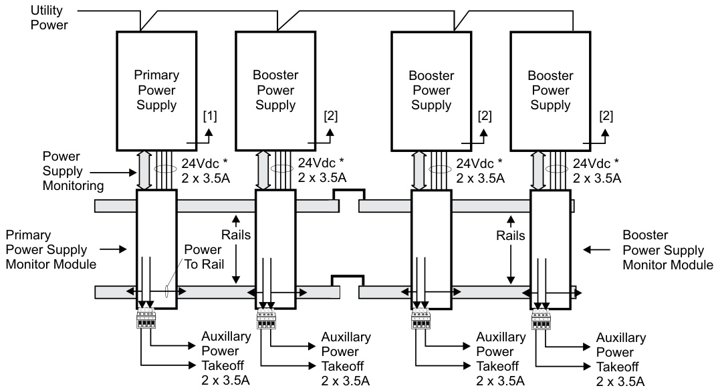

# EST3 Power Supplies 3-PPS/M series, 3-BPS/M series, 3-BBC/M series  

# Overview  

EST3 Power supplies consist of two assemblies, a high efficiency switch mode power supply card and a power supply monitor module. The monitor module mounts to the local rail and distributes the power from its supply to the local rail. The local rail distributes power from all power supplies to other local rail modules and user interface cards resulting in “Shared Power” throughout the system. By paralleling the power supplies on a rail maximum utilization of available power is possible, resulting in fewer power supplies. Up to four power supplies combine in a single enclosure providing up to 28 amps of available power. Battery backup is provided using from one to four sets of batteries, depending on standby power requirements.  

Power supplies mount to the back of the chassis units or wallboxes. The associated power supply monitor module mounts on the local rail providing system power distribution and mounting space for any control display module. Access to auxiliary power is via easily accessible terminal blocks located on the power supply monitor module. Each power supply produces 7 Amps of filtered and regulated power. With four power supplies located in an enclosure (one primary and three booster power supplies) 28 amps of current is available for local rail modules, control display modules and the eight auxiliary 3.5 amp power outputs (two per supply).  

# Standard Features  

•	 High efficiency switch mode   
•	 Increased power distribution efficiency - power supplies parallel allowing up to 28 amps in a single node   
120 or 230 Vac operation   
•	 7 AMP filtered and regulated   
•Two 3.5 AMP outputs   
•Temperature compensated, dual rated battery charger   
•Electronic power limiting   
•	 Automatic load testing of batteries Fully approved UL, ULC and EN standards (see Specifications section)  

# Application  

The primary power supply provides the system with battery charging and voltage regulation. Software configures the charger to either 10-24 AH batteries or 30-65 AH batteries and controls the high/low charge rates. Batteries mounted in the same enclosure as the power supply, have their charge rate monitored and adjusted based on the local enclosure temperature, keeping charging rates within battery specification. For remote batteries a temperature probe is monitored in the remote battery cabinet and charge rates are adjusted automatically. Battery damage is unlikely to occur when environmental short term conditions are outside of normal operating ranges.  

The EST3 power supplies automatically load test batteries by shutting down the battery charger and placing a load across the battery. If the battery voltage is outside the specification range the power supply reports a trouble. The trouble clears if the battery is able to recover and pass future load tests.  

Battery leads are electronically short circuit protected. If a short occurs in the battery leads the charger automatically disables itself and causes a trouble. The system will constantly look to see if the short has cleared. If the short clears the system automatically restores.  

During operation on standby batteries, battery voltage is constantly monitored. A trouble is reported if the battery voltage falls below a specified value.  

EST3 power supplies provide specific information back to the 3-CPU(1) designed to help speed trouble shooting of system functions. Should a power supply detect a fault, specific diagnostic codes are available to speed troublMe shooting. The 3-LCD will display the power supplies address, a specific trouble code, anJ8dJ1J a text message describing the specific trouble. Text messages are easy to understand and include items like: Battery Trouble, Aux Power Overload Circuit 1, Aux Power Overload Circuit 2.  

# Engineering Specification  

The fire alarm power supplies must be capable of being paralleled and to load share. Multiple power supplies must be capable of being backed up with a single 24 volt battery set. Each power supply shall be capable of charging up to 65 AH batteries. The power supply must be able to perform an automatic load test of batteries and return a trouble if the batteries fall outside a predetermined range. Power supplies must incorporate the ability to adjust the charge rate of batteries based on ambient temperatures. It shall be possible to adjust for ambient temperature changes in local cabinets as well as remote cabinets.  

# Installation and Mounting  

  

# Power Supply Rules  

1.	 Each battery set needs one charger, either a 3-PPS/M or a 3-BBC/M.   
2.	 Each power supply must be connected to a battery set using an identical length and gauge of wire to keep voltage drops identical.   
3.	 Distribute power supplies and loads evenly across rails.   
4.	 All battery sets for a panel must be the same capacity (AH), same manufacturer, and same manufacturing date code.   
The Table below illustrates the combinations of power supplies and batteries that meet all the power supply rules.  

24 VDC Power Supply Output Current   

<html><body><table><tr><td></td><td>7A</td><td colspan="2">14A</td><td colspan="2">21A</td><td colspan="2">28A</td></tr><tr><td>Battery Requirements</td><td>One Set, 65AHmax</td><td>OneSet, 65AHmax</td><td>Twoldentical Sets,65AH</td><td>One Set, 65AHmax</td><td>Threeldentical Sets,65AH</td><td>One Set, 65AHmax</td><td>Fourldentical Sets,65 AH</td></tr><tr><td>Required Modules</td><td>13-PPS/M</td><td>1 3-PPS/M 13-BPS/M</td><td>max 1 3-PPS/M 13-BBC/M</td><td>13-PPS/M2 3-BPS/M</td><td>max 1 3-PPS/M 23-BBC/M</td><td>13-PPS/M 33-BPS/M</td><td>max 1 3-PPS/M 33-BBC/M</td></tr></table></body></html>  

  
[1] From battery temperature probe terminals. [2] From battery and from temperature probe terminals if 3-BTSEN-E used. \* Nominal Voltage   
UL 864, Control Units and Accessories for Fire Alarm Systems; UL294, Access Control System Units; UL365, Police Station Connected Burglar Alarm Units and Systems; UL609, Local Burglar Alarm Units and Systems; UL636, Police Station Connected Burglar Alarm Units and Systems; UL1076, Proprietary Burglar Alarm Units and Systems; UL1610, Central Station Burglar Alarm Units; UL1635, Digital Alarm Communicator System Units; UL2017, General-Purpose Signaling Devices and Systems; ULC-S303-M91, Local Burglar Alarm Units and Systems; ULC-S527-99, Control Units for Fire Alarm Systems; ULC/ORD-C1076, Proprietary Burglar Alarm Units and Systems; CAN/ULC-S559-04, Equipment for Fire Signal Receiving Centres and System; ULC/ORD-C100, Smoke Control System Equipment  

# Agency Listings  

EST3 is listed to the following UL and ULC standards:  

# Specifications  

<html><body><table><tr><td>Catalog Number</td><td>3-PPS/M& 3-BBC/M</td><td>3-BPS/M</td><td>3-PPS/M-230& 3-BBC/M-230</td><td>3-BPS/M-230</td><td>3-PPS/M-230-E&</td><td>3-BPS/M-230-E</td></tr><tr><td>Agency Approvals</td><td>UL, ULC</td><td>U L, ULC</td><td>UL, ULC</td><td>UL, ULC</td><td>3-BBC/M-230-E LPCB EN54*, CE</td><td>EN54*</td></tr><tr><td>Input Voltage</td><td colspan="2">120 Vac (+10%,-15%),50-60 Hz</td><td colspan="4">230 Vac (+10%,-15%),50-60 Hz</td></tr><tr><td>Brownout Level</td><td>< or=102Vac</td><td>96 Vac</td><td>< or = 195 Vac</td><td>184Vac</td><td>< or = 195 Vac</td><td>188Vac</td></tr><tr><td>Current Requirements</td><td>3-PPS/M included with3-CPU3current 3-BBC/M Alarm: 70 mA</td><td>Alarm 50mA Standby 50mA</td><td>3-PPS/M-230 included with 3-CPU3 current 3-BBC/M-230 Alarm: 70 mA</td><td>Alarm: 50 mA Standby: 50 mA</td><td>3-PPS/M-230-E included with 3-CPU3 current 3-BBC/M-230-E Alarm: 70 mA Standby: 70 mA</td><td>Alarm: 50 mA Standby: 50 mA</td></tr><tr><td>Input Current</td><td colspan="4">Standby: 70 mA Standby: 70 mA 3.0A 1.5 A</td><td colspan="2"></td></tr><tr><td>Total Output Current</td><td colspan="6">Special Applications: 7.0 Amps Regulated: 4.5 Amps total (including internal panel and auxiliary outputs).</td></tr><tr><td>Battery Charging</td><td colspan="5">Maximum regulated NAC power via 3-IDC8/4: 1 Amp (see note). 65 AH Sealed 65 AH Sealed</td><td>30 AH Sealed</td></tr><tr><td>Capacity</td><td colspan="4">None Lead-Acid Lead-Acid 24 Vdc</td><td colspan="2">None None Lead-Acid</td></tr><tr><td>Low Battery Trouble Deep Discharge</td><td colspan="4">19.5 Vdc</td><td colspan="2">22.5 Vdc</td></tr><tr><td>Cutoff Mounting</td><td colspan="4">1 LRM space,</td><td>20.0 Vdc 1 LRM Space + 1 LRM space,</td></tr><tr><td>Requirements Output Voltage</td><td colspan="4">3-PPS: 2 footprints 1 chassis footprint 3-BBC: 1 footprint 24 Vdc Nominal</td><td>1 chassis footprint</td></tr><tr><td>Auxiliary Output Current</td><td colspan="5">Two sources of 3.5 Amps each taken from total output current</td></tr><tr><td>Auxiliary Output</td><td colspan="5">18 AWG to 12 AWG (1 mm2 to 2.5 mm2)</td></tr><tr><td>Terminal Capacity</td><td colspan="5"></td></tr><tr><td>Output Protection Ground Fault</td><td colspan="5">Electronic power limiting & heat sink temperature</td></tr><tr><td>Detection</td><td colspan="5">< 10K Ohms</td></tr></table></body></html>

Note: Each power supply can support 7 Amps with special application devices.  Up to one regulated NAC circuit via 3-IDC8/4 can be supported per 3-PPS power supply.  Total power supply current available when supporting a regulated NAC is 4.5 Amps.  Maximum regulated NAC current available from the 4.5A supply is 1 Amp.  

\* EN54-2: (1997) +A1: (2006) Control and Indicating Equipment; EN54-4: (1997) $+\mathsf{A}1$ : (2002) $+\mathsf{A}\mathsf{2}$ : (2006) Power Supply Equipment; EN54-16:(2008) Voice Alarm Control and Indicating Equipment  

Ordering Information   

<html><body><table><tr><td>Catalog Description Number</td><td></td><td>Ship Wt., Ib. (kg)</td></tr><tr><td>3-PPS/M</td><td>Primary Power Supply w/local rail module 120V 50/60 Hz</td><td>5 (2.3)</td></tr><tr><td>3-BPS/M</td><td></td><td>5 (2.3)</td></tr><tr><td>3-PPS/M-230</td><td>Primary Power Supply w/ local rail module 230V 50/60 Hz</td><td>5 (2.3)</td></tr><tr><td>3-BPS/M-230</td><td>BoosterPowerSupplyw/local rail module 230V50/60 Hz</td><td>5 (2.3)</td></tr><tr><td>3-PPS/M-230-E</td><td>Primary Power Supply w/local rail module 230V 50 Hz, EN54* Certified,CE.Comes with one EFM-2 and 15 ferrite clamps.</td><td>5 (2.3)</td></tr><tr><td>3-BPS/M-230-E</td><td>Booster Power Supply w/local rail module 230V 50 Hz, EN54*Certified,CE</td><td>5 (2.3)</td></tr><tr><td>3-BBC/M</td><td>Booster/Charger Supply w/local rail module 120V 50/60Hz</td><td>5 (2.3)</td></tr><tr><td>3-BBC/M-230</td><td>Booster/ChargerSupplyw/local railmodule230V50/60Hz</td><td>5 (2.3)</td></tr><tr><td>3-BBC/M-230-E</td><td>Booster/Charger Supply w/local rail module, 230V 50Hz, EN54* Certified, CE</td><td>5 (2.3)</td></tr><tr><td>3-BBCMON(-E)</td><td>Booster/ChargerMonitorModulewithchargercapability (upgrade 3-BPS/M(-230)(-E) to 3-BBC/M-(23O)(-E))</td><td>5 (2.3)</td></tr><tr><td>3-BTSEN</td><td>Distribution Module required when battery installed in remote cabinet</td><td>.5 (.22)</td></tr><tr><td>3-BTSEN-E</td><td>DistributionandTemperatureSensorModule.Required in EN54* Markets whenbattery installed in a remote cabinet.</td><td>.5 (.22)</td></tr><tr><td>EFM-2</td><td>Data filter board, ships with 3-PPS/M-230-E.Provides filtering for network data. For distributed audio applications refer to model EFM-10. Additional ferrite clampkitsmaybeordered separately.SeeEuropeanMarketplace Manual P/N 270925 for details on ferrite clamp locations,quantities and</td><td></td></tr><tr><td>EFM-10</td><td>wiring. Data Filterboard order separatelyfor distributed audio.OrderoneEFM-10 for each node receiving audio in the network. Additional ferrite clamp kits may beorderedseparately.SeeEuropeanMarketplaceManualP/N270925for</td><td></td></tr><tr><td>7300172</td><td>details onferrite clamplocations and quantities. Ferrite Kit includes 2 ferrites for EN54 applications.</td><td></td></tr><tr><td>7300173</td><td>Ferrite Kit includes 15 ferrites for EN54 applications.</td><td></td></tr><tr><td>7300174</td><td></td><td></td></tr><tr><td>7300175</td><td>Ferrite Kit includes 8 ferrites for EN54 applications.</td><td></td></tr><tr><td>3-FP</td><td>Filler Plate, order separately when no LED or LED/Switch module installed.</td><td>0.1 (0.05)</td></tr></table></body></html>

\* EN54-2: (1997) +A1: (2006) Control and Indicating Equipment; EN54-4: (1997) +A1: (2002) $+\mathsf{A}\mathsf{2}$ : (2006) Power Supply Equipment; EN54-16:(2008) Voice Alarm Control and Indicating Equipment  