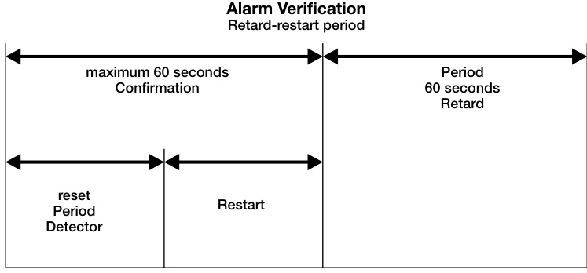

# Hardwired Module 3-IDC 8/4  

# Overview  

The Initiating Device Circuit module is a local rail module that provides the interface between the EST3 and conventional hardwired circuits. The 3-IDC 8/4 has eight supervised Class B input circuits. Four of the eight configure from input circuits to Notification Appliance Circuits. A wide range of wire sizes are supported by the 3-IDC 8/4 making retrofit easy. Removable field wiring terminals reduce the effort and time needed to trouble shoot field wiring or replace modules.  

Any Control Display module will mount in front of the 3-IDC 8/4 allowing great flexibility of system user interface layout.  

# Standard Features  

Eight supervised Class B hardwired circuits - configure as eight input circuits or configure up to four of the eight as Notification Appliance Circuits •	 Latching or non-latching by circuit •	 Verified or non-verified •	 Supports Regulated and Special Application NACs  

# Application  

The 3-IDC 8/4 is ideal for retrofit projects where existing wiring, smoke detectors and signals may not need replacing.  

Flexibility built right into the IDC module allows connection of normally open contact devices, and traditional 2 wire smoke detectors.  

The 3-IDC 8/4 configures for use with N.O. contacts and supports supervised Supervisory and Monitor circuits with latching or nonlatching operations. Use the monitor operation with the non-latching function and the circuit serves as a supervised event follower, efficiently covering critical fan and damper operations. Circuits will annunciate on the 3-LCD, control display modules or at any other display device on the network.  

Up to 30 photoelectric or 50 ionization smoke detectors are supported per circuit. All circuits may be programmed for non-verified or verified smoke operation. The 3-IDC 8/4 incorporates software selectable impedance ranges for Input Circuit configurations, eliminating conventional smoke detector compatibility problems. Ranges include open circuit, shorted condition and high and low impedance (relative to the main impedance setting), allowing the use of various detectors of similar impedance and European alarm circuit operation.  

Four of the eight 3-IDC 8/4 circuits are convertible to Class B Notification Appliance Circuits. The circuits employ traditional reversing polarity operation for polarized bells, horns, and strobes. The Notification Appliance circuits are arranged in pairs. Each pair distributes 3.5 Amps at 24 Vdc from the local rail or a single riser. Riser sources supported include 24V $@$ 3.5 (this should be pulsed (Temporal pattern) for audible signals) or up to 70 Vrms $@$ 100W audio source for speakers. For Regulated signals, the IDC supports one NAC pair to distribute up to 1 Amp from the 3-PPS primary power supply through the local rail.  

  

# Engineering Specification  

The fire panel shall be capable of supporting a variety of conventional smoke detectors with a single module. It must be possible to support polarized bells, horns or strobes. It shall be possible to provide hardwired supervisory and monitor functions with latching or non-latching operations. It shall be possible to display any circuit on an LCD or LED annunciator located anywhere on the network.  

  

<html><body><table><tr><td>AgencyListings UL,ULC,FM,LPCBEN54*.</td></tr><tr><td>TerminalWireSizes 18-12AWG（1.0mm2to2.5mm2)</td></tr><tr><td>Standby:48mA@24VDC Current</td></tr><tr><td>Alarm:408mA@24VDC MaximumRail 3.5A@24Vdc</td></tr><tr><td>orRiserCurrentRating Special Application: 3.5A @ 24 Vdc NotificationApplianceRating</td></tr><tr><td>Regulated:1.0A@24Vdc 100watts@70Vrms</td></tr><tr><td>AudioRiserRating 60watts@25Vrms</td></tr><tr><td>NotificationApplianceCircuitEOL 15KOhm 4.7K Ohm</td></tr><tr><td>InitiatingDeviceCircuitEOL Mounting OneLocalRailSpace</td></tr></table></body></html>

\* EN 54-2: 1997 $^+$ A1: 2006, EN 54-4: 1997 $^+$ A1: $^{2002+}$ A2: 2006, and EN 54-16: 2008.  

<html><body><table><tr><td>Catalog Number</td><td>Description</td><td>Ship Wt. Ib. (kg)</td></tr><tr><td>3-IDC8/4</td><td>Initiating DeviceCircuitModule</td><td>0.8 (0.36)</td></tr><tr><td>3-FP</td><td>FillerPlate,orderseparatelywhenno LEDorLED/Switchmoduleinstalled.</td><td>0.1( (0.05)</td></tr><tr><td>3-IDC8/4-E</td><td>Initiating DeviceCircuitModule forEN54applications</td><td>0.8 (0.36)</td></tr></table></body></html>  