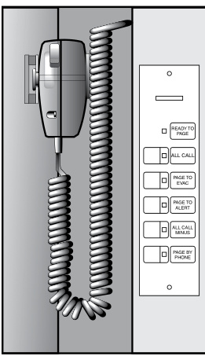

# Audio and Telephone Masters 3-ASU series  

# Overview  

The efficient EST3 audio system provides for intuitive local and remote audio control for Mass Notification/Emergency Communications (MNEC), Life Safety and other approved uses. EST3 audio builds from standard modules that fit together easily. Audio components use standard EST3 cabinets and power supplies.  

Taking full advantage of digital technology, up to eight channels of audio sources transmit over a single twisted pair of wires or fiber optic cables between nodes. Coupling the inherent reliability and performance of zoned amplifiers with EST3 simplified user interfaces makes audio system design and operation easy and dependable.  

The 3-ASU is seamlessly integrated into an EST3 system to provide for a rugged and reliable communications package that can be configured for Mass Notification/Emergency Communication (MNEC), as well as fire alarm and other emergency functions. The 3-ASU audio source unit supports eight channels of clear digital audio that is easily distributed to panels containing 3-ZA rail amplifiers. The 3-ASU supports digital storage and playback of prerecorded messages as well as live paging. The optional 3-FTCU provides a unique, space-saving and easy-to-operate control point for dedicated emergency/firefighter two-way telephones.  

# Standard Features  

•	 Eight channels for audio source selection   
•	 Audio data to remote EST3 panels with amplifiers can be transmitted over twisted copper wires or fiber optic cables (see DATA SHEET E85010-0131 for details on EST3 fiber optic communications)   
•	 Listed for Mass Notification/Emergency Communications UL2572 as CCS or ACU or LOC.   
•	 Part of an end-to-end audio solution suitable for low frequency signaling in sleeping areas   
•	 Auxiliary audio input interface for campus paging, telephone interface, etc.   
•	 Single fiber optic filament or one twisted pair of wires between nodes   
•	 VU display shows paging output level   
•	 Ready-to-page LED Digital transmission of audio signals - greater noise immunity - high quality signal transmission   
On board storage of programmed messages and tones   
•	 Optional LCD display of fire phone calls Optional earthquake hardening: OSHPD seismic pre-approval for component Importance Factor 1.5  

# Application  

EST3 audio is accomplished by selecting modular components for installation in standard fire alarm cabinet assemblies. At the main control panel location mounting audio control equipment provides an emergency user interface for “Paging” and optionally a “Firefighters Master Telephone”. Zoned amplifiers mount in the main control panel and/or in remote nodes. By mounting amplifiers in remote nodes, wire runs and space requirements are reduced at the main control panel.  

The heart of the EST3 audio package is the Audio Source Unit (ASU). The Audio Source unit converts analog signals to digital signals. On board audio memory stores signal tones and/or alarmalert verbal messages.  

These digitally-stored messages can be recorded onsite using standard PC audio components or downloaded from a library of pre-recorded messages and tones. Messages can be in any language or combination of languages. The ASU comes standard with two minutes of memory for tone and message storage. Available message memory expands easily to 100 minutes with the optional 3-ASUMX/100 memory expansion card.  

Audio Source units support connection of a local microphone, remote microphone, telephone voice line , and Mass Notification/ Emergency Communication (MNEC) audio feed. With eight audio channels to choose from combinations of paging, alert, evacuation signaling and automatic messages are available for simultaneous delivery to different parts of a building or to different buildings.  

There are two main audio user interface modules: the paging microphone, and the firefighter’s telephone, which supports threestate and four-state firefighter telephones. Available individually or in a set, EST3 audio modules open system design possibilities.  

When the Life Safety system requires paging only the 3-ASU or 3-ASU/4 Audio Source Units provides a Master Paging microphone with common controls. Switch labeling makes the operation intuitive. Six LEDs and five switches cover paging operations. Three of the five paging switches, All Call, Page to Evacuation, and Page to Alert, cover most paging operations. A VU display shows the user the output level of the page in process. The 3-ASU series mount in one chassis space of a EST3 Lobby enclosure. In addition to the paging microphone the 3-ASU/4 has mounting space for up to four local rail modules, including 20, 40, and 95 watt zone amplifiers and up to four Control Display modules allowing layout flexibility. The 3-ASU provides the same functionality as the 3-ASU/4 but is supplied with an inner door filler plate and no local rail module spaces.  

  

# Paging Microphone  

Ready-to-Page LED turns on after the   
pre-announce tone has finished indicating the system is ready to page.   
All Call selects all amplifiers for page   
delivery.   
Page to EVAC selects all amplifiers currently delivering evacuation signaling for page delivery.   
Page to ALERT selects all amplifiers   
currently delivering alert signaling for page delivery.  

All Call Minus selects all amplifiers not programmed for alarm signaling for page delivery (typically stairwells).  

Page by Phone selects the telephone voice line as the paging source.  

Operating the Microphone Talk Key stops alarm signaling to selected zones and starts pre-announce tone delivery.  

When the pre-announce tone finishes, the Ready to Page LED turns on.  

When system design calls for paging with Firefighters telephone the 3-ASU/FT provides all the paging features of the 3-ASU series with the added benefit of a master handset assembly. The 3-ASU/ FT brings to the emergency user easy to understand switches and text messages displaying on a backlit $8\times20$ character LCD display.  

# Low Frequency Audio Signaling in Sleeping Rooms  

This Audio Source Unit is part of an end-to-end low frequency solution listed to UL 464 and UL 864. It is approved for code-compliant $520\;\mathsf{H z}$ signaling in sleeping areas when used in conjunction with:  

an EST3 control panel   
a factory-supplied 520 Hz audio file   
one or more of the following amplifiers: 3-ZA20A, 3-ZA20B,   
3-ZA40A, 3-ZA40B, 3-ZA95, SIGA-AA30, SIGA-AA50, 1B3-125,   
or 1B3-250   
one or more Genesis High Fidelity speakers (G4HF or GCHF   
series)  

Consult the EST3 System Compatibility List for details.  

# Firefighters telephone  

  

DISCONNECT disconnects the highlighted call in the calls connected list.  

REVIEW CONNECTED scrolls a reverse highlight through the calls connected list.  

  

ing the call or by pressing the ACK (acknowledge) switch.  

Up to five remote telephone handset assemblies connect to the system simultaneously without any degradation of audio quality.  

# Installation and Mounting  

  
3-ASU/4 has Chassis, Audio Source Unit, Paging Common Control and rail space for four Local Rail Modules. Mounts in lobby enclosure.  

  

  
Mass Notification  

3-CPU Module  

  

# Engineering Specification  

The audio system shall provide eight simultaneous and distinct audio channels. These shall consist of a minimum of: Local Page, Emergency Communication, Multiple Evacuation, Alert, Auxiliary, and General Signaling. Channels shall support hierarchical operation and be controllable from system programming. The audio system also provides Elevator, Stairwell and Auxiliary signaling. Systems that cause signaling devices to go silent while performing any signaling functions will not be accepted.  

The system must provide operation to 25Vrms or 70.7Vrms speakers. The system must provide as a minimum the following paging common controls and indicators: Ready to page LED, VU display of paging output level, single switch function for paging to all — Alert zones, Evacuation zones, and areas not programmed for signaling. The system must provide high quality analog to digital conversion of paging sources. Digital transmission of paging must be provided between system nodes. The analog sources must be sampled and converted to digital with a sampling rate no less than 9600 samples per second. It must be possible to transmit signal sources (Alert, Alarm, Page, etc.) together over a single pair of wires between nodes.  

System amplifiers must be distributed zoned type. Centrally banked systems are not acceptable. The circuit must carry a minimum rating of 3.5 Amps for operating 24 Vdc signals.  

The system shall provide fully integrated fire fighters’ telephone system that shall provide 2-way communication between the fire alarm control panel and any fire fighters’ telephone station. $<<$ The Audio Source Unit and Firefighters Telephone shall be installed so that a seismic component Importance Factor of 1.5 is achieved.>> The system shall include an alphanumeric user display and controls. When a telephone is activated, a call-in buzzer shall sound, and the location of the phone shall be shown on the alphanumeric display. The display shall be capable of bilingual operation, displaying English, Dutch, Finnish, French, German, Italian, Portuguese or Spanish messages.  

The incoming call shall be selected by activating a single button. All subsequent telephone call locations shall be displayed in full text. The system shall display all incoming calls, all connected phone(s) on the alphanumeric display. The system shall be configured so that page messages may be issued from any firefighter’s telephone connected to the system, as directed by the emergency operator.  

<html><body><table><tr><td>Catalog Number</td><td>3-ASU</td><td>3-ASU/4</td><td>3-ASU/FT(RC)</td><td>3-FTCU</td></tr><tr><td>Agency Listings</td><td colspan="3">UL, ULC (see note 4 under Ordering Information), CE, EN54 (see note 3 under Ordering Information)</td><td></td></tr><tr><td>Ambient Temp.</td><td colspan="3">O°C-49°C(32°F-120°F)</td></tr><tr><td>Ambient Humidity</td><td colspan="3">93% Non-condensing @ 32°C</td></tr><tr><td>Mounting</td><td colspan="3">One Chassis Space NetworkData Riser-18-12AWG</td></tr><tr><td rowspan="2">Wire Size</td><td colspan="2">Network Data Riser- Onepair twisted 18-12AWG (1.0mm2-2.5mm2)</td><td colspan="2">(1.0-2.5mm2)(3-ASU/FT only) Network Audio Riser-18-12AWG</td></tr><tr><td colspan="2">Network Audio Riser - One pair twisted 18-12AWG (1.0mm2-2.5mm2)</td><td colspan="2">(1.0-2.5mm2)(3-ASU/FT only) Telephone Riser - One pair twisted shielded 18 -14 AWG</td></tr><tr><td>Current Rating</td><td colspan="2">80mAinAlarmandSupervisory</td><td>(1.0mm2 to 1.5mm2) 112mASupervisory and Alarm</td><td>32 mA Supervisory and Alarm</td></tr><tr><td>Audio Inputs</td><td colspan="2">Local Microphone (isolated and supervised); Remote Microphone (isolated and supervised); One MNEC audio input.</td><td colspan="2">Local microphone (isolated and supervised); Remote microphone (isolated and supervised); Firefighters' telephone (isolated and supervised; One MNEC audio</td></tr><tr><td>Pre-recordedMessage Storage</td><td colspan="2">Two minutes standard expandable to 100 minutes with optional 3-ASUMX/100. Max. message length 40 seconds.</td><td colspan="2">input. N/A</td></tr><tr><td>Supported Message Count</td><td colspan="2">255</td><td></td><td>N/A N/A</td></tr><tr><td>Auxiliary Input impedance</td><td colspan="4">1K Ohm</td></tr><tr><td>Bilingual Support</td><td colspan="4">English, Dutch, Finnish, French, German, Italian, Portuguese, Spanish</td></tr></table></body></html>  

<html><body><table><tr><td colspan="3">TelephoneRiser</td></tr><tr><td>ActiveTelephones</td><td>N/A</td><td>FiveMaximum</td></tr><tr><td>Wiresize</td><td>N/A</td><td>Onepairtwistedshielded18-14AWG (1.0mm2to1.5mm2)</td></tr><tr><td>LineResistance</td><td>N/A</td><td>50 0hm</td></tr><tr><td>EOLResistance</td><td>N/A</td><td>15KOhm</td></tr></table></body></html>  

Ordering Information   

<html><body><table><tr><td>Catalog Number</td><td>Description</td><td>Ship Wt. Ib. (kg)</td></tr><tr><td>3-ASU/FT 1.3.4</td><td>AudioSource Unit with Local Microphone and Firefighters Telephone.</td><td>20 (9.1)</td></tr><tr><td>3-ASU/FTRC</td><td>Audio Source Unit with Local Microphone, Firefighters Telephone and call in buzzer control.</td><td>20 (9.1)</td></tr><tr><td>3-ASU/4 1.3,4</td><td>AudioSourceUnit w/Local Microphone.Providesfourlocal rail spaces.</td><td>15 (6.8)</td></tr><tr><td>3-ASU 1.3.4</td><td>Audio Source Unit w/Local Microphone. Inner door filler plate</td><td>15 (6.8)</td></tr><tr><td>3-FTCU 1.3</td><td>Firefighters Telephone Control Unit inner door filler plate.</td><td>15 (6.8)</td></tr><tr><td>3-ASUMX/100</td><td>Audio Source Unit Memory Expansion. Provides 100 minutes of message time.</td><td>0.5 (.23)</td></tr><tr><td>3-FTEQ</td><td>Seismic hardening kit for 3-ASU/FT or 3-FTCU telephone handset 2</td><td></td></tr><tr><td>RC-BRKT</td><td>Redundant command centerrelay bracket</td><td></td></tr><tr><td>3-LKE</td><td>UK English Label Kit</td><td>.25 (.11)</td></tr><tr><td>3-LKF</td><td>French Label Kit</td><td>.25 (.11)</td></tr><tr><td>3-LKR</td><td>Russian Label Kit</td><td>.25 (.11)</td></tr><tr><td>3-LKS</td><td>Spanish Label Kit</td><td>.25 (.11)</td></tr><tr><td>EFM-2</td><td>Data filterboard, ships with 3-PPS/M-230-E.Provides filtering for networkdata.Fordistributed audioapplicationsrefertomodel EFM-10. Additional ferrite clamp kits may be ordered separately. See locations, quantities and wiring.</td><td></td></tr><tr><td>EFM-10</td><td>Data Filter board order separately for distributed audio. Order one EFM-10 for each node receiving audio in the network. Additional ferrite clampkits may be ordered separately.See European MarketplaceManualP/N270925fordetailsonferriteclamplocations</td><td></td></tr><tr><td>7300172</td><td>and quantities. Ferrite Kit includes 2 ferrites for EN54 applications.</td><td></td></tr><tr><td>7300173</td><td>Ferrite Kit includes 15 ferrites for EN54 applications.</td><td></td></tr><tr><td>7300174</td><td>FerriteKit includes 4ferritesforEN54 applications.</td><td></td></tr><tr><td>7300175</td><td>FerriteKit includes8ferritesforEN54 applications.</td><td></td></tr></table></body></html>

2.	 For earthquake anchorage, including detailed mounting weights and center of gravity detail, please refer to Seismic Application Guide 3101676. Approval of panel anchorage to site structure may require local AHJ, structural, or civil engineer review.  

# 1.	 Add “-CC” for City of Chicago  

3.	 For EN54 compliance, add the suffix -E (e.g.: 3-ASU-E). For 3-ASU/FT, order 3-ASU/FT-EN, for GOST R compliant order 3-ASU/FT-E. Noise immunity in accordance with CE requirements dictate that an EFM-2 or EFM-10 be installed along with ferrite clamps. EFM-2 data filter board and 15 ferrite clamps, ship with the 3-PPS/M-230-E. Order one EFM-10 for each node receiving audio in the network. Additional ferrite clamp kits can be ordered separately. See European Marketplace Manual P/N 270925 for details on ferrite clamp locations and quantities.  

4.	 For ULC 11th Edition multiple command center applications add the suffix MCC to the ASU SKUs  (e.g.: 3-ASUMCC, 3-ASU/4MCC and 3-ASU/FTMCC).  