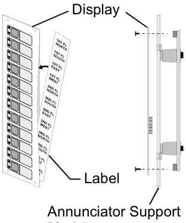
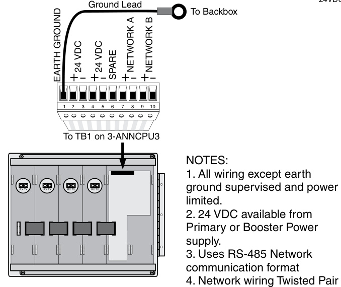
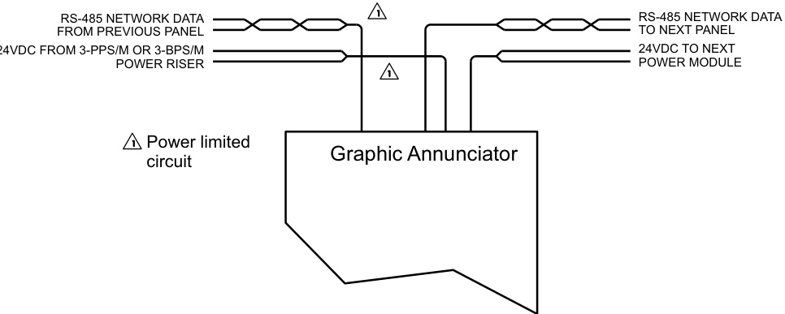
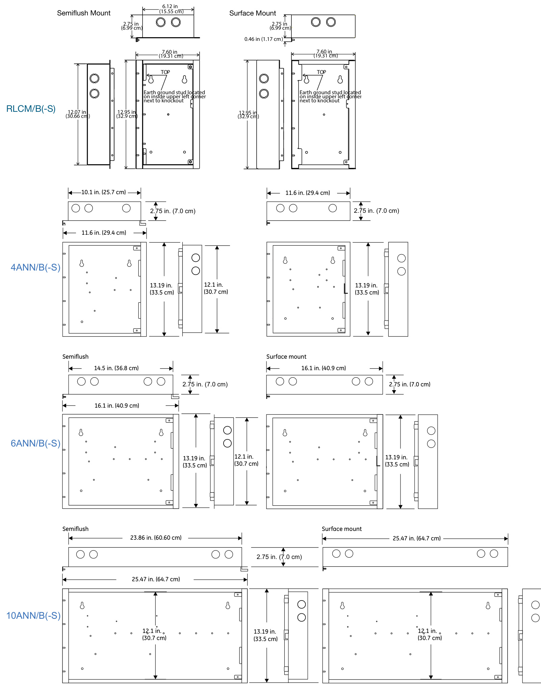

# EST3 Remote Annunciators 3-ANNCPU3, 3-LCDANN, 3-6ANN, 3-10ANN, 3-EVxxx, 3-4ANN  

# Overview  

EST3 supports a full range of annunciator options for Mass Notification/Emergency Communication (MNEC), Life Safety and other purposes. Annunciator cabinets are constructed from 16 gauge cold rolled steel. The gray textured enamel finish of the annunciators complements any decor. Both surface and semiflush mounting cabinet configurations maximize mounting flexibility and esthetic appeal.  Cabinet arrangements allow both LED and LCD annunciation to easily combine in a single enclosure. Slide in labeling for LEDs and switches provides designation flexibility for labeling in local languages. For graphic annunciation EST3 offers LED driver boards perfectly suited to operate in most graphic annunciators.  

EST3 annunciators are perfect for MNEC applications. They can be used in Central Control Stations (CCS), Autonomous Control Units (ACU), Local Operating Console (LOC) and combination units. In these applications,  annunciators are configured to operate as Local Operation Consoles, or even Central Command Stations, from which MNEC is initiated and controlled.  

# Standard Features  

•	 Standard 3-LCD (168 characters) and large-format 3-LCDXL1 (960 character) display options   
•	 LCD uses queues to sort events   
•	 Variety of wallbox configurations   
•	 Programmable LED flash rates   
•	 Slide-in labels Makes customization for regional language easy   
•	 Full line of driver boards for graphic annunciators  

# Application  

Use EST3 remote annunciators when a compact system status display is needed. Annunciator configurations include: LCD only display, LED only displays or combination LED and LCD display in a single enclosure.  

The LCD display uses either the 3-LCD or 3-LCDXL1 Liquid crystal display module.  The 3-LCD has a $128\times64$ graphical display typically used to display eight lines of 21 characters on its LCD display while the 3-LCDXL1 has a larger $240\times320$ pixel backlit display that supports 24 lines of 40 characters.  Both LDC displays provide the room needed to convey emergency information in a useful format.  

  
Module  

The 3-LCD always displays the last highest priority event even when the user is viewing other message queues. To give the greatest message flexibility EST3 event messages can route to specific annunciators. Routing can be initiated at a specific time/ shift change. Messages need only display in areas having to respond to an event.  

For LED display, the full line of EST3 Control/Display Modules support event display. Control/Display modules install over any annunciator support module maximizing annunciator design flexibility. A Lamptest feature can program to any spare control switch. If an LCD display is installed in the annunciator, simply operate the Alarm Silence and Trouble Silence switches simultaneously to lamptest all LEDs.  

# Typical Wiring  

# Rear view 3-ANNCPU3 Field Wiring 3-6ANN Shown  

  

# Power Riser  

Calculate wire size for a maximum 3.4 Vdc total line loss from the 24 Vdc nominal voltage.  

# Graphic Annunciator Field Wiring  

  
Wire Specifications Network Data Communications - RS485 Format   
Minimum Twisted Pair 18 AWG $(0.75\;\mathrm{mm}^{2})$ .Maximum Circuit Resistance 90 Ohms Maximum Circuit Capacitance $0.3\,\upmu\mathrm{F}$ Maximum Distance between any 3 panels 5,000 ft. $(1,524\;\mathrm{m})$ ).  

Capacitance, entire network Maximum Accumulative Capacitance   

<html><body><table><tr><td>Wire Size</td><td>38.4K Baud</td><td>19.2K Baud</td></tr><tr><td>18AWG</td><td>1.4 μF</td><td>2.8 μF</td></tr><tr><td>16AWG</td><td>1.8 μF</td><td>3.6 μF</td></tr><tr><td>14AWG</td><td>2.1 μF</td><td>4.2 μF</td></tr></table></body></html>

Distance limits are determined using the maximum allowable circuit resistance and capacitance, and manufacturer’s cable specifications.  

# Specifications  

<html><body><table><tr><td>Catalog Number</td><td>3-ANNCPU3</td><td>3-ANNSM</td><td>3-LCD</td><td>3-LCDXL1</td></tr><tr><td>AgencyListings</td><td></td><td colspan="2">UL,ULC,FM,CE,LPCB EN54*</td><td>UL, ULC, FM</td></tr><tr><td>Mounting Space</td><td>TwoSpaces</td><td>One Space</td><td>Mountsover3-ANNCPU</td><td>Mountsover3-ANNCPU plus twospaces.</td></tr><tr><td>CommunicationFormat Current@24Vdc</td><td>RS-485</td><td>N/A</td><td>N/A</td><td>N/A</td></tr><tr><td>Standby Alarm</td><td>144 mA</td><td>10mA 10mA</td><td>40mA 42mA</td><td>48mA 50mA</td></tr><tr><td>WiringTermination</td><td>144 mA Plug in terminal strip</td><td colspan="3"></td></tr><tr><td>Wiring Size</td><td>TwistedPair18-14AWG (0.75-1.5 mm2)</td><td colspan="3" rowspan="3">N/A</td></tr><tr><td>Max.WireDistance</td><td>5000 ft(1524m)</td></tr><tr><td></td><td>betweenany3panels</td></tr><tr><td>RelativeHumidity</td><td colspan="4">93%non condensing at 90°F(32°C) 0-49°C(32-120°F)</td></tr><tr><td>TemperatureRating WiringStyles</td><td colspan="4">ClassAorClassB</td></tr><tr><td></td><td colspan="4"></td></tr></table></body></html>

Note: For a complete list of EST3 annunciator display and control modules please refer to EDWARDS literature sheet part number 85010-0055. \* EN54-16:(2008), EN54-2:1997+A1 and EN54-4:1997+A1:2002+A2  

# Engineering Specification  

The Life Safety system shall incorporate annunciation of Alarm, Supervisory, Trouble and Monitor operations. Annunciation must be through the use of both LED display strips complete with a means to custom label each LED as to its function. Where applicable control switches must be provided. Switches with LEDs must provide positive feed back to the operator of remote equipment status. An LCD display with basic common control LEDs and switches shall be provided. The Common Control Switches and LEDs provided as minimum will be: Reset switch and LED, Alarm Silence switch and LED, Panel Silence switch and LED, Drill switch and LED. It must be possible to add additional common controls as required though the use of modular display / control  

units. The LCD interface must provide the ability to display custom event messages of a minimum of 40 characters. The LCD must provide the emergency user, hands free viewing of the first and last highest priority event. The last highest priority event must always display and update automatically. System events must automatically be placed in queues. It shall be possible to view specific event types separately. Having to scroll through a mixed list of events types is not acceptable. The total number of active events by type must be displayed. It must be possible to customize the designations of all user interface LEDs and switches for local language requirements. It must be possible to route system event messages to specific annunciator locations.  

# Dimensions  

  

# Ordering Information  

<html><body><table><tr><td>Catalog Number</td><td>Description</td><td>Ship Wt. Ib (kg)</td></tr><tr><td></td><td>Command Module Annunciators (c/w CPU,LCD display and doors.Orderwallboxseparately.)</td><td></td></tr><tr><td>3-LCDANN</td><td>Remote LCD Command Module Annunciator.</td><td>3.8 (1.7)</td></tr><tr><td>3-LCDANN-E</td><td>Remote LCD Command Module Annunciator.For EN54* market only, CE.</td><td>3.8 (1.7)</td></tr><tr><td></td><td>Base Annunciators(Come with two3-ANNSM annunciatorsupport modules,a CPU,and doors.</td><td></td></tr><tr><td></td><td></td><td></td></tr><tr><td> 3-4ANN</td><td>Four Position Base Annunciator.</td><td></td></tr><tr><td>3-4ANN-E</td><td>Four Position Base Annunciator. For EN54* market only, CE.</td><td></td></tr><tr><td>3-6ANN</td><td>SixPosition Base Annunciator.</td><td>6.28 (2.85)</td></tr><tr><td>3-6ANN-E</td><td>SixPosition Base Annunciator.ForEN54*market only,CE.</td><td>6.28 (2.85)</td></tr><tr><td>3-10ANN</td><td>10PositionBase Annunciator.</td><td>10.5 (4.8)</td></tr><tr><td>3-1OANN-E</td><td>10 Position Base Annunciator. For EN54*market only, CE.</td><td>10.5 (4.8)</td></tr><tr><td></td><td></td><td></td></tr><tr><td>*EN54-16:(2008),EN54-2:1997+A1and EN54-4:1997+A1:2002+A2 CPU, Support Module,&LCD Displays</td><td></td><td></td></tr><tr><td>3-ANNCPU3 Annunciator CPU (See Note 1)</td><td></td><td>1 (.45)</td></tr><tr><td>3-CPUDR</td><td>CPU doors with filler plates.Order separately, one required per CPU where</td><td>0.25 (.11)</td></tr><tr><td>3-ANNSM</td><td>no LCD display is installed. Annunciator Support Module</td><td>.45 (.2)</td></tr><tr><td>3-LCD</td><td>Liquid Crystal Display Module, eight lines. (See Note 1)</td><td>.8 (.36)</td></tr><tr><td>3-LCDXL1</td><td>Liquid Crystal Display Module, 40 lines mounts in 3-4ANN, 3-6ANN or 3-10ANN anunciators. Note one 3-LCDXL1KBL,(ordered separately) is required for each</td><td></td></tr><tr><td></td><td>3-LCDXL1mountinginto3-6ANNor3-10ANNannunicatorboxes.</td><td></td></tr><tr><td>3-LCDXL 1KBL</td><td>Cable for 3-LCDXL1(Use to connect from 3-ANNCPU3 to the first annuciator support model. Not required with 3-4ANN and 3-LCDXL1 applications.)</td><td></td></tr><tr><td>Control/Display Modules</td><td></td><td></td></tr><tr><td>3-CPUDR</td><td>Twoblank filler plates suitable for any annunciatorblank space.</td><td>.5 (.22)</td></tr><tr><td>3-24R</td><td>24 Red LED Display Module (See Note 1)</td><td>.35 (.12)</td></tr><tr><td>3-24Y</td><td>24 Yellow LED Display Module (See Note 1)</td><td>.35 (.12)</td></tr><tr><td>3-24G</td><td>24 Green LED Display Module (See Note 1)</td><td>.35 (.12)</td></tr><tr><td>3-12SR</td><td>12 switches with 12 Red LED Display/Control Module (See Note 1)</td><td>.35 (.12)</td></tr><tr><td>3-12SY</td><td>12switcheswith12Yellow LEDDisplay/Control Module(SeeNote 1)</td><td>.35 (.12)</td></tr><tr><td>3-12SG</td><td>12switcheswith 12GreenLEDDisplay/Control Module(SeeNote 1)</td><td>.35 (.12)</td></tr><tr><td>3-12RY</td><td>12 Red LED and 12 Yellow LED Display Module (See Note 1)</td><td>.35 (.12)</td></tr><tr><td>3-12/S1GY</td><td>12 switcheswith one Green and oneYellowLEDper switch(See Note 1)</td><td>.35 (.12)</td></tr><tr><td>3-12/S1RY</td><td>12 switches with one Red and one Yellow LED per switch (See Note 1)</td><td>.35 (.12)</td></tr><tr><td>3-12/S2Y</td><td>12 switches with two Yellow LEDs per switch</td><td>.35 (.12)</td></tr><tr><td>3-6/3S1G2Y</td><td>6 groups of 3 switches. Each switch with one LED: Green, Yellow, Yellow.(See Note 1)</td><td>.35 (.12)</td></tr><tr><td>3-6/3S1GYR</td><td>6 groups of 3 switches.Each switch with one LED: Green,Yellow,Red.(SeeNote 1)</td><td>.35 (.12)</td></tr><tr><td>3-REMICA</td><td>Remote microphone for use in 3-ANN series annunciator cabinets (See Note 1)</td><td>15 (6.8)</td></tr><tr><td>3-FP</td><td>Filler Plate, order separately one required per 3-ANNSM when no LED or</td><td></td></tr><tr><td></td><td>LED/Switch module installed on operator layer.</td><td>0.1 (0.05)</td></tr><tr><td>Driver Modules,Power Supplies 3-EVDVR</td><td>LED/SWITCHDriverModule,ForEDWARDSGraphics</td><td></td></tr><tr><td>3-EVDVRA</td><td>LED/SWITCH Driver Module Assembly for Third-party Graphics</td><td>.35 (.12) .35 (.12)</td></tr><tr><td>3-EVPWR</td><td>Power Supply for EDWARDS Graphics</td><td>.5 (.22)</td></tr><tr><td>3-EVPWRA</td><td>Power Supply Assembly c/w 19 inch rail mounting chassis assembly space</td><td></td></tr><tr><td></td><td>for one 3-ANNCPU3 for Third-party Graphics</td><td>2.5 (1.2)</td></tr><tr><td>3-EVDVRX</td><td>Plastic mounting extrusion 19" mounting - for up to 3 3-EVDVRAs</td><td>.35 (.12)</td></tr><tr><td>Enclosures RLCM/B</td><td>RemoteCommandmoduleflushmountLCDwallbox</td><td></td></tr><tr><td>RLCM/B-S</td><td>Remote Command module surface mount LCDwallbox</td><td>2.5 (1.2) 2.5 (1.2)</td></tr><tr><td>3-RLCM/D</td><td>Inner and outer doorsfor RLCM/B(-S)</td><td>2.0 (0.9)</td></tr><tr><td>4ANN/B</td><td>Four Position LED/LCD flush mount wallbox.</td><td></td></tr><tr><td></td><td></td><td>6.0 (2.7)</td></tr><tr><td>4ANN/B-S</td><td>Four position LED/LCD surface mount wallbox.</td><td>6.0 (2.7)</td></tr><tr><td>6ANN/B</td><td>Six position LED/LCD flush mount wallbox</td><td>7.0 (3.2)</td></tr><tr><td>6ANN/B-S</td><td>Six position LED/LCD surface mount wallbox</td><td>7.0 (3.2)</td></tr><tr><td>10ANN/B</td><td>Tenposition LED/LCD flush mount wallbox</td><td>9.0 (4.1)</td></tr><tr><td>10ANN/B-S</td><td>Ten position LED/LCD surface mount wallbox</td><td>9.0 (4.1)</td></tr><tr><td>3-4ANN/D</td><td>Inner andouterdoorsforfourpositionwallboxes</td><td>2.0 (0.9)</td></tr><tr><td></td><td></td><td></td></tr><tr><td>3-6ANN/D</td><td>Inner and outerdoorsforsixpositionwallboxes</td><td>2.0 (0.9)</td></tr><tr><td></td><td></td><td></td></tr><tr><td></td><td></td><td></td></tr><tr><td>3-10ANN/D</td><td>Innerandouterdoorsfortenpositionwallboxes</td><td>2.5 (1.2)</td></tr><tr><td></td><td></td><td></td></tr><tr><td></td><td></td><td></td></tr><tr><td></td><td></td><td></td></tr><tr><td></td><td></td><td></td></tr><tr><td></td><td></td><td></td></tr><tr><td></td><td></td><td></td></tr><tr><td></td><td></td><td></td></tr><tr><td></td><td></td><td></td></tr><tr><td></td><td></td><td></td></tr><tr><td></td><td></td><td></td></tr><tr><td></td><td></td><td></td></tr><tr><td></td><td></td><td></td></tr><tr><td></td><td></td><td></td></tr><tr><td></td><td></td><td></td></tr><tr><td></td><td></td><td></td></tr><tr><td></td><td></td><td></td></tr><tr><td></td><td></td><td></td></tr><tr><td></td><td></td><td></td></tr><tr><td></td><td></td><td></td></tr><tr><td></td><td></td><td></td></tr><tr><td></td><td></td><td></td></tr><tr><td></td><td></td><td></td></tr><tr><td></td><td></td><td></td></tr><tr><td></td><td></td><td></td></tr><tr><td></td><td></td><td></td></tr><tr><td></td><td></td><td></td></tr><tr><td></td><td></td><td></td></tr></table></body></html>

Note 1: Add suffix “-E” for EN54 compliant versions  