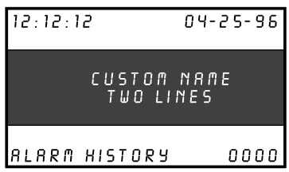
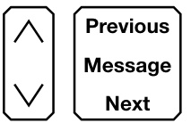

# Liquid Crystal Display Module 3-LCD  

# Overview  

The Main Display interface is the primary user interface in the EST3 Life Safety System. The main display interface focuses on the emergency user by putting information important to the user up front. Hands free, the first highest priority event is shown. The display always gives the last highest priority event. Arriving at the panel and without opening the door the first and last alarm is given. Simple to understand lights and switches help the emergency user execute system commands with confidence.  

A menu system supports maintenance functions such as disables or reports for use by staff or service personnel.  

# Standard Features  

•	 Uses simple lights and switches   
•	 Displays information important to user   
•	 Hands free first alarm display   
•	 Last event of highest priority always displays Eight lines by 21 character graphic LCD display — 168 characters total Multlingual Supports English, French, Spanish, and Russian Uses queues to sort events A queue is a list of messages Alarm, Supervisory, Trouble and Monitor Slide in LED and switch labels Makes customization for regional language easy  

# Application  

The 3-LCD module mounts to the local rail over the nodes Central Processing Unit Module (3-CPU). The 3-LCD module is optional in any network node.  

Ensuring information clarity the 3-LCD uses a backlit high contrast supertwist graphical display. Eight lines of 21 characters provide the room needed to convey emergency information in a useful format.  

The 3-LCD always displays the last highest priority event even when the user is viewing other message queues. Further message flexibility is provided with EST3’s message routing ability.  Messages from a node can display at every node on the network or messages can route to specific nodes only. Routing can be initiated at a specific time/shift change. There is no need to have messages display in areas that are not affected by an event.  

The 3-LCD can display messages in English, Spanish, French, and Russian. The bilingual display lets the operator select between either of two languages. Consult your representative for available language combinations.  

The EST3 system configures for Proprietary, Local or EN54 market operations. The mode of operation is selected through the System Definition Utility (SDU) which may adjust the following operations slightly to fit the system operation selected.  

# LEDs and Switches  

Further enhancing the 3-LCD user interface are easy to read and understand lights and switches. All functions are laid out in a logical order. At the top of the 3-LCD are five system status LEDs. Here determining the general condition of the system is easy.  

<html><body><table><tr><td>口 Power</td><td>口 Test</td><td>口 CPU Fail</td><td>口 Gnd Fault</td><td>口 Disable</td></tr></table></body></html>  

Power LED: Green, on when AC power is on. Test LED: Yellow, on when any portion of the system (Group) is under test.  

  

CPU Fail LED: Yellow, on when CPU stops running.  

Gnd Fault LED: Yellow, on when a ground exists on the system (group)  

Disable LED: Yellow, on when any point or zone is disabled by a user.  

Below the general status LEDs are located four, LED / Switch common controls. The versatility of EST3 allows system designers to define the features as affecting a domain (defined group of nodes) or as global (affects all nodes) across the network.  This feature is very useful when configuring systems with multiple buildings on one network. As an example, operating the reset in one building may have adverse effect in other buildings. With EST3 having operational differences between buildings on the same network is not a problem.  

Pressing Reset starts the system’s reset operation. The yellow LED has three flash rates during reset. The LED flashes fast during the smoke power down phase of reset, flashes slow during the restart phase, and turns on steady for the restoral phase. The Reset LED turns off when the system is normal.  

Pressing Alarm Silence turns off all Notification Appliance Circuits defined as audible. The yellow LED turns on when silence is active via the Alarm Silence switch or via alarm silence software timers.  

Pressing Panel Silence turns off the system’s internal audible signal.  The yellow LED turns on when panel silence is active.  The EST3 panel buzzer has user programmable signal rates for alarm, supervisory, trouble and monitor conditions.  

Pressing Drill turns on the drill LED and all signals sound evacuation. Drill does not activate city tie connections.  Auxiliary relays will not activate unless programmed to do so with drill.  

  

In the center of the 3-LCD is the Liquid Crystal Display. In the normal condition the date and time plus a definable system title display on the LCD. The last line of the display gives an alarm history. This total equals the number of  

times the system has entered the alarm state from the normal state.  

When active events are on display, the LCD formats into four logical windows.  

SYSTEA STRTUS WINDOU CURRENT EVENT WINDOWLRST EVENT WINDOW TUPE STRTUS WINDOU  

  

In the system status window, the display shows the time and the status of active and disabled points.  

The current event window, lines 2, 3, 4 automatically display the first active event of the highest priority if the user has not taken control of the system. Once the emergency user takes control, this window displays user message selections.  

The second line of the display shows system event information. In the example above the display shows the chronological number of the event (0001 is the first alarm) followed by the event type (Alarm Active). EST3 supports over 45 event type messages from which system designers choose. The last two lines of the current event window are custom programmable location message lines with space for 42 characters.  

The last event window shows the last highest priority event. This window is always displayed and updated automatically by the system. Here the emergency user can monitor the progress of a fire.  

When EST3 is configured for a local mode system viewing the second alarm message is easy, just press the NEXT key. The next message scrolls into the current event window.  

  

on view. No matter what queue the user selects for viewing, the LCD always displays the most recent alarm. A new alarm event resounds the panel audible signal and appears immediately on display without overwriting information the user selected for view.  

The final window of the LCD the type status window shows the total number of active events by queue type. A is alarm, S is supervisory, T is trouble, and M is monitor. The number following each letter is the number of active events existing in each queue.  

EST3 breaks down event types into queues and automatically displays the first event of the highest priority type.  

  

Priority order is alarm, supervisory, trouble, monitor. By using queues an emergency user does not waste time scrolling through a mixed event list looking for alarms or confusing an alarm message with other message types.  

EST3 configures for Remote proprietary system operation where every event must be acknowledged by viewing them before the internal buzzer will silence. Or the EST3 will configure for Local operation. Here the internal buzzer silences by pressing panel silence. If any events exist in queues that have not been viewed the queue LED continues to flash informing the user of un-seen events.  

When all events in a queue are acknowledged or ‘seen’, the LED associated with the queue turns on steady. If a new event is added to the queue, the EST3 internal buzzer resounds and the queue LED flashes.  

EST3 allows device grouping into logical group zones. Here two or more alarm devices (such as detectors or pull stations) make up the zone. When a device in the zone activates, the LCD displays the zone description. Each zone only displays once, regardless of the number of devices active within the zone.  

Details To display device information the user presses the Details key. The device with the lowest address displays in the first window.  

If multiple devices are active each is available for viewing by using the arrow associated with the Previous Message Next key and scrolling through the device list.  

The common controls easily expand beyond the Main Display interface by adding a Control Display Module and assigning features to its switch controls.  

  

For Maintenance users, the EST3 provides a smooth operating  

menu system providing powerful tools for system management, reports, and trouble shooting.  

# Installation and Mounting  

  
Page 3 of 4  

# EN54 Compliance  

EST3 has passed the British-based Loss Prevention Certification Board (LPCB) certified EST3 control panels and power supplies as having surpassed the requirements of the pivotal EN54 standard, parts two and four as well as part 16. LPCB Certificate #262ab  In order to meet these standards, display and control functions have undergone slight modifications for the EN54 marketplace. These differences are highlighted below. All other control and annunciation features remain unchanged.  

Note: EN 54-2: 1997 $^+$ A1: 2006, EN 54-4: 1997 + A1: 2002 + A2: 2006, and EN 54-16: 2008.  

# System Status LEDs  

<html><body><table><tr><td>口 Power</td><td>口 Test</td><td>口 CPU Fault</td><td>口 Sounder</td><td>口 Disable</td></tr></table></body></html>  

# Power LED (Green): on when DC power is on.  

Test LED (Yellow): on when any portion of the system (Group) is under test.  

CPU Fault LED (Yellow): on when CPU stops running (processor failures must be manually reset).  

# Gnd Fault LED: Not available.  

Sounder LED (Yellow): flashing indicates fault on sounder circuit.   
Steady indicates a disabled sounder circuit.  

Disable LED (Yellow): on when any point or zone is disabled by a user (disabled conditions have priority over fault conditions).  

# Switch Functions  

  

Pressing Sounder On/Off turns off all sounder circuits defined as audible. The yellow LED turns on when silence is activated via the Sounder On/Off or via the alarm silence software timers.  

See Page 2 for descriptions of Reset, Panel Silence, and Drill functions.  

# Event Queues  

  

For EN54 compliance, EST3 configures for remote proprietary system operation. This requires that every event must be acknowledged by viewing them before the internal buzzer will silence. The priority order is Fire, Fault, Disable, Monitor.  

# Engineering Specification  

The system shall provide a user interface that displays system events in a text format, and supports basic common control LEDs and switches. The Common Control Switches and LEDs provided as minimum will be; Reset switch and LED, Alarm Silence switch and LED, Panel Silence switch and LED, Drill switch and LED. It must be possible to add additional common controls as required through the use of modular display units. The user interface must provide an LCD that will allow custom event messages of up to 42 characters. The interface must provide a minimum of eight lines by 21 characters and provide the emergency user, hands free viewing of the first and last highest priority event. The last highest priority event must always display and update automatically. Events shall be automatically placed in easy to access queues. It shall be possible to view specific event types separately. Having to scroll through a mixed list of event types is not acceptable. The total number of active events by type must be displayed. Visual indication must be provided of any event type which has not been acknowledged or viewed.  It must be possible to customize the designation of all user interface LEDs and Switches for local language requirements. It shall be possible to have a custom message for each device in addition to zone messages. Custom device messages must support a minimum of 42 characters each. Instructional text messages support a maximum of 1,000 characters each. The display shall be capable of displaying English, Spanish, French, or Russian messages.  

Technical Specifications   

<html><body><table><tr><td>CatalogNumber</td><td>3-LCD</td></tr><tr><td>Agency Listings</td><td>UL,ULC,FM,CE,LPCB,EN54*.</td></tr><tr><td>LCD Display</td><td>Eight linesby21charactersbacklitLCD</td></tr><tr><td>Mounting</td><td>Twolocalraillspaces on topof 3-CPU</td></tr><tr><td>CommonControl SwitchesandLEDs</td><td>ResetswitchandLED AlarmSilenceswitchandLED</td></tr><tr><td></td><td>PanelSilenceswitchandLED DrillSwitchand LED</td></tr><tr><td>AlarmCurrent StandbyCurrent</td><td>42mA</td></tr><tr><td></td><td>40mA</td></tr></table></body></html>

\* EN 54-2: 1997 + A1: 2006, EN 54-4: 1997 + A1: 2002 $^+$ A2: 2006, and EN 54-16: 2008.  

# Ordering Information  

<html><body><table><tr><td>Catalog Number</td><td>Description</td><td>Shipping Weight, Ib. (kg)</td></tr><tr><td>3-LCD</td><td>LiquidCrystalDisplayModule Add suffix“-E"forEN54compliantversion</td><td>.8 (.36)</td></tr><tr><td>3-LKE</td><td>UK English Label Kit</td><td>.25 (.11)</td></tr><tr><td>3-LKF</td><td>French Label Kit</td><td>.25 (.11)</td></tr><tr><td>3-LKR</td><td>RussianLabelKit</td><td>.25 (.11)</td></tr><tr><td>3-LKS</td><td>SpanishLabelKit</td><td>.25 (.11)</td></tr></table></body></html>  