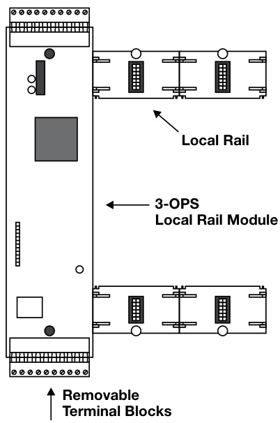
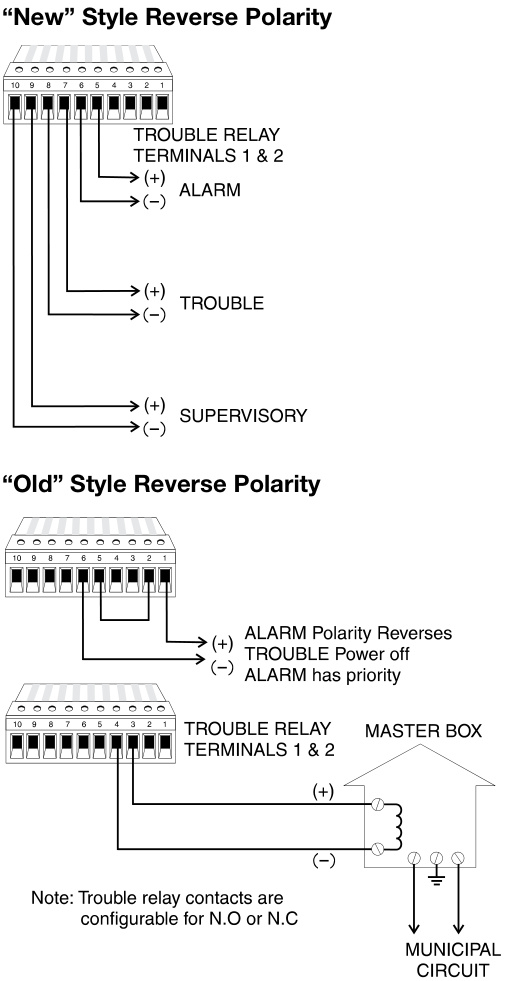

# Off Premise Signaling Module 3-OPS  

# Overview  

The 3-OPS configures for “old” or “new” styles of reverse polarity central station operation. Removable terminal blocks allow isolation of field wiring without having to remove individual wires. This feature helps make service and isolation of field wiring for trouble shooting easy. The 3-OPS off premises signaling module is a local rail module and will support any Control Display module mounting to its front giving exceptional flexibility to system user interface layout.  

# Standard Features  

•	 Reverse polarity oputputs for Alarm Supervisory and Trouble •	 City Box operation  

# Application  

The 3-OPS supports three separate off premises signaling modes of operation.  

1)	 The first or “old” style reverse polarity operation has only the alarm relay active. In the normal state the alarm output is 24 Vdc current limited to 6mA. In the alarm state the polarity reverses.  Should the EST3 panel go into trouble from the normal state, the voltage is removed from the output terminals of the 3-OPS the change will be detected by the central station as a trouble.  Alarm always has priority over trouble. Trouble relay contacts must be configured for normally closed operation.  

2)	 The second operation “new” style allows the 3-OPS to output three independent reversing polarity signals. These are alarm, supervisory, and trouble.  In each case an active condition causes the terminal output voltage to reverse. Should the central station detect a loss of voltage the condition is due to line failure. When configured for “new” style operation a set of form C trouble contacts are available.  

3)	 The 3-OPS will also support a City Tie connection. In this configuration the 3-OPS has terminals for a local energy master fire alarm box. The module operates into a 14 ohm coil and supervises the city tie connection for open conditions.  Trouble relay contacts are configurable for normally open or normally closed.  

# Typical Wiring  

  

# Installation and Mounting  

  

# Specifications  

<html><body><table><tr><td>Operating Current</td><td>53mA</td></tr><tr><td>StandbyCurrent</td><td>147 mA</td></tr><tr><td>Mounting</td><td>OneLocal RailSpace</td></tr><tr><td>TerminalSize</td><td>18-12AWG (1.0mm2-2.5mm2)</td></tr><tr><td>Approvals</td><td>UL,ULC</td></tr></table></body></html>  

# Ordering Information  

<html><body><table><tr><td>Catalog Number</td><td>Description</td><td>Ship Wt. Ib. (kg)</td></tr><tr><td>3-OPS</td><td>OffPremises Signalingmodule</td><td>0.59 (.27)</td></tr><tr><td>3-FP</td><td>FillerPlate，order separatelywhenno LEDorLED/Switch moduleinstalled.</td><td>0.1 (.05)</td></tr></table></body></html>  