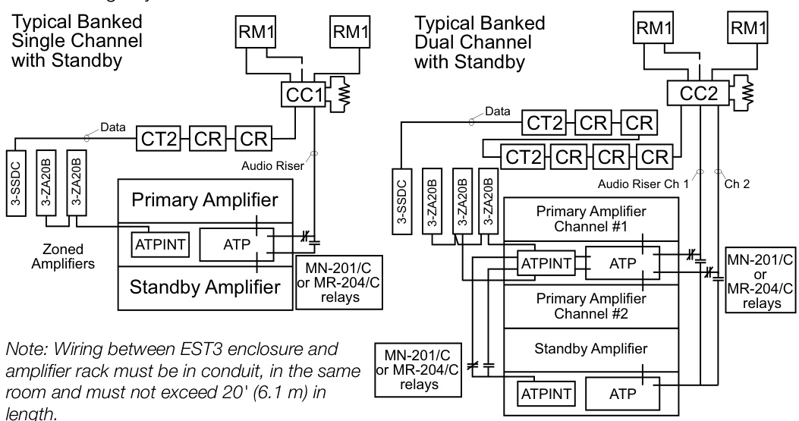

# Centralized Banked Amplifiers  

# Overview  

EST3 supports centralized (banked) amplifier configurations for Mass Notification/Emergency Communication (MNEC), life safety, and emergency signaling.  

Model 3-ZA20 Zoned Amplifiers at the EST3 control panel provide a channel source(s) for banked amplifiers. The 3-ZA20 amplifiers can select any one (at a time) of the EST3 eight audio channels as a signal source. Examples include; page, alert and evacuation. Standby Amplifier(s) are an option.  

Special interface modules, the 3-ATPINT, or MN-ABPM panel-mount, accept analog audio signals $@$ 25 or 70 Vrms from EST3’s zoned amplifiers and passes these signals to the 1B3-125 and 1B3-250 audio power amplifiers via an Amplifier Terminal Panel (ATP). The 3-ATPINT can pass supervised audio signals to other ATPlNTs within a local amplifier bank or to other remote banks of amplifiers. The 3-ATPINT mounts on the ATP.  

The ATP Audio Terminal Panel interfaces one or two audio power amplifiers and monitors utility power, charges and supervises standby batteries, and provides switch-over to standby. Audio risers connect at this panel. It also has an integral trouble signal and silence switch.  

The EST3 System monitors and controls the amplifier bank through Signature series modules such as the SIGA-CT1 or 2 input modules and the SIGA-CR control relay. MR-201/C or MN-204/C relays provide DPDT contacts for switching power amplifier risers when a system has standby amplifiers.  

SIGA-CC1 (Single Channel) or CC2 (Dual Channel) output control modules command and supervise each audio circuit or zone. The SIGA-RM1 Riser Monitor Module provides audio riser supervision.  

# Standard Features  

Large Supervised Amplifiers [1B3-250 & 1B3-125]   
- 250 or 125 Watt amplifiers   
- broad frequency response and low distortion   
- thermal and electronic protection  

# Amplifier Terminal Panel [ATP]  

- supports two audio power amplifiers - charges and supervises up 40 AH batteries - standard 19 inch rack mounting - Terminal Panel Interface Module [3-ATPINT] - supports connection to EST3 Zoned Amplifiers Supported by System Definition Utility - fast rules based programming  

Part of an end-to-end ${\bf520\;H z}$ signaling solution - UL approved for use in sleeping rooms  

Uses the 3-ASU & 3-ASU/FT Audio Source Units - site-recordable or downloadable messages - live paging - hierarchical operation of eight distinct digital audio channels  

# Uses the ZA20 amplifier as a source  

- Class A or B connection - Supports Multiple PreAmps - Optional Standby PreAmps - 25 Vrms or 70 Vrms interface - drives multiple 3-ATPlNTs in same rack  

# Application  

Life Safety Audio provides Emergency Response Personnel with a means to control building evacuation using voice instructions.   
Banked Amplifiers provide EST3 with economy audio configurations for Single and some Dual channel applications.  

# Typical Configuration  

# Block Wiring Layout  

  

# Typical System Components  

Data Sheets are available for the following components.  

3-ASU/FT	 Audio Source Unit with Fire Phone   
3-ASU Audio Source Unit   
3-ATPINT Audio Terminal Panel Interface   
ATP Audio Terminal Panel   
ATP-220 Audio Terminal Panel 220 Vac   
1B3-250 250 Watt Power Amplifier   
1B3-125 125 Watt Power Amplifier   
SIGA-CT1 Single Circuit Input Module   
SIGA-CT2	 Dual Circuit Input Module   
SIGA-RM1	Riser Monitor Module   
SIGA-CR Control Relay   
SIGA-MP1	Module Mounting Plate, eight spaces   
SIGA-MP2	Module Mounting Plate, four spaces   
ARM-8 Relay Module /w one relay, space for eight total   
MR-201/C	Relay for ARM-8 (single DPDT)   
MR-204/C	Relay for ARM-8 (four-position DPDT)   
RKU-42 Standard 19 inch Rack Mounting Cabinet, 42 inch   
RKU-61 Standard 19 inch Rack Mounting Cabinet, 61.25 inch   
RKU-70 Standard 19 inch Rack Mounting Cabinet, 70 inch   
RKU-77 Standard 19 inch Rack Mounting Cabinet, 77 inch   
VP-1 Vented Panel, 1.75 inch   
VP-3 Vented Panel, 3.5 inch   
BP-1 Blank Panel, 1.75 inch   
BP-2 Blank Panel, 3.5 inch   
BP-3 Blank Panel, 5.25 inch   
MFC Module Fire Cabinet  