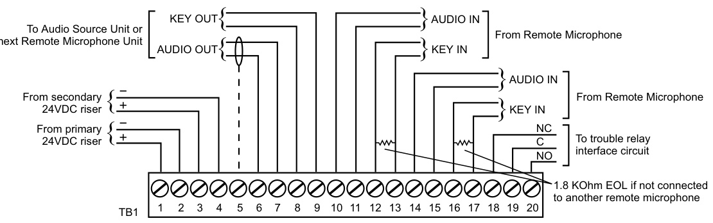

# Remote Microphones 3-REMICA, 3-REMICP  

# Overview  

The remote microphone panel is a supervised remote microphone, used with the Audio Source Unit’s (3-ASU) remote microphone input. The remote microphone panel is available in two packages. The 3‑REMICA is designed to mount in two spaces of a 3-ANN series annunciator enclosure. Model 3-REMICP mounts in a CAB series enclosure on a 3-CHASS4 rail assembly. Both panels include a dynamic push-to-talk microphone and operator interface panel.  

Each microphone panel has two external audio inputs.  Using the external inputs, up to 63 microphone panels can be connected to a single 3-ASU. The first panel to initiate a page seizes control of the remote 3-ASU input and automatically prevents the other remote panels from issuing a page while the first unit is in use. The built-in 3-ASU microphone has a higher priority than any remote microphone, and will override a remote page.  

The front panel provides Local Page Active, Remote Page Active, and Trouble LED indicators as well as an integral VU (Volume Unit) meter to indicate page volume level.  

All panels utilize a 24 Vdc power source. Provisions are made for redundant power supplies. All wiring is supervised. A form C trouble contact is provided for use with a Signature input module to report trouble back to the system.  

# Standard Features  

Up to 63 remote microphones per ASU   
•	 Annunciator or cabinet mounting VU meter and status LEDs Active remote mic has priority with ASU priority override   
All wiring is supervised  

# Application  

The 3-REMICA and 3-REMICP are designed to add remote paging capability at network nodes or remote annunciators that are remotely located from the Audio Source Unit. These areas are typically alternate fire command stations, security desks, or other areas where public messages are issued during an emergency. Selection of paging areas is done with standard EST3 Control Display Modules, which can be programmed as required for each paging application.  

# Typical Wiring  

  

# Engineering Specifications  

Remote paging microphones shall be provided at the locations specified on the drawings. Each remote microphone shall provide a dynamic Push-to-Talk microphone, Page level meter, Local Page Active LED, Remote Page Active LED, and Trouble LED. Selection of paging areas shall be provided using Control Display Modules, which can be programmed as required for each paging application. The system shall support up to 63 remote microphones.  

# Technical Specifications  

Installation  

<html><body><table><tr><td colspan="2">3-REMICA-Takes up two spaces in the 3-ANN series of annunciatorcabinets.</td></tr><tr><td>3-REMICP 3-REMICA-E</td><td>- Remote microphone in chassis for use in CAB series cabinets. - Takes up to two spaces in a 3-ANN series annunciator cabinet, EN54 listed, CE compliant (see Agency Listings below).</td></tr><tr><td>Input Power</td><td>21to27VDCCurrent:64mA</td></tr><tr><td>Microphone Audio Output</td><td>Dynamic, PTT</td></tr><tr><td>Audio Input</td><td>1 VRMSinto1KOhms</td></tr><tr><td></td><td>1 VRMSinto1KOhms</td></tr><tr><td>FrequencyResponse</td><td>100 - 4,000 Hz</td></tr><tr><td>Supervision AudioKey (PTT) Wiring</td><td>1 KHz Tone Pulse DC for opens and shorts</td></tr><tr><td>MaximumResistance WireType</td><td>210ohmsmax.fromoutputoflastcascadedremotemicrophone to 3-ASU remote microphone input Audio = Twisted-shielded pair, 14 - 26 AWG Key (PTT) = Twisted pair, 14 - 26 AWG</td></tr><tr><td>Indicators</td><td>Trouble LED</td></tr><tr><td>Agency Listings</td><td>UL,ULC,EN54-2:1997+A1:2006, EN 54-4:1997 + A1:2002 + A2: 2006, and EN 54-16:2008</td></tr><tr><td>OperatingEnvironment</td><td>32°F(0°C) to 120°F (49°C),93%RH Non-condensing</td></tr></table></body></html>  

# Ordering Information  

<html><body><table><tr><td>Catalog Number</td><td>Description</td><td>Ship Wt. Ib (kg)</td></tr><tr><td>3-REMICA</td><td>Remotemicrophoneforusein3-ANNseriesannunciatorcabinets</td><td>15 (6.8)</td></tr><tr><td>3-REMICA-E</td><td>Remotemicrophoneforusein3-ANNseriesannunciatorcabinets forEN54-16Applications</td><td>15 (6.8)</td></tr><tr><td>3-REMICP</td><td>RemotemicrophoneinchassisforuseinCAB Bseriescabinets</td><td>15 (6.8)</td></tr><tr><td>3-CHASS4</td><td>Chassis,with space fora 3-REMICPor 3-ASU and fourlocal rail modules，foruseinCABseriescabinets</td><td>8.5 (3.9)</td></tr></table></body></html>  