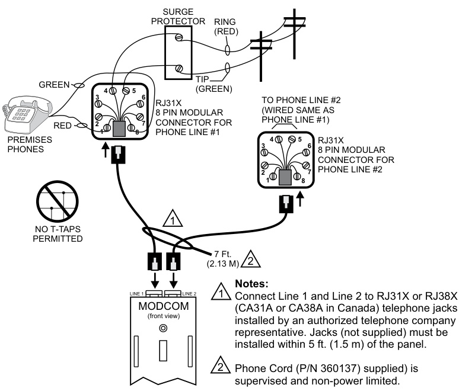

# Modem Communicator 3-MODCOM, 3-MODCOMP  

# Overview  

The Modem Communicator is a two-way local rail module that performs a variety of off-premise communications functions for the EST3 system.  

Using the latest in digital signal processing (DSP) techniques, the Modcom provides off premise communication features unavailable on any other system.  

The module has provisions for supervising two loop-start telephone lines. The module features a modular jack for telephone line connections. The Modcom’s configuration and firmware can also be updated from any network node.  

Modcom series modules occupy a single local rail space and can be mounted in any node on the network. Any EST3 Control/ Display module can be mounted on the face of a Modcom series module. Power for the Modcom is supplied by the EST3 system supply.  

The Modcom provides an enhanced level of survivability in the event of a network CPU failure by notifying the Central Monitoring Station of the failure and entering a degraded mode of operation. In degraded mode, the Modcom can transmit a default fire alarm message during a fire alarm condition.  

# Standard Features  

•	 Listed for fire, security and access control   
•	 V.32bis $14.4\mathsf{K}$ full duplex modem Digital alarm communicator transmitter supporting: SIA DCS protocol, Contact ID protocol, $3/1$ and 4/2 pulse format protocol   
•	 Supports “tap” alphanumeric pager protocol   
•	 Fully programmable messages   
•	 Alarm override of upload/download   
•	 Two phone line capability   
•	 Field upgradable firmware Split and multiple reporting to as many as 80 different receivers   
•	 255 subscriber accounts   
•	 Supports control/display modules   
•	 Supervised by the network controller   
•	 Supports Cellular communications  

# Application  

Two versions of the Modcom are available:  

3-MODCOM - Has an internal V.32bis 14.4K baud full duplex modem. The modem permits upload and download of system data remotely via a telephone line. In addition, the 3-MODCOM has a Digital Alarm Communications Transmitter (DACT) or dialer function that transmits network status information to Central Monitoring Stations (CMS) via telephone. Four DACT protocols are available:  

1.	 Digital Communicator Standard (DCS) “SIA forma” Dialer – 300 baud format, which transmits alphanumeric system status data to the CMS;   
2.	 Contact ID;   
3.	 SIA 3/1 dialer; and,   
4.	 SIA 4/2 dialer.  

Alarm code content is determined by system rules.  

3-MODCOMP – In addition to all modem and dialer (DACT) functions of the 3-MODCOM, the 3-MODCOMP can dial directly into paging systems using Telelocator Alphanumeric Protocol (TAP). Alphanumeric system data can be sent to a single pager or group(s) of pagers. Some pager services can forward messages via e-mail and Fax.  

# Multiple Priority  

Each Modcom can buffer up to 500 events in its event queue. It reviews all active events in the queue and identifies the highest priority event and dials the associated receiver. When the receiver is contacted, the MODCOM will transmit the highest priority message for that receiver. If the message is successfully received, the MODCOM identifies the next highest priority message and the process repeats.  

# Phone Line Friendly  

The Modcom series has been designed for installation on the same phone lines with other devices such as phones and faxes. The module makes its first dial out attempt on either of the two phone lines that is not in use. This prevents unnecessary interruption of calls in progress by the line seizure relays. In the event that both lines are busy, the module seizes line one.  

A fixed DACT testing time can be set at an off-hour, e.g. 2:00am, again minimizing interruptions and phone line costs. The call time is programmable, and allows testing of the DACT with the central station.  

The Modcom series also has the ability to detect Type 1, Type 2 and Type 3 distinctive ringing patterns, permitting it to share its phone lines with other devices and still have a unique phone number for incoming modem calls.  

# Multiple Modcoms per Network  

Multiple Modcoms can be installed in a single cabinet or located in nodes throughout the network to provide added availability and enhanced redundancy of off premise communications.  

# Multiple Receiver Capability  

In large system applications the EST3 system may be partitioned such that it supports a number of different customers, each using different Central Monitoring Stations and/or paging companies. The Modcom can accommodate up to 255 different accounts using up to 80 different receivers.  

The Modcom supports split reporting, a process where the system directs the Modcom to send some events or event types to one  

receiver, and different events to alternate receivers. The module’s multi-dial reporting capability permits an individual event to be transmitted to multiple receivers, including pagers.  

# Remote Data Upload/Download  

The modem permits data to be downloaded into the memories of the various components making up an EST3 system. Data can be remotely uploaded and downloaded for use with the EDWARDS Access Control Database Program. In the event that an alarm is received during upload/download activity, the Modcom automatically terminates the call and transmits the alarm events to the appropriate receivers. When completed sending the events, the download will continue where it left off.  

# Engineering Specification  

The system shall provided an off premise communications module capable of transmitting system events to multiple Central Monitoring Station (CMS) receivers. The module shall provide the CMS with point identification of system events via 4/2, Contact ID or SIA DCS protocols. <The module shall also be capable of  transmitting alphanumeric system activity by event to a commercial paging system using TAP Pager protocol.> The dialer shall have the capability to support up to 255 individual accounts and to send account information to eighty (80) different receivers, each having a primary and secondary telephone access number. System events shall be capable of being directed to one or more receivers depending on event type or location as specified by the system designer. The module shall have a degrade mode capable of transmitting fire alarm signals to the CMS in the event of system CPU failure. The module shall provide a high speed (V.32bis or greater) modem function in order to upload and download system data to/from a remote location.  

# Typical Wiring  

  
For cellular dialer capture module wiring refer to the installation manual received with the cellular capture module.  

<html><body><table><tr><td>Agency Listings</td><td>UL,FCCPart68/CFR47,ULC.SeeNote1.</td></tr><tr><td>Installation</td><td>TakesuponeLRMspacein3-CHAS7</td></tr><tr><td>Input Power</td><td>24Vdc@60mAstandby,95mAactive</td></tr><tr><td>ModemProtocol</td><td>ITU-V.32bis14.4KbaudfullduplexusingstandardPCmodemcompatibledata</td></tr><tr><td></td><td>SIA 3/1 (formatP2)and 4/2 (formatP3):20 pulsespersecond,doubleround Contact ID (DTMF format)</td></tr><tr><td>DialerProtocol</td><td>DigitalCommunicationsStandard(DCS)"SlAformat":Level2(300baud,Bell103)</td></tr><tr><td>PagerProtocol(3-MODCOMPonly)</td><td>Telocator AlphanumericProtocol (TAP), Version 1.8, 300 baud, Bell 103</td></tr><tr><td>Telephone</td><td></td></tr><tr><td>Dialing</td><td>Pulse or Tone (DTMF)</td></tr><tr><td></td><td>ConnectorTwo8-positionmodularphonejacks</td></tr><tr><td>CMSTelephoneNumbers</td><td></td></tr><tr><td></td><td>QuantityTwoper receiver-160 max.</td></tr><tr><td></td><td>AvailableDigitsUpto24digitspernumber</td></tr><tr><td>Receivers</td><td>Supportsupto80individual receivers.</td></tr><tr><td>EventBuffer</td><td>500events</td></tr><tr><td>OperatingEnvironment</td><td>32°F(0°C)to 120°F (49°C),93%RH Non-condensing</td></tr></table></body></html>  

<html><body><table><tr><td colspan="2"></td><td colspan="2"></td></tr><tr><td>Format</td><td>Manufacturer</td><td>Model</td><td>ReceiverCard</td></tr><tr><td>4/2 and3/1</td><td>Ademco</td><td>685</td><td>685-1or685-8</td></tr><tr><td></td><td>FBI (Fire Burglary Instruments)</td><td>CP220</td><td></td></tr><tr><td></td><td>Osborne-Hoffman</td><td>OH2000</td><td></td></tr><tr><td></td><td>Radionics</td><td>D6600</td><td></td></tr><tr><td></td><td>Silent Knight</td><td>0006</td><td>9032</td></tr><tr><td></td><td>Sur-Gard</td><td>MLR2,SG-SLR</td><td></td></tr><tr><td></td><td>MCDI</td><td>TLR, TLR+</td><td></td></tr><tr><td>Contact ID</td><td>Ademco</td><td>685</td><td>685-8</td></tr><tr><td></td><td>Osborne-Hoffman</td><td>OH2000</td><td></td></tr><tr><td></td><td>Sur-Gard</td><td>MLR2,SG-SLR</td><td></td></tr><tr><td></td><td>Radionics</td><td>D6600</td><td></td></tr><tr><td></td><td>Silent Knight</td><td>9000</td><td>9032</td></tr><tr><td></td><td>MCDI</td><td>TLR, TLR+</td><td></td></tr><tr><td>SIA DCS</td><td>Sur-Gard</td><td>MLR2,SG-SLR</td><td></td></tr></table></body></html>

Note 1: The EST3 is modularly listed under the following standards: UL 864 categories: UOJZ, UOXX, UUKL and SYZV, UL 294 category ALVY, UL 609 category AOTX, UL 636 category ANET, UL 1076 category APOU, UL 365 category APAW, UL 1610 category AMCX, UL 1635 category AMCX ULC-S527, ULC-S301, ULC-S302, ULC-S303, ULC-S306, ULC/ORD-C1076 and ULC/ORD-C693 Please refer to EST3 Installation and Service Manual for complete system requirements.  

Compatible Dialer Capture Modules Telguard TG-7FS - UL approved Cellular Alarm Communicator for Commercial Fire applications over 3G/4G networks. DSC 3G3070 - ULC approved Cellular Alarm Communicator for commercial fire applications.  

# Ordering Information  

<html><body><table><tr><td>Catalog Number</td><td>Description</td><td>Ship Wt. Ib (kg)</td></tr><tr><td>3-MODCOM</td><td>Modem/Dialer(DACT)version</td><td>0.5 (0.23)</td></tr><tr><td>3-MODCOMP</td><td>Modem/Dialer(DACT)w/TAPPagerProtocol</td><td>0.5 (0.23)</td></tr><tr><td>3-FP</td><td></td><td>0.1 (0.05)</td></tr></table></body></html>  