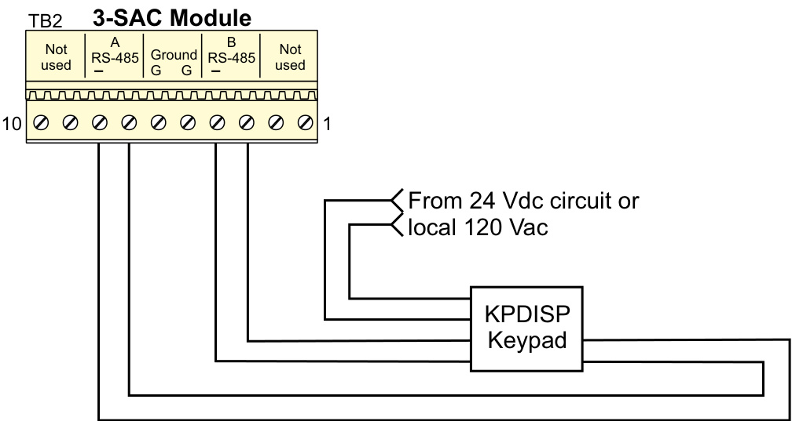
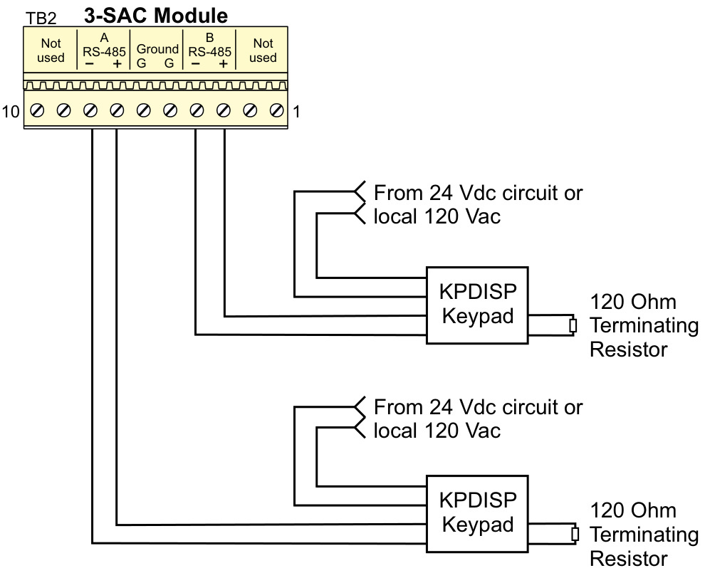

# Security/ Annunciation Control Module Model: 3-SAC  

# Overview  

The 3-SAC Security/Annunciation Control Module is a key component in the true integration of security functions into the EST3 multiplexed life safety system. The 3-SAC is the demarcation point between fire and security functions. For jurisdictions requiring independent wiring of fire and security devices, the 3-SAC offers two independent circuits. Where fire and security devices are permitted to be connected to the same circuit, both circuits can support both fire and security functions.  All security devices that connect to a 3-SAC are designed and tested to strict fire alarm standards. For example, to enhance reliability, the 3-SAC can be wired in a Class A (Style 6) configuration, thus delivering an additional level of system survivability over traditional systems employing Class B wiring.  

The 3-SAC can be used in combination with the Modcom Modem Communicator. The Modcom’s dialer (DACT) function is used to transmit alarms to one or more central monitoring stations and/ or paging terminals. Please refer to the Modcom catalog sheet for additional details  

Total integration of the EST3 system assures that processing of fire alarm signals always receives the highest priority over routine signal processing. Power for the 3-SAC comes from the same highly reliable power supply/battery combination used to power the fire alarm components. Any Control Display module will mount in front of the 3‑SAC, allowing great flexibility of the system user interface layout.  

# Standard Features  

•	 Listed for fire and security   
•	 Two supervised RS-485 device circuits   
•Class A configuration supports 30 keypad/displays   
•Class B configuration supports 62 keypad-displays   
•4,000 ft $(1,220\,\mathsf{m})$ max circuit length   
•EST3 local rail module   
•Supports control/display modules   
•Supervised by the network controller   
•$100\%$ digital communication   
•	 Removable field wiring terminal block  

# Application  

The 3-SAC is used to connect Keypad Displays to the EST3 network. This permits the network to perform functions network-wide in response to fire and/or security events.  

# Engineering Specification  

The security and access control module shall be capable of supporting 62 devices on two class B circuits or where added reliability is required, 30 devices on a single Class A circuit. It must be possible to wire Class A in Style 6 configuration. The module shall be capable of supporting both fire and security devices on the same circuit. The module shall permit total integration of the fire, security and access control functions by the system. The module shall be <UL> <ULC> listed for both fire and security applications.  

# Typical Wiring  

Class A wiring  

  

Class B wiring  

  

<html><body><table><tr><td>AgencyListings</td><td>UL,ULC.See Note 1.</td></tr><tr><td>Circuit Configuration</td><td>ClassAorClassB</td></tr><tr><td>CircuitCapacity</td><td>30devicesononeClassAcircuit,62 devicesontwocircuitswiredClassB</td></tr><tr><td>Input Current</td><td>40mAunderallconditions</td></tr><tr><td>WireSize</td><td>22AWGto14AWG(0.25mm2to1.5mm2)</td></tr><tr><td>WireType</td><td>Unshielded，twistedpair,>6twistsper foot</td></tr><tr><td>MaximumLineResistance</td><td>52Ohms</td></tr><tr><td>MaximumCapacitance</td><td>0.1 μF</td></tr><tr><td>Operating Environment</td><td>0°Cto49°Complete(32°Fto120°F) @85%RH,Non-condensing</td></tr><tr><td>Mounting</td><td>OneLocalRailSpace</td></tr></table></body></html>

Note 1: The EST3 is modularly listed under the following standards: UL 864 categories: UOJZ, UOXX, UUKL and SYZV, UL 294 category ALVY, UL 609 category AOTX, UL 636 category ANET, UL 1076 category APOU, UL 365 category APAW, UL 1610 category AMCX, UL 1635 category AMCX ULC-S527, ULC-S301, ULC-S302, ULC-S303, ULC-S306, ULC/ORD-C1076 and ULC/ ORD-C693. Please refer to EST3 Installation and Service Manual for complete system requirements.  

<html><body><table><tr><td>Catalog Number</td><td>Description</td><td>Shipping Wt. Ib (kg)</td></tr><tr><td>3-SAC</td><td>Security/Access ControlModule</td><td>0.5 (.23)</td></tr><tr><td>3-FP</td><td>FillerPlate,orderseparatelywhen noLEDorLED/Switchmodule installed.</td><td>0.1 (0.05)</td></tr></table></body></html>  