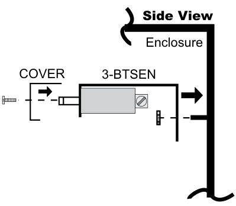
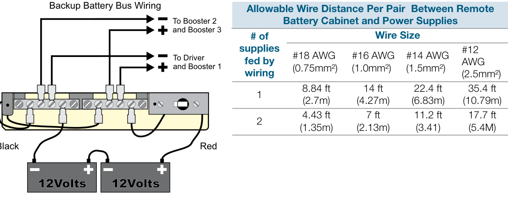

# Battery Distribution Unit 3-BTSEN  

# Overview  

The 3-BTSEN consists of a circuit breaker and copper bus bars mounted on a sheet metal bracket. The unit provides a backup battery bus for supplying backup power to multiple power supplies fed by a common battery. The 3-BTSEN features a 50 Amp circuit breaker to protect the backup battery. The 3-BTSEN mounts in the BC-1 Battery cabinet or any EST3 “RCC” series enclosure.  

# Standard Features  

50 Amp circuit breaker   
24 Vdc power distribution bus  

# Application  

The 3-BTSEN is designed to protect and distribute standby 24 Vdc from a large common battery to multiple power supplies in an EST3 cabinet.  

# Engineering Specification  

Where a remote battery cabinet is required to house large standby batteries for the fire alarm system cabinet, the remote battery cabinet shall be equipped with a circuit breaker and distribution bus.  

# Mounting  

  

# Typical Wiring  

  

# Specifications  

<html><body><table><tr><td>AgencyListings</td><td>UL,ULC,EN 54-2:1997 +A1:2006,EN 54-4:1997 +A1:2002 + A2:2006,andEN54-16:2008</td></tr><tr><td>Mounting</td><td>BC-1or“RCCSeries” enclosures</td></tr><tr><td>PowerRating</td><td>50Amps @24Vdc</td></tr><tr><td>PowerBusConnections</td><td>#10-32machinescrews</td></tr><tr><td>Operating Environment</td><td>32°F (O°C) to 120°F (49°C),93%RH,non-condensing</td></tr></table></body></html>  

# Ordering Information  

<html><body><table><tr><td>Catalog Number</td><td>Description</td><td>Shipping Wt., Ib (kg)</td></tr><tr><td>3-BTSEN</td><td>Battery Distribution Bus</td><td>1 (.45)</td></tr><tr><td>3-BTSEN-E</td><td>Remote ebatterycabinet interlace,temperaturesensing</td><td>1 (.45)</td></tr></table></body></html>

EN 54-2: 1997 $^+$ A1: 2006, EN 54-4: 1997 $^+$ A1: 2002 $^+$ A2: 2006, and EN 54-16: 2008  