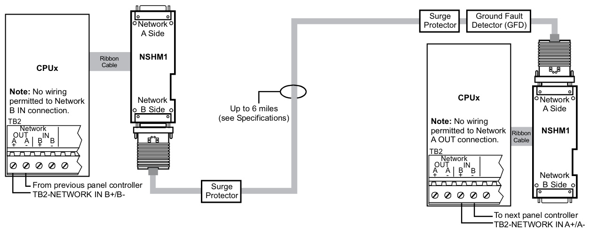
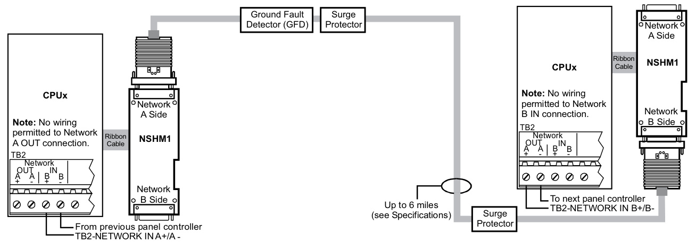
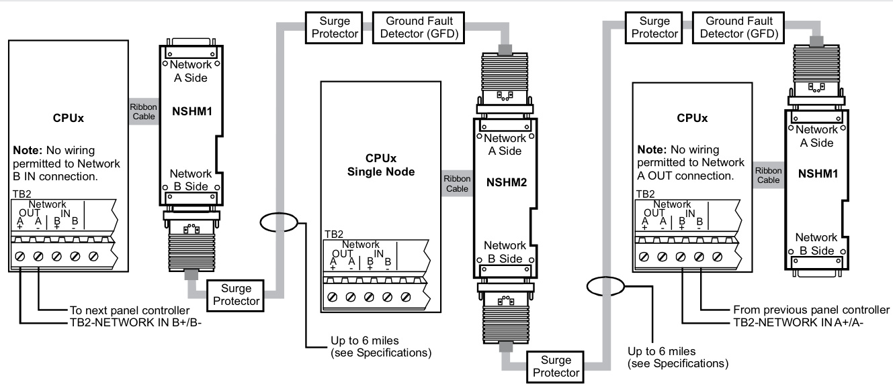
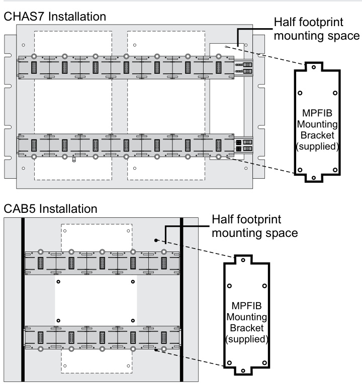
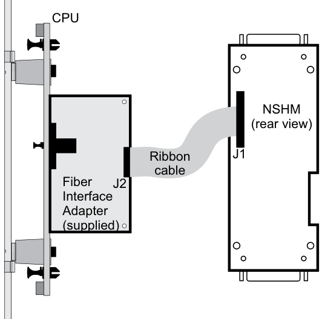

# Network Modem Communications Interface 3-NSHM1 & 3-NSHM2  

# Overview  

EST3 networks easily configure for use over existing copper telephone lines using the 3‑NSHM Short Haul Modem Communi‑ cations Interface.  

The 3-NSHM electronics card, plugs right into the 3‑CPU3.  A ribbon cable connects the 3-CPU3 directly to the modem interface card.  The interface card mounts on the right rear of a 3‑CHAS7 chassis.  No local rail space is used. The 3-NSHMs requires the 3‑MPFIB mounting bracket for 3-CAB5 enclosure mounting.  

3-NSHM1 provides a single short haul modem connection and converts the signal to RS-485 format for hard wired network con‑ nections to additional network nodes. The 3-NSHM2 provides two short haul modem connections for use when two short haul modems are required for connections to additional network nodes.  

Each short haul modem circuit consists of two pairs of twisted pair cable. Network wiring can be installed as Class A or Class B, depending on installation.  

The 3-NSHM1 also supports copper wire connections, permitting network data communications format changes from short haul modem connection to direct RS-485 and from direct RS-485 to short haul modem connections as job conditions require.  

The 3-NSHM provides an integral test signal, making the use of a separate signal source unnecessary.  This can reduce setup and trouble shooting time. A standby battery connection is provided to maintain communications through the node in the event that power is removed for servicing the node.  

The 3-NSHMs are compatible with EST3 systems using digitized audio, however the 3-NSHMs do not transmit the digitized audio signal between nodes.  

# Standard Features  

Class A or Class B EST3 Data Network Connections Up to 5 miles between nodes •Uses existing copper telephone lines •	 Supervised Integral test modes  

# Application  

The 3‑NSHM short haul modems provide long distance network communications between nodes, typically using existing telephone conductors. A model GFD Ground Fault Detector should be used in applications where ground fault detection is required.  

  
Network B to A wiring using the NSHM1  

Network A to B wiring using the NSHM1 Network wiring using the NSHM2  

  

  

  
Chassis Mounting  

  
Module Connections  

# Engineering Specification  

The intra-node communications links for network shall utilize cop‑ per and/or fiber optic connections.  The communications interface card shall provide Class B <Class A> connections. It shall be pos‑ sible to convert from modem connections to hard wired RS-485 wiring or from hardwired RS-485 wiring to modem wiring at any network node. The short haul modem communications interface card shall have provisions for testing the modem(s) and its con‑ nections for maintenance and troubleshooting purposes.  

# Specifications  

<html><body><table><tr><td>Agency Listings</td><td>UL, ULC</td></tr><tr><td>Installation</td><td>Connector J2 of 3-CPU3. Modem card mounts on bracket under 3-CHAS7</td></tr><tr><td>Network Data Circuit</td><td>or on3-MPFIBbracket in3-CAB5enclosure.</td></tr><tr><td>Configuration</td></tr><tr><td>Data Rate</td><td>Class B or Class A 19.2 Kb, or 38.4 Kb</td></tr><tr><td>Isolation</td><td>Optically isolated from previous 3-CPU3</td></tr><tr><td>Hard Wired RS-485Circuit</td></tr><tr><td>Circuit Length</td><td>5,000 ft (1,524 m) max.between any three panels</td></tr><tr><td>Circuit Resistance</td><td>90 Ohms, max.</td></tr><tr><td>Circuit Capacitance</td><td>0.3 mF, max.</td></tr><tr><td>Wire Type</td><td>Twisted pair</td></tr><tr><td>Test Functions</td><td>Local analog loopback and remote digital loopback</td></tr><tr><td>PowerConsumptionSupervisory</td><td>3-NSHM1: 79 mA @ 24 VDC; 3-NSHM2: 105 mA @ 24 VDC</td></tr><tr><td>or Alarm Operating environment </td><td></td></tr><tr><td>Compatible with</td><td>32°F -120°F (0°C - 49°C) @93% RH,Non-condensing 3-CPU1,3-CPU3</td></tr><tr><td>Maximumpernetwork</td><td rowspan="2">20 (EST3 Version 3.5)</td></tr><tr><td></td></tr><tr><td>Short Haul Modem Circuit 19AWG</td><td>24AWG 26AWG</td></tr><tr><td>Wiring Configuration</td><td>TWO Twisted Pair</td><td>TWO Twisted Pair TWO Twisted Pair</td></tr><tr><td>Max. Resistance</td><td>16.3 Ohms/1000 ft (53.5 Ohm/km)</td><td>51.65 Ohms/1000 ft (169.5 Ohm/ 82.35 Ohms/1000 ft (270.2 Ohm/ km)</td></tr><tr><td>Max. Capacitance</td><td>83 nf/mi [15.72 pf/ft] (151.6 nf/km)</td><td>km) 83 nf/mi [15.72 pf/ft] (151.6 nf/km)</td></tr><tr><td>Max. Distance mi (km)</td><td></td><td>83 nf/mi [15.72 pf/ft] (151.6 nf/km)</td></tr><tr><td>@ 38.4Kb</td><td>6 (9.7)</td><td>2 (3.2) 3 (4.8)</td></tr><tr><td>@19.5Kb</td><td>9 (14.5)</td><td>3.5 (5.6) 5 (8)</td></tr></table></body></html>  

# Ordering Information  

<html><body><table><tr><td>Catalog Number</td><td>Description</td><td>Shipping Wt.Ib (kg)</td></tr><tr><td>3-NSHM1</td><td>NetworkShortHaulModemCommunicationsInterface singlemodemconnection</td><td>1 (.45)</td></tr><tr><td>3-NSHM2</td><td>NetworkShortHaulModemCommunicationsInterface twomodemconnections</td><td>1 (.45)</td></tr><tr><td>GFD</td><td>GroundFaultDetectionModule</td><td>1 (.45)</td></tr></table></body></html>  