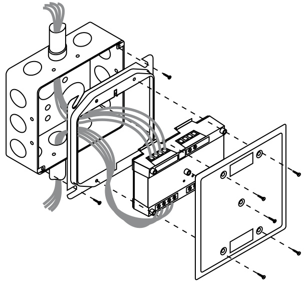
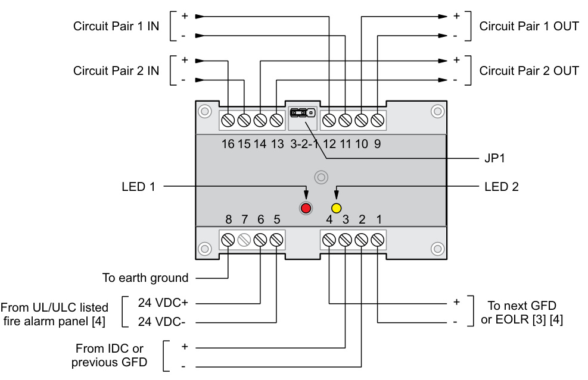

# Ground Fault Detection Module GFD  

# Overview  

The GFD module is designed to detect ground fault conditions on either of two independent power or data circuits. Each circuit must be balanced with respect to ground.  

The module will detect when the resistance between any of the monitored conductors and earth ground gets below $10\;\mathsf{K}$ Ohms. Two LEDs are provided to indicate the conductor with the ground condition. A normally energized Trouble/Ground Fault relay is provided with NO/NC relay contacts for interfacing with monitoring systems. Either of two operating modes is selected by jumper selection.  

Mode 1 places a ground fault on the common terminal of the relay. When used with a Signature input module, this configuration provides independent indications of ground fault and GFD module trouble conditions at the control panel.  

Mode 2 de-activates the normally energized relay contact upon ground fault or module trouble.  

The ground fault relay activates when any monitored conductor experiences a ground fault condition. The trouble relay operates when module power is not available or the supervisory watchdog timer activates.  

The module is designed to mount in a 2-gang electrical box.  

# Standard Features  

•	 Monitors two independent circuits   
•	 Suitable for all power limited circuits Provides separate ground fault and trouble indication when used with Signature input modules   
Provides form C relay contact   
•	 Supervised In and out terminals for convenient wiring Mounts in 2-gang electrical box  

# Application  

The GFD module is designed to operate with short haul modems and other power limited circuits requiring the detection of ground fault conditions on its conductors.  

When used with Signature series input modules, separate indications of ground fault and module trouble can be annunciated at the control panel (mode1). The module’s relay contacts are also suitable for monitoring by systems not capable of independently reporting grounded conditions by using mode 2.  

# Engineering Specification  

The ground fault detection module shall be supplied on network communication circuits not employing integral ground fault detection. Detection of a ground fault condition shall transfer the module’s relay contacts.  

# Mounting  

  

# Typical Wiring  

  

# Notes  

1.	 All circuits are power-limited and supervised, unless otherwise noted   
2.	 Contact 7 is not used   
[3]	 The functionality of the Trouble/GF circuit is dependent on the position of JP1. See “Jumper setup” on installation sheet 387630 for details.   
[4]	 Use a UL/ULC listed end-of-line device for complete supervision. Contacts cannot be used for nonpower-limited applications unless all wiring is type FPL, FPLR, or FPLP.  

<html><body><table><tr><td>Agency Listings</td><td>UL, ULC</td></tr><tr><td>Installation</td><td>Connectstobothconductorsofthemonitoredcircuit(s)</td></tr><tr><td>Ground fault condition</td><td>Lessthan1oKohmsbetweenanymonitoredconductorandthereferenceground</td></tr><tr><td>MonitoredCircuit(s)Configuration Maxvoltage100Vdc</td><td>Monitoredcircuit(s)musthavebothconductorsbalanced withrespecttoground</td></tr><tr><td>Max current4.0A</td><td></td></tr><tr><td>Maxvoltagebetweenmonitoredcircuits10o0Vdc</td><td></td></tr><tr><td>Power Consumption</td><td>110mA@24V.Powerisisolatedfrommonitoredcircuits.</td></tr><tr><td>Trouble/GroundFaultRelay</td><td>Output operation is jumper configurable</td></tr><tr><td></td><td>Mode 1Places a ground fault on the common terminal of the relay for detectionby aSignaturemodule.</td></tr><tr><td>Contactrating1.0A@30Vdc</td><td>Mode 2Normally energized NO/NC contact de-activates upon module trouble or ground fault.</td></tr><tr><td>Mounting</td><td></td></tr><tr><td></td><td>with2-gangcover</td></tr><tr><td>Visual Indicators</td><td>Mounting Brackets SIGA-MP1,SIGA-MP2(L)</td></tr><tr><td>Terminations</td><td>TwoLEDsindicatewhichofthefourconductorsaregrounded.</td></tr><tr><td>Operatingenvironment</td><td>All wiring to terminals that accept #18AWG to #12AWG conductors</td></tr><tr><td></td><td>32°F-120°F(0°C-49°C) @93%RH,Non-condensing</td></tr></table></body></html>  

# Ordering Information  

<html><body><table><tr><td>Catalog Number</td><td>Description</td><td>ShippingWt.,Ib(kg)</td></tr><tr><td>GFD</td><td>GroundFaultDetectionModule</td><td>1 (.45)</td></tr><tr><td>MFC-A</td><td>MultifunctionFireCabinet-Red,supportsSignatureModuleMountingPlates</td><td>7.0 (3.1)</td></tr><tr><td>SIGA-MP1</td><td>SignatureModuleMountingPlate,1footprint</td><td>1.5 (0.70)</td></tr><tr><td>SIGA-MP2</td><td>SignatureModuleMountingPlate,1/2footprint</td><td>0.5 (0.23)</td></tr><tr><td>SIGA-MP2L</td><td>SignatureModuleMountingPlate,1/2extendedfootprint</td><td>1.02 (0.46)</td></tr></table></body></html>  