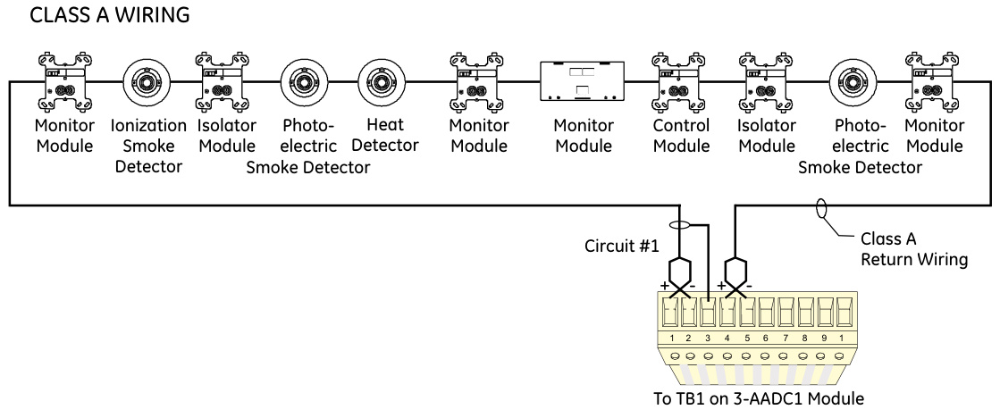

# Addressable Analog Device Controller 3-AADC1(-E)  

# Overview  

The 3-AADC1 Addressable Analog Circuit Module is a local rail module used on the EST3 system. The module requires one connection on the rail chassis. The module can support 99 addressable analog sensors and 99 addressable analog modules. The controller also features a hinged front panel for a Control Display Module, which are available in a variety of LED and/or switch configurations. The 3-AADC1 is a direct replacement for the 3-AADC and $100\%$ backward compatible.  

The microprocessor based 3-AADC1 provides internal test and diagnostic functions for troubleshooting. The controller contains nonvolatile memory that stores the operating system software and data file which is downloaded from a PC. The System Definition Utility Program accomplishes data file programming including the device type, address, description, sensitivity, verification, and wiring configuration. The 3-AADC1 continuously checks the output value of each device, reporting status to the cabinet CPU. The module can isolate ground faults to a specific addressable loop.  

All field wiring connections to the module are made via plug-in connectors, permitting termination of field wiring without the module installed in the enclosure. The plug-in connectors and snap rivet module mounting facilitate rapid remove and replace troubleshooting without the use of tools.  

# Standard Features  

•Class A or Class B   
•Continuous monitoring of analog device values Ground fault detection by loop   
•Removable field wiring terminals Fully backward compatible with the 3-AADC   
Listed for fire and security  

# Application  

The 3-AADC1 is ideal for EST3 systems being installed in retrofit applications where there is a quantity of existing analog devices installed. The 3-AADC1 is compatible with:  

Sensors  

• 1551F ionization • 1251F(B) ionization • 2551F photoelectric • 2251F(B) photoelectric • 2551TF(B) photoelectric/thermal	 • 5551F thermal • 5251F(B) thermal• 5551FR fixed/ROR thermal• DH200PF photoelectric duct detector • RZB12-6 Remote Zone Interface Module  

Modules  

• M400MF(B) monitor• M501MF monitor• M500CFS control • M500SF control • M500XF isolator • M500RF relay • UIO-12 Universal Input/Output Module  

NOTES:	 Relay bases, isolator bases, sounder bases, are NOT supported. The 3-AADC1 is fully backward compatible with the 3-AADC. When connecting RZB12-6 to 3-AADC1, a 3-RZBCAP is required at each RZB. Please refer to the latest RZB installation instructions (part number 387591).  

The Addressable Analog circuit cable must be a minimum of 18 gauge twisted pair with 6 twists per foot. This cable may be unshielded or shielded as required. Shielded cable is recommended where electrical noise might interfere with data transmission. If shielded wire is used, it must be used through the entire length of the circuit. Distance limits are determined using the maximum allowable circuit resistance and capacitance, and manufacturer’s cable specifications.  

# Typical Wiring  

  

# Engineering Specification  

The control panel shall provide an addressable analog interface module to directly connect to the existing addressable analog sensors and modules. The interface shall be capable of supporting 99 analog sensors and 99 input/control modules, and identifying ground faults by loop. The module shall be capable of accommodating both Class A and Class B wiring. All field wiring terminations shall be made to removable connectors for ease of installation and troubleshooting.  

Specifications   

<html><body><table><tr><td>Installation 1 LRM Space</td><td></td></tr><tr><td>Module Configuration</td><td>1AddressableAnalogCircuit</td></tr><tr><td>Operating Current*</td><td></td></tr><tr><td>Standby</td><td>175mA</td></tr><tr><td>Alarm205mA</td><td></td></tr><tr><td>AddressableCircuitCapacitance</td><td>0.5μF, max., allbranches</td></tr><tr><td></td><td></td></tr><tr><td>AddressableCircuitResistance</td><td>36 Ohms when using RZB12-6 or UIO12 (No Relay bases permitted)</td></tr><tr><td>Addressable Circuit Configuration</td><td></td></tr><tr><td>Addressable Circuit Capacity</td><td>Class A or Class B</td></tr><tr><td>Sensors</td><td> 99 sensors per circuit</td></tr><tr><td>Modules</td><td> 99 modules per circuit</td></tr><tr><td>Ground Fault Limits</td><td>10K Ohms, min.</td></tr><tr><td>lsolator Limits #Isolator modulesper circuit6 Maximum</td><td></td></tr><tr><td>#Devices between two isolators25 Maximum</td><td></td></tr><tr><td>#Devicesbetweenpanel and first isolator25 Maximum</td><td></td></tr><tr><td>#Devicesbetween last isolator and panel (Class A)</td><td>25 Maximum</td></tr><tr><td>Max.resistance from device to panel</td><td></td></tr><tr><td>MaximumWireSize</td><td>25 Ohms</td></tr><tr><td>Termination</td><td>12 AWG (2.5 mm2)</td></tr><tr><td>Operating Environment</td><td>Removable plug-in terminal strip on LRM 32°F(0°C) to 120°F (49°C) 93%RH,non-condensing</td></tr><tr><td>Agency Listing</td><td>UL,ULC,CE,EN 54-2:1997+A1:2006,EN 54-4:1997+A1:2002+A2:2006,and EN 54-16:2008</td></tr><tr><td></td><td></td></tr></table></body></html>

\*Note: Currents include full loop of devices  

# Ordering Information  

<html><body><table><tr><td>CatalogNumber</td><td>Description</td><td>Shipping Wt.,Ib (kg)</td></tr><tr><td>3-AADC1</td><td>AddressableAnalogModule</td><td>0.5 (.23)</td></tr><tr><td>3-AADC1-E</td><td>AddressableAnalogModule</td><td>0.5 (.23)</td></tr><tr><td>3-RZBCAP</td><td>RZB 3Communications</td><td></td></tr><tr><td>3-FP</td><td>FillerPlate，orderseparately whennoLEDorLED/Switch moduleinstalled.</td><td>0.1 (0.05)</td></tr></table></body></html>

\*EN 54-2: 1997 + A1: 2006, EN 54-4: 1997 $+$ A1: 2002 $^+$ A2: 2006, and EN 54-16: 2008  