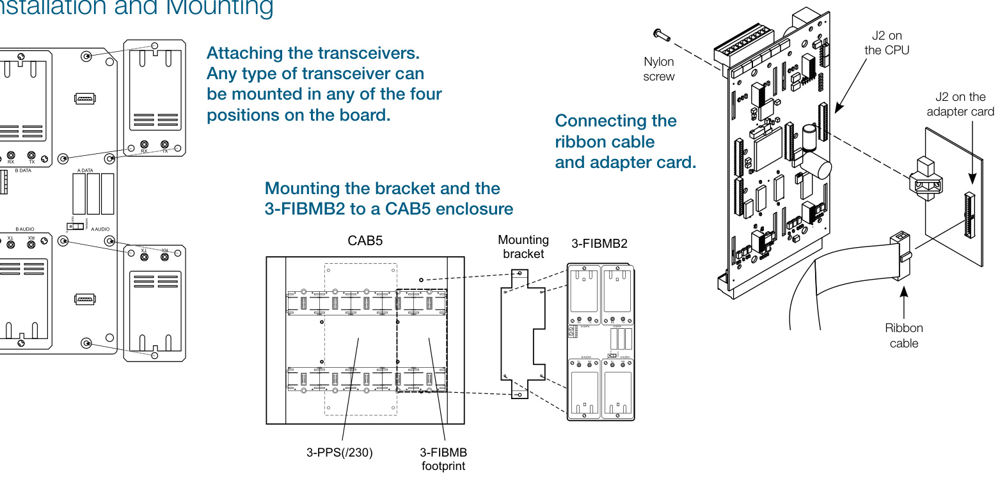
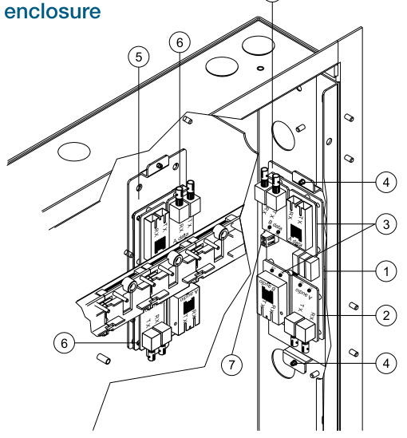
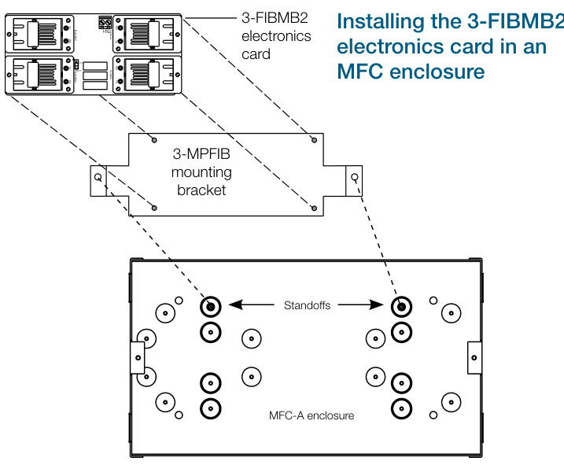
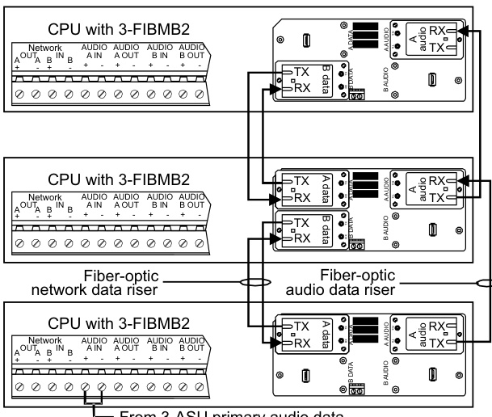
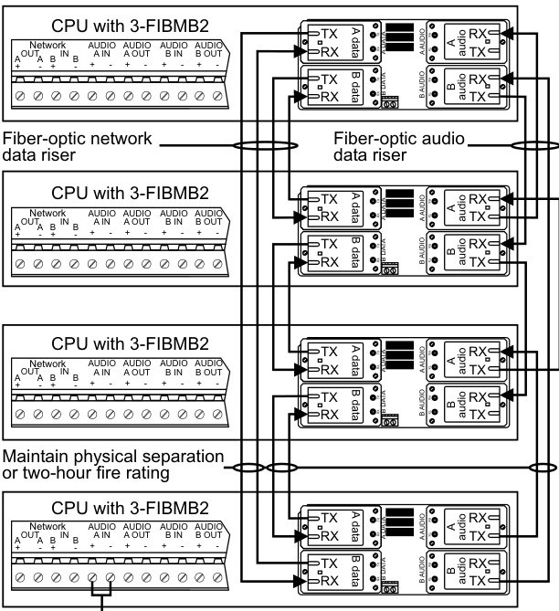
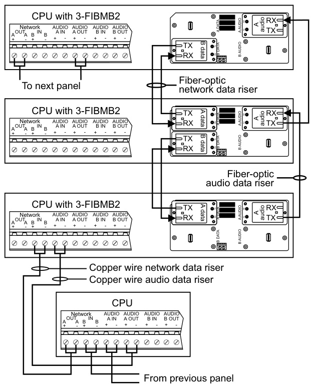

# Fiber Optic Communications Interface 3-FIBMB2, SMXLO2, SMXHI2, MMXVR  

# Overview  

EST3 networks easily configure to single or multi mode fiber optic or combination fiber optic / copper networks using the 3-FIBMB2 Fiber Optic Communications Interface and the appropriate fiber optic transceivers.  

The 3-FIBMB2 electronics card plugs right into the CPU. A ribbon cable connects the 3-CPU directly to the 3-FIBMB2 fiber interface card. The interface card mounts in the $\%$ footprint space in a 3-CHAS7 chassis or 3-CAB5 enclosure.  

The 3-FIBMB2 supports from one to four single or multi mode transceivers that plug into the interface card. Each transceiver provides the transmission and reception capability for the network data or digital audio data to/from a 3-FIBMB2 located in the next network node using single and/or multi mode fiber optic cables.  

The 3-FIBMB2 also supports copper wire connections, permitting network data and audio communications format changes from copper to single mode fiber, copper to multi-mode fiber, and single to multi-mode fiber, as job conditions require. All copper and fiber circuits can be configured as supervised Class B, Class A, or Class X circuits.  

The 3‑FIBMB2 has a constant output test signal that simplifies installing and testing multi-mode fiber circuits only, reducing setup and troubleshooting time. Secondary power input terminals and an external 24 Vdc source can be used to provide continuous network and audio data to flow through the 3‑FIBMB2, when the panel is powered down for servicing.  

# Standard Features  

•	 Class B or Class A or Class X network data connections   
•	 Class B or Class A or Class X audio data connections Node to node distances: Multi-mode: Up to 8,000 ft. $(2.4\,\mathsf{k m})$ using multi-mode fiber Single-mode high power: Up to 24.85 mi $\left(40\,{\mathsf{k m}}\right)$ using single mode fiber driver - model SMXHI2 Single-mode low power: Up to 8.7mi (14km) using single mode fiber driver- model SMXLO2   
•	 Built-in test signal   
•	 Secondary power input   
•	 Transition from copper to fiber on same network   
•	 Transition from single to multi-mode fiber on same network  

# Application  

Fiber optics communication links provide a high level of immunity from electrical noise. The circuits are power limited and suitable for use through hazardous atmospheres. Fiber optic circuits also provide a high level of security and are resistant to the effects of moisture. The choice of either single mode or multi mode fiber links is one of cost vs the distances between nodes. System performance is identical with either single or multi mode fiber. NOTE: The 3-FIBMB2/MMXVR is compatible with 3-FIB(A) multi mode fiber modules.  

The SMXLO2 standard output single mode transceiver is suitable for distances up to approximately 8.7 miles (14km). The SMXHI2 high output single mode transceiver is available to span distances up to approximately 24 miles (40km).  

For multi mode applications, the MMXVR transceiver is suitable for distances up to approximately 8,000ft (2,400m) Actual distances are dependent on the losses in each fiber optic circuit, and should be calculated for each installation. One transceiver is required for each fiber side of both network and audio links. Simply order the required type and number and type of transceiver(s) for your application.  

# Engineering Specification  

The intra-node communications links for network and digital audio data shall utilize copper and/or fiber optic connections. The fiber optics interface card shall provide Class B, Class A, or Class X connections. It shall be possible to convert from fiber optic cable to copper wiring or from copper wiring to fiber optic cable at any network panel node. The fiber optics interface card shall have provisions for an external power source input to permit continuous network and audio data to flow through a network node while primary node power is removed for servicing purposes. The fiber optics interface card shall provide a constant output test signal for maintenance and troubleshooting purposes. The fiber optics interface module shall utilize single/multi mode fiber with SC single mode or ST multi-mode connectors.  

#  

  

# Installing the 3-FIBMB2 bridge in a 3-CAB7,  

1. 3-FIBMB2 electronics card on a 3-MPFIB mounting bracket   
2. MMXVRs in the B data slot and A audio slot on the 3-FIBMB2   
3. SMXLO2/SMXHI2 in the A data slot and B audio slot on the 3-FIBMB2   
4. Mounting studs   
5. Existing 3-FIBMB   
6. MMXVR in the A data slot and B audio slot on the 3-FIBMB   
7. 24 VDC  

  

  

# Typical Wiring  

The following wiring diagrams can be used with single or multimode fiber. If using single mode use the SMXLO2 or SMXHI2 transceivers. If using multimode use the MMXVR transceivers.  

  
3-FIBMB2 Class B network and audio fiber-optic connections   
From 3-ASU primary audio data  

  
3-CPU Class A or Class $\pmb{\mathrm{x}}$ network & audio fiber connections   
From 3-ASU primary audio data  

  
Class B hybrid fiber-optic and coppe2r wRiXre anetwork and audio connections  

  

3-CPU hybrid fiber-optic and copper wire network and Class A or Class $\pmb{\mathrm{x}}$ fiber-optic and copper wire audio  

  

Note: These diagrams are for general information only. For more wiring diagrams and installation details, please refer to 3-FIBMB2 Fiber Optic Interface, Installation Sheet 3101835.  

# Using single and multimode transceivers  

Transition from single mode fiber to multimode fiber requires special configuration for the audio circuit. The following wiring diagrams show how to wire audio circuits in Class B, Class A, or Class X using single mode and multimodeT XfibeAr.  

  

# Data and audio circuit for Class A orU2 ClRaXss aX using single mode and multimode fiber  

  

# Data and audio circuit for Class B using TXsiXnudgTlXe mtroadnsec eaivnerd multimTXoXudde fiber  

  

Note: These diagrams are for general information only. For more wiring diagrams and installation details, please refer to 3-FIBMB2 Fiber Optic Interface, Installation Sheet 3101835.  

# Wiring alternative power terminals  

BThe 3-FIBMB2 provides a secondary Bp OUoTwer optioRXn, tapeRXrmitA AtB Ding A Dcommunications to flToXw d thTXrougUDIRXhdio BthReX module, even with panel power disconnected.  

Note: In the TeXve dnt TXa paDIOnARXediol nAeReXds to be powered B+d OoU-Twn for s 3ervice; a $24\,\lor$ batAteryU can be connected to the modadTXule toAUD XdimBaintain network and audio comUmunications during se3rvicing.  

  

<html><body><table><tr><td>Agency Listings</td><td>UL, ULC</td></tr><tr><td>Installation</td><td>Connector J2 of 3-CPU1. Fiber card mounts on %2 footprint 3-CHAS7, 3-CAB5 enclosure, or an MFC-A cabinet.</td></tr><tr><td>Compatibility</td><td>3-CPU1 and later</td></tr><tr><td>Single Mode (network & audio)</td><td></td></tr><tr><td>Budget</td><td>t15 dBm (approximately</td></tr><tr><td>SMXLO28.7mi. [14km] max).</td><td></td></tr><tr><td></td><td>SMXHl2 25 dBm (approximately 24.85 mi. [40km] max). 1</td></tr><tr><td>Wavelength</td><td></td></tr><tr><td>Cable Type8.3u Single Mode</td><td>1300nm</td></tr><tr><td>Connector Duplex SC</td><td></td></tr><tr><td>Multimode(network&audio)</td><td></td></tr><tr><td> [    )  6  </td><td></td></tr><tr><td>Wavelength820nm</td><td></td></tr><tr><td></td><td></td></tr><tr><td>Connector </td><td>ST</td></tr><tr><td>Network Data Circuit</td><td></td></tr><tr><td>Circuit ConfigurationClass B or Class A</td><td></td></tr><tr><td></td><td>Data Rate19.2K, or 38.4K Baud</td></tr><tr><td></td><td>Isolation From “previous" 3-CPU using copper, total isolation using fiber optics </td></tr><tr><td>Digital Audio Data Circuit</td><td></td></tr><tr><td>Circuit Configuration Class B, Class A, or Class X</td><td></td></tr><tr><td>Data Rate327K Baud</td><td></td></tr><tr><td>Copper Wired NetworkData Circuit</td><td>Isolation From “previous" 3-CPU using copper, total isolation using fiber optics</td></tr><tr><td>Segment</td><td></td></tr><tr><td>Circuit Length</td><td>5.000ft (1,524 m) max. between any three panels</td></tr><tr><td>Circuit Resistance</td><td>90 Ohms, max.</td></tr><tr><td>Circuit Capacitance Wire Type</td><td>0.3uf max. Twisted pair, 18 AWG (0.75 mm2) min</td></tr><tr><td>Copper Wired AudioData Circuit Segment</td><td></td></tr><tr><td>Circuit Length </td><td></td></tr><tr><td>Circuit Resistance 90 Ohms, max.</td><td>5.000 ft (1,524 m) max. between any three panels</td></tr><tr><td>Circuit Capacitance0.09 μf max.</td><td></td></tr><tr><td></td><td></td></tr><tr><td></td><td>Wire Type Twisted pair, 18 AWG (0.75mm2) min</td></tr><tr><td>Eye Safety</td><td></td></tr><tr><td>Power Consumption</td><td>EN60825 Class 1 3-FIBMB2:105mA@24Vdc</td></tr><tr><td>Supervisory and/or Alarm</td><td>Add 79 mA for each SMXLO2 and SMXHI2</td></tr><tr><td></td><td>Add20mAforeachMMSVR</td></tr><tr><td>Operating Environment</td><td>()    (  - 4 - </td></tr></table></body></html>

¹ A minimum fiber attenuation of -8dBm is required when using the SMXHI2 in order to prevent overloading the receiver.  

# Ordering Information  

<html><body><table><tr><td>CatalogNumber</td><td>Description</td><td>Shipping Wt.,Ib (kg)</td></tr><tr><td>3-FIBMB2</td><td>FiberOpticCommunicationsInterface(requiresoneormoretransceivers)c/wmounting bracket</td><td>1.0(.45)</td></tr><tr><td>SMXLO2</td><td>for3-CHAS7or3-CAB5enclosuremounting Plug-Instandardoutputsinglemodetransceiverfor3-FIBMB2</td><td>0.5(.23)</td></tr><tr><td>SMXHI2</td><td>Plug-lnhighoutputsinglemodetransceiverfor3-FIBMB2</td><td>0.5(.23)</td></tr><tr><td>*MMXVR</td><td>Plug-lnstandardoutputmultimodetransceiverfor3-FlBMB2</td><td>0.5(.23)</td></tr></table></body></html>

\* 1 to 4 transceivers required, depending on application.  