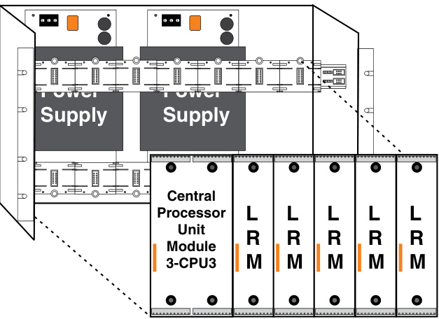
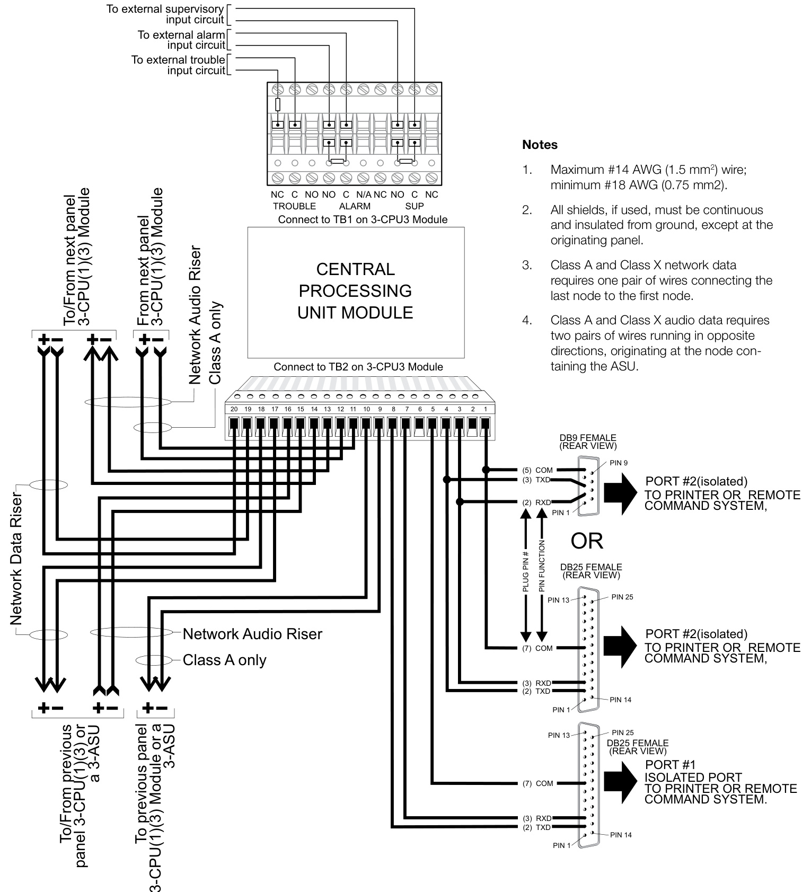

# EST3 Central Processor Unit 3-CPU3, 3-RS485A, 3-RS485B, 3-RS232  

# Overview  

The 3-CPU3 is the Central Processing Unit Module monitoring the status of all modules and providing the link for network communications. Although each local rail card contains their own microprocessor, the 3-CPU3 provides all inter-module communication and has the ability to download rail module operating parameters. Upon power up the 3-CPU3 automatically learns all local rail module attributes and locations. Site specific software is loaded into the 3-CPU3 which then downloads data to each local rail module. Firmware upgrades are also done from the 3-CPU3 eliminating the need to unplug chips on rail modules.  

Mounting must be in the first two local rail spaces of the upper 3-CHAS7 (module chassis). Options for the 3-CPU3 include the addition of an LCD display and User Interface, RS-232 Communication Card, and RS-485 Series Network Communication Cards.  

The 3-CPU3 is fully compatible on the same network with the 3-CPU and 3-CPU1 modules.  

# Standard Features  

Up to 1,000 history events   
•	 RS-485 local rail communications Multiplexed audio channels Network communication media can consist of twisted copper RS485, short-haul modems and/or single or multimode fiber optic cables RS-232 communication card   
•	 Form ‘C’ contacts for: Alarm, Supervisory and Trouble   
•	 Low voltage memory write protection   
•	 Non-volatile memory  

# Application  

The 3-CPU3 helps make EST3 an extremely powerful and flexible system. As a single node, stand alone system a single 3-CPU3 controls 1 to 19 additional local rail modules. For larger systems, up to 64 nodes interconnect on a peer-to-peer multi-priority token ring protocol network.  

The 3-CPU3 controls all local panel responses to automatic, user initiated, or network reported events. As a network node, it is an equal among peers, there is no master on the network. This gives exceptional response times over the network, less than three seconds.  

Each 3-CPU3 provides slots at the back for mounting Network, and RS-232, cards. Removable terminal blocks on the 3-CPU3 support connection of network and audio data wiring. On board common relays also terminate at the 3-CPU3 terminals. To aid in trouble shooting and service, status LEDs monitor local rail, network, RS232 and audio data communications.  

The Network Communications card mounts to the back of the Central Processor Unit. The 3-RS485A card provides a Class A, Class X or Class B circuit for network communications signals and support for a Class B, Class A or Class X circuit for the digitized audio signals. The 3-RS485B card provides a Class B, Class A or Class X circuit for network communications signals and a second Class B circuit for the digitized audio signals. The 3-RS485B card provides a Class B or Class A circuit for network communications signals and a second Class B circuit for the digitized audio signals. Network messages received by the Network Communications card are re-transmitted to the next network node. Re-transmission maximizes the wire run lengths between nodes. With 64 nodes miles of network length is possible. Fail safe mechanisms built into the card direct connect the data input and output ports should the network card or its related Central Processor fail. Network communications may be configured via copper or fiber media using the 3-FIBMB.  

The 3-RS232 Communication Card mounts to the back of the 3-CPU3. The 3-RS232 has two optically isolated RS-232 ports. The ports support connection of a printer and/or an external command center. Entire network downloading from one location (to all 64 nodes) is available through the RS-232 card.  

# Engineering Specification  

It must be possible to support a single stand alone node or up to 64 nodes communicating on a peer-to-peer token ring protocol network. Network and digitized audio wiring shall be run in a [choose one: Class A, Class X or Class B] configuration. Network alarm response from alarm input to signal activation must be under 3 seconds. All field wiring must be to removable terminal blocks. Status LEDs must be provided for communications of network and internal rail communications. Inter-node communication speed must be programmable. Internal rail communications speed must be programmable.  

# Installation and Mounting  

  

# Data  

<html><body><table><tr><td>Maximumresistance betweenany 3 panels</td><td>90Ohms</td></tr><tr><td>Maximum capacitance betweena any 3 panels</td><td>0.3 μF</td></tr><tr><td>Maximum distance betweena any 3 panels via RS485</td><td>5,000 ft. (1,524 m)</td></tr></table></body></html>  

Capacitance, entire network Maximum Accumulative Capacitance   

<html><body><table><tr><td>Wire Size</td><td>38.4KB Baud</td><td>19.2K Baud</td></tr><tr><td>18AWG</td><td>1.4 μF</td><td>2.8 μF</td></tr><tr><td>16AWG</td><td>1.8 μF</td><td>3.6 μF</td></tr><tr><td>14AWG</td><td>2.1 μF</td><td>4.2 μF</td></tr></table></body></html>  

# Audio  

<html><body><table><tr><td>Maximumresistance betweenany 3 panels</td><td>90Ohms</td></tr><tr><td>Maximum capacitance betweena any 3 panels</td><td>0.09 9uF</td></tr><tr><td>Maximum distance betweena any 3 panels viacopper RS485</td><td>5,000 ft.(1,524 m)</td></tr></table></body></html>  

  

# Specifications  

3-CPU3   

<html><body><table><tr><td></td><td></td></tr><tr><td>AgencyListings</td><td>UL,ULC,CSFM,CE,LPCBEN54*.</td></tr><tr><td>Mounting</td><td>2 -Left most local rail spaces</td></tr><tr><td>TerminalSize</td><td>18-12AWG(1.0mm2to2.5mm2)</td></tr><tr><td>StandbyCurrent</td><td>155 mA</td></tr><tr><td>AlarmCurrent</td><td>165mA</td></tr><tr><td>ContactRatings</td><td>NonbypassableAlarm,SupervisoryandTroubleForm‘C'1Aat30Vdc</td></tr><tr><td>DataDownLoading</td><td>RJ14Jack</td></tr><tr><td>OperatingEnvironment</td><td>O°C-49°C(32°F-120°F);93%at40°CNon-Condensing</td></tr></table></body></html>

\*For EN 54-2: $7997+A7$ : 2006, EN 54-4: 1997 + A1: 2002 $^+$ A2: 2006, and EN 54-16: 2008 compliant product add suffix -E to model eg. 3-CPU3-E.  

Note: CPU current includes the main power supply, since the CPU and PPS cannot be measured separately.  

Option Cards   

<html><body><table><tr><td>Catalognumber</td><td>3-RS232</td><td>3-RS485A</td><td>3-RS485B</td></tr><tr><td>StandbyCurrent</td><td>58mA</td><td>98mA</td><td>98mA</td></tr><tr><td>AlarmCurrent</td><td>58mA</td><td>98mA</td><td>98mA</td></tr><tr><td>CommunicationPorts</td><td>Twoopticallyisolated RS-232</td><td>ThreeRS-485ClassA orClassX</td><td>OneClassAor ClassXnetworkdata circuitandoneClass Baudiodatacircuit</td></tr><tr><td>AgencyListings</td><td colspan="3">UL,ULC.CSFM,CE,LPCB.EN54*.</td></tr><tr><td>Mounting</td><td colspan="3">Backof3-CPU3</td></tr><tr><td>OperatingEnvironment</td><td colspan="3">0°C -49°C (32° F- 120°F); 93% at 40°C Non-Condensing</td></tr></table></body></html>

\*For EN 54-2: $7997+A7$ : 2006, EN 54-4: $7997+A7$ : 2002 $^+$ A2: 2006, and EN 54-16: 2008 compliant product add suffix -E to model eg. 3-RS485A-E  

# Ordering Information  

<html><body><table><tr><td>Catalog Number</td><td>Description</td><td>Ship Wt. Ib (kg)</td></tr><tr><td>3-CPU3</td><td>CentralProcessorUnitModule. Add suffix“-E"forEN54compliantversions.</td><td>0.7lb (0.32kg)</td></tr><tr><td>3-RS485A</td><td>NetworkCommunicationsCard,ClassAorClassX. Addsuffix“-E"forEN54compliantversions.</td><td>0.33lb (0.15kg)</td></tr><tr><td>3-RS485B</td><td>OneClassA,XBnetworkdatacircuitandoneClassBaudiodata circuit.Addsuffix“-E"forEN54compliantversions.</td><td>0.33lb (0.15kg)</td></tr><tr><td>3-RS232</td><td>RS-232CommunicationCard. Addsuffix“-E"forEN54compliantversions.</td><td>0.33lb (0.15kg)</td></tr><tr><td>3-CPUDR</td><td>CPU doors with filler plates. Order separately, one required per CPU wherenoLCDdisplayisinstalled.</td><td>0.25lb (0.11kg)</td></tr></table></body></html>  