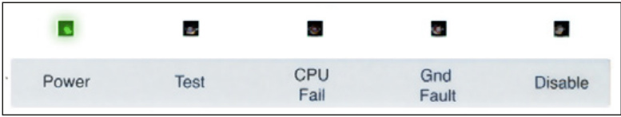
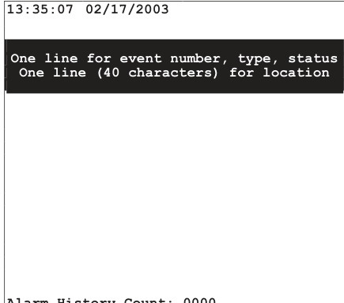
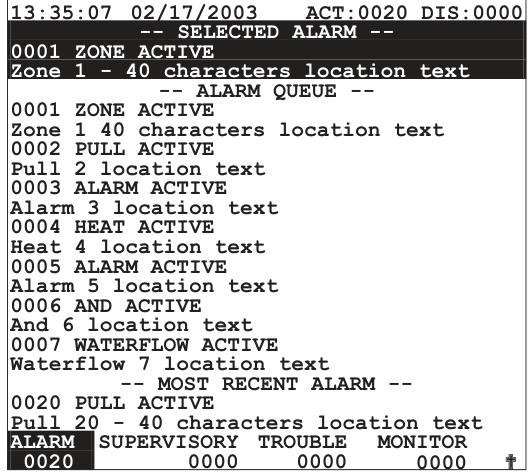
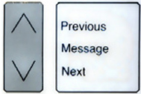
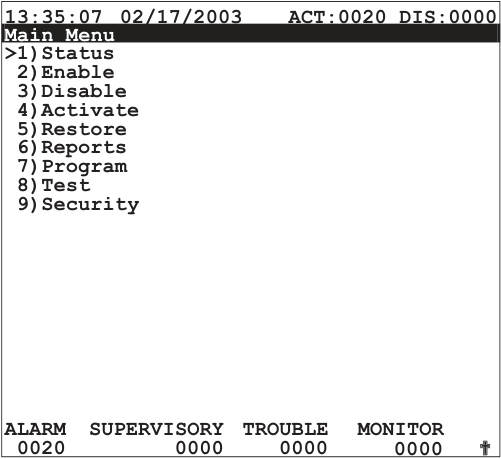
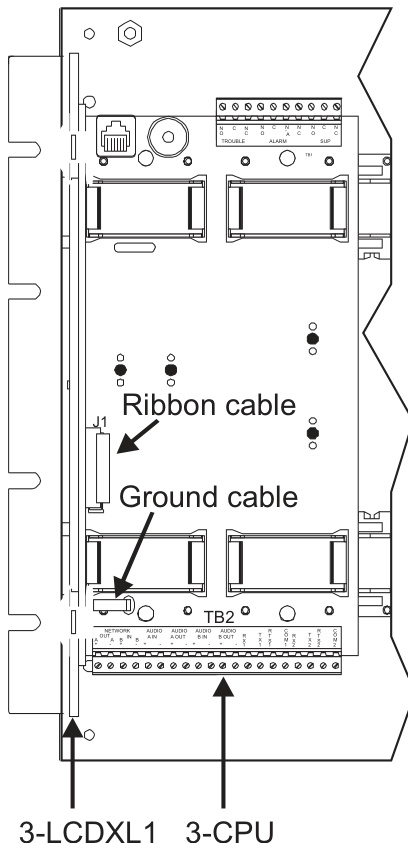

# Eight Event Liquid Crystal Display Module 3-LCDXL1  

# Standard Features  

Uses simple lights and switches   
•	 Simultaneous display of eight events   
•Hands free first alarm display   
•Last event of highest priority always displays   
•24 lines by 40 character graphic LCD display   
•Multilingual   
•Events categorized and displayed in Queues   
•Slide-in LED and switch labels Compatible with other 3-LCD and 3-LCDXL1 displays on the same network Listed to latest ULC-S527 Control Panel Standard UL 10th Edition Listed  

# Overview  

The 3-LCD series of display modules is the primary user interface for the EST3 Life Safety System. Designed specifically to meet the latest Control Panel Standard the 3-LCDXL1 provides 8 simultaneous events to be displayed. Emergency operator information shows the first 7 highest priority events in addition to the most recent event. Simple to understand LEDs and switches help the emergency user to display information and execute system commands with confidence.  

# Application  

The 3-LCDXL1 module mounts to the 3-CPU and extends over the first four local rail module slots. The 3-LCDXL1 module is optional in any network node. EST3 networks can support any combination of 3-LCDXL1 and 3-LCD display modules.  

Ensuring information clarity the 3-LCDXL1 uses a backlit high contrast supertwist display. 24 lines of 40 characters provide the room needed to convey emergency information in a useful format.  

The 3-LCDXL1 always displays the last highest priority event even when the user is viewing other message queues. Further message flexibility is provided with EST3’s message routing ability. Messages from a node can display at every node on the network or messages can route to specific nodes only. Routing can be initiated at a specific time/shift change. There is no need to have messages display in areas that are not affected by an event.  

The 3-LCDXL1 can display system messages in either English, French or Spanish.  

The EST3 system configures for Local or Proprietary operation in compliance with U.S. or Canadian marketplace requirements. The mode of operation is selected through the System Definition Utility (SDU) which may adjust the following operations slightly to fit the system operation selected.  

# About LEDs and Switches  

Further enhancing the 3-LCDXL1 user interface are easy to read and understand lights and switches. All functions are laid out in a logical order. At the top of the 3-LCDXL1 are five system status LEDs, indicating the general condition of the system.  

  

Power LED: Green, on when AC power is on.  

Test LED: Yellow, on when any portion of the system (Group) is under test.  

CPU Fail LED: Yellow, on when CPU stops running.  

Gnd Fault LED: Yellow, on when a ground exists on the system (group)  

Disable LED: Yellow, on when any point or zone is disabled by a user.  

<html><body><table><tr><td>Reset</td><td>Alarm Silence</td><td>Panel Silence</td><td>Drill</td></tr><tr><td></td><td></td><td></td><td>G</td></tr></table></body></html>  

Located below the general status LEDs are four, LED / Switch common controls. The versatility of EST3 allows system designers to define the features as affecting a domain (defined group of nodes) or as global (affects all nodes) across the network. This feature is very useful when configuring systems with multiple buildings on one network. As an example, operating the reset in one building may have adverse effect in other buildings. With EST3, having operational differences between buildings on the same network is not a problem.  

Pressing Reset starts the system’s reset operation. The yellow LED has three flash rates during reset. The LED flashes fast during the smoke power down phase of reset, flashes slow during the restart phase, and turns on steady for the restoral phase. The Reset LED turns off when the system is normal.  

Pressing Alarm Silence turns off all Notification Appliance Circuits defined as audible. The yellow LED turns on when silence is active via the Alarm Silence switch or via alarm silence software timers.  

Pressing Panel Silence turns off the system’s internal audible signal. The yellow LED turns on when panel silence is active.  

Pressing Drill turns on the drill LED and all signals sound evacuation. Drill does not activate city tie connections. Auxiliary relays will not activate unless programmed to do so with drill.  

  
  
Alarm History Count: 0000  

In the center of the 3-LCDXL1 is the Liquid Crystal Display. In the system normal condition the date and time plus a definable system title are displayed on the LCD. The last line of the display gives an alarm history. This total equals the number of times the system has entered the alarm state from the normal state.  

When active events are on display, the LCD formats into four logical windows.  

  

In the system status window (top line), the display shows the time and the status of active and disabled points.  

The “Selected Alarm” window, lines 2, 3, 4 automatically display the first active event of the highest priority if the user has not taken control of the system. Once the emergency user takes control, this window displays user message selections.  

The system events window of the display shows system event information. In the example above, the display shows the alarm queue as indicated by the window header and the reversed text on the bottom two lines.  

The queue shows the chronological number of the event (0001 is the first alarm event) followed by the event type (Zone Active). EST3 supports over 60 event type messages from which system designers choose. The second line of each event is the custom programmable location message, which has space for 40 characters.  

  

The Most Recent Event window shows the last highest priority event in the system (a pull station in this example). This window is always displayed and updated automatically by the system. Here the emergency user can monitor the progress of a fire.  

When EST3 is configured for a local mode system viewing the subsequent alarm messages is easy, just press the NEXT key. The next message scrolls into the selected alarm window. The last highest priority event always remains in view. No matter what queue the user selects for viewing, the LCD always displays the most recent alarm. A new alarm event resounds the panel audible signal and appears immediately on display without overwriting information the user selected for view  

The last two lines on the display make up the status window. This window shows the total number of active events by queue type: Alarm, Supervisory, Trouble, and Monitor. The number below each event is the number of active events existing in each queue.  

<html><body><table><tr><td>Alarm Supvr</td><td>Trouble</td><td>口 Monitor</td></tr></table></body></html>  

EST3 breaks down event types into queues and automatically displays the first event of the highest priority type. Priority order is alarm, supervisory, trouble, and monitor. By using queues an emergency user does not waste time scrolling through a mixed event list looking for alarms or confusing an alarm message with other message types.  

EST3 may be configured for Remote proprietary system operation where every event must be acknowledged by viewing them before the internal buzzer will silence. Alternately the EST3 may be configured for Local operation. Here the internal buzzer silences by pressing panel silence. If any events exist in queues that have not been viewed the queue LED continues to flash informing the user of un-seen events.  

When all events in a queue are acknowledged or ‘seen’, the LED associated with the queue turns on steady. If a new event is added to the queue, the EST3 internal buzzer resounds and the queue LED flashes.  

EST3 allows device grouping into logical groups or zones. Here two or more alarm devices (such as detectors or pull stations) make up the zone. When a device in the zone activates, the LCD displays the zone description. Each zone only displays once, regardless of the number of devices active within the zone  

To display information about devices active within a zone, the user presses the Details key.  

# Guide Specification  

  

The device with the lowest address displays in the first window. If multiple devices are active, each one is available for viewing by using the arrow associated Previous or Next keys and scrolling through the device list.  

The common controls may be easily expanded beyond the Main Display interface by adding Control Display Modules and assigning features to switch controls. For Maintenance users, the EST3 provides a smooth operating menu system providing powerful tools for system management, reports, and trouble shooting.  

  

The system shall provide a user interface that displays system events in a text format, and supports basic common control LEDs and switches. The Common Control Switches and LEDs provided as minimum will be; Reset switch and LED, Alarm Silence switch and LED, Panel Silence switch and LED, Drill switch and LED. It must be possible to add additional common controls as required through the use of modular display units. The user interface must provide an LCD that will allow custom event messages of up to 40 characters. The interface must provide a minimum of 24 lines by 40 characters and provide the emergency user, hands free viewing of the first and last highest priority event. The last highest priority event must always display and update automatically. Events shall be automatically placed in easy to access queues. It shall be possible to view specific event types separately. Having to scroll through a mixed list of event types is not acceptable. The total number of active events by type must be displayed. Visual indication must be provided of any event type which has not been acknowledged or viewed. It must be possible to customize the designation of all user interface LEDs and Switches for local language requirements. It shall be possible to have a custom message for each device in addition to zone messages. Custom device messages must support a minimum of 40 characters each. Instructional text messages support a maximum of 2,000 characters each.  

# Installation and Mounting  

  

Specifications   

<html><body><table><tr><td>AgencyListings</td><td>UL, ULC</td></tr><tr><td>LCDDisplay</td><td>24 lines by 40 characters, (240x 320 pixels), monochromeLCDDisplay</td></tr><tr><td>Mounting</td><td>Mountsoverthefirst4localrailmodulespaces</td></tr><tr><td>CommonControlSwitches&LEDs</td><td>ResetSwitch&LEDAlarmSilenceSwitch&LEDPanel SilenceSwitch&LEDDrillSwitch&LED</td></tr><tr><td>AlarmCurrentwhenconnectedto.. 3-CPU 62 mA</td><td></td></tr><tr><td>3-CPU1</td><td>62 mA</td></tr><tr><td>3-CPU3</td><td>50 mA</td></tr><tr><td>StandbyCurrentwhenconnectedto...</td><td></td></tr><tr><td>3-CPU 53mA</td><td></td></tr><tr><td>3-CPU1</td><td></td></tr><tr><td>3-CPU3</td><td>53 mA 48 mA</td></tr><tr><td>Ambienttemperature</td><td>32to120°F(0to49°C)at93%</td></tr><tr><td>Supported Languages</td><td>relativehumidity,non-condensing English,French, Spanish</td></tr></table></body></html>  

# Ordering Information  

<html><body><table><tr><td>CatalogNumber</td><td>Description</td><td>Shipping Wt. Ib (kg)</td></tr><tr><td>3-LCDXL1</td><td>Liquid Crystal Display Module (see note)</td><td>2.0 (0.91)</td></tr><tr><td>3-LKFXL</td><td>Language Kit, French</td><td>0.25 (0.11)</td></tr></table></body></html>

Note: 3-LCDXL1 requires CPU code version 3.61 or higher.  