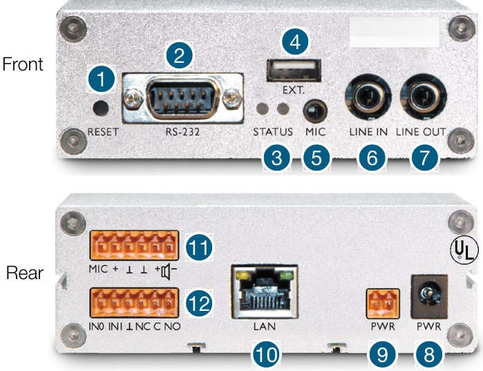
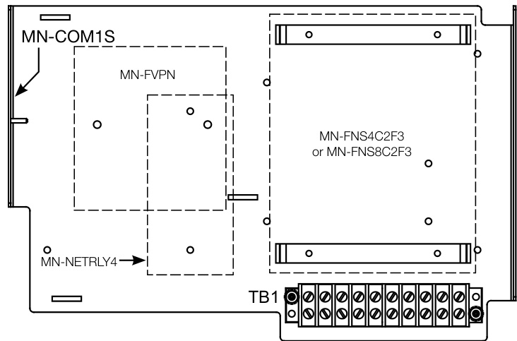
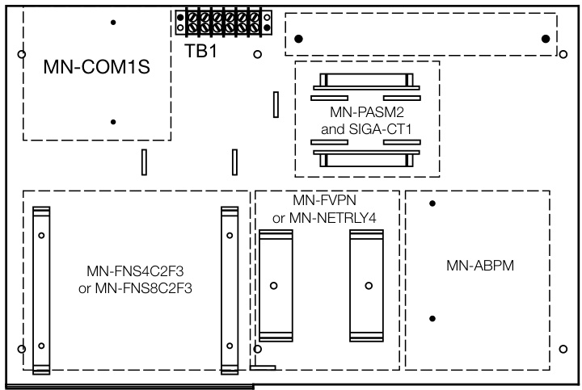
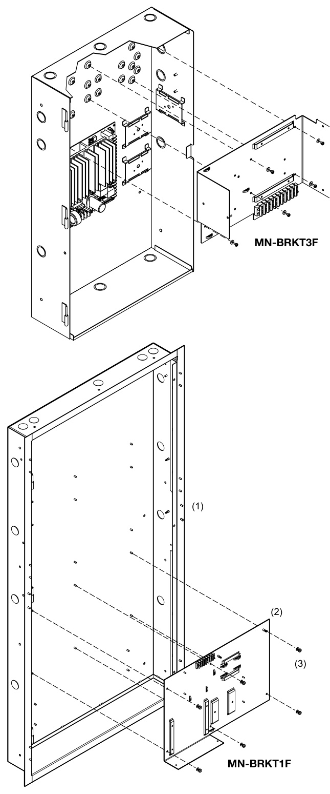
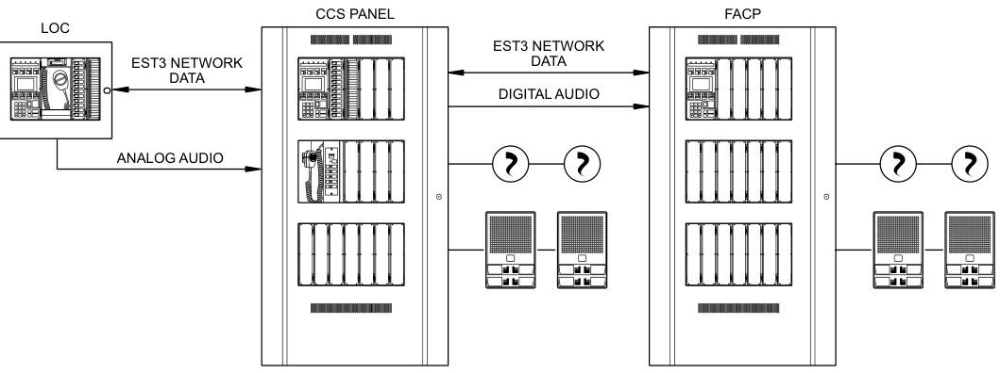
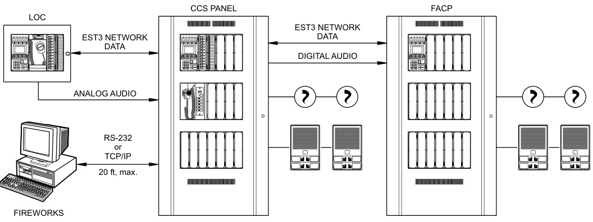
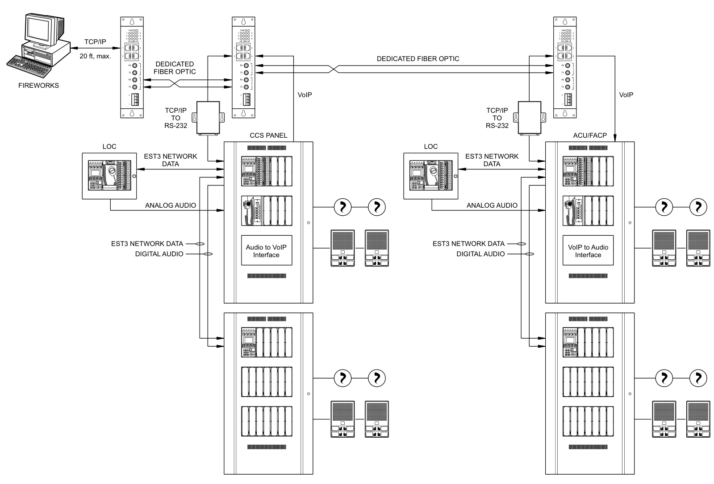

# VoIP Encoder/ Decoder MN-FVPN  

# Overview  

EDWARDS Voice over Internet Protocol (VoIP) encoder/decoder units allow for the use of Transmission Control Protocol/Internet Protocol (TCP/IP) to transmit supervised digital audio for mass notification applications.  

While in encoder mode, the MN-FVPN takes audio signals from the Central Control Station (CCS) and transmit it over an Ethernet path. While in decoder mode, the MN-FVPN takes the digital audio signal from the Ethernet pathway and provides the connectivity to the local 3-ASU/4, 3-ASU/FT or local audio system.  

The EDWARDS VoIP system can operate in a one-to-one (one encoder to one decoder) or one-to-many (one encoder to multiple decoders) modes of operation, while providing end-to-end supervision of the entire audio path, and delivering highly intelligible audio signals.  The MN-FVPN mounts in an EST3 enclosure on an MN-BRKT1F, in a 3-CAB or 3-RCC enclosure, or on a MN-BRKT3F in an APS(6)(10)A power supply.  

# Standard Features  

•	 Rugged aluminum construction   
•Powered by 24 Vdc from the control panel   
•Easy to configure Easy to wire, comes with polymer bracket and standard cables  

# Connections  

  

1. Reset button.   
2. RS-232 connection   
3. Status LEDs   
4. USB interface (not used)   
5. Microphone input (not used)   
6. Line input   
7. Line output   
8. Power   
9. Power(not used)   
10. LAN connection (RJ-45, 10/100 Half/Full duplex)   
11.	 Microphone/Speaker (not used)   
12.	 Unsupervised input zones and Form C relay  

# Application  

EDWARDS VoIP encoder/decoders are part of the EST3 mass notification solution set, which is flexible and scalable enough to suit new installations and retrofits alike. Voice-over-Internet offers the universality of a standard protocol that simplifies setup and configuration and, because VoIP is a digital protocol, there is no loss of signal quality over long distances.  

As part of the EST3 Emergency Communications platform, MNFVPN units can be configured to operate with a stand-alone EST3 network or with multiple EST3 networks that are controlled by the powerful, but intuitive-to-operate FireWorks Graphical Control Workstation. Pre-recorded and/or live voice messages can easily be routed where desired. FireWorks can function as the event management system that brings ECS/MNS, Fire Alarm, Security, CCTV and other functions together into a single event-driven interface. All signals are presented in a consistent, concise and informative manner.  

# Mounting  

The MN-COM1S mounts on an MN-BRKT1F or an MN-BRKT3Fbracket. These install inside the EST3 control panel or Auxiliary Power Supply for a neat and self-contained mass notification solution.  

  
MN-BRKT3F  
MN-BRKT1F  

  

# Component Layout  

Compatible Control Panel  

  

# Typical Wiring  

Single EST3 Network without FireWorks  

Single EST3 Network with FireWorks  

  

  

  
Multiple EST3 Network with FireWorks  

Specifications   

<html><body><table><tr><td>Voltage 18to28VDC</td><td></td></tr><tr><td>Current</td><td>89 mA</td></tr><tr><td>Dimensions (WxHxD)</td><td>5.0"×4.25"×1.375"（127mmx38mm×35mm)</td></tr><tr><td>Housing</td><td>Aluminum</td></tr><tr><td>Audiointerface</td><td></td></tr><tr><td>In</td><td>1VRMSfromMN-ABPM</td></tr><tr><td>1no</td><td>100mVRMSto3-ASU/4or3-ASU/FTTerminals13&14</td></tr><tr><td>NetworkInterface</td><td></td></tr><tr><td>Connector</td><td>RJ-45</td></tr><tr><td>Cable type</td><td>CAT6orCAT6a</td></tr><tr><td>Other</td><td>10/100Mbps,TCP/IP,autonegotiating</td></tr><tr><td>Operatingenvironment</td><td></td></tr><tr><td>Temperature</td><td>32 to120°F(0 to49°C)</td></tr><tr><td>Humidity</td><td>0 to93%RH,noncondensing at90°F(32°C)</td></tr></table></body></html>  

# Ordering Information  

<html><body><table><tr><td>MN-FVPN</td><td>MN-FVPNVolPEncoder/Decoder,comeswithMN-FVPB1polymerbracket MN-AUDCBL1audiointerfacecable,andMN-PWRCBL1powercable.</td></tr><tr><td>RelatedEquipment</td><td></td></tr><tr><td>MN-BRKT1F</td><td>VolPinterfacemountingbracketforEST3enclosures</td></tr><tr><td>MN-BRKT3F</td><td>s</td></tr><tr><td>MN-COM1S</td><td>EthernetDeviceServerNetworkInterface-10/100BASE-T</td></tr><tr><td>MN-PASM2</td><td>Pre-ampSupervisionModule.OneMN-PASM2&oneSIGA-(M)RM1required perMN-FVPNused indecodermode.</td></tr><tr><td>SIGA-RM1/MRM1</td><td>RiserSupervisionModule</td></tr><tr><td>MN-FNS4C2F3</td><td>FourFastEthernet(RJ45),2GBSFP,Layer3Lite.24VDC</td></tr><tr><td>MN-FNS8C2F3</td><td>Eight Fast Ethernet (RJ45),2 GBComboSFP/RJ45,Layer 3 Lite.24 VDC</td></tr><tr><td>MN-FNS8C18F2</td><td>Rack-mount,8FastEthernet(RJ45)，16FESFP,2GBComboSFP/RJ45, Layer2.Requirespowersupplymodules.</td></tr><tr><td>MN-ABPM</td><td>AudioBridge</td></tr><tr><td>MN-FVPNTS6</td><td>Six-positionterminalstrip</td></tr><tr><td>MN-TK10</td><td>10-positionterminalstripkit</td></tr></table></body></html>  