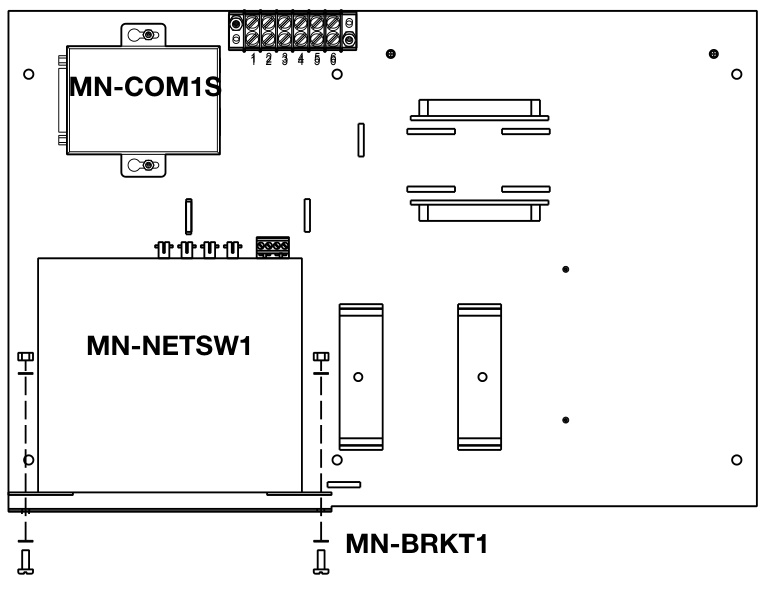
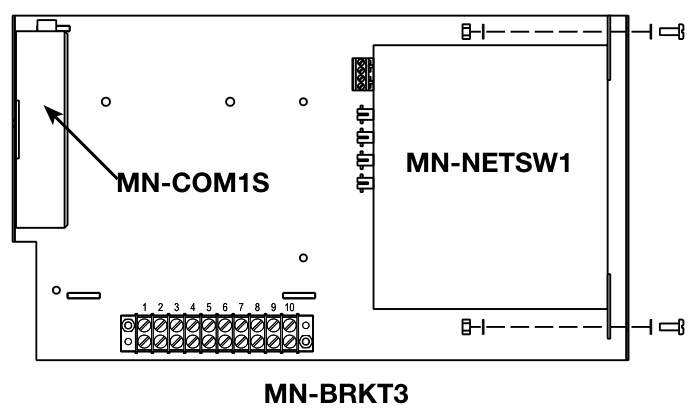
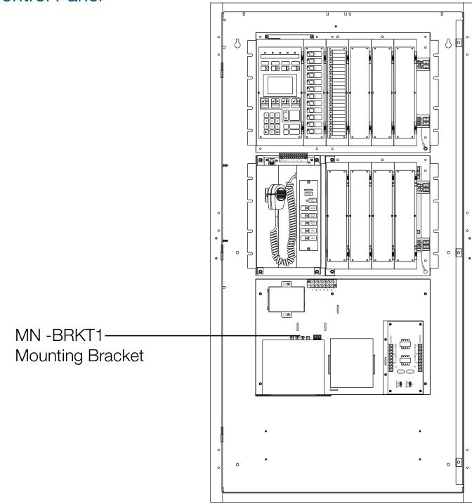
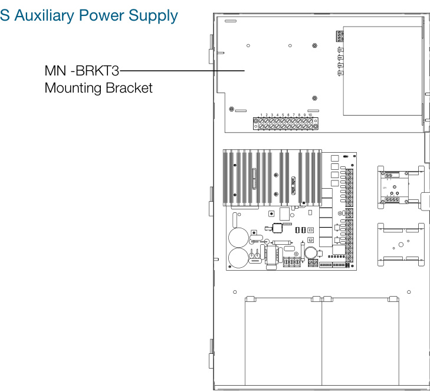
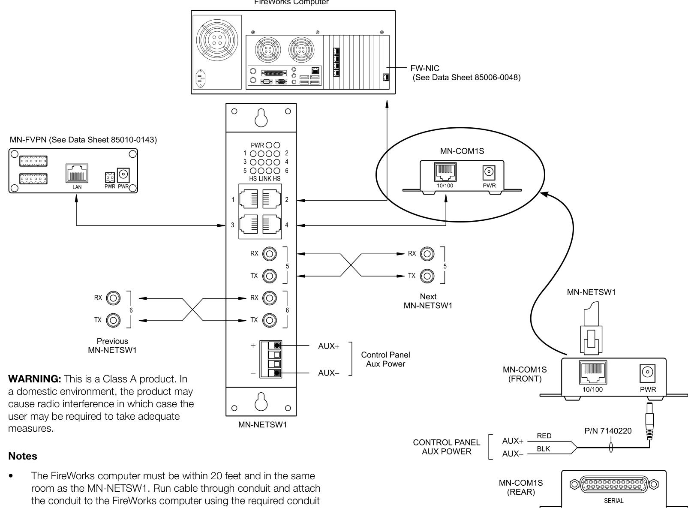

# Mass Notification Communications MN-NETSW1, MN-COM1S  

# Overview  

# MN-NETSW1Four-port Mass Notification multimode fiber optic Ethernet switch  

The MN-NETSW1 is an industrial grade, 10/100 Mbps auto-negotiating Ethernet switch used in life safety and mass notification applications to connect EST3’s FireWorks workstation to the MNFVPN VoIP module and/or the MN-COM1S RS-232 interface. The MN-NETSW1 provides four RJ-45 ports for local connections and two full-duplex multimode fiber ports for remote connections.  

The MN-NETSW1 has three LED indicators  

•Power: On indicates the MN-NETSW1 has power.   
•Link: On indicates Ethernet link has been established. Flashing indicates link is active. HS: Indicates data transferring at 100 Mbps.  

# MN-COM1S  

Mass Notification Serial Communications/LAN interface The MN-COM1S is a TCP/IP to RS-232 interface with one RJ-45 port and one RS-232 port. It is used in mass notification settings to connect a FireWorks workstation to an EST3 control panel.  

Both the MN-NETSW1 and the MN-COM1S mount on an MN-BRKT1 or an MN-BRKT3 bracket. These install inside the EST3 control panel or Auxiliary Power Supply for a neat and self-contained mass notification solution.  

# Standard Features  

# MN-NETSW1 Four-port Mass Notification Ethernet Switch  

Connect alarm panels to a remote FireWorks workstation over TCP/IP, LAN/WANs Supports Mass Notification and Fire Alarm applications Implement VoIP communications between EST3 nodes   
•10/100BASE-T Ethernet interface (RJ45)   
•Supports MN-COM1S for Serial connection to 3-CPU3 Supports MN-FVPN for VoIP communication between FireWorks workstations Four RJ-45 ports for local connections   
•Two full-duplex multimode fiber ports for remote connections.   
•Configuration and port director software included Flash ROM for easy software upgrade  

# MN-COM1S Mass Notification Serial Communications/LAN interface  

•	 Connect a FireWorks workstation to an EST3 control panel. •	 RS-232 Serial port for connection to 3-CPU3   
•	 One RJ-45 port   
•	 One RS-232 port   
•	 Browser-based setup and configuration  

# Mounting  

The MN-NETSW1 and the MN-COM1S mount on an MN-BRKT1or an MN-BRKT3 bracket. These install inside the EST3 control panel or Auxiliary Power Supply for a neat and self-contained mass notification solution.  

  

  

# Component Layout  

EST3 Control Panel  

  

  

  

adapter.   
Use the control panel power supply or a compatible regulated 24 VDC power supply that is UL/ULC listed for fire protective signaling systems.  

# Specifications, MN-COM1S  

<html><body><table><tr><td>Voltage</td><td>18to28VDC</td></tr><tr><td>Current</td><td>60 mA</td></tr><tr><td>Dimensions</td><td>(W × H× D) 2.5 ×0.9 x 3.5 in.(6.4× 2.3 x 9.0 cm)</td></tr><tr><td>Serialinterface</td><td>RS-232C</td></tr><tr><td>NetworkInterface</td><td></td></tr><tr><td>Connector</td><td>RJ-45</td></tr><tr><td>Cable type</td><td>Category5,min.</td></tr><tr><td>Other</td><td>10/100Mbps,TCP/IP,autonegotiating</td></tr><tr><td>Operatingenvironment</td><td></td></tr><tr><td>Temperature</td><td>32to120°F(0to49°C)</td></tr><tr><td>Humidity</td><td>0to93%RH,noncondensingat90°F(32°C)</td></tr></table></body></html>  

# Specifications, MN-NETSW1  

<html><body><table><tr><td>Voltage</td><td>18 to28VDC</td></tr><tr><td>Current</td><td>350 mA, max.</td></tr><tr><td>Dimensions (W × H × D)</td><td>1.75 x 7.54 x 5.54 in. (44×191 × 138.4 mm)</td></tr><tr><td>Fiber optic ports 2</td><td></td></tr><tr><td>Quantity</td><td></td></tr><tr><td>Connector type</td><td>ST</td></tr><tr><td>Signaling/Data Rate</td><td>100Base-FX/100Mbps</td></tr><tr><td>Attenuation</td><td>13 db, max. at a 1310 wave length</td></tr><tr><td>Operatingenvironment</td><td></td></tr><tr><td>Temperature</td><td>32to120°F(0to49°℃)</td></tr><tr><td>Humidity Segment Length</td><td>0 to 93% RH, noncondensing at 90°F/32°C</td></tr><tr><td>Copper</td><td>3,28ft (100m)</td></tr><tr><td>Fiber Optic</td><td>~6,562 ft (2km) multi mode fiber</td></tr><tr><td></td><td></td></tr><tr><td>Fiber OpticBudget</td><td>10dB</td></tr><tr><td>Segment Media</td><td></td></tr><tr><td>Copper</td><td>Category 6 UTP</td></tr><tr><td>Fiber Optic (1300 nm)</td><td>50/125or62/5/125MultiModeFiber</td></tr><tr><td>Agency Listings</td><td>CE;FCCPart 15,ClasSA;EN50081-2;EN50082-2;UL-864</td></tr><tr><td>Power Requirements</td><td>24VDCat21mA,nominal10-36VDC,5watts8-24VAC,47-63</td></tr><tr><td></td><td>Hz, 5 VA</td></tr></table></body></html>  

# Ordering Information  

<html><body><table><tr><td>MN-COM1S</td><td>UL864ListedFireWorksCommunicationsEthernetPort,Command& Control.ComeswithpowerandRS232datacables</td></tr><tr><td>MN-NETSW1</td><td>Four-portmultimodefiberopticEthernetswitch</td></tr><tr><td>RelatedEquipment</td><td></td></tr><tr><td>MN-BRKT1</td><td>MN-FVPmountingbracketforEST3enclosures</td></tr><tr><td>MN-BRKT3</td><td></td></tr><tr><td>FW-NCCA4</td><td>EthernetcableconduitconnectorassemblyforUL4computer</td></tr><tr><td>MN-FVPB1</td><td>PolymermountingbracketforMN-FVPN</td></tr><tr><td>MN-FVPN</td><td>FireVolPencoder/decoder,includespowerandaudiocables</td></tr><tr><td>MN-PASM2</td><td>FVPN,alongwithSIGA-RM1orSlGA-MRM1)</td></tr><tr><td>SIGA-RM1/MRM1</td><td>RiserSupervisionModule</td></tr><tr><td>MN-ABPM</td><td>AudioBridge(Panelmount3-ATPiNT)</td></tr></table></body></html>  