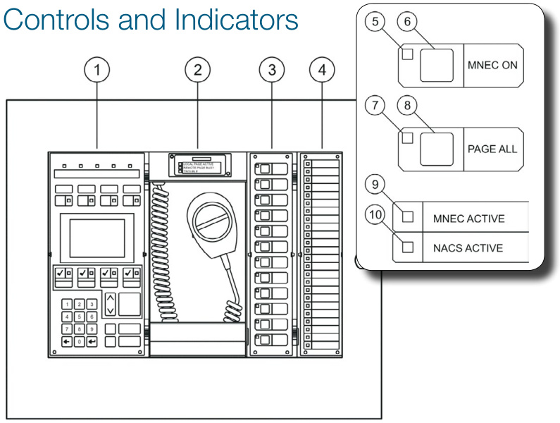
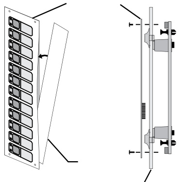
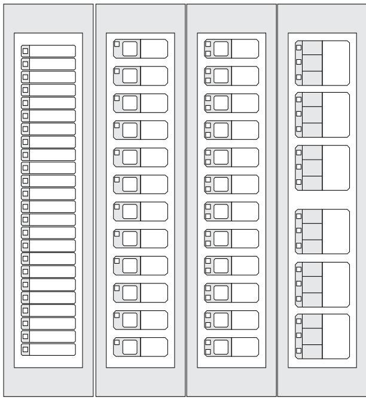
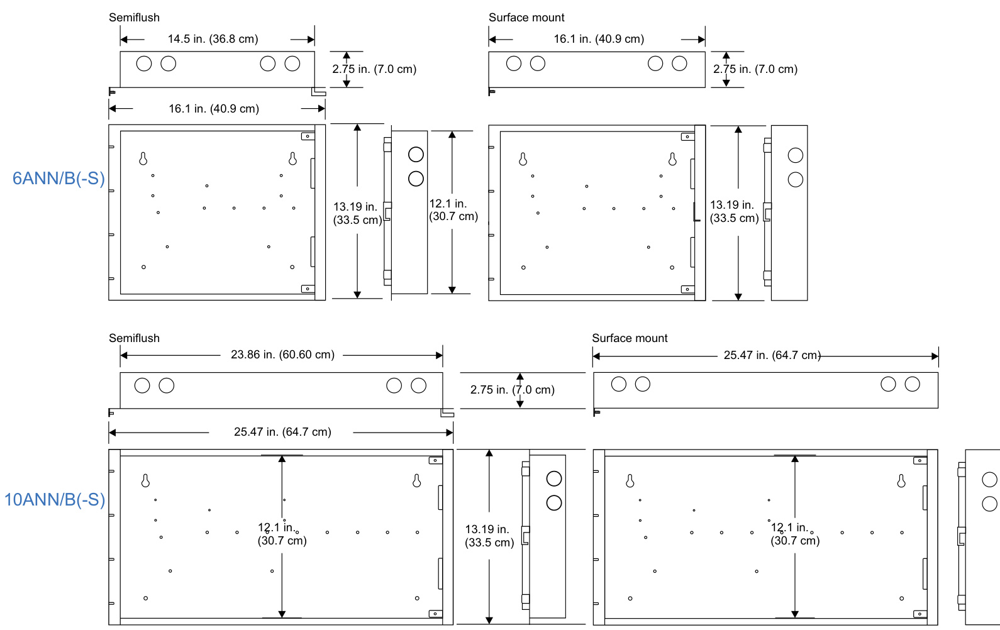

# Local Operations Console 3-ANNCPU3, 3-LCDANN, 3-6ANN, 3-10ANN, 3-REMICA  

# Overview  

EST3 remote annunciation and control equipment is ideally suited to serve mass notification purposes. LCD display modules, remote microphones, and control and display modules configured for mass notification operation provide everything that’s needed for annunciation, control, and paging operations. In these applications, annunciators are configured to operate as Local Operation Consoles (LOCs), from which mass notification is initiated and controlled.  

Annunciator cabinets are constructed from 16 gauge cold rolled steel. The gray textured enamel finish of the annunciators complements any decor. Both surface and semi-flush mounting cabinet configurations maximize mounting flexibility and esthetic appeal. Cabinet arrangements allow LED and LCD annunciation, as well as paging, to easily combine in a single enclosure. Slide-in labeling for LEDs and switches provides designation flexibility for mass notification labeling.  

# Standard Features  

•	 Variety of wallbox configurations neatly houses annunciation and control, as well as paging equipment   
•	 On-board microphone provides instant access to mass notification audio   
•	 Slide-in labels makes mass notification configuration easy Standard 3-LCD (168 characters) and large-format 3-LCDXL1 (960 character) display options   
•	 LCD uses queues to sort events   
•	 Programmable LED flash rates  

# Configurable  Features  

•	 Fan & Damper HOA 3-Position Switches   
Audio and strobe selector switches using two-position or threeposition switches   
Fire Alarm Zone Annunciation   
•	 Prerecorded message selection  

# Application  

Local Operating Consoles should be located so as to provide response personnel and building occupants with access to the mass notification (MNEC) system. They should be used to send messages in emergency situations from locations in the building other than from the Autonomous Control Unit (ACU).  

LOC Location Guidelines:1  

Provide a separate LOC for use by the fire department near the building fire alarm control panel (or fire command center) unless this is also the location of the ACU.   
Do not place an LOC inside locked rooms or closets (with the possible exception of the operating console intended for use by the fire department near the FACP).   
Install LOCs at those facility entrances/exits that will be used when building access is limited during emergency situations. Locate LOCs so that occupants do not need to travel a distance in excess of 61 m (200 ft) horizontally or to other floors to access one.   
Make LOCs available for use by visitors in those facilities open to unescorted visitors or to the public.  

1Unified Facilities Criteria 4-021-01: Design and Operation of Mass Notification Systems, 5-6.1 & 4-5.1.  

  

# 1.	 3-LCD  

2. 3-REMICA paging microphone and in-use indicators   
3. 3-12SR or equivalent   
4. 3-24R or equivalent   
5. MNEC ON button status LED. On indicates MNEC ON button was pressed.   
6. MNEC ON button. Press to activate MNEC operation.   
7. PAGE ALL button status LED. On indicates PAGE ALL button was pressed.   
8. PAGE ALL button. Press to direct live voice instructions from the 3-REMICA microphone to all notification appliance circuits.   
9.	 MNEC status LED. On indicates MNEC operation is active.   
10.	 NAC status LED. On indicates all notification appliance circuits are active.  

# Switch and Display Modules  

  

  

<html><body><table><tr><td>3-24x</td><td>3-12Sx</td><td>3-12/S1xx</td><td>3-6/3S1xxx</td></tr><tr><td>24Colored LEDs</td><td>12switches withone</td><td>12switches withtwo</td><td>or 3-4/3SGYWR</td></tr><tr><td></td><td>coloredLED perswitch</td><td>colored LEDs perswitch</td><td>Sixswitcheswith threecolored LEDs per switch</td></tr></table></body></html>  

LEDs are available in red, green, yellow and white.   
Consult the ordering information table for details.  

# Dimensions  

  

# Specifications  

<html><body><table><tr><td>Catalog Number</td><td>3-ANNCPU3</td><td>3-ANNSM</td><td>3-LCD</td><td>3-LCDXL1</td></tr><tr><td>Agency Listings</td><td colspan="4">UL,ULC, FM, CE</td></tr><tr><td>Mounting Space</td><td>Two Spaces</td><td>One Space</td><td>Mountsover3-ANNCPU</td><td>Mountsover3-ANNCPU plustwo spaces.</td></tr><tr><td>CommunicationFormat</td><td>RS-485</td><td>N/A</td><td>N/A</td><td>N/A</td></tr><tr><td>Current@24Vdc Standby</td><td>144 mA</td><td>10mA</td><td>40mA</td><td>48mA</td></tr><tr><td>Alarm</td><td>144 mA</td><td>10mA</td><td>42mA</td><td>50mA</td></tr><tr><td>WiringTermination Wiring Size</td><td>Plug in terminal strip TwistedPair18-14AWG</td><td colspan="3"></td></tr><tr><td></td><td>(0.75-1.5 mm2) 5000 ft(1524m)</td><td colspan="3">N/A</td></tr><tr><td>Max.WireDistance RelativeHumidity</td><td>between any3panels</td><td colspan="3">93% non condensing at 90° F (32° C)</td></tr><tr><td>TemperatureRating</td><td colspan="4">0-49°C(32-120°F)</td></tr><tr><td>WiringStyles</td><td colspan="4">ClassAorClassB</td></tr><tr><td></td><td colspan="4"></td></tr></table></body></html>

The EST3 is modularly listed under the following standards: UL 864 categories: UOJZ, UOXX, UUKL and SYZV, UL 294 category ALVY, UL 609 category AOTX, UL 636 category ANET, UL 1076 category $A P O U,$ UL 365 category APAW, UL 1610 category AMCX, UL 1635 category AMCX. ULC-S527, ULC-S301, ULC-S302, ULC-S303, ULC-S306, ULC/ORD-C1076 and ULC/ORD-C693. UL2572 for Mass Notification.   
For detailed specifications on EST3 compatible annunciator display and control modules please refer to EDWARDS literature sheet part number 85010-0055.  

# Ordering Information  

<html><body><table><tr><td>Catalog Number</td><td>Description</td><td>Ship Wt. Ib (kg)</td></tr><tr><td colspan="2">CommandModuleAnnunciators(ComewithCPU,LcDdisplayanddoors.Orderwallbox separately.)</td><td></td></tr><tr><td>3-LCDANN</td><td>RemoteLCDCommandModuleAnnunciator.</td><td>3.8 (1.7)</td></tr><tr><td></td><td>BaseAnnunciators(Comewithtwo3-ANNSMannunciatorsupportmodules,aCPU,anddoors. OrderDisplay/Controlmodules，additionalsupportmodules&wallboxseparately.)</td><td></td></tr><tr><td>3-6ANN</td><td>SixPositionBaseAnnunciator.</td><td>6.28 (2.85)</td></tr><tr><td>3-1OANN</td><td>1oPositionBaseAnnunciator.</td><td>10.5 (4.8)</td></tr></table></body></html>  

CPU, Support Module, & LCD Displays   

<html><body><table><tr><td>3-ANNCPU3</td><td>AnnunciatorCPU</td><td>1 (.45)</td></tr><tr><td>3-CPUDR</td><td>CPUdoorswithfillerplates.Orderseparately,onerequiredperCPU wherenoLCDdisplayisinstalled.</td><td>0.25 (.11)</td></tr><tr><td>3-ANNSM</td><td>AnnunciatorSupportModule</td><td>.45 (.2)</td></tr><tr><td>3-LCD</td><td>LiquidCrystalDisplayModule,eightlines.</td><td>.8 (.36)</td></tr><tr><td>3-LCDXL1</td><td>LiquidCrystalDisplayModule,40linesmountsin3-6ANNor3-10ANN anunciators.Note one 3-LCDXL1KBL,(ordered separately) is required for each 3-LCDXL1mountinginto3-6ANNor3-10ANNannunicatorboxes.</td><td></td></tr><tr><td>3-LCDXL1KBL</td><td>module.</td><td></td></tr></table></body></html>  

Control/Display Modules   

<html><body><table><tr><td>3-CPUDR</td><td>Twoblankfillerplatessuitablefor any annunciator blankspace.</td><td>.5 (.22)</td></tr><tr><td>3-24R</td><td>24 Red LEDDisplayModule</td><td>.35 (.12)</td></tr><tr><td>3-24Y</td><td>24 Yellow LEDDisplayModule</td><td>.35 (.12)</td></tr><tr><td>3-24G</td><td>24 Green LED Display Module</td><td>.35 (.12)</td></tr><tr><td>3-12SR</td><td>12switcheswith 12 Red LEDDisplay/Control Module</td><td>.35 (.12)</td></tr><tr><td>3-12SY</td><td>12switcheswith12Yellow LEDDisplay/Control Module</td><td>.35 (.12)</td></tr><tr><td>3-12SG</td><td>12switcheswith12GreenLEDDisplay/Control Module</td><td>.35 (.12)</td></tr><tr><td>3-12RY</td><td>12RedLEDand12YellowLEDDisplayModule</td><td>.35 (.12)</td></tr><tr><td>3-12/S1GY</td><td>12 switcheswithone Green and oneYellow LEDperswitch</td><td>.35 (.12)</td></tr><tr><td>3-12/S1RY</td><td>12switcheswithoneRed andoneYellowLEDperswitch</td><td>.35 (.12)</td></tr><tr><td>3-12/S2Y</td><td>12 switches with two Yellow LEDs per switch</td><td>.35 (.12)</td></tr><tr><td>3-6/3S1G2Y</td><td>Six groups of three switches. Each switch with one LED: Green, Yellow, Yellow.</td><td>.35 (.12)</td></tr><tr><td>3-6/3S1GYR</td><td>Six groups of three switches. Each switch with one LED: Green, Yellow, Red.</td><td>.35 (.12)</td></tr><tr><td>3-4/3SGYWR</td><td>12 switches in four groups of three switches, switch one with a green LED, switch two with yellow and white LEDs and switch three with a red LED</td><td>.35 (.12)</td></tr><tr><td>3-FP</td><td>LED or LED/Switch module installed on operator layer.</td><td>0.1 (0.05)</td></tr></table></body></html>  

3-REMICA Remote microphone for use in 3-ANN series annunciator cabinets 15 (6.8)  

Microphone   
Enclosures   

<html><body><table><tr><td>6ANN/B</td><td>Sixp position LED/LCD flushr mountwallbox 7.0 (3.2)</td></tr><tr><td>6ANN/B-S Sixp</td><td>position LED/LCD surfacemountwallbox 7.0 (3.2)</td></tr><tr><td>10ANN/B Tenp</td><td>position LED/LCD flushmountwallbox 9.0 (4.1)</td></tr><tr><td>10ANN/B-S Tenp</td><td>positionLED/LCD surfacemountwallbox 9.0 (4.1)</td></tr></table></body></html>  