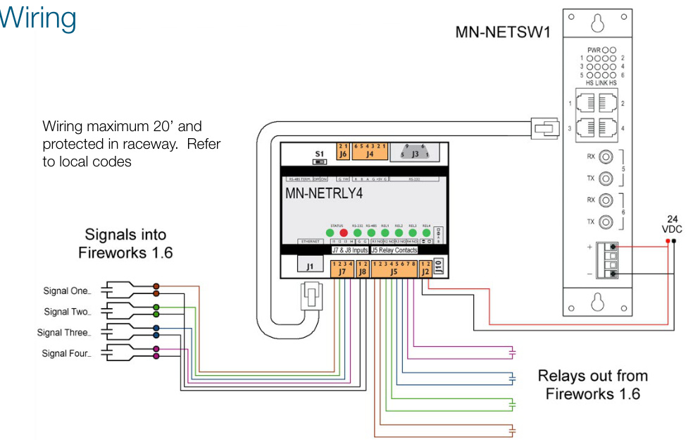
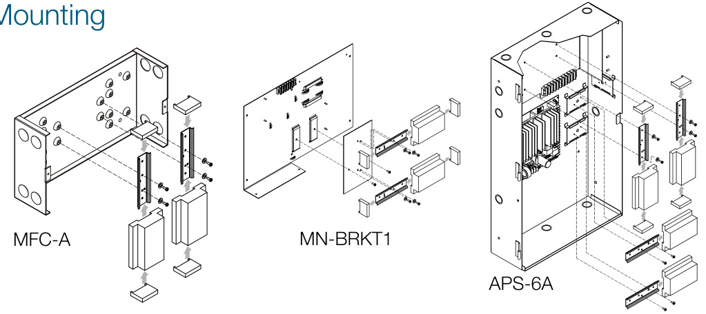

# Ethernet Network I/O Module MN-NETRLY4  

# Overview  

The EDWARDS MN-NETLRY4 Network Relay provides four unsupervised input zones and four normally-open relays to and from FireWorks V1.6 or greater over an Ethernet (TCP/IP) network. This module is particularly well-suited for mass notification, life safety applications, and other monitoring or output applications. It is also ideal for interfacing to third-party systems.  

The MN-NETRLY4’s four input zones may be configured as Alarm, Supervisory, Trouble, or Monitor inputs directly into FireWorks. These can initiate display events and trigger FireWorks logic. The wiring for these zones is limited to 20 ft (6.1 m), and must be mechanically protected in accordance with applicable codes.  

The four normally-open relays are controlled directly from FireWorks. These can be programmed to respond to automatic or manual FireWorks commands.  

Data communication to and from the MN-NETLRY4 is constantly supervised from FireWorks. A fixed IP address is required.  

The MN-NETRLY4 snaps easily onto the included DIN rail (MNNRBK1) mounting bracket that can be mounted in an 2-WB, EST3 (on MN-BRKT1), MFC-A, APS(6)(10)A (on MN-BRKT3), or BPS(6)(10)A enclosure.  An optional MN-NRMP is also available that will allow two MN-NETLRY4s to be mounted on an MN-BRKT1 inplace of an MN-FVPN.  

# Standard Features  

•Flexible mounting options   
•Powered by 24 Vdc from control panel or listed power supply   
•Easy to configure   
•Removable terminal strips Optional MN-TK10 Terminal Block Kit  

# Application  

The MN-NETLRY4 can be used to connect to a third-party system to bring common Alarm, Supervisory and Trouble signals directly to FireWorks. The MN-NETRLY4 is also ideal for providing commands and receiving confirmation signals to and from third-party systems, or any application where a high concentration of inputs and outputs are required.  

When interfacing the MN-NETRLY4 to an initiating device circuit from a third-party control panel, an MN-TK10 Terminal Block Kit is required.  

  

  

Specifications   

<html><body><table><tr><td>Voltage 18to28VDC</td></tr><tr><td>95 mA standby, 152.5 mA Current withallrelays active</td></tr><tr><td>Form A,programmable,24 Contacts VDC@0.5Aresistive</td></tr><tr><td>Housing Polymer</td></tr><tr><td>UL864,UL2572,CSFM,See Listings note 1</td></tr><tr><td>NetworkInterface</td></tr><tr><td>Connector RJ-45</td></tr><tr><td>Cable Type Cat5orbetter</td></tr><tr><td>10/100Mbps,TCP/IP,auto Data negotiating</td></tr><tr><td>Operatingenvironment</td></tr><tr><td>Temperature 32to120F(0to49℃)</td></tr><tr><td>0 to 93%RH,noncondensing Humidity at 90 F (32 °C)</td></tr></table></body></html>  

# Ordering Information  

<html><body><table><tr><td>MN-NETRLY4</td><td>EthernetcontrollablemultiI/O unit,4input4relayoutputs</td></tr><tr><td>MN-NETSW1</td><td>ULListedMultimodeEthernet switch</td></tr><tr><td>MN-NRBK1</td><td>Replacementmountingbracket withend-capsforsingleMN- NETRLY4(onecomeswith eachMN-NETRLY4)</td></tr><tr><td>MN-NRMP</td><td>Mountingplateto allowupto 2MN-NETRLY4modulestobe mountedonanMN-BRKT1</td></tr><tr><td>MN-TK10</td><td>10positionterminalkit</td></tr><tr><td>ULListedMN-NETSW1switches</td><td>Note1:TheMN-NETRLY4islistedforconnection toadedicatedEthernetnetworkmadeupFireWorks computers,MN-COM1Sunitsthatareconnectedto</td></tr></table></body></html>  