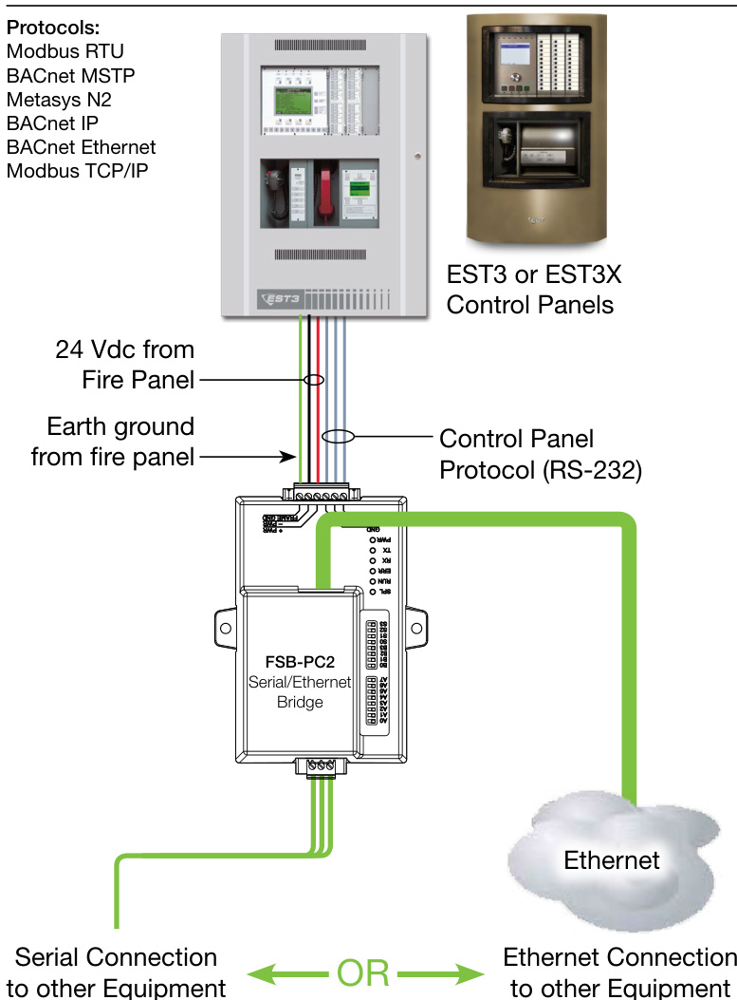
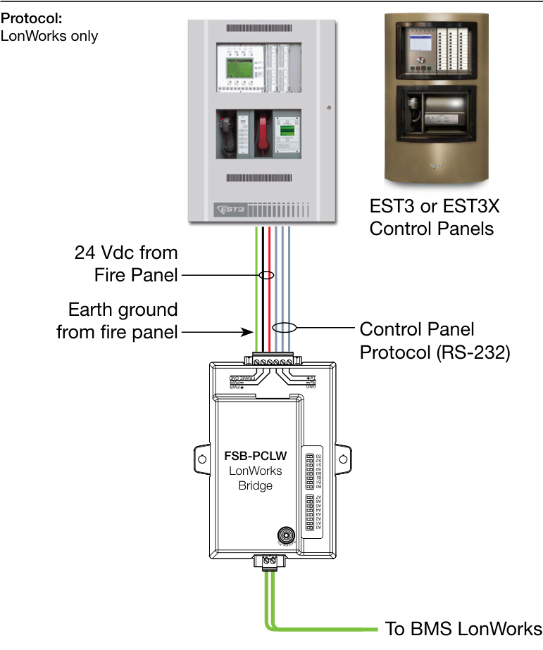
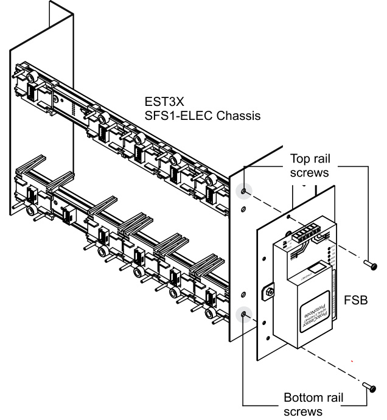
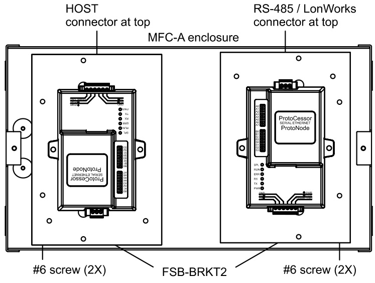

# BMS Communications Bridges FSB-PC2 and FSB-PCLW  

# Overview  

The BMS Communication Bridges are ancillary devices that provide protocol translation between between EST3 or EST3X control panel serial data and the se­rial or Ethernet input of an external device controller. Signal flow is typically one way — from the life safety panel to the network to the building automation system.  

Two communication bridges are available. Each comes complete with the driver necessary to communicate over a single supported protocol.  

The FSB-PC2 is a multi-protocol bridge that converts the panel’s External Communications Protocol (ECP) to any one of several supported protocols including Modbus RTU, BACnet MSTP and Metasys N2. It operates over RS-232 or RS-485 serial communications or Ethernet (10/100 Base-T).  

The FSB-PCLW is a single-protocol bridge that converts the panel’s External Communications Protocol (ECP) to LonWorks only.  

# Standard Features  

Links EST3 or EST3X with building management system Sends events to a BMS system via serial or Ethernet connections, helping to reduce interface hardware costs   
Supplied with field protocols, Modbus, BACnet and Metasys One module provides selection of any single protocol – no need to purchase separate software or hardware modules Serial and Ethernet ports Flexible connection type for the BMS system: RS-232 or RS485, LonWorks, or Ethernet 10/100 Base-T Software configuration Speeds installation and setup Selectable connection to BMS via RS-485 or Ethernet Enable Serial-to-Serial protocol translation for bridging EST3 or EST3X or Serial-to-Ethernet to Industrial Automation or Building Automation equipment RoHS compliant Provides readiness for the Restriction of Certain Hazardous substances (RoHS) directives that are becoming prevalent in many jurisdictions.  

# Application  

Options selected for bridging EST3 or EST3X panels to building control systems depend on the requirements of the external device controller. Before specifying an FSB bridge, determine the communications protocol and the communications interface required by third-party equipment. Keep in mind that both FSB bridges support either Ethernet or serial interfaces, however the FSB-PCLW supports only the LonWorks protocol.  

FSB bridges communicate with EST3 or EST3X systems via an installer-supplied RS-232 cable. This connects between the control panel’s RS-232 port and a DB-9 connection at the bridge. Software is used to select the desired communications protocol where applicable, and whether the serial or the Ethernet interface is to be used for output to field equipment.  

In order to complete the bridging process, individual points need to be specified within the FSB software. This allows the bridge to relay only required data to the external device controller. To do this, use the EST3-SDU to identify and export a list of relevant device addresses. Then simply import this list into the FSB software and generate a new configuration file for uploading to the bridge.  

# Engineering Specification  

The system shall proved an interface from the fire/life safety sys­ tem to the Building Management System. The interface shall be via $<$ Modbus RTU> <BACnet MSTP> <Metasys $\mathsf{N}2\!>$ <BACnet $\Vdash$ <BACnet Ethernet> <Modbus TCP/IP> <LonWorks> protocol. The interface shall be software configurable as to which points from the fire systems shall be provided to the BMS. The BMS interface shall be powered from and mount within the fire panel without affecting its agency listing.  

# Typical Wiring  

  

  
Dimensions  

  

# Installation  

FSB bridges mount inside the EST3 or EST3X control panel enclosures using the separately-ordered FSB-BRKT2 mounti­ng kit. This kit eliminates the cost and effort of installing a separate cabinet. If an external cabinet is required, the FSBs may be mounted inside an MFC-A multifunction cabinet. FSB bridges are powered from the control panel 24VDC power supply.  

  

Mounting to an EST3X SFS1-ELEC Chassis  

  

  

  
Mounting to an EST3 3-CAS7 Chassis  

# Technical Specifications  

<html><body><table><tr><td></td><td>FSB-PC2</td><td>FSB-PCLW</td></tr><tr><td>Communication Interfaces</td><td>Serial to fire panel: RS-232 ToBMS:Serial(RS-485) or Ethernet 10/100Base T (auto sensing).</td><td>To Fire Panel: Serial To BMS -FTT-10 LonWorks</td></tr><tr><td>Supported field protocols</td><td>To Fire Panel: Serial To BMS:Ethernet BACnet/IP (default), Modbus TCP Serial:Modbus RTU,BACnet</td><td>To Fire Panel: Serial To BMS: LonWorks</td></tr><tr><td>Points per Bridge</td><td>MS/TP, Metasys N2 3,600 max.1</td><td>1,800 max.</td></tr><tr><td>Operating Current</td><td>110 mA nominal, 120 mA max. (at 24 VDC)</td><td>130 mA nominal, 140 mA max. (at 24 VDC)</td></tr><tr><td>Input voltage Storage &Operating</td><td>9 to 30 VDC (from EST3 power supply)</td><td></td></tr><tr><td>Environment</td><td>32to 120F(0 to 49°C) 5-90% RH, non-condensing</td><td></td></tr><tr><td>Regulatory Approvals</td><td>CE (EN 55022,EN 55024) Tested to comply with UL916 to carry the TUV Rheinland Mark.</td><td>Surge Suppression: EN61000-4-2 ESD, EN61000-4-3EMC,EN61000-4-4 EFT</td></tr><tr><td>Construction and Finish</td><td>Light Grey metal enclosure with mounting ears.</td><td>Complies with part 15 of the FCC Rules.</td></tr><tr><td>Mounting</td><td>or within an MFC-A cabinet.</td><td>WithinEST3orEST3Xcabinet using mountingkit model FSB-BRKT2</td></tr><tr><td>Configuration</td><td>as well as specific points to be translated.</td><td>Software programmable for protocol supported</td></tr><tr><td>Maximum Bridges</td><td></td><td>TwoperEST3node;OneperEST3Xnode;</td></tr><tr><td>Dimensions, W × H x D</td><td>10 per EST3/EST3X network 3.6 × 5.0 × 1.6 in. (8.2 × 11.5 × 4.0 cm)</td><td></td></tr></table></body></html>

1 A single FSB-PC2 can support up to 3,600 points. Total points are a combination of the programmed points coming into the FSB-PC2 and the programmed points going out to the building management system. For example, if you program 1,800 points to come into the FSB-PC, you can program up to 1,800 points to go out to your building management system. See installation sheet 3102007 for further details.  

# Ordering Information  

<html><body><table><tr><td>Model</td><td>Description</td><td>Ship Wt. Ib (kg)</td></tr><tr><td>FSB-PC2</td><td>BMSCommunicationsBridge. MountsonseparatelyorderedFSB-BRKT2.</td><td>3.0 (1.36)</td></tr><tr><td>FSB-PCLW</td><td>BMSCommunicationsBridge. Mounts on separately ordered FSB-BRKT2.</td><td>3.0 (1.36)</td></tr><tr><td>FSB-BRKT2</td><td>MountingbracketforFSB-PC2orFSB-PCLW.AllowsFSBseries tomountinanMFC-AcabinetoronthesideofanEST3Chass7</td><td>1.0 (0.45)</td></tr><tr><td>MFC-A</td><td>oronthesideoftheEST3XSFS1-ELECchassis. MultifunctionFireAlarmCabinet,red.</td><td>7.0 (3.1)</td></tr></table></body></html>  