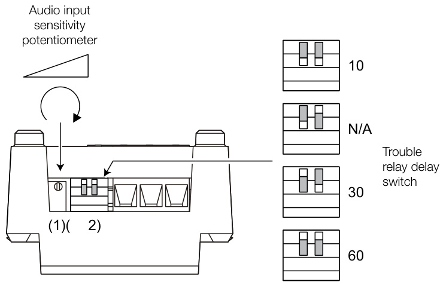
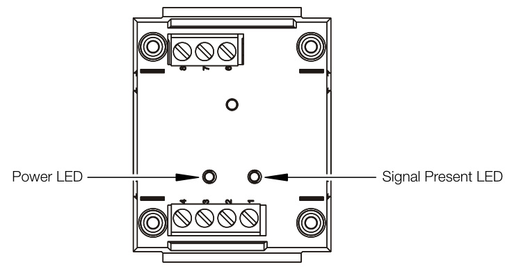
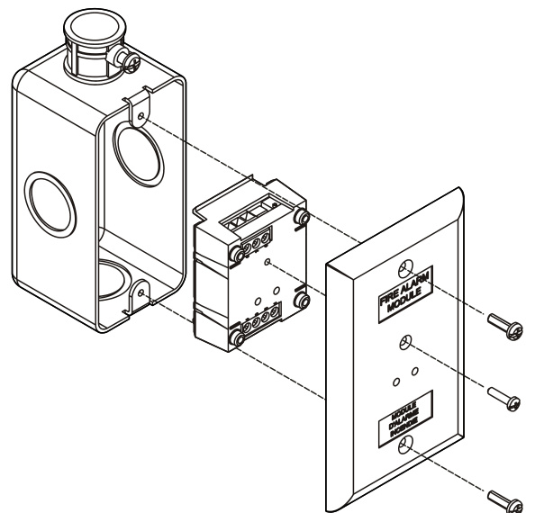
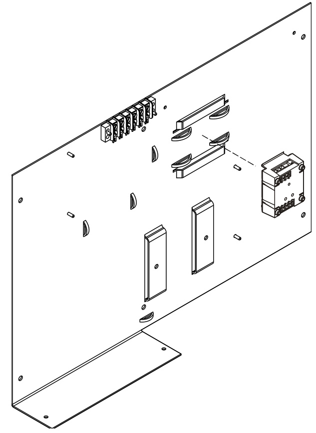
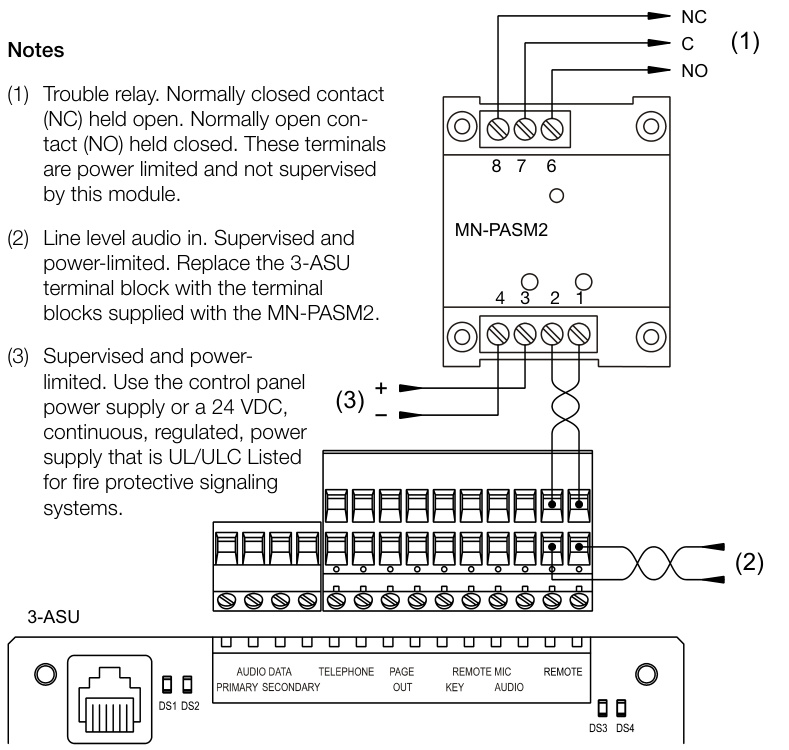

# Preamp Supervision Module MN-PASM2  

# Description  

The versatile EDWARDS MN-PASM2 module provides the means to supervise preamp (line level) audio signals. The easy to install module is locally powered from 24 VDC and provides a 1 Amp Form C relay contact output that transfers upon loss of the monitored audio signal.  

Relay contact transfer times can be programmed for 10, 30 or 60 seconds of loss of audio. The relay restores immediately upon restoration of the signal. It also transfers immediately upon loss of power to the module.  

MN-PASM2 audio sensitivity is adjustable with a highly sensitive on-board potentiometer. This can be adjusted in order to calibrate the audio supervision level to the specific system.  

The MN-PASM2 has two on-board LED indicators. The first is a Power LED. This provides local visual indication that the module has 24 VDC power. The second LED follows the relay. If the module is configured correctly and the audio stream is present, this LED is illuminated.  Both LEDs are visible from the front of the module even if the module cover plate is installed.  

The MN-PASM2 comes with replacement terminal strips that allow complete supervision of the signal through the 3-ASU Series audio source unit modules.  

# Standard Features  

The MN-PASM2 can be mounted to a standard electrical box or inside cabinets to EDWARDS mounting brackets.  

•	 Small form-factor •Field adjustable •Easy to configure •Easy to install •Multiple mounting options Low power consumption Fail-safe operation  

# Application  

The MN-PASM2 is part of the EST3 mass notification solutions set. It resides at the Voice-over-Internet Protocol (VoIP) decoder location, supervising the audio stream for loss of signal.  

If the signal is lost for any reason, the MN-PASM2 relay contact transfers. This relay is monitored by an input circuit on the ECS/ MNS/LSS system.  

Note: This module is not a Signature Series module and does not connect to a Signature or any other signaling line circuit directly.  

# Control  

  

# Indicators  

  

# Mounting  

Electrical Box  

  

MN-BRKT Series  

  

# Typical Wiring  

  

# Specifications  

<html><body><table><tr><td>Operating voltage</td><td>16to32VDC</td></tr><tr><td>Current</td><td></td></tr><tr><td>Standby</td><td>38 mA</td></tr><tr><td>Alarm</td><td>38 mA</td></tr><tr><td>Audio input</td><td></td></tr><tr><td>Signal level</td><td>0.1 to 1.0 VRMS</td></tr><tr><td>Frequency response</td><td>100 Hz to 4 kHz</td></tr><tr><td>Input impedance</td><td>U009</td></tr><tr><td>Relay outputs Quantity Type</td><td>1 Zone</td></tr><tr><td>Style</td><td>Form C</td></tr><tr><td>Rating</td><td>1Aat30VDC(resistive)</td></tr><tr><td>Wire size</td><td>12 to 18 AWG (0.75 to 2.5 mm2)</td></tr><tr><td>Compatible electrical boxes</td><td>21%2 in.(64 mm) deep,single-gang 4 in. square box, 112 in. (38 mm) deep with single-</td></tr><tr><td>Environmentalclass</td><td>gangcover Indoor, dry</td></tr><tr><td>Operatingenvironment</td><td></td></tr><tr><td>Temperature</td><td>32to120°F(0to49°C)</td></tr><tr><td>Relative humidity</td><td>0 to93% noncondensing</td></tr></table></body></html>  

# Ordering Information  

<html><body><table><tr><td>CatalogNumber</td><td>Description</td></tr><tr><td>MN-PASM2</td><td></td></tr></table></body></html>  

Related Equipment   

<html><body><table><tr><td>MN-BRKT1</td><td>MountingbracketforEST3enclosures</td></tr><tr><td>APS6A</td><td>6.5AmpAuxiliaryPowerSupply</td></tr><tr><td>APS10A</td><td>10AmpAuxiliaryPowerSupply</td></tr><tr><td>BPS6A</td><td>6.5AmpBoosterPowerSupply</td></tr><tr><td>BPS10A</td><td>10AmpBoosterPowerSupply</td></tr><tr><td>MN-FVPN</td><td>MN-FVPNVolPEncoder/Decoder.</td></tr><tr><td>3-ASU/4*</td><td>EST3AudioSourceUnitw/Local Microphone.Providesfourlocalrailspaces.(Add-CCforCityofChicago.)</td></tr><tr><td>3-ASUFT*</td><td>EST3AudioSourceUnitwithLocalMicrophoneandFirefightersTelephone.(Add-CCforCityofChicago.)</td></tr></table></body></html>  