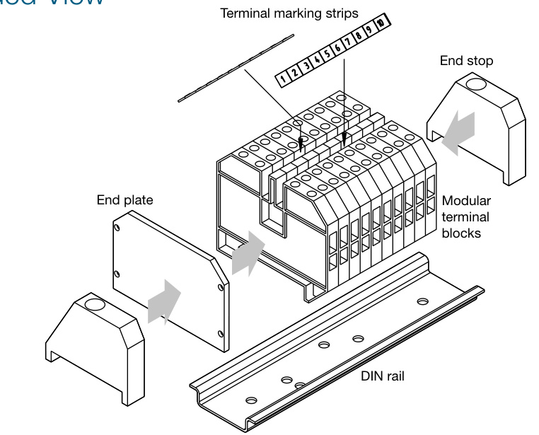
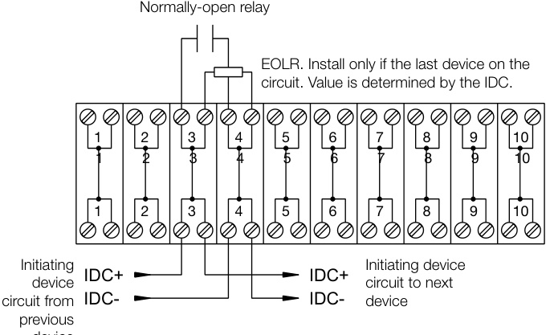

# Terminal Block Module MN-TK10  

# Description  

The heavy-duty EDWARDS MN-TK10 Terminal Block Module pro-vides multiple high-current-capable terminals for power distribution and/or connection to initiating device circuits where each wire/ device must have its own terminal.  

Each pole of the MN-TK10 is rated 35 Amperes at up to 600 volts. Each terminal can accommodate a copper (stranded or solid) conductor from 10 AWG down to 22 AWG (6.0 to $1.0\:\mathsf{m m}^{2},$ ).  

The easy-to-assemble kit can be mounted in any listed EDWARDS enclosure.  To make installation easier, the mounting bracket has hole patterns that line up with the mounting bosses in APS and BPS Series power supplies. The module comes with two durable polymer terminal marking devices that make the terminals easy to identify when the module is installed.  

# Standard Features  

•	 Small form-factor Rugged design High current capacity   
•Wide wire gauge support Easy to install Multiple mounting options  

# Application  

The MN-TK10 is intended to be used as part of the powerful EST3 mass notification solution.  

The MN-TK10 can be used with the MN-FVPN Voice-over-InternetProtocol (VoIP) modules and/or the MN-NETRLY4 Input/Outputmodule. For these applications, the relays from the MN-FVPN or MN-NETLRY4 can be easily wired to an Initiating Device Circuit from a system, thereby providing separate terminals for each wire and device. Conversely, if multiple contacts are desired to operate an IDC to an MN-FVPN or MN-NETLY4, they can be connected to the MN-TK10.  

The MN-TK10 can also be used to distribute AC or DC power where required.  

# Exploded View  

  

# Typical Wiring  

  

# Specifications  

<html><body><table><tr><td>Contactrating</td><td>35Aat600V</td></tr><tr><td>Wiresize</td><td>10 to22AWG(1.0 to6.0mm2)</td></tr><tr><td>Compatibleelectricalbox</td><td>ListedEDWARDSenclosure</td></tr><tr><td>Operatingenvironment</td><td></td></tr><tr><td>Temperature</td><td>32to120°F(0 to49°C)</td></tr><tr><td>Relativehumidity</td><td>0to93%noncondensing</td></tr></table></body></html>  

# Ordering Information  

<html><body><table><tr><td>CatalogNumber</td><td>Description</td></tr><tr><td>MN-TK1O</td><td>10 Position, 4 Pole Terminal Strip Kit</td></tr></table></body></html>  

Related Equipment   

<html><body><table><tr><td></td><td></td></tr><tr><td>APS6A</td><td>6.5AmpAuxiliaryPowerSupply</td></tr><tr><td>APS10A</td><td>10AmpAuxiliaryPowerSupply</td></tr><tr><td>BPS6A</td><td>6.5AmpBoosterPowerSupply</td></tr><tr><td>BPS10A</td><td>10AmpBoosterPowerSupply</td></tr><tr><td>MN-FVPN</td><td>MN-FVPNVolPEncoder/Decoder.</td></tr><tr><td>MN-NETLRY4</td><td>EthernetcontrollablemultiI/Ounit,4input4relayoutputs</td></tr></table></body></html>  