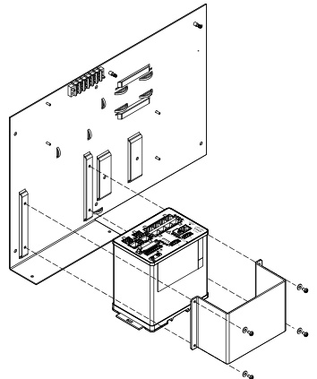
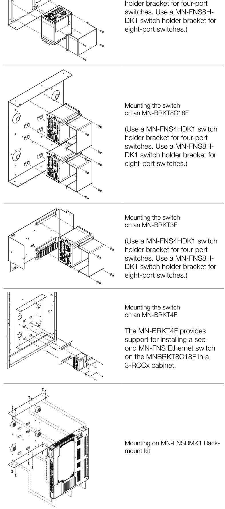
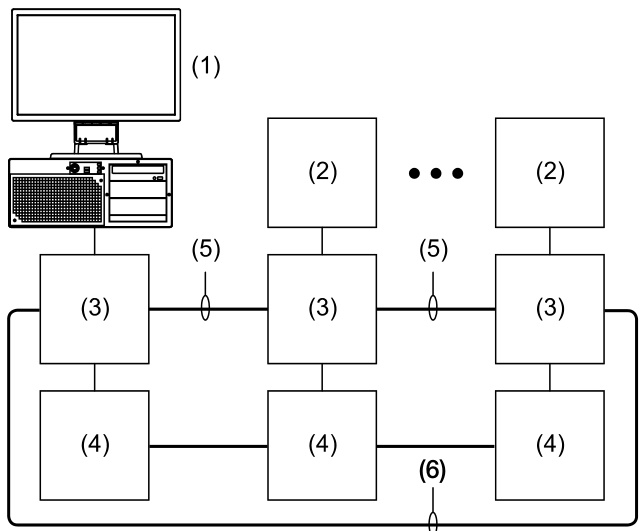
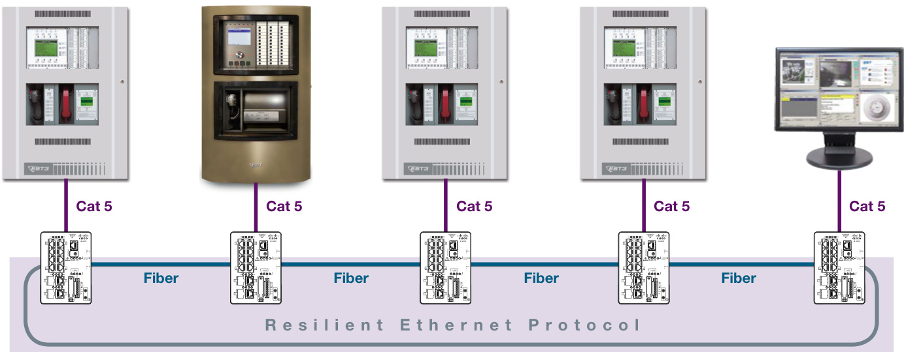
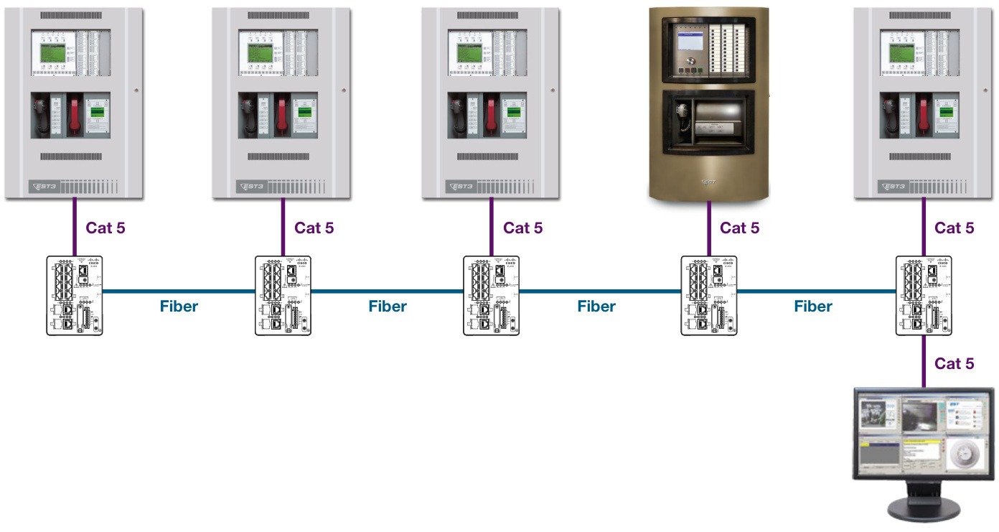

# Managed Ethernet Switches MN-FNS Series  

# Description  

The MN-FNS Series managed Ethernet switches from EDWARDS are advanced managed switch solutions and accessories that provide for a fully scalable Ethernet network to support virtually any mass notification or life safety application. These networks may be dedicated for use by ECS/MNS/LSS systems or where permitted, may be part of a non-dedicated facility network.  

UL Listed and supervised Ethernet connections between the EDWARDS FireWorks Computer Platforms, MN-FVPN Voice Over Inter-net Protocol Modules, MN-NETRLY4 Ethernet Input/Output Modules,MN-COM1S Ethernet/RS232 Communication Module, EST3, EST3X and other EDWARDS panels and panel networks can now be done over single-mode and/or multimode fiber optic cable. MN-FNS Ether-net switches may be interconnected to build spoke format networks, as well as Class B, Class X, Mesh, and Hybrid systems.  

MN-FNS Series Ethernet switches are powered by Cisco® Technologies and are listed to UL 864 and ULC S527. They provide powerful, flexible, and scalable interfaces to fiber optic networks, and are easy to install and configure. Models are available in single and dual inputs for 24 VDC filtered/regulated and 100-250 VAC.  

The MN-FNS4C2F3 switch has four copper RJ45 10/100 ports and two 10/100/1000 fiber optic ports. The MN-FNS8C2F3 switch has eight copper RJ45 10/100 ports and two 10/100/1000 fiber optic ports. The MN-FNS8C18F2 switch has eight copper RJ45 10/100 ports, 16 10/100 fiber optic ports and two 10/100/1000 fiber optic ports.  

Thanks to the exclusive Cisco Resilient Ethernet Protocol, all MN-FNS switches feature ultra-fast communications, as well as seamless redundant data path capabilities. The MN-FNS Series supports sophisticated encryption algorithms and offers extensive diagnostics and trouble-shooting tools.  

# Standard Features  

•	 UL 864 and ULC S527 listed   
•	 Powered by Cisco  Technologies   
•	 For use with spoke format networks, as well as Class B, Class X, Mesh, and Hybrid systems   
•	 Exclusive Resilient Ethernet Protocol for ultra-fast communications and seamless redundant path capability   
•	 Dual power input options   
•	 Browser or command-line setup   
•	 Network Assistant utility simplifies system maintenance Hot-swappable Small Fiber Package Modules accommodate multimode, single-mode, or mixed-mode networks   
•	 Fanless operation   
•	 Compact footprints   
•	 Can be mounted in EST3 cabinets  

# Application  

MN-FNS switches offer browser-based setup and support command line configuration. They are compatible with the powerful Cisco Network Assistant utility, which simplifies network maintenance and control. Diagnostic LEDs facilitate at-a-glance network and switch status.  

All switches use hot-swappable Small Form-Factor Pluggable (SFP) fiber optic cable transceiver modules that allow the system designer to choose the fiber optic media required by the network. These compact input/output devices make it easy to accommodate multimode, single-mode, or mixed-fiber networks. You can come into a switch with multimode fiber and leave on single-mode fiber or come in on standard power single-mode fiber and leave on high-power single-mode – all as required by the application.  

MN-FNS Series switches feature fanless operation and compact footprints that offer efficient mounting options while requiring minimal use of cabinet space. Switches may be mounted in EST3 family cabinets such as the 3-RCC and 3-CAB series. The MN-FNS4C2F3 and MN-FNS8C2F3 may also be installed in an APS6A enclosure, while the MN-FNS8C18F2 may be rack-mounted or installed in EST3 cabinets.  

Compliance and Features   

<html><body><table><tr><td></td><td>MN-FNS4C2F3</td><td>MN-FNS8C2F3</td><td>MN-FNS8C2F2</td></tr><tr><td>UL 864</td><td></td><td>√</td><td>√</td></tr><tr><td>ULC S527</td><td>√</td><td>√</td><td></td></tr><tr><td>UL/CSA 60950-1</td><td></td><td>√</td><td></td></tr><tr><td>UL 508</td><td></td><td>√</td><td></td></tr><tr><td>CSA C22.2 No. 142</td><td></td><td></td><td></td></tr><tr><td>EN 60950-1</td><td></td><td>√</td><td>√</td></tr><tr><td>CE Marking</td><td></td><td></td><td></td></tr><tr><td>Class 1, Div 2 A-D</td><td></td><td></td><td></td></tr><tr><td>FCC Class A</td><td></td><td></td><td></td></tr><tr><td>EN 55022A Class A</td><td></td><td></td><td>√</td></tr><tr><td>VCCI Class A</td><td></td><td></td><td></td></tr><tr><td>RoHS Compliance</td><td></td><td></td><td></td></tr><tr><td>C-Tick (Australia)</td><td></td><td></td><td></td></tr><tr><td>Russia certification</td><td></td><td></td><td></td></tr><tr><td>Brazil certification</td><td>√</td><td></td><td></td></tr><tr><td>IEC Shock & Vibration</td><td>√</td><td>√</td><td>√</td></tr><tr><td>RJ45 Ports</td><td>4</td><td>8</td><td>8</td></tr><tr><td>10/100 Fiber Ports</td><td>0</td><td>0</td><td>16</td></tr><tr><td>Gigabit Ports</td><td>2</td><td>2</td><td>2</td></tr><tr><td>LAN BASE OS</td><td></td><td></td><td>√</td></tr></table></body></html>  

# Mounting  

(Use a MN-FNS4HDK1 switch  

Mounting the switch on an MN-BRKT1F  

  

  

# Typical Network Configuration  

  

1. FireWorks workstation   
2. EST3(X) life safety network (up to 64 cabinets per network)   
3. MN-FNS Ethernet switch   
4. UL/ULC Listed 24 VDC power supervision relay and trouble   
signal initiating device circuit   
5. Class B communication link   
6. Class X redundant communication link  

# Dedicated Class X  

  

# Dedicated Class B  

  

MN-FNS8C2F3  

<html><body><table><tr><td colspan="2">Input Power</td></tr><tr><td>Voltage</td><td>24 VDC, nominal</td></tr><tr><td>Current</td><td>2 A,max.</td></tr><tr><td>FastEthernetports</td><td></td></tr><tr><td>Quantity</td><td>8</td></tr><tr><td>Signaling/data rate</td><td>10BaseT/10 Mbps 100BaseTX/100 Mbps</td></tr><tr><td>Cabling type</td><td>RJ-45, Category 5e or better</td></tr><tr><td>GigabitEthernet ports</td><td></td></tr><tr><td>Quantity</td><td>2 (combination RJ-45/SFP)</td></tr><tr><td>Signaling/data rate</td><td></td></tr><tr><td>RJ-45 port</td><td>10BaseT/10 Mbps 100BaseTX/100 Mbps</td></tr><tr><td>SFP port</td><td>1000BaseTX/1000Mbps Varies with SFP module</td></tr><tr><td>Cabling type</td><td></td></tr><tr><td>RJ-45 port</td><td></td></tr><tr><td>SFP port</td><td>RJ-45, Category 5e or better VarieswithSFPmodule</td></tr><tr><td></td><td></td></tr><tr><td>Relay outputs Quantity</td><td></td></tr><tr><td>Type</td><td>1</td></tr><tr><td>Style</td><td>Common trouble Form C</td></tr><tr><td>Contact rating</td><td>1.0 A at 24 VDC</td></tr><tr><td>Wire size</td><td></td></tr><tr><td>Ground</td><td>10 to 12 AWG (4.0 to 6.0 mm2)</td></tr><tr><td>DC-A and DC-B</td><td>18 AWG (1.0 mm2) twisted-pair</td></tr><tr><td>Relay</td><td>18 AWG (1.0 mm2) twisted-pair</td></tr><tr><td>Dimensions</td><td>5.10 × 3.60 × 5.26 in.</td></tr><tr><td>Weight</td><td>(12.95 x 9.14 x 13.36 cm) 2.75 Ibs. (1.25 kg)</td></tr><tr><td>Compatible enclosures</td><td>3-CAB21,3-CAB14,3-CAB7, 3-RCCx cabinets,and APS6x cabinets [1]</td></tr></table></body></html>

[1] When installed in an $\mathsf{A P S6x}$ power supply cabinet, you cannot use the APS6x to power any equipment outside the cabinet.  

The MN-FNS8C18F2 Switch comes with the standard Cisco Layer 2 LAN BASE image.  This switch can be upgraded at any time to the Cisco IP Services image by ordering and loading the MN-FNS8C18F2UK3 upgrade kit.  

MN-FNS8C18F(2)  

<html><body><table><tr><td></td></tr><tr><td>Input power</td></tr><tr><td>MN-FNS8C18FAC 120-240 V, 60/50 Hz,2A[2]</td></tr><tr><td>MN-FNS8C18FDC 18-33VDC,2A</td></tr><tr><td>Wiresize</td></tr><tr><td>MN-FNS8C18FAC 10 to 14 AWG (2.5 to 6.0 mm2) MN-FNS8C18FDC</td></tr><tr><td>FastEthernetRJ-45ports</td></tr><tr><td>Quantity 8</td></tr><tr><td>10BaseT/10 Mbps Signaling/datarate 100BaseTX/100Mbps</td></tr><tr><td>Cabling type RJ-45,Cat5eorbetter</td></tr><tr><td>FastEthernetSFPports</td></tr><tr><td>Quantity 16</td></tr><tr><td>10BaseT/10Mbps Signaling / data rate 100BaseTX/ 100Mbps</td></tr><tr><td>Cabling type Fiber-optic</td></tr></table></body></html>  

MN-FNS4C2F3  

<html><body><table><tr><td>Input Power</td></tr><tr><td>Voltage 24 VDC, nominal</td></tr><tr><td>Current 2 A, max.</td></tr><tr><td>Fast Ethernet ports</td></tr><tr><td>Quantity 4</td></tr><tr><td>10BaseT/10 Mbps Signaling / data rate</td></tr><tr><td>100BaseTX/100Mbps</td></tr><tr><td>Cabling type RJ-45,Category5e orbetter</td></tr><tr><td>GigabitEthernet ports</td></tr><tr><td>Quantity 2</td></tr><tr><td>Signaling / data rate VarieswithSFPmodule</td></tr><tr><td>Cabling type Varies with SFP module</td></tr><tr><td>Relay outputs</td></tr><tr><td>Quantity 1</td></tr><tr><td>Type Common trouble</td></tr><tr><td>Style Form C</td></tr><tr><td>Contact rating 1.0 A at 24 VDC</td></tr><tr><td>Wire size</td></tr><tr><td>Ground 10 to 12 AWG (4.0 to 6.0 mm2)</td></tr><tr><td>DC-A and DC-B 18AWG(1.0mm2)twisted-pair</td></tr><tr><td>Relay 18 AWG (1.0 mm2) twisted-pair</td></tr><tr><td>5.10 × 2.95 x 4.51 in. Dimensions (12.95×7.50× 11.46 cm)</td></tr><tr><td>Weight 2.45 Ibs. (1.11 kg)</td></tr><tr><td>3-CAB21,3-CAB14,3-CAB7, Compatible enclosures 3-RCCxcabinets,andAPS6x cabinets [1]</td></tr><tr><td>Operating environment</td></tr><tr><td>Temperature 32 to 120F (0 to 49°C)</td></tr><tr><td>Relative Humidity 0 to 93% noncondensing</td></tr><tr><td>[1] When installed in an APS6x power supply cabinet, you cannot use the APS6x</td></tr></table></body></html>

to power any equipment outside the cabinet.  

<html><body><table><tr><td>GigabitEthernetports</td><td></td></tr><tr><td>Quantity</td><td>2</td></tr><tr><td>Relay outputs</td><td></td></tr><tr><td>Quantity</td><td>1</td></tr><tr><td>Type</td><td>Common trouble</td></tr><tr><td>Style</td><td>Form C</td></tr><tr><td>Contact rating</td><td>1.0Aat24VDC</td></tr><tr><td>Dimensions (H × W × D)</td><td>1.75 × 17.5 × 14.0 in, (4.45 ×44.5×35.6 cm)</td></tr><tr><td>Weight</td><td>10 Ib (4.5 kg) withoutpowersupplymodules</td></tr><tr><td>Compatible enclosures</td><td>3-CAB21,3-CAB14,3-CAB7,and 3-RCCx cabinets [1]</td></tr><tr><td>Operatingenvironment</td><td></td></tr><tr><td>Temperature</td><td>32to120°F(0to49°C)</td></tr><tr><td>RelativeHumidity</td><td>0 to 93% noncondensing</td></tr><tr><td>[1] You cannot install any other electronics in the same cabinet as the switch. [2]From aUL1481Listeduninterruptiblepowersupply</td><td></td></tr></table></body></html>  

Cabling   

<html><body><table><tr><td>SFPmodule</td><td>Wavelength (nm)</td><td>Fibertype</td><td>Coresize (microns) [1]</td><td>Modalbandwidth (Mhz/km)</td><td>Cabledistance</td></tr><tr><td>MN-FNSFEMM2K</td><td>1310</td><td>MMF</td><td>62.5 62.5 50</td><td>160(FDDl-grade) 200 (OM1) 400 (400/400)</td><td>1.24 mi. (2 km)</td></tr><tr><td></td><td></td><td></td><td>50</td><td>500(OM2)</td><td></td></tr><tr><td>MN-FNSFEDSM1OK MN-FNSGBDSM7OK</td><td>1310 1550</td><td>SMF SMF</td><td>G.652 G.652</td><td></td><td>6.2 mi. (10 km) 43.4 mi. (70 km)</td></tr></table></body></html>

[1] G.652, listed under core size for single mode fiber (SMF), refers to a ITU-T standard of commonly deployed non-dispersion-shifted single mode fiber with a core size of approximately 8 to 10 microns (µm).  

Optical   

<html><body><table><tr><td>Model</td><td>Transceivertype</td><td>Transmitpower (dBm)</td><td>Min</td><td>Receivepower (dBm)</td><td>Maxchannel insertionlossindB</td><td>Transmitandreceive wavelength (nm)</td></tr><tr><td>MN-FNSFEMM2K</td><td>100Base-FX,1310nmMMF</td><td>Max -14</td><td>Max -20 -14</td><td>Min -31</td><td>(by fiber type) 10</td><td>1270 to1380</td></tr><tr><td>MN-FNSFEDSM1OK</td><td>100Base-LX,1310nmSMF</td><td>-8</td><td>-15 -8</td><td>-28</td><td>10</td><td>1260 to 1360</td></tr><tr><td>MN-FNSGBDSM7OK</td><td>1000Base-ZX,1550nmSMF</td><td>+5</td><td>0 -3</td><td>-23</td><td>20 (any SMF)</td><td>1500 to1580</td></tr><tr><td>MN-FNSGBDSM10K</td><td>1000BASE-LX/LH,1310 nm SMF</td><td>-3</td><td>-9.5 -3</td><td>-20</td><td>5 (G.652 SMF)</td><td>1260 to1355</td></tr><tr><td>MN-FNSGBDSMDR</td><td>1000BASEDWDMCH41SMF</td><td>+4</td><td>0 -9</td><td>-28</td><td>25 (G.652 SMF)</td><td>1544.43 to 1544.63</td></tr><tr><td>MN- FNSGBSSM10KD</td><td>1000BASE-BX-D,1490nmSMF</td><td>-3</td><td>-9 -3</td><td>-19.5</td><td>5 (G.652SMF)</td><td>1480to1500(transmit) 1260 to 1360 (receive)</td></tr><tr><td>MN- FNSGBSSM1OKU</td><td>1000BASE-BX-U,1310nmSMF</td><td>-3</td><td>6- -3</td><td>-19.5</td><td>5(G.652SMF)</td><td>1260 to 1360 (transmit) 1480 to 1500 (receive)</td></tr></table></body></html>

[1] Maximum channel insertion loss is defined for maximum distance guaranteed as specified above and by fiber type. When links are deployed over shorter distances, additional channel insertion loss may be allowed.  

# Ordering Information  

<html><body><table><tr><td colspan="2">EthernetSwitches&Power Supplies</td></tr><tr><td>MN-FNS4C2F3</td><td>4FastEthernet(RJ45),2GBSFP,Layer3Lite.24VDC.</td></tr><tr><td>MN-FNS8C18F2</td><td>MN-FNS8C18F2 100-250 VAC (50 or 60 Hz) or 100-250 VDC power supply module, primary or backup. Requires MN-TK10</td></tr><tr><td>MN-FNS8C18FAC</td><td>terminalstripandanMN-TP1201P(for120V)orMN-TP230-E(for230V)transientprotector,whichareorderedseparately.</td></tr><tr><td>MN-FNS8C18FDC</td><td></td></tr><tr><td>MN-FNS8C2F3</td><td>8FastEthernet(RJ45),2GBComboSFP/RJ45,Layer3Lite.24VDC.</td></tr></table></body></html>  

Ethernet Switch Mounting Hardware   

<html><body><table><tr><td>MN-BRKT1E</td><td>MN-FVPN,MN-ABPM,MN-PASM2,MN-COM1S,MN-NETRLY4 and/orMN-FNS(4)(8)SeriesSwitchmounting bracketfor EST3enclosures</td></tr><tr><td>MN-BRKT3F</td><td>MN-FVPN,MN-COM1Sand/orMN-MN-FNS(4)(8)SeriesswitchmountingbracketforAPS6A/10ASeriespowersupplies</td></tr><tr><td>MN-BRKT8C18F</td><td></td></tr><tr><td>MN-FNSRMK1</td><td>MN-FNS8C18FSeriesswitchinstallationkit.UsedwithMN-BRKT8C18For19"rackmounting.</td></tr><tr><td>MN-FNS4HDK1</td><td>MN-FNS4Seriesswitchholderbracket.UsedwithMN-BRKTSeries.Onerequiredperswitch.</td></tr><tr><td>MN-FNS8HDK1</td><td>MN-FNS8Seriesswitchholderbracket.UsedwithMN-BRKTSeries.Onerequiredperswitch.</td></tr></table></body></html>  

SFP   

<html><body><table><tr><td>MN-FNSFEDSM1OK</td><td>SFP.Singlemodefiber,Dualfilament,LCConnectors,FE，Omto10km，10dBfiberbudget，131Onm</td></tr><tr><td>MN-FNSFEMM2K</td><td>SFP.Multimodefiber,Dualfilament,LCConnectors，FE,Omto2km，10dBfiberbudget,1310nm</td></tr><tr><td>MN-FNSGBDSM7OK</td><td>SFP.Singlemodefiber,Dualfilament,LCConnectors,GB，10mto70km,20dBfiberbudget,1550nm</td></tr><tr><td>MN-FNSGBDSM1OK</td><td>SFP.Single mode fiber,Dualfilament,LC Connectors,GB,550mto10km,5dB fiberbudget,1310nm.Canonlybeused in</td></tr><tr><td>MN-FNSGBDSMDR-41</td><td>GBports 25dBfiberbudget.1544.43nm.CanonlybeusedinGBports</td></tr><tr><td>MN-FNSGBSSM1OKD</td><td></td></tr><tr><td>MN-FNSGBSSM1OKU</td><td>SFP.Non-hardened,Singlemodefiber,Singlefilament,LCConnectors,GB,Omto10km,5dBfiberbudget,1310nm,Must beusedinpairwithMN-FNSGBSSM1OKR.CanonlybeusedinGBports</td></tr></table></body></html>  

<html><body><table><tr><td colspan="2">Accessories</td></tr><tr><td>APS6A</td><td>Auxiliary/BoosterPower Supply, 6.5A total, Expanded cabinet, 26a/h capacity，115VAC</td></tr><tr><td>MN-FNSCABSD1</td><td>BlankSDcardthatcanbePCformattedtobeusedwithMN- FNS4C2F3orMN-FNS8C2F3Ethernetswitches</td></tr><tr><td>MN-FNSLC2STMM1</td><td>62.5micronmultimodeduplexfibercableLCmaleconnectorsonone endtoSTmaleconnectorsontheother.</td></tr><tr><td>MN-FNSRCKSD1</td><td>Ethernetswitches</td></tr><tr><td>MN-FNSST2STCON1</td><td>STtoSTbarrelconnector</td></tr><tr><td>MN-TK10</td><td>10Position,4poleterminalkitforusewithMN-NETRLY4orMN-FVPN</td></tr><tr><td>MN-TP1201P</td><td>TPSeries12oVAClinetransientprotectormodule</td></tr><tr><td>MN-TP24STD</td><td>TPSeries24Vcircuittransientprotectormodule</td></tr><tr><td>MN-TPBLK1</td><td>TPSeriesSinglecircuitbreakerlockoutkit</td></tr><tr><td>MN-TPRJ45STD</td><td>TPSeriesRJ45transientprotectormodule</td></tr><tr><td>MN-FNS8C18F2UK3</td><td>MN-FNS8C18FL2toLayer3Upgradekit</td></tr></table></body></html>  