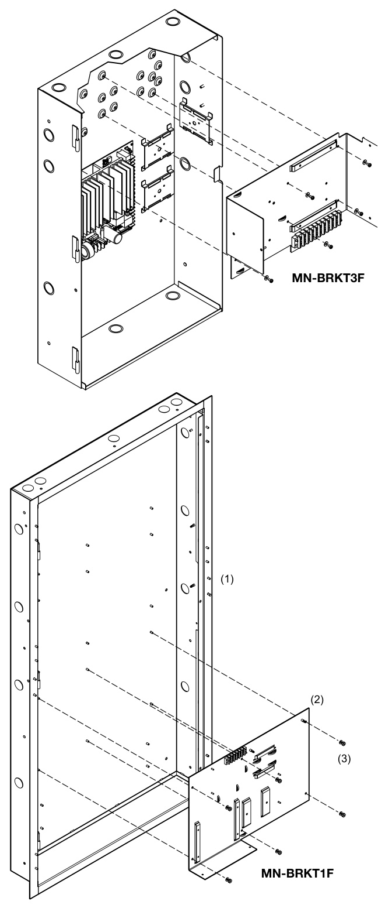

# TCP/IP to RS-232 interface MN-COM1S  

# Overview  

The MN-COM1S is a TCP/IP to RS-232 interface with one RJ-45 port and one RS-232 port. It is used in mass notification settings to connect a FireWorks workstation to an EST3 control panel.  

The MN-COM1S mounts on an MN-BRKT1F or an MN-BRKT3Fbracket. These install inside the EST3 control panel or Auxiliary Power Supply for a neat and self-contained mass notification solution.  

# Standard Features  

Connect a FireWorks workstation to an EST3 control panel.   
RS-232 Serial port for connection to 3-CPU3   
•One RJ-45 port   
•One RS-232 port   
•	 Browser-based setup and configuration  

# Mounting  

The MN-COM1S mounts on an MN-BRKT1F or an MN-BRKT3Fbracket. These install inside the EST3 control panel or Auxiliary Power Supply for a neat and self-contained mass notification solution.  

  
MN-BRKT3F  

# MN-BRKT1F  

  

# Component Layout Compatible Control Panel  

  

  

# FCC compliance  

This equipment has been tested and found to comply with the limits for a Class A digital device, pursuant to part 15 of the FCC Rules. These limits are designed to provide reasonable protection against harmful interference when the equipment is operated in a commercial environment. This equipment generates, uses, and can radiate radio frequency energy and, if not installed and used in accordance with the instruction manual, may cause harmful interference to radio communications. Operation of this equipment in a residential area is likely to cause harmful interference in which case the user will be required to correct the interference at his own expense.  

# Specifications  

<html><body><table><tr><td>Voltage</td><td>18to28VDC</td></tr><tr><td>Current</td><td>60 mA</td></tr><tr><td>Dimensions</td><td>(W× H× D) 2.5 × 0.9 × 3.5 in.(6.4× 2.3 × 9.0 cm)</td></tr><tr><td>Serialinterface</td><td>RS-232C</td></tr><tr><td>NetworkInterface</td><td></td></tr><tr><td>Connector</td><td>RJ-45</td></tr><tr><td>Cable type</td><td>Category5,min.</td></tr><tr><td>Other</td><td>10/100Mbps,TCP/IP,autonegotiating</td></tr><tr><td>Operatingenvironment</td><td></td></tr><tr><td>Temperature Humidity</td><td>32to120°F(0to49°C) 0to93%RH,noncondensing at90°F(32°C)</td></tr></table></body></html>  

# Ordering Information  

MN-COM1S UL 864 Listed FireWorks Communications Ethernet Port, Command & Control.  Comes with power and RS232 data cables.  

Related Equipment   

<html><body><table><tr><td>MN-BRKT1F</td><td>MN-FVPmountingbracketforEST3enclosures</td></tr><tr><td>MN-BRKT3F</td><td>MN-FVPmountingbracketforAPS-(6)(10)Apowersupplies</td></tr><tr><td>FW-NCCA4</td><td>EthernetcableconduitconnectorassemblyforUL4computer</td></tr><tr><td>MN-FVPN</td><td>FireVolP encoder/decoder, includespower and audio cables</td></tr><tr><td>MN-PASM2</td><td></td></tr><tr><td>SIGA-RM1/MRM1</td><td>RiserSupervisionModule</td></tr><tr><td>MN-ABPM</td><td>AudioBridge(Panelmount3-ATPiNT)</td></tr></table></body></html>  