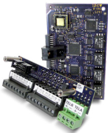
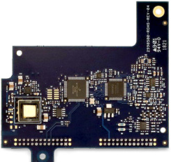
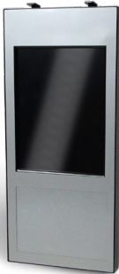
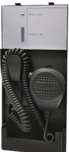
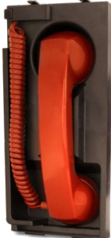
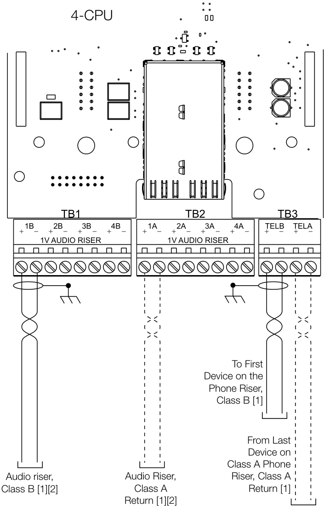

# EST4 Audio Units and Interfaces 4-MIC, 4-FT, 4-LCDAUDTEL  

# Overview  

Nothing connects with building occupants better than spoken words, and EST4’s highly intelligible voice audio ensures that those words are heard loud and clear. This high-fidelity messaging, across EST4’s impressive capacity of 200 channels, provides the flexibility needed to get messages out clearly and concisely.  

EST4’s voice audio function is built modularly from a collection of components finely tuned to the needs of small and large facilities alike. System designers can specify an ideal voice audio system by pinpointing the right components for the project, and selecting only equipment needed to get the job done. All audio components are standard modules that fit together easily. Each is an integrated part of EST4, allowing the use of the same cabinets, power supplies, and even network cabling as other EST4 components.  

EST4 microphones and telephone handsets, along with their controllers, are used to create Notification Control Areas (NCAs) that can contain one or more Command Centers. EST4 allows both mass notification and emergency communications to be addressed, delivering live paging and pre-recorded messaging where its needed. EST4 supports configurations with Central Control Stations (CCSs), Autonomous Control Units (ACUs), and Local Operations Consoles (LOCs). Together, these options provide the opportunity to find an efficient yet economical Emergency Communications audio solution for any size installation.  

# Standard Features  

Annunciator or Cabinet Mounting   
One SKU for mounting in any cabinet configuration.   
Paging Priority Automatically Set   
Ensures highest priority paging location has control.   
Color Touch-screen Audio Interface   
LCD touch-screen interface for paging circuit selection.   
Customizable Switch Modules, Multi-color LEDs   
Tactile and visual feedback with printable slide-in labels.   
200 Audio Channels per Network   
100 Channels per Notification Control Area (NCA). Eight   
channels for audio source selection.   
Use Twisted Copper Wires or Fiber Optic Cables for Audio Network data, audio and firefighter telephone are transmitted on the same cables, helping reduce installation cost and complexity. Listed for Mass Notification   
Listed to UL2572 as CCS or ACU or LOC.   
Supports Low Frequency Signaling in Sleeping Areas Auxiliary inputs, telephone interface   
Auxiliary inputs allow other audio systems to be interconnected Digital Transmission of Audio Signals   
Greater noise immunity, high quality signal transmission.   
On-Board Storage of Programmed Messages and Tones Distributed storage helps overcome a single point of failure. Optional LCD Display of Fire Phone Calls   
Optional Earthquake Hardening   
OSHPD seismic pre-approval for Component Importance Factor 1.5.  

# Application  

EST4 integrated audio is a modular group of components that install in standard fire alarm cabinet assemblies. The Audio Command Center, which holds audio control equipment, provides an emergency user interface for live and recorded paging, and optionally, a firefighters’ master telephone or microphone. Zoned amplifiers mount in the main control panel or in remote cabinets, allowing distribution of the system, reducing the need to home run speaker wiring. Remote cabinets are easy to install because only a single twisted pair is required between cabinets, carrying not only audio, but network data and firefighters’ telephone audio as well.  

EST4 goes beyond standard emergency systems, ensuring that audio can provide the resources needed to cover the applications of even the largest and complex life safety applications. EST4 supports connection of local and network microphones, multiple telephone voice lines, and Mass Notification audio. It also expands the potential of these capabilities with 200 audio voice channels – an industry first. In fact, up to 100 audio channels per NCA support any combination of eight channels at the panel. These 100 channels for Paging, Alert, Evacuation signalling and automatic messages are delivered simultaneously to the parts of a building or buildings that need the information.  

# Efficient deployment  

EST4 supports high fidelity digital audio, providing intelligibility that is not compromised at any point in the system. A dramatically simplified interconnect architecture handles up to 100 audio channels per NCA, and audio data can be transmitted over the same inter-panel cabling as other EST4 data. This means that paging, firefighters’ telephone, and panel data can all share the same cable – significantly reducing project material expenses and installation labor costs for new installations and allowing audio to be added to many retrofit applications without the need of additional cables.  

EST4 audio applications benefit from the inherent reliability and performance of zoned amplifiers, along with simplified user interface options, network interconnection flexibility, and several layers of survivability. All this combines to provide a flexible, cost-effective, and reliable audio solution.  

# Effective Control  

The 4-LCDAUDTEL LCD module provides a dedicated color touchscreen user interface option for selecting page circuits, and placing and receiving calls over the Firefighter Telephone Handset. The LCD module mounts to the inner door of cabinets or annunciators.  

LED-Switch Modules may be used exclusively for audio control, or used in conjunction with the LCD user interface. These modules offer convenient slide-in strips for custom and color-coded labeling. Switch modules provide both tactile and visual feedback when a switch selection is made, offering instant verification that the command has been received by the system.  

The 4-MIC Microphone assembly works with LED-Switch modules and the LCD touch-screen user interface. It also comes standard with a VU volume level that shows the signal level provided by the microphone during the page process.  

# Survivable Distributed Audio  

EST4’s true distributed audio ensures the survivability of emergency messaging functions even in the face of catastrophic events. All pre-recorded messages are stored at the control panel, and programmed audio channel selection is made locally as well. This means that programmed messages will become active when a locally generated alarm is initiated — even if a network failure has occurred. Zoned amplifiers also have integrated 1000 Hz temporal tone generators that will produce a backup signal should the control panel CPU go offline. For additional system redundancy, a single standby amplifier can back up any zoned amplifier installed in the same cabinet.  

Network wiring can also be configured in several ways to bolster the survivability of live paging and event notification throughout the network. These layers of redundancy provide audio system survivability that keeps life safety measures in place. There is no need to rely on network data transmissions of pre-recorded messaging. The panel always plays the message for events based on the event. This ensures fast selection and reliable playback even under the harshest conditions.  

# Uncomplicated Plug-and-Play Configuration  

Adding a microphone or firefighters’ telephone at any EST4 control panel is as easy as plugging in a module. The 4-AUDTELS and 4-ANNAUDTEL interface modules mount to the back of the 4-CPU main processor unit or to a 4-ANNCPU annunciator CPU. The interface modules accept connections from locally-mounted microphones or telephones. Pre-recorded messages are stored at each panel that have zone amplifiers so there is no need to have a microphone or telephone at every panel. Nonetheless, EST4 does support multiple paging microphone masters and fire fighter telephone masters with programmable request-grant-deny function. This ensures that messaging is provided by those in control of the system.  

# Audio Components  

# 4-AUDTELS Audio-Telephone Interface Module  

The 4-AUDTELS enables and processes information from connected microphone or telephone units mounted directly to the right of the CPU. The 4-AUDTELS also provides audio input-output, and is the source for a telephone riser that supports remote handsets and up to four line-level balanced audio input/output connections are available.  

The four balanced audio connections can be individually programmed as inputs or outputs, each rated for 1 Vrms nominal signal level. Multiple 4-AUDTELS may be installed in an EST4 network, providing support for multiple telephone riser applications and multiple low-level audio inputs/ outputs.  

# 4-ANNAUDTEL Annunciator, Audio, and Telephone Interface Module  

The 4-ANNAUDTEL mounts to the top of the 4-ANNCPU. The 4-ANNAUDTEL enables and processes information from connected microphone or telephone units. The module mounts in remote annunciators as well as in lobby cabinets.  

  

  

# 4-LCDAUDTEL LCD Display Module for Audio and Telephone Control  

The optional 4-LCDAUDTEL LCD module provides a dedicated color touch-screen user interface for selecting page circuits and for placing and receiving calls over the Firefighters’ Telephone Handset. The LCD module mounts to the inner door of cabinets or annunciators. The interface does not have common control push buttons. The 4-LCDAUDTEL touch screen LCD may be used as the only method of making audio and telephone selections, or it may be used in combination with LED-Switch modules.  

For a complete list of LCD options please see the Ordering Information table.  

# 4-MIC - Paging Microphone  

The 4-MIC paging microphone mounts to the inner door of cabinets and annunciators, taking only two spaces. The 4-MIC is easy to use. It provides a hand-held microphone with push-to-talk switch and a multi-color amber-green-red volume meter on the assembly. The 4-MIC can be used for general alarm paging. Where no zoning is needed, simply pick up the mic, press the push-to-talk switch, and make the page to the entire system. Use an LED-Switch Module or 4-LCDAUDTEL color touch-screen interface where zoning or specific messaging operations are needed.  

  

  

# 4-FT - Firefighter Master Handset  

The 4-FT firefighter master handset mounts to the inner door of cabinets and annunciators, taking only two spaces. The 4-FT is used in conjunction with the 4-AUDTELS or 4-ANNAUDTEL interface modules. The 4-AUDTELS provides a firefighter telephone riser connection for remote warden stations. Telephone call-in selection may be annunciated at the control center via standard EST4 LED-Switch modules or the 4-LCDAUDTEL color touch-screen. Where multiple command centers are deployed, EST4 easily configures for request-grant-deny operation, ensuring that one command center is in control at one time, but allowing for changes in control if required.  

  

# Assembly  

The 4-LCDAUDTEL, 4-FT, and 4-MIC modules each occupy two slots on the  

To install the audio units, insert the tabs at the bottom of the module into the  

For a more secure installation, install two $4{-}40\times7/16$ screws from the back side of the UI frame assembly into the standoffs on the back side of the module.  

# Engineering Specification  

Provide emergency audio as part of the main fire alarm control panel. The emergency audio shall contain a paging microphone, pre-recorded messages <fire fighter telephone> and zoned amplifiers capable of delivering multi-channel audio messages. The system shall support a minimum of 100 audio channels. Transmission of audio shall be over the same data network wiring as the fire panel data. The network shall be over a dedicated <single copper pair> <dual multimode fibers>, <dual Single mode fibers><one single mode fiber> to remote parts of the facility.  

For systems requiring multiple locations for paging, the ability to Request/Grant/Deny page privileges shall be supported. Priorities shall be configured in software covering projects operational priorities between Autonomous Control Units (ACU), Central Control Station (CCS) and Local Operators Consoles (LOCs).  

Each panel shall store digitally up to 750 minutes of pre-recorded audio messages as WAV files without the need to add additional memory storage devices. These messages shall be automatically played in various areas of a facility under program control. The system shall have the capacity to store up to 250 individual audio messages. Each audio channel shall support up to 250 individual messages. Each panel shall simultaneously play back any of seven (7) different message channels in addition to a live page message of the 100 available.  

The system must provide operation to 25Vrms or 70.7Vrms speakers. The system must provide as a minimum the following paging common controls and indicators: Ready to page LED, three color VU display shows signal level provided by the  

microphone, single switch function for paging to all — Alert zones, Evacuation zones, and areas not programmed for signaling. The system must provide high quality analog to digital conversion of paging sources. Digital transmission of paging must be provided between system nodes over the same cabling as other system data. The analog sources must be sampled and converted to digital across the network.  

System amplifiers must be distributed zoned type. Centrally banked systems are not acceptable. The circuit must carry a minimum rating of 3.5 Amps for operating 24 Vdc signals.  

The system shall provide fully integrated fire fighters’ telephone system that shall provide two-way communication between the fire alarm control panel and any firefighters’ telephone station. $<<$ Audio and Firefighters’ Telephone shall be installed so that a seismic component Importance Factor of 1.5 is achieved.>> <<The system shall include a dedicated color LCD touch screen user display and controls. When a telephone is activated, a call-in buzzer shall sound, and the location of the phone shall be shown on the LCD display. The display shall be capable of bilingual operation, displaying English, French, Spanish, or Portuguese messages.  

All incoming calls and all connected phones shall be selected by touching the LCD screen. All subsequent telephone call locations shall be displayed in full text. The system shall display all incoming calls, all connected phone(s) on the color LCD display. The system shall be configured so that page messages may be issued from any firefighter’s telephone connected to the system, as directed by the emergency operator.  

  
[1] For Class B risers, install a $15\,\mathsf{k}\Omega$ EOLR at the last device on the riser. Do not install an end-of-line resistor if the riser is wired Class A.  

[2] Audio riser connections can be programmed as inputs or outputs using the 4-CU configuration utility.  

# Technical Specifications  

4-LCDAUDTEL Audio and Firefighter Telephone Control Display   

<html><body><table><tr><td>Current</td><td>Connectedto4-ANNCPU</td></tr><tr><td>Active</td><td>93mA</td></tr><tr><td>Standby</td><td>40mA@20%brightness 18bitcolor.640×480pixels,resistivetouch</td></tr><tr><td>Display</td><td>screen</td></tr><tr><td>AgencyApprovals</td><td>UL,ULC,FM, CSFM Temperature:32 to120°F(0 to49°C) Operatingenvironment RelativeHumidity:0to93%noncondensing</td></tr></table></body></html>  

4-MIC Paging Microphone   

<html><body><table><tr><td>Current Active</td><td>38mA</td></tr><tr><td>Standby</td><td>8mA</td></tr><tr><td>Commoncontrols/ indicators</td><td></td></tr><tr><td>VUmeter</td><td>Represents the signal level from the</td></tr><tr><td></td><td>microphoneinput</td></tr><tr><td>ReadyToPage</td><td>Flashesduringpreannouncement tone, steadywhenreadytopage</td></tr><tr><td>AgencyApprovals</td><td>UL,ULC,FM, CSFM</td></tr><tr><td>Operating environment</td><td>Temperature:32to120°F(0 to49°C) RelativeHumidity:0to93%noncondensing</td></tr></table></body></html>  

4-FT Firefighter Telephone Master Handset   

<html><body><table><tr><td>Current</td><td>Connectedto4-ANNCPU</td></tr><tr><td>Active</td><td>168mA 9mA</td></tr><tr><td>Standby Optionaltelephoneriser</td><td>See4-AUDTELSspecifications.</td></tr><tr><td>AgencyApprovals</td><td>UL, ULC, FM, CSFM</td></tr><tr><td>Operatingenvironment</td><td>Temperature:32to120°F(0to49°C) RelativeHumidity:0to93%noncondensing</td></tr></table></body></html>  

4-AUDTELS Audio and Telephone Interface/Riser Module   

<html><body><table><tr><td colspan="2">Current</td></tr><tr><td>Standby</td><td>85mAat24VDC</td></tr><tr><td>Alarm/active</td><td>101 mA at24VDC</td></tr><tr><td>Groundfaultimpedance</td><td>5kΩ</td></tr><tr><td>Wire size</td><td>22 to 12AWG (0.5 to2.5mm2)</td></tr><tr><td></td><td></td></tr><tr><td colspan="2">TelephoneRiserspecification</td></tr><tr><td>EOL resistor</td><td>15k Ω (P/N EOL-15)</td></tr><tr><td>Activetelephones</td><td>Fiveplus the master headsetor sixwithout the master handset</td></tr><tr><td>Wire type</td><td>Twistedpair,shielded</td></tr><tr><td>Configuration</td><td>ClassAorClassB</td></tr><tr><td>Line impedance</td><td>52 Ω,0.2 μF, max.</td></tr><tr><td></td><td></td></tr><tr><td colspan="2">AudioRiserSpecification</td></tr><tr><td>EOLResistorClassB</td><td></td></tr><tr><td>Wiretvpe</td><td>15KQ (P/N EOL-15) Twistedpair.shielded</td></tr></table></body></html>  

<html><body><table><tr><td colspan="2">AuuioRiserSpecmcation</td></tr><tr><td>EOLResistorClassB</td><td>15KQ(P/NEOL-15)</td></tr><tr><td>Wiretype</td><td>Twistedpair,shielded</td></tr><tr><td>Voltage</td><td>1VRMS</td></tr><tr><td>Audioinputs/outputs</td><td>Uptofour,configurableusing the 4-CU</td></tr><tr><td>Operatingenvironment</td><td>Temperature:32to120°F(0to49°C) RelativeHumidity:0to93%noncondensing</td></tr><tr><td>AgencyApprovals</td><td>UL,ULC,FM,CSFM</td></tr></table></body></html>  

4-ANNAUDTEL Annunciator, Audio, and Telephone Interface Module   

<html><body><table><tr><td>Current</td><td></td></tr><tr><td>Standby/active</td><td>98mA@24VDC</td></tr><tr><td>Operatingenvironment</td><td></td></tr><tr><td>Temperature</td><td>32to120°F(0 to49°C)</td></tr><tr><td>Humidity</td><td>0to93%noncondensing</td></tr><tr><td>AgencyApprovals</td><td>UL,ULC,FM, CSFM</td></tr></table></body></html>  

# Ordering Information  

<html><body><table><tr><td>Model # (SKU)</td><td>Description</td><td>Shipping Weight</td></tr><tr><td>4-MIC</td><td>Paging Microphone</td><td>1.2lb (0.54kg)</td></tr><tr><td>4-FT</td><td>FirefighterMasterHandset(SeeNote1)</td><td>1.4lb (0.63kg)</td></tr><tr><td>4-LCDAUDTELANN</td><td>Display,LCDModulewithCablefor Audio/TelephoneControlannunciatorsin 4-8ANNMT,4-16ANNMTand 4-24ANNMTenclosures</td><td>1.8lb (0.82kg)</td></tr><tr><td>4-LCDAUDTELCAB-CB</td><td>Display,LCDModulewithCablefor Audio/Telephone Control with 4-BRKT-CB bracket.Supports mounting in3-CAB7B, 3-CAB14Band3-CAB21Bseriescabinets</td><td>2.9lb (1.32kg)</td></tr><tr><td>4-LCDAUDTELCAB-MPLT</td><td>Display,LCDModulewithCablefor Audio/TelephoneControlwith4-MPLT mountingplatefor3-CAB7B,3-CAB14B 3-CAB21B,4-16ANNMTand4-24ANNMT</td><td>6.3b (2.9kg)</td></tr></table></body></html>  

Accessories and related equipment   

<html><body><table><tr><td>4-AUDTELS Audioa</td><td>andTelephone Interface/RiserModule</td><td>0.7lb (0.29kg)</td></tr><tr><td>4-ANNAUDTEL</td><td>Annunciator,Audio andTelephone Interface eModule</td><td>0.3lb (0.13kg)</td></tr><tr><td>4-LCDAUDTEL</td><td>Display, LCDModuleforAudio/Telephone Control</td><td>1.2lb (0.52kg)</td></tr></table></body></html>

Note 1: When mounting a 4-FT in a CAB series enclosure space directly behind the telephone must be left open for proper mounting.  