# EST4 Remote Annunciators 4-xxANN Series  

# Overview  

EST4 Remote Annunciators provide front panel system status and control functions located conveniently anywhere on the EST4 network. Annunciators can be as simple as a couple of LED indicator strips, or complex enough to support up to two LCD displays, an audio telephone interface, and hundreds of control points and indicators — all in a single enclosure.  

Up to 576 tactile switches and 576 LED indicators may be mounted in a single EST4 annunciator cabinet. Control Display Modules (CDMs), comprise a column of programmable buttons accompanied by one or two LED indicator positions per button. Indicator-only modules hold up to 24 indicators. Switch and indicator module LEDs can be set to any of five colors, providing an additional level of feedback.  

All remote annunciators feature color-matched cabinets and distinctive metallic bronze (Pantone Coated PMS# P 171-16 C, Pantone RGB# 81 75 67, and RAL Classic/RAL Design# 7022) doors for a readily-identifiable and consistent look throughout the facility.  

Thanks to EST4's ingenious communications protocol, network data — as well as telephone and audio data — is carried on a single fiber optic cable or twisted wire pair. This multi-use capacity has an enormous cost-savings potential compared with conventional audio transmission, reducing not only installation costs, but also simplifying ongoing system maintenance.  

Slide-in LED and switch labeling makes it easy to incorporate right into the annunciator design such information aids as descriptive text, color-coding, icons, and local languages. For custom floorplans or facility maps, EST4 offers LED driver boards perfectly suited to operate in most graphic annunciators.  

# Standard Features  

•	 Connection Over High-speed Life Safety Network Annunciator network and audio data carried on a single fiber or twisted pair. Optional Color LCD Display Touch screen capability supplements control buttons for quick, intuitive access to key system status and control functions. Wide Range of Annunciator Configurations From a two-slot model holding a single LCD display to 24-slot cabinets for complex annunciation. Supports Two LCD Displays Providing users with a simplified sequence of operations. Convenient Programming Built-in support for radio groups of up to 24 switches in size. Slide-in Switch and Indicator Labels A simple, effective means to customize annunciator appearance and messaging. Programmable LED Flash Rates and Colors Easy to see, quick to understand. Clean and robust door designs Support for all Common Networking Media Annunciators connect over any combination of twisted pair wire, Multi-mode fiber, Single Mode fiber, and even CAT5 cable.  

# Application  

Use EST4 remote annunciators where a compact system status display is needed. Annunciator configuration can range from a couple of LED indicator strips, to complex arrangements supporting in a single enclosure up to two LCD displays, paging microphone, firefighter telephone and hundreds of control points and indicators.  

EST4 annunciators support a range of options that make them ideal for Mass Notification, Life Safety and other emergency communications purposes. They can be used as Central Control Stations (CCS), Autonomous Control Units (ACU), Local Operating Console (LOC), and combination units from which initiated Mass Notifica­tion functions can be controlled.  

Cabinets may be surface or semi-flush mounted for installation expediency and aesthetic appeal.  

Annunciators connect over the high-speed EST4 network, which supports copper or fiber-optic communications in any combination. Network data and audio data share the same cabling. This results in more efficient deployment with fewer cables needed and fewer connections to be made.  

The 2 wide, 4 wide, and 6 wide, 4-xANNMT series, annunciator wallboxes come standard with surface mounting trims and semi-flush mounting trims.  

The 8 space, 16 space and 24 space 4-xxANNMT series wallboxes are designed for surface mount applications. Their depth is kept to a minimum to allow the least amount of room penetration. When semi-flush mounting is required, order the standard 3-CAB5B, 7B, or 14B wallbox.  

# Engineering Specification  

The Life Safety system shall incorporate annunciation of Alarm, Supervisory, Trouble and Monitor operations. Annunciation must be through the use of both LED display strips complete with a means to custom label each LED as to its function. LED color shall be selectable at configuration time. Where applicable control switches must be provided. Switches with LEDs must provide positive feed back to the operator of remote equipment status. A color touchscreen LCD display with basic common control LEDs and switches shall be provided. Optionally a second color touchscreen display may be added to support audio and telephone operations. The Common Control Switches and LEDs provided as minimum will be: Reset switch and LED, Alarm Silence switch and LED, Panel Silence switch and LED, Drill switch and LED. It must be possible to add additional common controls as required through the use of modular display / control units. The LCD must provide the emergency user, hands free viewing of the first highest priority event. System events must automatically be placed in queues. It shall be possible to view specific event types separately. The total number of active events by type must be displayed. It must be possible to customize the designations of all user interface LEDs and switches for local language requirements. It must be possible to route system event messages to specific annunciator locations. It must be possible for the annunciator to contain a paging microphone and fire fighter telephone.  

# Installation and Mounting  

4-2ANNMT, 4-4ANNMT, and 4-6ANNMT included side trim installation for surface mount applications  

# 4-2ANNMT, 4-4ANNMT, and 4-6ANNMT  

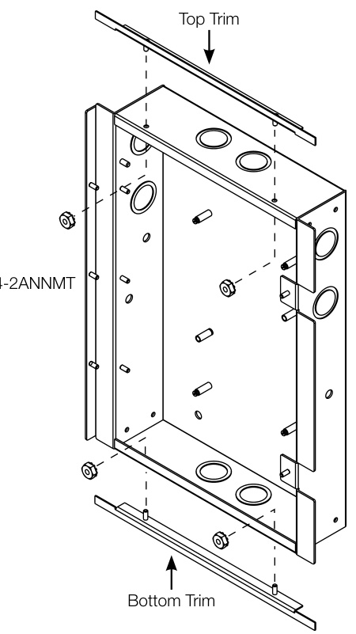  

included trim installation for semi-flush mount applications  

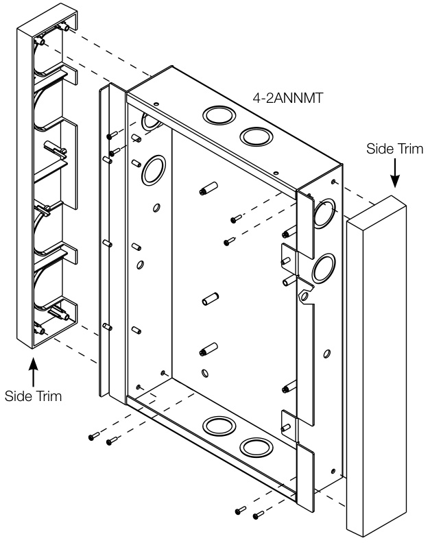  

See Specifications Table for 4-8ANNMT, 4-16ANNMT, 4-24ANNMT mounting options.  

# Dimensions, wallboxes  

# 4-2ANNMT Wallbox Assembly, Surface and Semi-flush Mounting (both trims are included)  

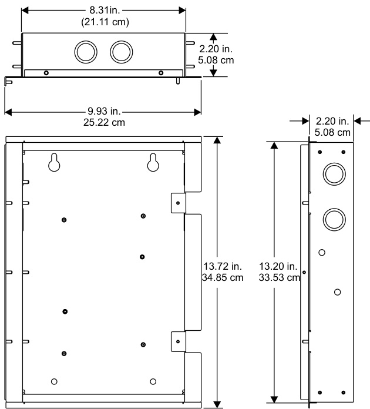  
Semi-flush mount (trim ins(1t)alled top and bottom)  

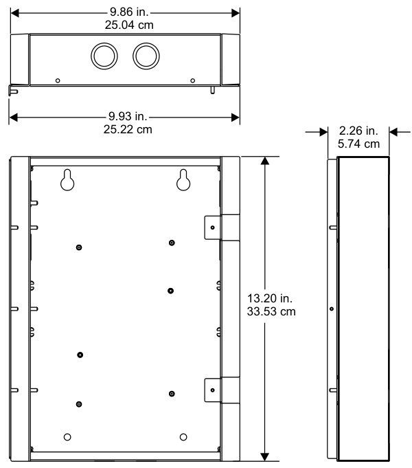  
Surface mount (trim instal(l2e)d right and left sides)  

# 4-4ANNMT Wallbox Assembly, Surface and Semi-flush Mounting (both trims are included)  

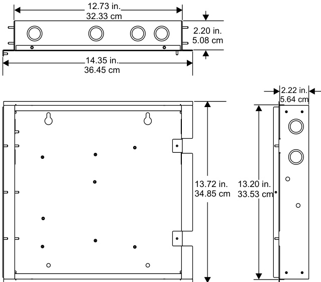  
Semi-flush mount ((t1r)im installed top and bottom)  

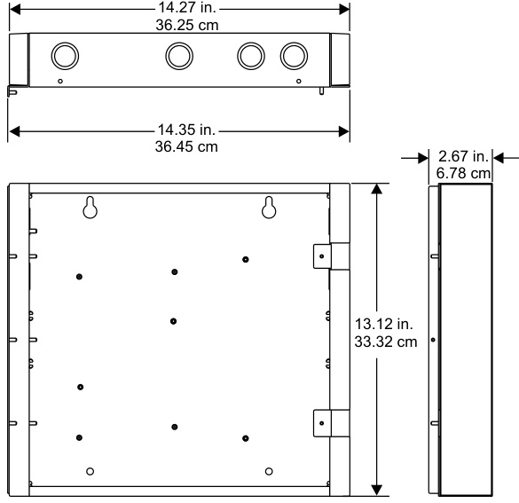  
Surface mount (tri(m2) installed right and left sides)  

# 4-6ANNMT Wallbox Assembly, Surface and Semi-flush Mounting (both trims are included)  

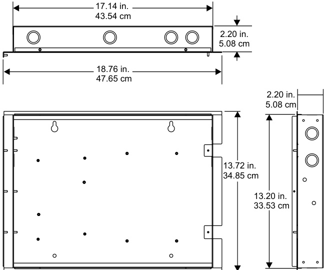  

Semi-flush mount (trim ins(t1a)lled top and bottom)  

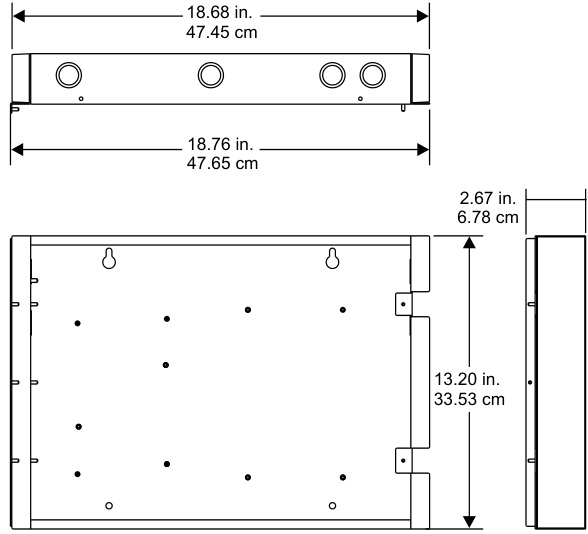  
Surface mount (trim in(s2t)alled right and left sides)  

Dimensions, wallboxes  

4-8ANNMT Wallbox Assembly, Surface Mount For semi-flush mounting, use a 3-CAB5B wallbox.  

4-24ANNMT Wallbox Assembly, Surface Mount For semi-flush mounting, use a 3-CAB14B wallbox.  

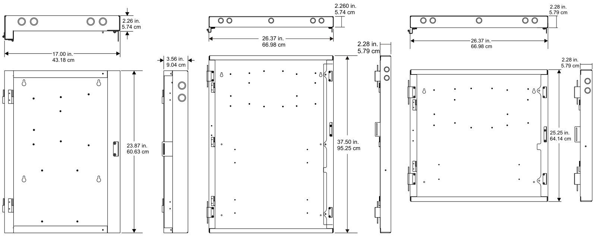  
4-16ANNMT Wallbox Assembly, Surface Mount For semi-flush mounting, use a 3-CAB7B wallbox.  

# Dimensions, door assemblies  

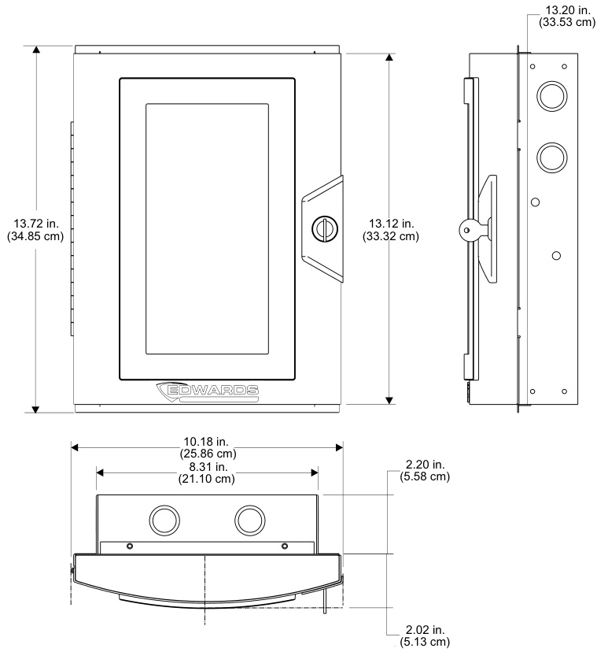  
4-2ANN Series Door Assembly  

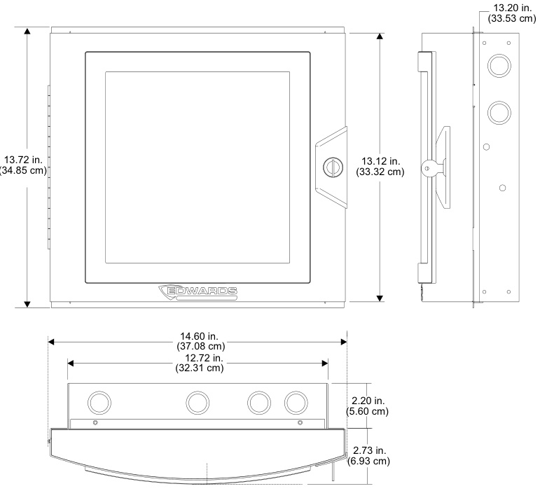  
4-4ANN Series Door Assembly  

# Dimensions, door assemblie2.2s0 i n.continued  

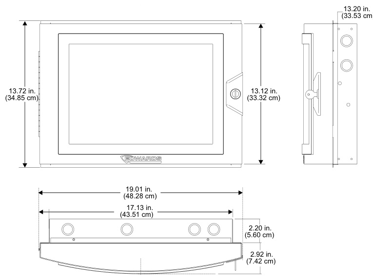  
4-6ANN Series Door Assembly   
4-CAB8D Series Door Assembly  

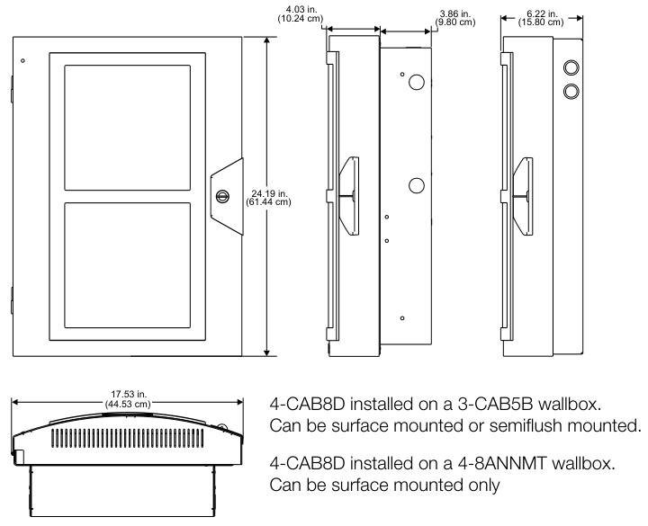  

# 4-CAB16D Series Door Assembly  

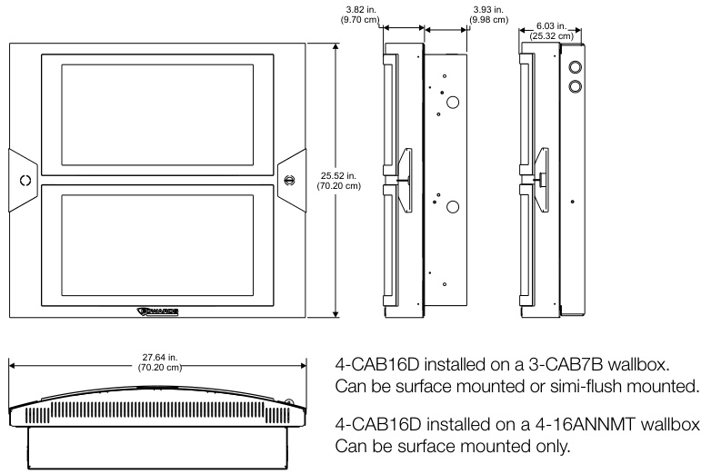  

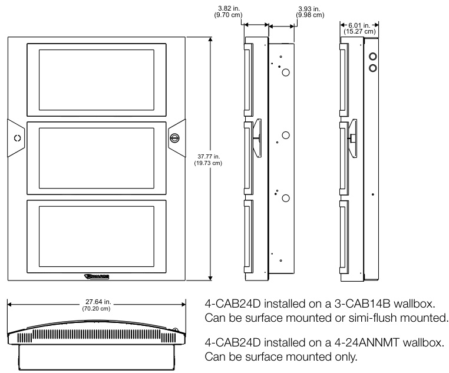  
4-CAB24D Series Door Assembly   
Wiring  

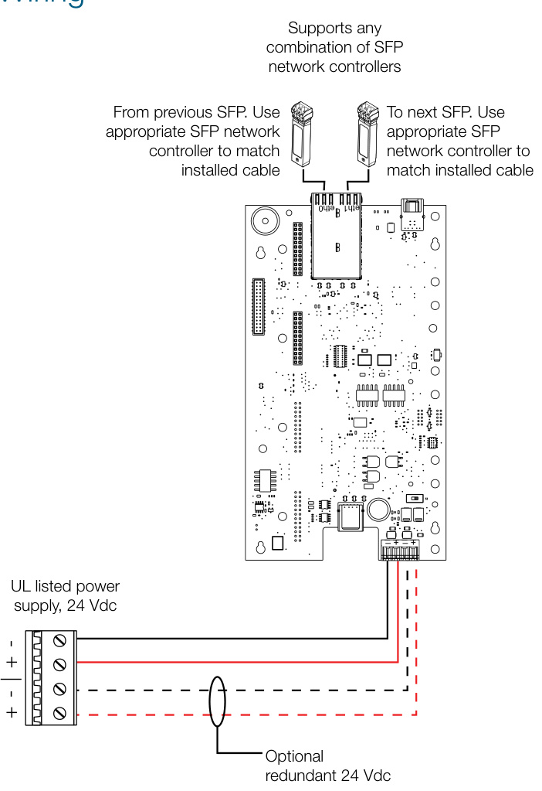  

<html><body><table><tr><td>Model #</td><td>Description</td><td>Network Interconnection Media Supported</td></tr><tr><td>4-NET-CAT</td><td>100Mbps SFP Network Controller</td><td>Cable type - Cat 5e or better Connector type - RJ-45 Distance 328 ft. (100 m) max</td></tr><tr><td>4-NET-MM</td><td>Multi-mode fiber-optic SFPNetwork Controller</td><td>SFP network media interface, multi-mode fiber-optic, supports 50/125 μ (OM3/ OM4) fiber pair up to 1.24 mi. (2 km), 62.5/125μ (OM1) fiberpair up to 0.62 mi. (1 km), 0r a 100/140 μ fiber pair up to 150 m. Order one 4-NET-MM for "in" wiring and one for "out" wiring for connections from previous node and to nextnodeasrequired.Each4-NET-MM supports one multi-mode fiber pair between network cards.</td></tr><tr><td>4-NET-SM</td><td>Single-mode fiber-optic SFP Network Controller</td><td>Single mode 9/125 μ(G.652) fiber pair up to 6.2 miles (10 km). Order one 4-NET-SM for “in" wiring from the previousnodeandasecond4-NET-SM for “out" network wiring to the next node. Each 4-NET-SM supports onesingle-modefiberpairbetween network cards</td></tr><tr><td></td><td>Single-mode fiber-optic 4-NET-SMHSFP Network Controller ndino yb!H</td><td>Single-mode fiber-optic, high-power output, with a 9/125 μ (G.652) fiber pair up to 24.8 mi (40km). Order one 4-NET- SMH for"“in”wiringfromtheprevious node and a second 4-NET-SMH for "out" network wiring to the next node. Each 4-NET-SMH supports one single- mode fiber pair between network cards.</td></tr></table></body></html>  

<html><body><table><tr><td>4-NET-SMU</td><td>Single-mode fiber-optic SFP Network Controller Bi-Directional</td><td>Bi-directional, single-mode fiber-optic with a 9/125 μ (G.652) fiber up to 6.2 miles (10 km). The 4-NET-SMU must be paired with a 4-NET-SMD over one single-mode fiberbetweennetwork cards.</td></tr><tr><td>4-NET-SMD</td><td>Single-mode fiber-optic SFPNetwork Controller Bi-Directional</td><td>Bi-directional, single-mode fiber-optic with a 9/125 μ (G.652) fiber up to 6.2 miles (10 km). The 4-NET-SMD must be paired with a 4-NET-SMU over one single-mode fiber between network cards.</td></tr><tr><td>4-NET-TP</td><td>2 Mbps Twisted Pair SFP Network Controller</td><td>Twisted pair. Following specifications are between any two panels. 16 to 22 AWG (1.3 to 0.33 mm2) Six twists per foot minimum Circuit Capacitance 0.09 μF max. 5,000 ft.(1,524 m) between any two panels Circuit resistance 90 Ω max.</td></tr><tr><td>4-NET-TP- HC</td><td>0.3 Mbps Twisted Pair SFP Network Controller</td><td>Twisted pair or Shielded twisted pair. Following specifications are between any two panels. 16 to 24 AWG (1.3 to 0.20 mm2) Six twists per foot minimum 5,000 ft.(1,524 m) between any two nodes with unshielded twisted pair Circuit capacitance 0.3 μF max. 3280 ft. (1,000 m) between any two nodes shielded twisted pair Circuitresistance 90 Q max.</td></tr></table></body></html>

Refer to Data Sheet E85014-0008 for additional details on SFP network controllers.  

# Technical Specifications  

Annunciator Assemblies Each annunciator space holds a control-display module. LCD displays, 4-MIC and 4-FT take two spaces.  

<html><body><table><tr><td></td><td>4-2ANN</td><td>4-4ANN</td><td>4-6ANN</td><td>4-8ANN</td><td>4-16ANN</td><td>4-24ANN</td></tr><tr><td>NumberofSpaces</td><td>Two</td><td>Four</td><td>Six</td><td>Eight</td><td>Sixteen</td><td>Twenty-four</td></tr><tr><td>Wallbox,SurfaceMounting</td><td>4-2ANNMT</td><td>4-4ANNMT</td><td>4-ANNMT</td><td>4-8ANNMT</td><td>4-16ANNMT</td><td>4-24ANNMT</td></tr><tr><td>Wallbox,Semi-flushMounting</td><td></td><td></td><td>UL,ULC,FM,CSFM</td><td>3-CAB5B</td><td>3-CAB7B</td><td>3-CAB14B</td></tr><tr><td>AgencyApprovals:</td><td colspan="6"></td></tr><tr><td>DoorColor WallboxColor</td><td colspan="6">MetallicBronze(PantoneCoatedPMS#P 171-16 C,PantoneRGB#817567,andRALClassic/RALDesign#7022)</td></tr><tr><td></td><td colspan="6">Black</td></tr></table></body></html>  

Comes standard with annunciator assemblies.  

4-ANNCPU Central Processor   

<html><body><table><tr><td>Voltage</td><td>16to32Vdc</td></tr><tr><td>Currentdraw Standby Alarm/Active</td><td>183mAat16VDC;125mAat24VDC;119mAat32VDC 188mAat16VDC;125mAat24VDC;124mAat32VDC</td></tr><tr><td>USB support</td><td>OneUSB3.0,TypeA-femaleport OneUSB3.O,TypeB-femaleport</td></tr><tr><td>SFP support</td><td></td></tr><tr><td>WireSize</td><td>TB1backuppowerconnection12to18AWG (2.5 to1.0 mm2)</td></tr><tr><td>OperatingTemperature</td><td>32to120°F(0 to49°C)</td></tr><tr><td>OperatingrelativeHumidity</td><td>0 to93%noncondensing</td></tr><tr><td>Optionmodules</td><td>4-ANNAUDTEL:AnnunciatorAudio/Telephoneinterfacemodule.Addsaudioandtelephoneprocessing capabilitiestothe4-ANNCPU,requiredfortheuseofthe4-MICand/or4-FTwiththe4-ANNCPU.</td></tr></table></body></html>  

<html><body><table><tr><td>Model # (SKU)</td><td>Description</td><td>Shipping Weight</td></tr><tr><td>4-2ANN</td><td>LCDAnnunciator-Comeswith4-LCDANNcolortouchscreendisplay,4-ANNCPU,metallicbronzeouterdoor and black inner door.Order wallboxassemblymodel 4-2ANNMTand required network Controllers 4-NET-XX separately (seeNote1).</td><td>10.3lb (4.67kg)</td></tr><tr><td>4-4ANN</td><td>Metallic bronze Annunciator supports 4 slots (1 row of 4).Comes with 4-ANNCPU,metallic bronze outer door and blackinnerdoor.Orderwall Mountingassembly4-4ANNMT,requirednetworkcontrollers4-NET-XXseries(Seenote 1),anyuserinterfaces andfillerplatesseparately.</td><td>11.5lb (5.22kg)</td></tr><tr><td>4-6ANN</td><td>MetallicbronzeAnnunciator,6slots(1rowof6).Comeswith4-ANNCPU,metallicbronzeouterdoorandblackinner</td><td>12.5lb (5.67kg)</td></tr><tr><td>4-8ANN</td><td>Metallic bronze Annunciator, 8 slots (2 rows of 4). Comes with 4-ANNCPU, metallic bronze outer and black inner doors. Order wall Mounting assembly 4-8ANNMT (surface mounting), or 3-CAB5B (Semi-flush mounting) required networkControllers4-NET-XXseries(seeNote1),EndUserinterfacesandrequiredfillerplatesseparately.</td><td>24.5lb (11.11kg)</td></tr><tr><td>4-16ANN</td><td>MetallicbronzeAnnunciator, 16slots(2rowsof8).Comeswith4-ANNCPU,metallicbronzeouterandblackinner s</td><td>37.9b (17.19kg)</td></tr><tr><td>4-24ANN</td><td>MetallicbronzeAnnunciator, 24 slots (3rows of 8). Comeswith4-ANNCPU,metallic bronze outer and black inner doors.Orderwallmountingassembly4-24ANNMT,requirednetworkControllers4-NET-XXseries(seeNote1),and EndUserinterfacesandrequiredfillerplatesseparately.</td><td>52.9lb (24.02kg)</td></tr></table></body></html>  

Accessories and Related Equipment   

<html><body><table><tr><td rowspan="2">4-LCDANN</td><td>Color LCD display, includes silicon rubber common control buttons, mounts in remote annunciators, communicates to 4-ANNCPU. Comes with interconnect cable. LCD ordered separately for mounting in 4-4ANN or 4-6ANN. 4-2ANN</td><td>1.90lb (0.85kg)</td></tr><tr><td>comes with one 4-LCDANN. Color LCD display, includes silicon rubber common control buttons, mounts in remote annunciators sizes 4-8ANN,</td><td>1.9lb (0.85kg)</td></tr><tr><td>4-LCDLE 4-LCDAUD</td><td>4-16ANN or 4-24ANN,communicates to 4-ANNCPU. Comes with interconnect cable LCD display for control of paging and fire fighter telephone. Comes with one 4-LCDAUDTEL and mounting and cablinghardwareformounting in4-16ANNMTor4-24ANNMTenclosureswhereseparateLCDdisplayofAudioand</td><td>1.8lb (0.81kg)</td></tr><tr><td>TELANN</td><td>Telephone is required. Is not supported in other annunciator sizes. Order annunciator application specific equipment separately. Annunciator Central Processor Unit (CPU), provides mounting forup to two network controllers (see note 1),</td><td>1.0lb</td></tr><tr><td>4-ANNCPU</td><td>one USB device port, one USB host port and one 4-ANNAUDTEL module. Control Display Module with 24 indicators.See note 2.</td><td>(0.45kg)</td></tr><tr><td>4-24L 4-24L12S</td><td>Control Display Module with 24 indicators and 12 switches. See Note 2.</td><td>0.6lb (0.27kg) 0.7lb (0.29kg)</td></tr><tr><td>4-24L18S</td><td>ControlDisplayModulewith-24indicatorsand 18switchesSeeNote 2.</td><td>0.7lb (0.29kg)</td></tr><tr><td>4-24L24S</td><td></td><td>0.7lb (0.29kg)</td></tr><tr><td>4-FIL</td><td>Fills one indicator/switch space on inner doors when no Switch or LED strips are installed.</td><td></td></tr><tr><td></td><td>Audio paging microphone. Requires 4-ANNAUDTEL support card be installed on the 4-ANNCPU card.</td><td>0.1lb (0.04kg)</td></tr><tr><td>4-MIC</td><td>Can be mounted in 4-4ANN through 4-24ANN annunciators MasterFireFighters telephone.Requires a 4-ANNAUDTEL support cardbe installed on the 4-ANNCPUcard.</td><td>1.2lb (0.54kg)</td></tr><tr><td>4-FT 4-ANN</td><td>Can be mounted in 4-4ANN through 4-24ANN annunciators.</td><td>1.4lb (0.64kg)</td></tr><tr><td>AUDTEL</td><td>requiredfor theuseof the4-MICand/or4-FTwith the4-ANNCPU.</td><td>0.3Ib (0.14kg)</td></tr><tr><td>4-CPUGRPH</td><td>GraphicAnnunciator CentralProcessorModule.SeeNote3.</td><td>1.5lb (0.68kg)</td></tr><tr><td>3-EVDVR</td><td>LED/SWITCH Driver Module Assembly for ENVOY graphics. See Note 3.</td><td>0.4lb (0.18kg)</td></tr><tr><td>3-EVDVRA</td><td>LED/SWITCH Driver Module Assembly for Third-party Graphics. See Note 3.</td><td>0.7lb (0.32kg)</td></tr><tr><td>3-EVPWR</td><td>Power Supply Assembly c/w 19 inch rail mounting chassis assembly space for one 4-CPUGRPH for</td><td>0.2lb (0.09kg)</td></tr><tr><td>3-EVPWRA</td><td>Third-party Graphics.See Note 3.</td><td>2.9lb (1.34kg)</td></tr><tr><td>3-EVDVRX</td><td>Plasticmountingextrusion19"mounting-forupto33-EVDVRAs.SeeNote3.</td><td>0.9lb (0.41kg)</td></tr></table></body></html>

Note 1: Refer to Catalog Sheet part number E85014-0008 for a complete list and description of available Network Controllers. Note 2: Refer to Catalog Sheet part number E85014-0006 for a complete description of Control Display Modules. Note 3: SKU not FM approved.  

# Ordering Information, wallboxes and replacement parts  

<html><body><table><tr><td>Model # (SKU)</td><td>Description</td><td>Shipping Weight</td></tr><tr><td colspan="2">Wallboxes</td><td></td></tr><tr><td>4-2ANNMT</td><td>Mounting assembly for 4-2ANN, two wide annunciator. Supports surface or semi-flush mounting. Comes with black wallbox, surface mounting plastic fillers and semi-flush trim.</td><td>6.4lb (2.9kg)</td></tr><tr><td>4-4ANNMT</td><td>Mounting assembly for 4-4ANN, four wide annunciator. Supports surface or semi-flush mounting. Comes with black wallbox, surface mounting plastic fillers and semi-flush trim.</td><td>9.0lb (4.08kg)</td></tr><tr><td>4-6ANNMT</td><td>Mountingassemblyfor4-6ANN,sixwideannunciator.Supports surfaceorsemi-flushmounting.Comeswithwallbox,surface mounting plastic fillers and semi-flush trip.</td><td>10.3b (4.67kg)</td></tr><tr><td>4-8ANNMT</td><td>Mountingassemblyfor4-8ANN,fourwidextworowhigh annunciator.Supports surfacemounting.</td><td>19.0lb (8.62kg)</td></tr><tr><td>3-CAB5B</td><td>Wallbox-BlackSemi-flushwallbox,ideal forusewhensemi-flush mounting 4-8ANN annunciators.</td><td>20.0lb (9.07kg)</td></tr><tr><td>4-16ANNMT</td><td>SurfaceMount Wall box assembly for eightwidebytwohigh annunciators (16spaces)</td><td>27.0lb (12.25kg)</td></tr><tr><td>3-CAB7B</td><td>Wallbox-BlackSemi-flushwallbox,ideal forusewhensemi-flush mounting 4-16ANN annunciators.</td><td>29.5lb (13.38kg)</td></tr><tr><td>4-24ANNMT</td><td>Surfacemountwallboxassemblyforeightwidebythreehigh annunciator (24 spaces).</td><td>37.0lb</td></tr><tr><td>3-CAB14B</td><td>Wallbox-BlackSemi-flush wallbox, ideal for use when semi-flush mounting4-24ANNannunciators.</td><td>(16.78kg) 40.8lb (18.5kg)</td></tr></table></body></html>  

Service Replacement Parts   

<html><body><table><tr><td>4-2ANND</td><td>ServicereplacementmetallicbronzeAnnunciatorDoorfor4-2ANN</td><td>7.7lb (3.5kg)</td></tr><tr><td>4-4ANND</td><td>annunciatorsincludestheinnerandouterdoors. ServicereplacementmetallicbronzeAnnunciatorDoorfor4-4ANN</td><td>10lb (4.5kg)</td></tr><tr><td>4-6ANND</td><td>annunciators includesthe inner and outerdoors. annunciators,includestheinnerandouterdoor</td><td>11lb (5kg)</td></tr><tr><td>4-CAB8D</td><td>Servicereplacementmetallicbronzedoorfor3-CAB5Bor 4-8ANNMT - four spaces wide by two high (8 spaces)</td><td>23lb (10.4kg)</td></tr><tr><td>4-CAB8DR</td><td>Includes inner (black) door and outer metallic bronze door. Reddoorfor3-CAB5B-fourspaceswidebytwohigh(8spaces). Includes inner (black) door and outer red door. May be used to</td><td>23lb (10.4kg)</td></tr><tr><td>4-CAB16DR</td><td>provideareddoorfor4-8ANNannunciators. spaces). Includes inner (black) door and outer red door. Maybe</td><td>36lb (16.3kg)</td></tr><tr><td>4-CAB24DR</td><td>used toprovidea red doorfor 4-16ANNannunciators. Red door for3-CAB14B-eight spaces wideby threehigh(24 spaces). Includesinner (black)door and outer red door.May be</td><td>51lb (23.1kg)</td></tr><tr><td>4-2ANNFA</td><td>used toprovideareddoorfor4-24ANNannunciators Service replacement part - plastic frame assembly with mounting screwsfor4-2ANNannunciators</td><td>1.5lb (0.68kg)</td></tr><tr><td>4-4ANNFA</td><td>Service replacement part - plastic frame assembly with mounting screwsfor4-4ANNannunciators.</td><td>2lb (0.91kg)</td></tr><tr><td>4-6ANNFA</td><td>Service replacement part - plastic frame assembly with mounting screwsfor4-6ANNannunciators.</td><td>2lb (0.91kg)</td></tr><tr><td>4-4X2ANNFA</td><td>Service replacement part - plastic frame assembly with mounting screwsfor4-8ANNannunciatorsand4-CAB5Ddoorassemblies.</td><td>3lb (1.36kg)</td></tr><tr><td>4-8ANNFA</td><td>Service replacement part - plastic frame assembly with mounting screwsfor4-CAB16Dand 4-CAB21D(L)doorassemblies.</td><td>3lb (1.36kg)</td></tr></table></body></html>  