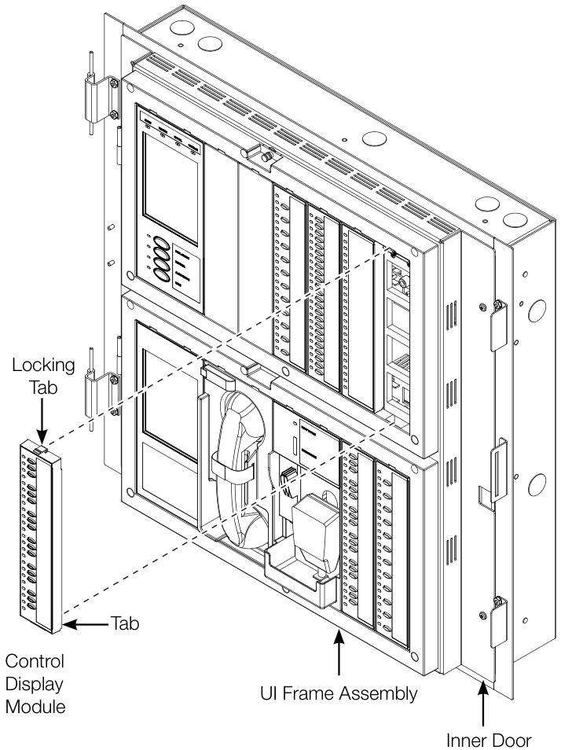

# EST4 Control Display Modules 4-24L Series  

# Overview  

EST4 Control-Display Modules provide first responders and emergency users with easy-to-operate controls and at-a-glance indication when time is of the essence and event information is critical.  

Control-Display Modules come with 24 LED indicators and are available with 0, 12, 18, or 24 control buttons. LED indicators are actually comprised of five individual LEDs, each of a different color. Programmers configure indicators to display their pre-selected color according to the type of information conveyed by the indicator. This offers a level of design efficiency that can reduce the number of display strips necessary for an application. In addition to color selection, the flash rate of the LED may be programmed to provide even more information. Examples include: damper and fan status, or audio zone notification status, alert, evaluation or paging.  

Control display modules simply snap into place on the inner door of control panels or annunciators, and can mount in any unused display location. They can be positioned according to use, and spaced to create a physical separation between different control functions.  

Control modules feature large and easy-to-see buttons. They provide tactile feedback when pressed, and visual feedback by means of the associated indicator, which flashes briefly when the button is activated.  

Printable slide-in label inserts give control-display modules context with color-coded shading and other effects. They can be localized for regional language requirements, and printed on-the-fly to accommodate system changes as they are implemented.  

Up to 576 tactile switches and 576 indicators may be mounted in a single EST4 cabinet. Module lamp test can be programmed to any spare control switch, or by selecting the Lamp Test feature from the LCD display.  

# Standard Features  

Modules Mount on Inner Door of Cabinet   
Simple snap-in modules speed installation, provides   
a clean look.   
Rubber Buttons for Switch Control   
Provides durability with great tactile feedback of   
switch operation.   
Selectable LED Colors   
Minimizes the inventory needed to support operations. Slide-in Customizable Labeling   
Print color-coded and regional languages from the   
Configuration Utility.   
Stable Frame Assembly   
Ensures positive switch operation.   
Switch Radio Groups   
Allows up to 24 switches in a group.   
Synchronized Indicator Flash Rates Across Network Consistent indication between nodes.   
Visual Feedback of Switch Activation   
Visual feedback of a switch press by status LED   
color change.  

# Application  

Life Safety Systems require only occasional operation. Yet, in an emergency the user must be able to identify system operation and status quickly and without hesitation. LCD screen displays are excellent for identifying specific information, but even a large LCD display cannot convey overall system status as effectively as individual LEDs and switches.  

# Simple design, sophisticated operation  

EST4 control-display modules are designed to provide simple identification and operation of system functions for the emergency user. They offer positive feedback of control activity with flexibility for selection of display configurations and mounting location options. This configuration flexibility means that there are fewer models needed to cover a wide array of applications. In fact, just four models handle all the control and display options needed for EST4 operation.  

At each indicator location, display modules have five individual LEDs: red, yellow, blue, green and white. At configuration time the system designer matches the color of the LED to the needs of the system design. This allows maximum use of indicator and switch locations on each module, making it unnecessary to skip or leave indicator spaces blank because the color is wrong for the application.  

# Multi-use modules increase efficiency  

Flexible multi-use design allows the same control-display model to be used for several different applications. For example, the 24-indicator 4-24L may be used for displaying zone annunciation, or zone annunciation with disable indicator, or zone annunciation with trouble, or a combination of all three.  

Switches can also work independently, or they can be grouped into a latching-interlock to support operations that must be kept separated, such as fan and damper control. The interlock is controlled by software, so only one switch is active at a given time. EST4 offers further flexibility by supporting the interlock of not just two or three switches in a group, but the interlock of any combination – right up to the full module complement of 24 switches.  

Radio switch groups are also an option with EST4 control modules, as are On-Off-Auto configurations, and a variety of HVAC and building control system operations. In fact, the EST4 command and control interface is much more than the sum of its constituent parts, and its design flexibility is sure to inspire new and creative ways to make buildings safer.  

# Engineering Specification  

The Life Safety system shall incorporate annunciation of Alarm, Supervisory, Trouble and Monitor operations. Annunciation must be through the use of LED display strips, complete with a means to custom label each LED/Switch position as to its function. The labels must support the ability to allow visual custom grouping of LEDs and switches. Where applicable, control of remote smoke control devices must be made available at the control center. Switches with LEDs must provide positive feedback to the operator of remote equipment status. All individual indicator LEDs shall be configurable for color including Red, Yellow, Blue, Green or White to facilitate identification from a distance and maximize display location usage. Where voice audio is required, a means of paging individual zones must be available. The status of each paging zone must be annunciated. It must be possible to selectively page into specific zones. It shall be possible to manipulate the evacuation of the building from the main control center. It must be possible for the emergency operator to put specific zones into evacuation manually. When being serviced or when it is necessary to disable switches, the system shall not ‘remember’ if a disabled switch is pressed. Switches’ must be rubber to provide tactile feedback as well as a visual indication when a switch is activated.  

# Installation  

  

<html><body><table><tr><td colspan="2">4-24L</td><td>4-24L12S</td><td>4-24L18S</td><td>4-24L24S</td></tr><tr><td>Indicators</td><td>24</td><td>24</td><td>24</td><td>24</td></tr><tr><td>Switches</td><td>0</td><td>12</td><td>18</td><td>24</td></tr><tr><td colspan="5">Current Standby 3.0 mA (base)+0.23mA/IndicatorON @ 24VDC Alarm 3.0 mA (base)+0.23mA/IndicatorON @ 24VDC</td></tr><tr><td>Mounting</td><td colspan="5">Display modules mount on the inner door of the following doorassemblies: 4-CAB8D,4-CAB16D,4-CAB24D,4-CAB24DL 4-4ANND,and4-6ANND</td></tr><tr><td>Operating environment</td><td colspan="5">Temperature: 32 to 120°F (0 to 49°C). Relativehumidity:0 to93%noncondensing.</td></tr><tr><td>Agency Listings</td><td colspan="5">UL,ULC,FM,CSFM</td></tr></table></body></html>

Agency approvals: UL864 10th edition - UOJZ, UUKL, SYZV, UOQY, UL2017 2nd edition - FSZI, UL2572 2nd edition - PGWM; ULC-S527-11 3rd edition - UOJZ, UULK7, SYXV7, ULC-S576-14 1st edition - PGWM7, ULCS-S559-13 2nd edition - DYR7  

<html><body><table><tr><td>Model # (SKU)</td><td>Shipping Description Weight</td></tr><tr><td>4-24L 24IndicatorDisplayModule</td><td>0.6lb (0.27kg)</td></tr><tr><td>4-24L12S</td><td>0.65lb 24 Indicator 12ControlDisplayModule (0.29kg)</td></tr><tr><td>4-24L18S</td><td>0.65lb 24Indicator18ControlDisplayModule (0.29kg)</td></tr><tr><td>4-24L24S</td><td>0.65lb 24Indicator24ControlDisplayModule (0.29kg)</td></tr><tr><td>4-FIL BlankFillerPlate</td><td>0.1lb (0.04kg)</td></tr></table></body></html>  