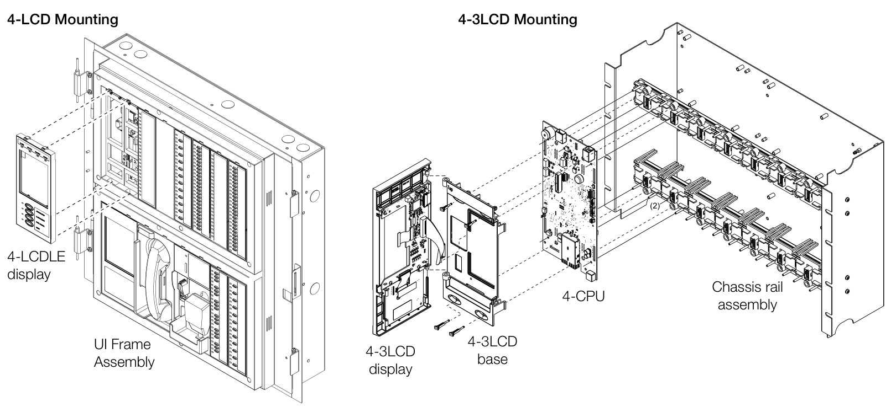
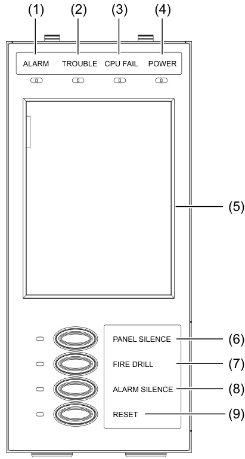

# EST4 LCD Display Module 4-LCD Series  

# Overview  

EST4’s LCD large color touch-screen display is the window into system operation and maintenance functions. It is large enough to support a graphical tree view of the system. The tree closely matches the system’s physical layout, so there’s no need for lookup tables to find specific devices. This is invaluable to technicians and building service personnel who can pinpoint the location of an off-normal device with a glance at the on-screen tree.  

The EST4 LCD screen will display eight events without scrolling. In addition to touch-screen capability, the display assembly includes four dedicated easy-access rubber buttons for main control functions.  

On the display, device events automatically sort into classification queues with event counts for easy identification and response. When new events are present that have yet to be reviewed, each queue is highlighted with an visual marking.  

# Standard Features  

Large Easy-to-Read Display Area   
Displays eight events, 768 10-point characters.   
Full Color for Detail-rich User Experience   
262,144 colors with support for custom wallpaper.   
Displays System Tree View on One Screen Page   
Quick drill-downs to find devices, no look-up tables required. Context-sensitive User Interface   
One sign-in determines user privileges and available devices. Color-coded Event Queue, History Log, Status Report At-a-glance identification of priorities.   
User Configurable Image Display   
Displays a customized image that appears on the LCD’s home screen when no active events are present.  

# Application  

Ensuring information clarity, the 4-LCD uses a 262,144 color touch screen LCD display. The display’s design layout provides not only emergency information in a useful format, but also the ability to view other system operations including reports. A single button press will route the report to a configured network printer for hardcopy record of the report.  

The 4-LCD always displays the last highest priority event. Further message flexibility is provided with EST4’s message routing ability. Messages from a panel can display at every LCD on the network, or messages can route to specific LCDs only. Routing can be  

initiated at a specific time/shift change. There is no need to have messages display in areas that are not affected by an event.  

The 4-LCD can display system messages in any two of the EST4- supported languages and dialects. Choice of language is selected by the marketplace setting in EST4, any two of the available languages for a marketplace can be displayed as the primary language, and a second language can be displayed simply by selecting the language button on the LCD display. The display supports a set of Unicode symbols for example: $\circledcirc$ 818 . These symbols can provide a heightened visual element to a messages importance.  

# Assembly and Installation  

The 4-LCD display mounts onto the inner door frame of EST4 control panels. The inner door also acts as a deadfront, separating users from field wiring located behind it.  

The 4-3LCD display mounts into EST3 enclosures that do not contain audio control components. This allows reuse of EST3 user interface layers in these applications. The 4-3LCD mounts onto the top of the 4-CPU in EST3 retrofit applications, providing all the benefits of the 4-LCD, while matching closely the EST3 look.  

  

# Engineering Specification  

The system shall provide a user interface that displays system events on a color touch screen display in a text format. The display must be capable of supporting a minimum of two languages including but not limited to English, Spanish, Portuguese or French. The display design shall be simplified for emergency users so that main common controls are provided as switches/buttons that provide positive feedback of operation, common control buttons shall not be part of the touch screen display area. The Common Control Switches and LEDs provided through tactile buttons with indicators shall be; Reset switch and LED, Alarm Silence switch and LED, Panel Silence switch and LED, Acknowledge switch and LED. In addition the following LEDs shall be provided as discrete indicators, Alarm Indicator, CPU Fail Indicator, Trouble Indicator and Power Indicator. It must be possible to add additional common controls as required through the use of modular display units. The user interface must provide a color touchscreen LCD display with minimum resolution of VGA $640\times480$ . The display shall provide a minimum of seven events displayed concurrently and support $>\!200{,}000$ colors. The system shall be capable of displaying custom images on the panel’s LCD screen when no active events are present. Hands free operations shall be provided for viewing the first eight highest priority events. Events of different priorities shall be automatically placed in easy to access queues. It shall be possible to view specific event types separately. Having to scroll through a mixed list of event types is not acceptable. The total number of active events by type must be displayed. Visual indication must be provided of any event type which has not been acknowledged or viewed. It must be possible to customize the designation of all user interface LEDs and Switches for local language requirements. The color LCD display must support scripts & ideograph style font types. It shall be possible to have a custom message for each device in addition to zone messages. Custom device messages must support a minimum of 42 characters each. Instructional text messages support a maximum of 2,000 characters each.  

# Control and Display Functions  

The EST4 LCD display simplifies the user interface. Up front and at the top of the display are four easy-to-read and understand status lights.  

# 1	 Alarm LED  

The Alarm LED serves as a common alarm event indicator. The LED illuminates when there is am Alarm type event on the system. The specific Alarm event displays in its queue on the LCD where a count of alarm events is displayed along with a visual indicator if there are new events that have not been viewed.  

# 2	 Trouble LED  

This LED serves as a common trouble event indicator. The LED illuminates when there are events in the trouble event queue located on the LCD display. The trouble event queue provides a count of trouble events and highlights if there are new events that have not been viewed (local systems operation) or acknowledged (proprietary systems operation).  

# 3	 CPU Fail LED  

The LED indicates that the CPU has detected a processor failure. Processor failures must be reset manually using the Reset button.  

# 4	 Power LED  

  

The LED indicates   
the power status. The   
LED operation is selectable in the panel configuration utility and supports local power display requirements including: On if there is primary or standby power present; On when primary power present, off during primary power loss; On when the panel has primary power and standby power, off if either standby or primary power are absent.  

# 5	 LCD screen  

The heart of the 4-LCD is the color Liquid Crystal Display located in the center of the module. In the System Normal condition the date and time plus system wallpaper image are displayed on the LCD.  

# Control Buttons  

Four easy to find rubber buttons are located at the bottom of the display. These provide simple-to-understand common control functions. The switch design gives tactile feedback when operated, but EST4 offers additional user feedback by also providing a visual indication of switch activation through the associated LED. When a switch is activated the LED beside the switch will illuminate in a contrasting color. This gives a visual indication that the system has seen the switch push. The LED will change to its programmed color when the switch command has been executed.  

The versatility of EST4 allows system designers to define the features affecting particular areas of a building. These are known as Notification Control Areas (NCAs), which are defined areas of an installation. A network may have several NCAs. This feature is very useful when configuring systems with multiple buildings on one network. For example, operating the Reset function in one building may have an adverse effect in other buildings. As a solution to this, audio paging may be programmed to affect the defined NCA and no other NCAs. This means that with EST4, having operational differences between buildings on the same network is not a problem. This feature can save wiring and reduce inter panel overhead.  

# 6	 Panel Silence button and LED  

The factory default for this programmable button and LED indicator is Panel Silence. Pressing Panel Silence turns off the system’s internal audible signal. The switch indicator has two statuses: white when the switch is pressed, yellow on when panel silence is active.  

# 7 Fire Drill button and LED  

The factory default for this programmable button and LED indicator is Fire Drill. Pressing Fire Drill turns on the drill LED and all signals sound evacuation. Drill does not activate city tie connections. Auxiliary relays will not activate unless programmed to do so with drill.  

# 8	 Alarm Silence button and LED  

The factory default for this programmable button and LED indicator is Alarm Silence. Pressing Alarm Silence turns off all Notification Appliance Circuits defined as audible. The switch indicator has two statuses: white when the switch is pressed, yellow when silence is active via the Alarm Silence switch or via alarm silence software timers.  

# 9	 Reset button and LED  

The factory default for this programmable button and LED indicator is Reset. Pressing Reset starts the system’s reset operation. The switch indicator has four statuses: white when the switch is pressed; fast flashing green during the smoke power down phase of reset; slow flashing green during the restart phase; and, on steady green during the restoral phase. The Reset LED is off when the system is not in the reset process.  

# Technical Specifications  

<html><body><table><tr><td></td><td>4-LCD</td><td>4-3 LCD</td></tr><tr><td>Rail Spaces</td><td>Two inner door spaces</td><td>Two user interfaces spaces.</td></tr><tr><td>Mounting</td><td>Mounts on inner door</td><td>Mounts on UI layer above 4-CPU</td></tr><tr><td>Current</td><td></td><td></td></tr><tr><td>Standby</td><td>40 mA at 24 Vdc</td><td></td></tr><tr><td>Alarm/active</td><td>93 mA at 24Vdc</td><td></td></tr><tr><td>Display</td><td>18 bit color. 640 × 480 pixels, resistive touch screen</td><td></td></tr><tr><td>System status indicators ALARM</td><td>Red indicator</td><td></td></tr><tr><td>TROUBLE</td><td>Yellow indicator</td><td></td></tr><tr><td>CPU FAIL</td><td>Yellowindicator</td><td></td></tr><tr><td>POWER ON</td><td>Green indicator</td><td></td></tr><tr><td>Common controls and indicators [1]</td><td></td><td></td></tr><tr><td>PANELSILENCEbutton</td><td>Yellowindicatorintegrated with thePanel Silence button</td><td></td></tr><tr><td>FIRE DRILL button</td><td>Yellow indicatorintegrated with theFireDrillbutton</td><td></td></tr><tr><td>ALARM SILENCE button</td><td>Yellow indicator integrated with the Alarm Silence button</td><td></td></tr><tr><td>RESET button</td><td>Green indicatorintegrated with the Reset button</td><td></td></tr><tr><td>Operating environment Temperature Relativehumidity</td><td>32 to 120F (0 to 49°℃)</td><td></td></tr><tr><td>Custom Background Image</td><td>0 to 93% noncondensing (e.g.,600 × 800, 768 x 1024, or 960 x 1280) Resolution: 141 dpi or greater Color depth: 18-bit color or greater (24-bit is RGB; 32-bit is CMYK) Format: JPG, JPEG, or PNG</td><td>Size: 480 x 640 pixels or greater with as aspect ratio of 3:4</td></tr></table></body></html>

[1] Factory default for the common controls and indicators are listed here. These common controls can be reprogrammed using the Configuration Utility (4-CU). The associated indicators can also be reprogrammed as red, green, yellow, blue or white colors.  

# Ordering Information  

<html><body><table><tr><td>Model # (SKU)</td><td>Description</td><td>Shipping Weight</td></tr><tr><td>4-LCD</td><td>MaincolortouchscreenLCDdisplay</td><td>1.25lb (0.57kg)</td></tr><tr><td>4-LCDANN</td><td>4-LCDw/cableforAnnunciatorenclosure4-4ANN,4-6ANN mounting</td><td>1.9lb (0.85kg)</td></tr><tr><td>4-LCDLE</td><td>and24ANN mounting</td><td>1.9b (0.85kg)</td></tr><tr><td>4-3LCD</td><td>LCD display for use in EST3panels, allows reuse of EST3 UI layer in retrofit applications. The 4-3LCD can be mounted in remote closet cabinets where an LCD display is needed. The display mounts on the 4-CPU module.</td><td>1.5lb (0.66kg)</td></tr><tr><td colspan="3">Accessories and related equipment</td></tr><tr><td>4-CABL0502</td><td>Service replacement cable,4-LCD to 4-CPU flex interconnect cable for CAB5,7,14,21.</td><td>0.38lb (0.17kg)</td></tr><tr><td>4-CABL0504</td><td>Service replacement cable 4-LCD to 4-ANNCPU cable for use in 4-2ANN, 4ANN, 6ANN annunciator configuration.</td><td>0.37lb (0.17kg)</td></tr><tr><td>4-CABL0541</td><td>Servicereplacement cable 4-3LCD to 4-CPU cable forusein3-CAB5B,7B,14B,21B,RCCseries.</td><td>0.1lb (0.04kg)</td></tr><tr><td>4-CABL0505</td><td>Cable,Door Rail to Rail, 13 Inch for 4-CAB16D(R),4-CAB24D(R), or 4-CAB24D(R)L.</td><td>0.5b (0.23kg)</td></tr><tr><td>4-CABL0507</td><td>Cable, Door Rail to Rail, 11.3 Inch for 4-CAB8D(R).</td><td>0.5b (0.23kg)</td></tr><tr><td>4-CABL0542</td><td>Cable,forusewith4-CPUor 4-ANNCPUwherenoLCDis installed on Inner Door.</td><td>0.6lb (0.26kg)</td></tr></table></body></html>  