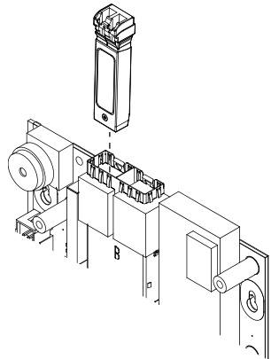

# EST4 Network Controllers 4-NET Series  

# Overview  

4-NET Series controllers are a series of small form factor pluggable (SFP) transceivers that provide physical media options for EST4 network cabling. The selection of the controller determines the media type. Eight models are available, each one offers a different kind of physical connection.  

EST4 network controllers are easy to install and provide flexible solutions for system changes and upgrades. They mount into any EST4 panel on the life safety network by simply plugging into either of the two slots found on the 4-CPU, 4-ANNCPU, 4-CPUGRPH and 4-NET-AD modules. The controllers are hotswappable and may be used in any combination of fiber, copper or CAT 5e or better cable.  

Controllers allow vast distances between panels and thousands of addressable points. For example, a single IPv6 network can support up to an astonishing 200,000 addressable devices. Copper wire runs of nearly a mile between nodes puts detection, alarm, notification, and audio into the furthest reaches of the tallest buildings and broadest campuses.  

EST4 gives the flexibility to configure the network to the needs of the installation, including no network redundancy (Class B), a single redundant connection (Class A/X), or any combination of styles including multiple redundant paths.  

EST4 network controllers are used for panel-to-panel communications only. Connections to external networks are handled by 4-FWAL Series adapters. See the relevant literature for more information concerning firewalls and external network connections.  

# Standard Features  

Multiple Connection Options   
Hot pluggable SFP-style network controllers allow selection of twisted pair, fiber optic and CAT cables.   
Supports multiple network configurations   
Networks can be configured in Class B, Class A, Class X and Class N.   
IPv6 Support   
Autoconfiguring network for simple setup and easy network configuration.  

# Application  

EST4 life safety communication is built on a self-configuring IPv6 network. 4-NET series SFP network controller modules provide the connection to physical inter-panel cabling. All SFPs are hotswappable and mount in either of the two SFP slots found on 4-CPU, 4-ANNCPU, 4-CPUGRPH and 4-NET-AD modules.  

# Capacity for Large Projects  

Robust physical interconnections facilitate a range of liberating network capacities. Twisted pair copper at 2 Mbps supports distances of up to 5,000 ft. $(1.5\,\mathsf{k m})$ between any two panels; up to 50,000 ft. $:15\,{\mathsf{k m}})$ at 0.2 Mbps when used with the 4-NETXT.  Single-mode, multimode, and even CAT 5 (or better) cable solutions are also available.  

  

A single network cable carries all panel-to-panel services: data, voice audio, and firefighters’ telephone. No separate interconnections are needed. This powerful feature reduces cable costs and installation time.  

# Powerful Network Security and Survivability  

Cabling options satisfy even the most demanding redundancy and survivability requirements. The EST4 network can be configured for Class A, Class B, Class X, and Class N wiring. CAT5 installations are not limited to Class N wiring style: the network can be designed to meet Class A, Class B, and Class X configuration with CAT5 cable.  

Network messages received by 4-NET controllers are routed by the CPU to the appropriate network link. As each link is an independent point-to-point connection wire run lengths between nodes are maximized.  

Failsafe mechanisms are built right into EST4 network controllers. Should a connected CPU module go offline, the input and output ports automatically connect directly to one another. This operation provides a pass-through mode that maintains basic connectivity in the event of something as mundane as a routine power-down for servicing, or as catastrophic as the failure of a control panel.  

The EST4 life safety network is a self-configuring IPv6 network that enables the full support for cybersecurity tested to meet FIPS publication 197. Salted Hashing of passwords, authentication and en­cryption of sensitive data (user PINs, node authentication) are all standard features. This security applies to a single panel or the full complement of nodes that the EST4 network can support.  

SFP Passthrough Support, eth0 to eth1   

<html><body><table><tr><td></td><td>4-NET- 4-NET- CAT (fibertype)</td><td>4-NET- TP</td><td>4-NET- TP-HC</td></tr><tr><td>4-NET-CAT √</td><td>√</td><td>√</td><td>√</td></tr><tr><td>4-NET-(fiber type) √</td><td>√</td><td>√</td><td>√</td></tr><tr><td>4-NET-TP √</td><td>√</td><td>√</td><td></td></tr><tr><td>4-NET-TP-HC</td><td></td><td></td><td></td></tr></table></body></html>  

# Installation  

4-NET controllers mount into any EST4 panel on the life safety network by simply plugging into either of the two slots found on the 4-CPU, 4-ANNCPU, 4-CPUGRPH or 4-NETAD modules. The controllers are hotswappable and may be combined to provide fiber, twisted-pair, or CAT5/6 connections as needed.  

# Engineering Specification  

The system shall support communicating on a TCP/IP, IPv6 network that supports multiple network topologies including any mix of ring, bus, star and mesh. The network shall support physical media connections via fiber, twisted pair or CAT5 in any combination. The Network shall support data transmission of panel-to-panel data, voice audio and firefighters’ telephone data on a single twisted pair or single optical fiber. The Network shall be configured as <Class A> <Class B> <Class X>. Networks restricted to Class N wiring shall not be acceptable. Network shall support a back-to-back pass through mode that maintains network connectivity on power down for servicing or catastrophic failure of a single panel.  

For retrofit of existing installations the system shall support reuse of existing network wiring that meets the minimum wiring specification of the specified SFP controller, is electrically sound and is acceptable to the Authority Having Jurisdiction.  

# Technical Specifications  

SFP Twisted Pair Specifications   

<html><body><table><tr><td></td><td>4-NET-TP</td><td>4-NET-TP-HC</td></tr><tr><td>Current</td><td colspan="2">32mAat24Vdc</td></tr><tr><td>Circuit Capacitance</td><td>0.09 μF max. betweentwonodes</td><td>0.3 μF max. betweentwonodes</td></tr><tr><td>Data speed</td><td>2 Mbps TX/RX</td><td>0.3 Mbps TX/RX</td></tr><tr><td>Maximum Resistance</td><td colspan="2">90 ohms</td></tr><tr><td>Operating Temperature</td><td colspan="2">32 to120F(0 to 49°C)</td></tr><tr><td>Operating relative humidity</td><td colspan="2">0 to 93% noncondensing</td></tr><tr><td>Wire Size</td><td colspan="2">One twisted pair, six twists per foot minimum,</td></tr><tr><td>Cable Connector</td><td colspan="2">16 to 24 AWG (1.3 to 0.20 mm2) Push-in, self clamping terminal block</td></tr><tr><td>type Agency Listings</td><td colspan="2">UL,ULC,FM, CSFM</td></tr><tr><td>Circuit Length</td><td colspan="2">5,000 ft. (1,524 m) between any two nodes</td></tr><tr><td>Data supported</td><td colspan="2">Network,VoiceAudio, Network, Firefighters'Telephone, OnechannelVoiceAudio, Pre-recorded messages. Pre-recorded messages.</td></tr></table></body></html>  

<html><body><table><tr><td>4-NET-CAT</td></tr><tr><td>Voltage</td></tr><tr><td>Current 45mAat24VDC</td></tr><tr><td>Data Speed 100MbpsTX/RX</td></tr><tr><td>OperatingTemperature 32to120°F(0to49°C)</td></tr><tr><td>OperatingRelativeHumidity O to93%noncondensing</td></tr><tr><td>CableSupported Cat5eorbetter</td></tr><tr><td>CableConnectorType RJ-45</td></tr><tr><td>Agency Listings UL,ULC,FM,CSFM</td></tr><tr><td>Circuit Length 328 ft.(100 m)max.</td></tr><tr><td>Network,VoiceAudio，Firefighters Data supported</td></tr><tr><td>Telephone Cable Rating Fire or plenum</td></tr></table></body></html>  

<html><body><table><tr><td colspan="2">4-NET-TPusingCAT5eorbettercable</td></tr><tr><td colspan="2">Voltage</td></tr><tr><td>Current</td><td>45mA at 24 VDC</td></tr><tr><td>CircuitCapacitance</td><td>N/A</td></tr><tr><td>CircuitResistance</td><td>N/A</td></tr><tr><td>Data Speed</td><td>2 Mbps TX and RX</td></tr><tr><td>OperatingTemperature</td><td>32to120°F(0to49°C)</td></tr><tr><td>Operating RelativeHumidity</td><td>0 to 93%noncondensing</td></tr><tr><td>Wiresize</td><td>22to24AWG</td></tr><tr><td>Cable Connector Type</td><td>terminal block</td></tr><tr><td>Agency Listing</td><td>UL,ULC,FM, CSFM</td></tr><tr><td>Circuit Length</td><td>3280 ft(1,000m)</td></tr><tr><td>Data Support</td><td>Network,VoiceAudio,Firefighters Telephone</td></tr><tr><td>CableRating</td><td>Fire or plenum</td></tr></table></body></html>  

SFP Cabling Specifications   

<html><body><table><tr><td>SFPnetwork controller</td><td>Wavelength (nm)</td><td>Fibertype</td><td>Coresize (microns) [1]</td><td>Modalbandwidth (Mhz/km)[2]</td><td>Cabledistance Miles (km)</td></tr><tr><td>4-NET-MM [2]</td><td>1310</td><td>OM1/OM2</td><td>62.5um/50um</td><td>500</td><td>1.24 miles (2 km)</td></tr><tr><td>4-NET-SM</td><td>1310</td><td>G.652</td><td>9</td><td>N/A</td><td>8.7 miles (14 km)</td></tr><tr><td>4-NET-SMH</td><td>1310</td><td>G.652</td><td>9</td><td>N/A</td><td>24.8 miles (40 km)</td></tr><tr><td>4-NET-SMU</td><td>1310</td><td>G.652</td><td>9</td><td>N/A</td><td>6.2 miles (10 km)</td></tr><tr><td>4-NET-SMD</td><td>1550</td><td>G.652</td><td>9</td><td>N/A</td><td>6.2 miles (10 km)</td></tr></table></body></html>

[1] G.652, listed under core size for single mode fiber (SMF), refers to an ITU-T standard of commonly deployed non-dispersion-shifted single mode fiber with a core size of approximately 8 to 10 microns (μm). [2] The maximum cable distance will be reduced when using fibers with less than 500 MHz/km bandwidth. For example, a $62.50\%$ 125u step-index fiber may have a modal bandwidth as low as 160 MHz/km. This translates to a maximum 100Base link length of about $640\;\mathrm{m}$ . If 100u core fiber is installed, the length could be reduced to about 150 m.  

SFP Optical Specifications   

<html><body><table><tr><td rowspan="2">SFPnetwork controller</td><td rowspan="2">Transceiver type</td><td colspan="2">Transmitpower(dBm)</td><td colspan="2">Receive power(dBm)</td><td rowspan="2">Maxchannelinsertionloss in dB (by fiber type)[1]</td><td rowspan="2">Transmitandreceive wavelength (nm)</td></tr><tr><td>Min</td><td>Max</td><td>Min Max</td><td></td></tr><tr><td>4-NET-MM</td><td>100Base-FX</td><td>-20</td><td>-14</td><td>-31</td><td>-14</td><td>10 (62.5/125um OM1)</td><td>1300/1300</td></tr><tr><td>4-NET-MM</td><td>100Base-FX</td><td>-20</td><td>-14</td><td>-31</td><td>-14</td><td>5 (50/125umOM2)</td><td>1300/1300</td></tr><tr><td>4-NET-SM</td><td>100Base-LX10</td><td>-15</td><td>-8</td><td>-25</td><td>-8</td><td>5</td><td>1310/1310</td></tr><tr><td>4-NET-SMH[2]</td><td>100Base-LX40</td><td>-5</td><td>0</td><td>-33</td><td>-10</td><td>25 (10 dBmin)</td><td>1310/1310</td></tr><tr><td>4-NET-SMU</td><td>100Base-BX10-U</td><td>-14</td><td>-8</td><td>-27</td><td>-8</td><td>5</td><td>1310/1550</td></tr><tr><td>4-NET-SMD</td><td>100Base-BX10-D</td><td>-14</td><td>-8</td><td>-27</td><td>-8</td><td>5</td><td>1550/1310</td></tr></table></body></html>

[1] Maximum channel insertion loss is defined for maximum distance guaranteed as specified in the Cabling Specifications table above and by fiber type/core diameter. When links are deployed over shorter distances, additional channel insertion loss may be allowed. Actual performance may allow greater insertion loss. [2] 4-NET-SMH requires a minimum 10db insertions loss. If the insertion loss is less than 10db, a single mode attenuator is required to obtain the minimum 10db loss.  

<html><body><table><tr><td colspan="2">4-NET-fiberopticSFPs</td></tr><tr><td colspan="2">Current</td></tr><tr><td>Standby/Alarm</td><td>5mAat24VDC</td></tr><tr><td>Data speed</td><td>100 MbpsTX/RX</td></tr><tr><td>OperatingTemperature</td><td>32to120°F(0 to49°C)</td></tr><tr><td>OperatingRelativehumidity</td><td>0 to 93% noncondensing</td></tr><tr><td>CableSpecification</td><td>SeeSFPCablingSpecificationsabove.</td></tr><tr><td>CableConnectortype</td><td>LCsimplexfor4-NET-SMUand4-NET-SMD,LCduplex,forallotherfibercontrollers</td></tr><tr><td>AgencyListings</td><td>UL, ULC, FM, CSFM</td></tr></table></body></html>  

# Ordering Information  

<html><body><table><tr><td>Model #(SKU)</td><td>Description</td><td>Shipping Weight</td></tr><tr><td>4-NET-TP</td><td>SFP Network Controller, 2Mbps Shared TX/RX, Twisted Pair or Cat 5.</td><td>0.2lb (0.091kg)</td></tr><tr><td>4-NET-TP-HC(1]</td><td>SFPNetworkController,O.3MbpsSharedTX/RX, High Capacitance Twisted Pair</td><td>0.2lb (0.091kg)</td></tr><tr><td>4-NET-MM</td><td>SFP NetworkController, Multimode,Dual-Fiber, 100Base-FX 1310nm</td><td>0.248lb (0.112kg)</td></tr><tr><td>4-NET-SM</td><td>SFPNetworkController,Single-Mode,Dual-Fiber, 100Base-LX10 1310nm</td><td>0.248lb (0.112kg)</td></tr><tr><td>4-NET-SMD</td><td>SFP Network Controller, Single-Mode, Single-Fiber, Downlink,100Base-BX10-D 1550nm/1310nm Tx/Rx, workswith 4-NET-SMU</td><td>0.248lb (0.112kg)</td></tr><tr><td>4-NET-SMU</td><td>SFP Network Controller, Single-Mode, Single-Fiber, Uplink,100Base-BX10-U1310nm/1550nmTx/Rx works with 4-NET-SMD</td><td>0.248lb (0.112kg)</td></tr><tr><td>4-NET-SMH</td><td>SFPNetworkController,Single-Mode,Dual-Fiber, 100Base-High Output 1310nm,</td><td>0.248lb (0.112kg)</td></tr><tr><td>4-NET-CAT</td><td>SFPNetworkController,CAT5UTPCopper, 100Base-TX,100Mbps</td><td>0.2lb (0.091kg)</td></tr></table></body></html>

[1] Not for use with new installations.  