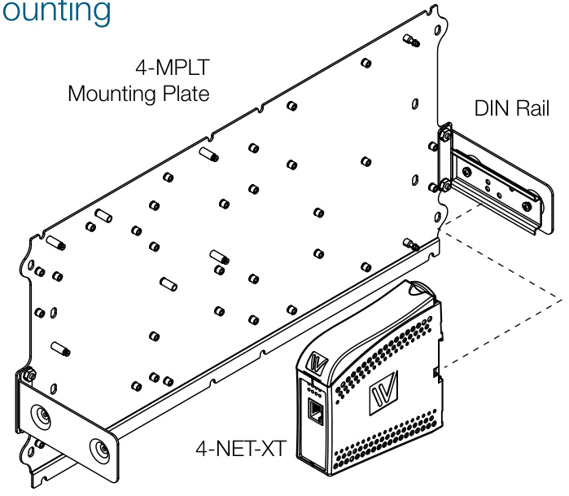
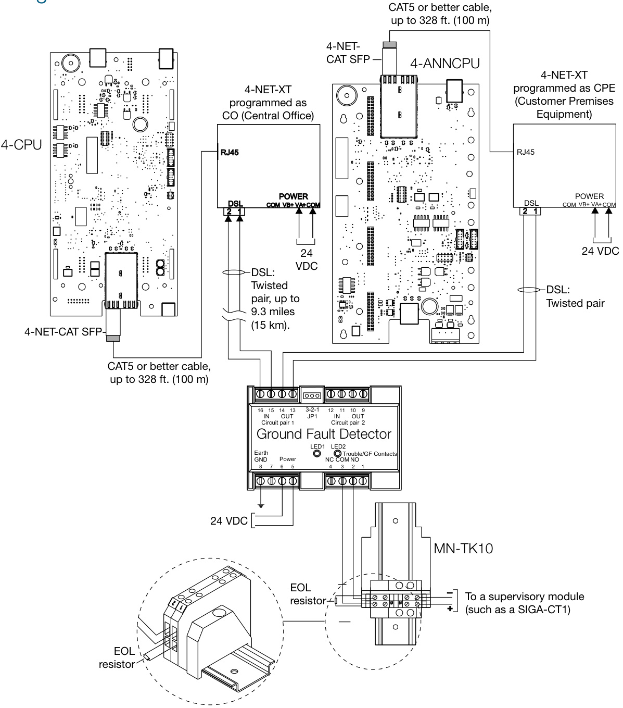

# EST4 Network Extender Module 4-NET-XT  

# Overview  

The 4-NET-XT network extender provides long distance network data among EST4 nodes or to third-party systems. It typically uses existing unshielded telephone single-pair wires or CAT5 or better cables. The expander allows connections of up to nine miles $:14.5\,\mathsf{k m})$ .  

Two 4-NET-XT modules are needed to complete a circuit path: one at either end of the cable run. The 4-NET-XT data rate is 192 kbps. It automatically senses the cable type, which helps simplify setup.  

The 4-NET-XT has on-board status LEDs that provide quick visual indication of Power, DSL status, Ethernet status, and link trouble indication. Terminals are provided for 24Vdc from the panel, which provides full battery standby capability from the EST4 system.  

0508  

# Standard Features  

Allows the use of Existing Telephone Lines or CAT5 Cable Lower cost installation, reuse of existing copper wire.  

Up to Nine Miles Between Panels Much farther than standard interconnect methods.  

Supports Panel Data and One Live Audio Page Channel Allows the extension of audio to remote areas with pre-recorded audio supported at each panel.  

Supports extension of EST4 Network or external connection Expands the life safety network, interface with third party equipment.  

# Application  

4-NET-XT extenders work in pairs one is configured as CO (Central Office), and one as CPE (Customer Premises Equipment). The 4-NET-XT must be used with a GFD Ground Fault Detector.  

The 4-NET-XT encapsulates EST4 network data or ECP-XML protocol and transmits it using a DSL (Digital Subscriber Line) link. Each 4-NET-XT has a connection for one twisted pair cable supporting Class B installations. Class A configuration is possible by adding another pair of 4-NET-XT modules. The 4-NET-XT is DIN rail mounted. Up to two extenders can mount on a 4-MPLT mounting plate.  

The 4-NET-XT extenders are compatible with EST4 systems using digitized audio, and can support voice paging between panels. They do not support transmission of fire fighters’ telephone signals.  

# Mounting  

  

# Typical Wiring  

  

# Engineering Specification  

The intra-panel communications links for network shall utilize copper and/or fiber optic connections. The communications interface card shall provide Class B <Class A> connections. It shall be possible to convert from DSL connections to Ethernet wiring or from Ethernet wiring to DSL wiring at any network panel. The DSL communications interface card shall have provisions for testing its connections for maintenance and troubleshooting purposes. Ground fault detection shall be supported on all intra-panel communications.  

Technical Specifications   

<html><body><table><tr><td>Voltage 24VDC</td><td></td></tr><tr><td>CurrentAlarm/Standby</td><td>150mA@24VDC</td></tr><tr><td>DSLWireSize</td><td>SeeDSLwiresizeanddistancetable</td></tr><tr><td>DSLDatarate</td><td>192kbit/s</td></tr><tr><td>EthernetCable</td><td>CAT5orbetter,unshielded(UTP)</td></tr><tr><td>EthernetTransmission</td><td>Up to328 ft.(100m)</td></tr><tr><td>MountingEnclosure</td><td>Mountson4-MTPLin3-CAB7，3-CAB14， 3-CAB21,3-RCC7,3-RCC14,and3-RCC21</td></tr><tr><td>Operatingenvironment</td><td>TemperatureRelativeHumidity32to120°F (0to49°C)0to93%noncondensing</td></tr><tr><td>AgencyApprovals</td><td>UL,ULC,FM,CSFM</td></tr></table></body></html>

Note: The 4-NET-XT supports a single audio IP stream of live paging or 1 VRMS input in addition to pre-recorded audio. A network with 4-NET-XT connections supports a maximum of 15 nodes.  

# DSL Wire Size and Distance  

<html><body><table><tr><td>AWG</td><td>(mm2)</td><td>Distance</td></tr><tr><td>24</td><td>(0.205)</td><td>7 miles (11 km)</td></tr><tr><td>22</td><td>(0.326)</td><td>9 miles (14 km)</td></tr><tr><td>20 [1]</td><td>(0.519)</td><td>13 miles (20 km)</td></tr></table></body></html>

[1] 20 AWG or larger  

<html><body><table><tr><td>Model # (SKU)</td><td>Description</td><td>Shipping Weight</td></tr><tr><td>4-NET-XT</td><td>NetworkExtenderModule-Mountsto DINrailon4-MPLTorderedseparately</td><td>0.8lb (0.34kg)</td></tr><tr><td colspan="3">Accessoriesandrelatedequipment</td></tr><tr><td>4-MPLT</td><td>Mounting Plate,mounts in Chassis or BatterySpace</td><td>4.3lb (1.95kg)</td></tr><tr><td>GFD</td><td>GroundFaultDetector</td><td>0.35lb (0.16kg)</td></tr><tr><td>4-NET-CAT</td><td>SFPNetworkController,CAT5UTP Copper,100Base-TX</td><td>0.2lb (0.09kg)</td></tr><tr><td>4-FWAL- CAT</td><td>SFPNetworkFirewallAdapter,CAT5 UTPCopper,100Base-TX</td><td>0.2lb (0.09kg)</td></tr></table></body></html>  