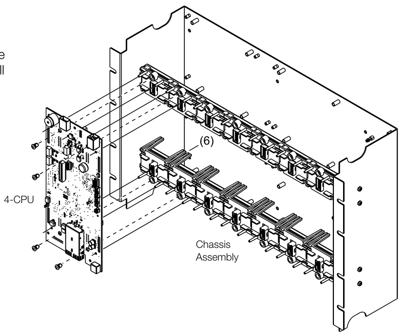

# EST4 Central Processing Unit 4-CPU  

# Overview  

EST4’s Central Processing Unit, the 4-CPU, is a control panel card that manages data generated by local modules and acts as a nexus for system-wide network communication. It accomplishes this by pulling data from local rail modules in real time and facilitating both intra-module data exchange, and inter-node communications with remarkable speed and efficiency.  

The 4-CPU is, in essence, the gatekeeper for events reported to modules from field devices; it is the controller of audio data; the caretaker of event logs; the guardian of security; and, the link to central monitoring facilities. The EST4 Emergency Communications Platform is built upon system nodes, and the 4-CPU is controller of the nodes.  

The hardware that supports 4-CPU operation is robust enough to handle the complex and critical tasks it is assigned. The 4-CPU’s eight gigabytes of on-board memory storage holds nearly two hours of pre-recorded audio messaging, as well as an expansive project database. It also holds a large on-board history – large enough to handle more than 10,000 alarm events – and room to store up to 10,000 locked or frozen events held for investigative purposes.  

Thanks to its self-configuring network, EST4 nodes easily deploy and configure without intervention by network administration personnel. They adapt to a wide range of network configurations, including rings, stars, redundant segment, and full mesh topology. The 4-CPU even allows changes in the physical layer from copper to fiber, and employs hot-swappable network connections. All this improves network reliability and saves money at installation time and throughout the equipment’s life cycle.  

# Standard Features  

20,000 event history Large history ensures system events are captured plus additional 10,000 event EST4 History Freeze function. SFP style Network Communications Media Options Supported media types include, twisted pair, CAT5, Single and Multimode Fiber in any combination.   
Up to 750 Minutes of Stored Voice Messages Memory is standard on-board. No need for additional modules.   
USB V2.0 Type A Host Port High speed connection for printers and hubs.   
USB V2.0 Type B Device Port High speed connection supports laptops. Integrated Audio Synchronization The 4-CPU synchronizes audio signals across the network, ensuring clear messaging over long distances. Optional Form C Alarm, Supervisory, Trouble Contacts Space for the 4-COMREL Common Relay Module. Relays are rated 30Vdc at 1A. Supports wire sizes from 18 to 12AWG. Optional USB Hub Expands the USB capability of the CPU to meet application   
needs, comes with RS-232 port. Optional Audio Support Space provided for the 4-AUDTELS Audio I/O and Telephone   
Riser source module. Simple Plug-in Design   
Easy installation, no special tools required, CPU simply plugs onto the panel rail.  

# Application  

The 4-CPU makes EST4 an extremely powerful and flexible system. Systems may comprise a single standalone node, while larger installations comprise an integrated network. These may include many nodes communicating via IPv6 over several different types of fire-listed wiring, including fiber optics, twisted pair, and CAT5 cabling. Regardless of the system size, a single 4-CPU node controls up to 19 additional local rail modules.  

The 4-CPU controls all local panel responses to automatic, user initiated, or network-reported events. As a network node, it is an equal among peers: there is no master on the network. This gives exceptional response times of less than three seconds.  

# Intra-module Communications  

Upon power-up the processor automatically learns all local rail module attributes and locations; it negotiates with other life safety CPUs at nodes on the IPv6 network; and, it automatically enables the full support for cyber security protocols tested to meet FIPS Publication 197. This security applies optionally to a single panel, or throughout the entire EST4 network. The 4-CPU automatically configures the EST4 network thanks to integrated plug-and-play setup and auto address. No IT network administrator is required.  

The EST4, 4-CPU on-board USB ports make inner panel wiring simple. The majority of interconnections are made with standard USB 3.0 cables supplied as standard with most option modules. The USB interconnect runs at speeds of up to 480 Mbps, ensuring fast system data transmission.  

This fast data transmission is used, not only for inner panel communication, but also for external communications through a 4-FWAL to the FireWorks graphical user interface, printers, and other systems needing integration to the life safety system.  

# Inter-Panel Neworking  

Each 4-CPU provides two SFP slots supporting hot-swappable modules that determine the media type in use at the panel. The 4-CPU also supports the 4-AUDTELS Audio Telephone Riser Module. This enables audio, local microphone connection, and firefighter telephone connection. The 4-CPU supports connection of optional common relays, 1 Vrms audio in- and out-terminals, and firephone riser connection — all of which provide removable field wiring terminal blocks.  

For enhanced survivability, SFP network controller modules are hot swappable and mount to the slots on the 4-CPU. The network connection supports panel-to-panel data, voice audio, and firefighters telephone all on the same cabling – no separate interconnections needed. Should the application call for it, cabling can be installed that allows all inter-panel network data – including panel data, voice audio, and firefighters telephone – to be transmitted on a single twisted pair or single fiber optic fiber. This helps speed setup time and cuts installation costs.  

Network physical interconnection options offer a range of solutions from twisted pair running at 2 Mbps and supporting distances of up to 5,000 ft. $(1.5\,\mathsf{k m})$ between any two panels. When running at 0.2 Mbps, even longer distances are possible – up to 50,000 ft. $:15\,{\mathsf{k m}})$ .  

Single-mode, multimode, and even CAT5 cabling options are possible with EST4. The 4-CPU also meets redundancy and survivability requirements of many cabling needs, including Class A, Class B, Class X, and Class N. CAT5 installations are not limited to Class N wiring style: the network can be engineered to meet Class A, Class B, and Class X configuration when the project requires distances of up to 3,280 ft.  

Network messages received by the network communications controllers are re-transmitted to the next network panel. This re-transmission maximizes the wire run lengths between panels.  

Should the related central processor stop operating to specifications, fail-safe protocols built into EST4 network controller cards connect the data input directly to the output ports. This operation provides a back-to-back passthrough mode for most media type to media type and maintains network connectivity, not only during a catastrophic failure of a single panel, but also in the event that the panel is powered down for servicing. This keeps the fire network up and running at all times. For greater serviceability, any powered-down panel maintains its real time clock for up to 30 minutes — even if the panel has all power sources removed, including main and standby sources.  

# Installation  

The 4-CPU mounts in the first two local rail spaces of the upper 3-CHAS7 module chassis. Options for the 4-CPU include a color LCD display and user interface, a wide selection of small form-factor pluggable (SFP) network controller modules, USB internal panel connections, common relays, audio, and fire fighters telephone communication cards.  

  

# Engineering Specification  

It must be possible to support a single standalone node or multiple nodes communicating on a TCP/IP, IPv6 network that supports mesh configuration. The network shall support physical media connections via fiber, twisted pair or CAT 5 in any combination. The Network shall support data transmission of panel-to-panel data, voice audio and firefighter telephone data on a single twisted pair or single fiber optic cable. The Network shall be configured as Class A or Class B or Class X configuration. Networks restricted to Class N wiring shall not be acceptable. Network shall support a back-to-back pass-through mode that shall maintain network connectivity on power down or catastrophic failure of a single panel. The network shall support twisted pair links to 5,000 ft., CAT 5 links to 3,280 ft., and fiber links to 130,994 ft.  

The network shall support hard copy report printing to a system printer connected to any panel in the network, systems that require reports be run from the panel that has a printer connection shall not be considered equal. The systems LCD display shall provide color graphics display of maintenance and sensitivity reports.  

The system shall support multiple languages/dialects and Unicode character set.  

The Control panel and network shall not use easily removable devices, such as SD cards or external storage devices for storage of system critical information including programming and project files. Communications outside the life safety network shall meet the requirements of FIPS Publication 197.  

Security-relevant information, such as: failed login attempts, failed unauthorized accesses, and user modification shall be logged to panel history. Unsuccessful authentication attempts shall not leak information regarding the presence of the system or users. Credentials shall only be transmitted that are encrypted. The system shall provide for multiple users, roles shall be provided for users to ensure proper access by user for the role they perform on the system. All passwords shall use a cypher algorithm for security purposes to protect any sensitive information. No passwords shall be visible as plain text within the database or entire system.  

Sensitive information shall not be logged to history or displayed on service tools (e.g. passwords, PINs etc.).  

The system shall support configuration of multiple IP connections to external services including, central stations, email servers, web interfaces, reports, and third party integration.  

Email messages shall support multiple languages in native characters that match the languages supported in the panel. Email messages shall support symbolic and color alarm event highlighting.  

The system shall support logging of up to 20,000 chronological events using FIFO. Is shall be possible to freeze or store the most recent 10,000 events separately from the FIFO log.  

It shall be supported to download all applications and firmware from the configuration computer at a single location on the fire network. The system shall support upload of a project file from any location on the fire network.  

<html><body><table><tr><td>Current Standby Alarm</td><td>211mAat24Vdc</td></tr><tr><td>Common relays</td><td>Seethe4-COMRELCommonRelayModule Installation Sheet (P/N 3102284- EN)</td></tr><tr><td>UniversalSerialBus (USB) ports</td><td>1 USB 3.0, Type A - female port 1 USB 3.0, Type B -female port</td></tr><tr><td>USB cables[1]</td><td>4-CABLUSBSM - 3.0 USB, 29.5 in.(0.75 m), included. 4-CABLUSBLG - 3.0 USB, 59.0 in.(1.5 m), sold separately.</td></tr><tr><td>SFP modules</td><td>Refer to theSFP catalog sheetE85014-0008 for a list of compatible SFP modules.</td></tr><tr><td>AgencyApprovals</td><td>UL, ULC, FM, CSFM</td></tr><tr><td>Wire size TB1 network backup power connection</td><td>12 to 18 AWG (2.5 to 1.0 mm2)</td></tr><tr><td>Groundfaultimpedance</td><td>5 kQorless</td></tr><tr><td>Operatingenvironment Temperature Relative humidity</td><td>32to120F(0 to49°C) 0 to 93% noncondensing</td></tr></table></body></html>

[1] Only use listed USB cables. Retail USB cabling is not sufficient for this application.  

# Ordering Information  

<html><body><table><tr><td>Model # (SKU)</td><td>Description</td><td>Shipping Weight</td></tr><tr><td>4-CPU</td><td>Central Processor Module</td><td>0.95lb (0.43kg)</td></tr><tr><td>Accessories andrelated equipment</td><td></td><td></td></tr><tr><td>4-AUDTELS</td><td>Audio and Telephone Interface/Riser Source Module</td><td>0.65lb (0.29kg)</td></tr><tr><td>4-COMREL</td><td>Common Relay Module</td><td>0.25lb (0.11kg)</td></tr><tr><td>4-NET-MM</td><td>SFPNetworkController,Multimode, Dual-Fiber, 100Base-FX 1310nm</td><td>0.248lb (0.112kg) 0.248lb</td></tr><tr><td>4-NET-SM</td><td>SFP Network Controller, Single-Mode, Dual-Fiber, 100Base-LX10 1310nm SFP Network Controller, Single-Mode,</td><td>(0.112kg)</td></tr><tr><td>4-NET-SMH</td><td>high power output, Dual-Fiber, 100Base-LX401310nm</td><td>0.248lb (0.112kg)</td></tr><tr><td>4-NET-TP</td><td>SFP Network Controller, 2Mbps Shared TX/RX, Twisted Pair SFP Network Controller, 0.3Mbps</td><td>0.2lb (0.091kg)</td></tr><tr><td>4-NET-TP-HC</td><td>Shared TX/RX, High Capacitance Twisted Pair</td><td>0.2lb (0.091kg)</td></tr><tr><td>4-NET-CAT</td><td>SFP Network Controller, CAT5 UTP Copper, 100Base-TX SFP Network Controller, Single-Mode,</td><td>0.2lb (0.091kg)</td></tr><tr><td>4-NET-SMD</td><td>Single-Fiber, Downlink, 100Base-BX10-D 1550nm/1310nmTx/Rx</td><td>0.248lb (0.112kg)</td></tr><tr><td>4-NET-SMU</td><td>SFP Network Controller, Single-Mode, Single-Fiber, Uplink, 100Base-BX10-U 1310nm/1550nmTx/Rx,</td><td>0.248lb (0.112kg)</td></tr><tr><td>4-USBHUB</td><td>USB Multiport Hub Module</td><td>0.85lb (0.39kg)</td></tr><tr><td>4-CABLUSBLG</td><td>Cable, USB 3.0 A-B, Male, Long</td><td>0.31lb (0.14kg)</td></tr><tr><td>4-CABL0542</td><td>Cable interconnects the 4-CPU to the inner door rail when no 4-LCD display is installed in the cabinet.</td><td>0.58lb (0.26kg)</td></tr></table></body></html>  