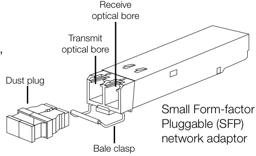
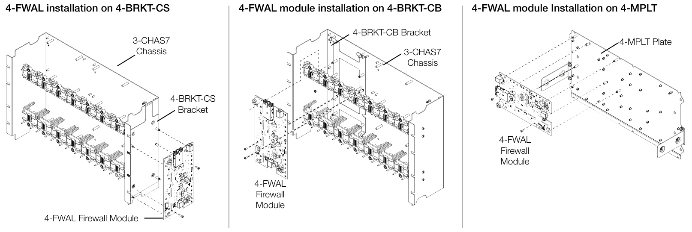

# EST4 Network Firewalls 4-FWAL Series  

# Overview  

The security and integrity of the EST4 network is paramount to its ability to maintain systems operations in the face of outside threats. The most vulnerable point of contact for any integrated building system is where it meets the facility owner’s existing TCP/IP network. Ironically it is this gateway, which enhances and expands system capability beyond the communications network, that also exposes the system to some of its most critical vulnerabilities. 4-FWAL Series firewalls mitigate those vulnerabilities by providing a barrier between the EST4 life safety platform and the external connections necessary in today’s networked building infrastructure.  

4-FWAL firewalls communicate to other EST4 panel modules including the 4-CPU, 4-ANNCPU and 4-NET-AD. Each 4-FWAL firewall also has two small form-factor pluggable (SFP) slots that support its network adapters. These are used to connect to external networks, and provide physical layer options for connections between outside equipment and EST4 CAT or fiber cabling. 4-FWAL firewalls support both IPv4 and IPv6 networks, thus removing concern over network addressing compatibility.  

EST4 firewalls are mounted inside the control panel. Panel power and communications is provided via a single internal USB cable. All firewalls provide engineered cybersecurity measures, including hashing of passwords, authentication, and encryption. The 4-FWAL series provides the interface between the fire system networking and the facility intra-net. EDWARDS recommends the installation of robust commercial firewall between the facilities intra-net and the Internet. To further enhance network security, an optional tamper switch may be installed on EST4 cabinet doors. This alerts the system when equipment enclosures accessed.  

# Standard Features  

Secure Interface between EST4 and Outside Networks Select the version of Firewall to support the features needed for the project from support for printers and Graphics through IP integration with central stations, web services, e-mail. Multiple Physical Connection Options   
Hot pluggable SFP-style network adapters allow selection of media including fiber and CAT cables.   
Simple Interconnection with Panel Modules   
Connection within the control panel is via USB cable.   
Fully Listed as Part of the Fire System   
End-to-end protection from external cyber threats.   
Employs the latest Encryption Technology   
Secure AES 256 algorithms per FIPS197 are used   
IPv4 and IPv6 Support   
Compatible with local network addressing methodology.  

# Application  

4-FWAL firewalls make EST4 a safe and secure system for external connections. They meet Advanced Encryption Standard (AES), thus ensuring that the system is effectively insulated from malware that may exist on external networks. The EST4 proxy firewall uses Advanced Encryption Standard (AES) encryption and secure protocols making it FIPS Pub 197 certified. The FIPS, Federal Information Processing Standards, are the most current and most advanced encryption protocols administered by the National Institute of Standards and Technology (NIST).  

All 4-FWAL Series firewalls provide the same high level of security and can be configured to meet the individual needs of the application. They come standard with one 3.0 Type A USB port  

and one 3.0 Type B USB port for connection to internal equipment, as well as two small form-factor pluggable (SFP) network adaptor connectors for connection to  

  

Each 4-FWAL SFP slot supports connection directly to external equipment, or may connect to a switch in order to allow single point connection to multiple communications paths.  

SFP adaptors are selected based on the physical layer needs of the facility infrastructure. Five versions are available, each for a different media type. They are hot swappable, so there is no need to power-down the system when changing out adaptors.  

National and local codes and standards should be followed to ensure compliance with the options selected. Refer to the EST4 UL Listing Document P/N 3102302-EN for additional detail.  

# Engineering Specification  

The systems shall support integrated Firewalls meeting the requirements of FIPS publication 197. It shall track relevant security information such as: failed login attempts, failed unauthorized accesses, and user modification shall be logged to panel history. Unsuccessful authentication attempts shall not leak information regarding the presence of the system or users. Credentials shall only be transmitted that are encrypted. The system shall provide for multiple users. Roles shall be provided for users to ensure proper access by user for the role they perform on the system. All passwords shall use a cypher algorithm for security purposes to protect any sensitive information. No passwords shall be visible as plain text within the database or entire system.  

Sensitive information shall not be logged to history or displayed on service tools (e.g., passwords, PINs etc.).  

The system shall support configuration of multiple IP connections to external services including, <central station>, <email servers>, <web interfaces>, <reports>, and <third party integration>. Email messages shall support multiple languages in native characters that match the languages supported in the panel. Email messages shall support symbolic and color alarm event high lighting.  

The system shall support connection to external services via <single-mode fiber>, <multimode fiber>, <CAT $_{5>}$ . Connections to external systems shall be hot swappable removing the need to power down the life safety systems when deploying connections to external services. A minimum of eight external services shall be supported per Firewall. The system shall support installation of multiple Firewalls on the life safety network providing flexibility of connections to external services. A single point of connection into the system is not acceptable.  

# Mounting  

  

<html><body><table><tr><td>Features</td><td>4-FWAL1</td><td>4-FWAL2</td><td>4-FWAL3</td><td>4-FWAL4</td></tr><tr><td>Eightconcurrentservices</td><td></td><td></td><td></td><td></td></tr><tr><td>FireWorkssupport</td><td></td><td></td><td></td><td></td></tr><tr><td>3rdpartyECP-XMLsupport</td><td></td><td></td><td></td><td></td></tr><tr><td>Supportsdownstream4-USBHUBforprintersandCDR-3connections</td><td></td><td></td><td></td><td></td></tr><tr><td>IP-DACT (dialer) support for Sur-Gard IPreceivers</td><td></td><td></td><td></td><td></td></tr><tr><td>Web services (End user connectionfor standard reports)</td><td></td><td></td><td></td><td></td></tr><tr><td>E-mailserverconnectivity</td><td></td><td></td><td></td><td></td></tr></table></body></html>

\*Does not use nor requires a Firewall CPU for serial printer support.  

# Technical Specifications  

SFP Cabling Specifications   

<html><body><table><tr><td>SFPnetwork adapter</td><td>Wavelength (nm)</td><td>Fibertype</td><td>Coresize (microns) [1]</td><td>Modalbandwidth (Mhz/km) [2]</td><td>Cabledistance Miles (km)</td></tr><tr><td>4-FWAL-MM [2]</td><td>1310</td><td>OM1/OM2</td><td>62.5um/50um</td><td>500</td><td>1.24 miles (2 km)</td></tr><tr><td>4-FWAL-SM</td><td>1310</td><td>G.652</td><td>9</td><td>N/A</td><td>6.2 miles (10 km)</td></tr><tr><td>4-FWAL-SMH</td><td>1310</td><td>G.652</td><td>9</td><td>N/A</td><td>24.8 miles (40 km)</td></tr><tr><td>4-FWAL-SMU</td><td>1310</td><td>G.652</td><td>9</td><td>N/A</td><td>6.2 miles (10 km)</td></tr><tr><td>4-FWAL-SMD</td><td>1550</td><td>G.652</td><td>9</td><td>N/A</td><td>6.2 miles (10 km)</td></tr></table></body></html>

[1] G.652, listed under core size for single mode fiber (SMF), refers to an ITU-T standard of commonly deployed non-dispersion-shifted single mode fiber with a core size of approximately 8 to 10 microns (μm). [2] The maximum cable distance will be reduced when using fibers with less than 500 MHz/km bandwidth. For example, a 62.5u/125u step-index fiber may have a modal bandwidth as low as 160 MHz/km. This translates to a maximum 100Base link length of about $640\;\mathrm{m}$ . If 100u core fiber is installed, the length could be reduced to about $150\;\mathrm{m}$  

SFP Optical Specifications   

<html><body><table><tr><td rowspan="2">SFPnetwork adapter</td><td rowspan="2">Transceivertype</td><td colspan="2">Transmitpower(dBm)</td><td colspan="2">Receive power(dBm) Max</td><td rowspan="2">Maxchannelinsertionloss</td><td rowspan="2">Transmitandreceive wavelength (nm)</td></tr><tr><td>Min</td><td>Max</td><td>Min</td><td>in dB (by fiber type)[1]</td></tr><tr><td>4-FWAL-MM</td><td>100Base-FX</td><td>-20</td><td>-14</td><td>-31</td><td>-14</td><td>10 (62.5/125umOM1)</td><td>1300/1300</td></tr><tr><td>4-FWAL-MM</td><td>100Base-FX</td><td>-20</td><td>-14</td><td>-31</td><td>-14</td><td>5(50/125umOM2)</td><td>1300/1300</td></tr><tr><td>4-FWAL-SM</td><td>100Base-LX10</td><td>-15</td><td>-8</td><td>-25</td><td>-8</td><td>5</td><td>1310/1310</td></tr><tr><td>4-FWAL-SMH[2]</td><td>100Base-LX40</td><td>-5</td><td>0</td><td>-33</td><td>-10</td><td>25 (10 dB min)</td><td>1310/1310</td></tr><tr><td>4-FWAL-SMU</td><td>100Base-BX1O-U</td><td>-14</td><td>-8</td><td>-27</td><td>-8</td><td>5</td><td>1310/1550</td></tr><tr><td>4-FWAL-SMD</td><td>100Base-BX10-D</td><td>-14</td><td>-8</td><td>-27</td><td>-8</td><td>5</td><td>1550/1310</td></tr></table></body></html>

[1] Maximum channel insertion loss is defined for maximum distance guaranteed as specified in the Cabling Specifications table above and by fiber type/core diameter. When links are deployed over shorter distances, additional channel insertion loss may be allowed. Actual performance may allow greater insertion loss. [2] 4-FWAL-SMH requires a minimum 10db insertions loss, if the insertion loss is less than 10db a single mode attenuator is required to obtain the minimum 10db loss.  

# Wiring  

4-FWAL Specifications   

<html><body><table><tr><td>Voltage 16 to32Vdc</td><td></td></tr><tr><td>Current:Standby</td><td>128mAat16Vdc 92mAat24Vdc</td></tr><tr><td>Alarm/Active</td><td>77mAat32Vdc 129mAat16Vdc 92mAat24Vdc 79mAat32Vdc</td></tr><tr><td>USBPorts</td><td>One Type A host (female port) requires use of V3.0 USB cable One Type B device (female port) requires use of V3.0 USB cable</td></tr><tr><td>Services</td><td>Up to8concurrent</td></tr><tr><td>PhysicalConnections</td><td>Two, max.</td></tr><tr><td>Agency OperatingEnvironment</td><td>UL,ULC,FM,CSFM</td></tr><tr><td>Temperature Relativehumidity Oto93%noncondensing</td><td>32to120°F(0to49°C)</td></tr></table></body></html>  

  

4-FWAL-CAT Specifications   

<html><body><table><tr><td>Current</td><td>27 mA</td></tr><tr><td>Mounting</td><td>SFPslotin4-FWALseries</td></tr><tr><td>Cabletype</td><td>Cat5eorbetter</td></tr><tr><td>CableConnector</td><td>RJ-45</td></tr><tr><td>Distance</td><td>328ft.(100m)max.betweentwointerfaces</td></tr><tr><td>Agency</td><td>UL, ULC, FM, CSFM</td></tr><tr><td>OperatingEnvironment</td><td>Temperature32to120°F(0to49°C)Relativehumidity0to93% noncondensing</td></tr></table></body></html>  

# Ordering Information  

<html><body><table><tr><td>Model # (SKU)</td><td>Description</td><td>Shipping Weight</td></tr><tr><td>4-FWAL1</td><td>Firewall-Provides secure connection to external systems. Supports up to eight concurrent IP connections. Provides support for connection to 4-USBHUB with printer and/or CDR3, SFP connection to FireWorks and other supported</td><td>1.0lb (0.43kg)</td></tr><tr><td>4-FWAL2</td><td>external connections. FireWall with DACT/Web support</td><td>1.0lb (0.43kg)</td></tr><tr><td>4-FWAL3</td><td>FireWall with EMAIL/Web support</td><td>1.0lb (0.43kg)</td></tr><tr><td>4-FWAL4</td><td>FireWallwithDACT/EMAILWebsupport</td><td>1.0lb (0.43kg)</td></tr><tr><td colspan="2">Accessories and related equipment</td><td></td></tr><tr><td>4-FWAL-MM</td><td>SFP Network Firewall Adapter, Multimode, Dual-Fiber, 100Base-FX 1310nm</td><td>0.25lb (0.11kg)</td></tr><tr><td>4-FWAL-SM</td><td>SFP Network Firewall Adapter, Single-Mode, Dual-Fiber, 100Base-LX10 1310nm</td><td>0.25lb (0.11kg)</td></tr><tr><td>4-FWAL-SMD</td><td>SFP Network Firewall Adapter, Single-Mode, Single-Fiber, Downlink,100Base-BX10-D 1550nm/1310nm Tx/Rx,works with 4-FWAL-SMU</td><td>0.248lb (0.11kg)</td></tr><tr><td>4-FWAL-SMU</td><td>SFPNetworkFirewallAdapter,Single-Mode,Single-Fiber, Uplink, 100Base-BX10-U 1310nm/1550nm Tx/Rx works with 4-FWAL-SMD</td><td>0.25lb (0.11kg)</td></tr><tr><td>4-FWAL-SMH</td><td>SFP NetworkFirewallAdapter,Single-Mode,Dual-Fiber, 100Base-High Output 1310nm,</td><td>0.25lb (0.11kg)</td></tr><tr><td>4-FWAL-CAT</td><td>SFP Network Firewall Adapter, CAT5 UTP Copper, 100Base-TX,100Mbps</td><td>0.2lb (0.09kg)</td></tr><tr><td>4-MPLT</td><td>Mounting Plate, mounts in a chassis or battery space</td><td>4.3lb (1.95kg)</td></tr><tr><td>4-BRKT-CB</td><td>Mounting bracket for 4-FWAL series, allows mounting to the back of a 3-CHAS7.</td><td>1.1lb (0.49kg)</td></tr><tr><td>4-BRKT-CS</td><td>Mounting bracket for 4-FWAL series, allows mounting to the right side of a 3-CHAS7.</td><td>1.2lb (0.54kg)</td></tr><tr><td>4-CABLUSBLG</td><td>Cable, USB 3.0 A-B, Male, Long</td><td>0.3lb (0.14kg)</td></tr><tr><td>4-NET-XT</td><td>NetworkExtenderModule-MountstoDINrail on 4-MPLT ordered separately.</td><td>0.75lb (0.34kg)</td></tr></table></body></html>  