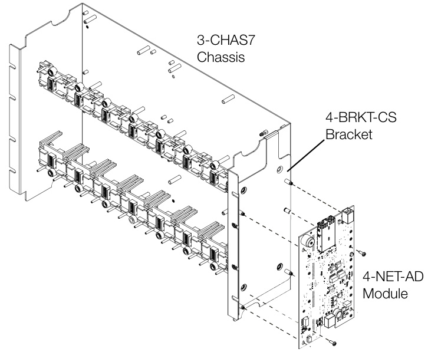
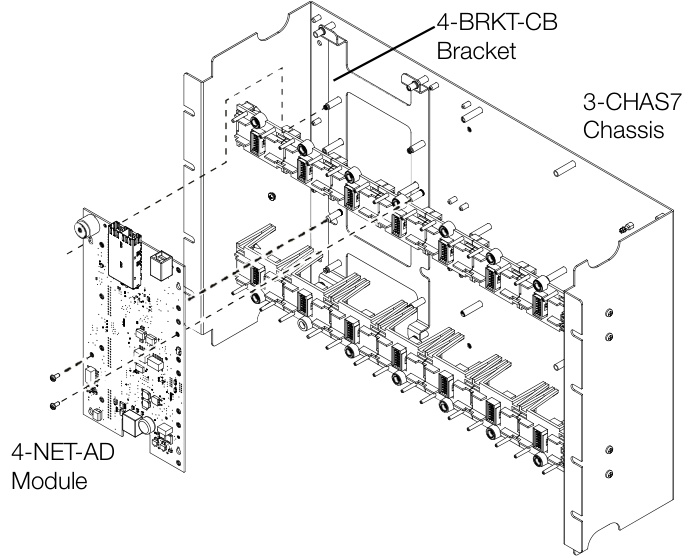
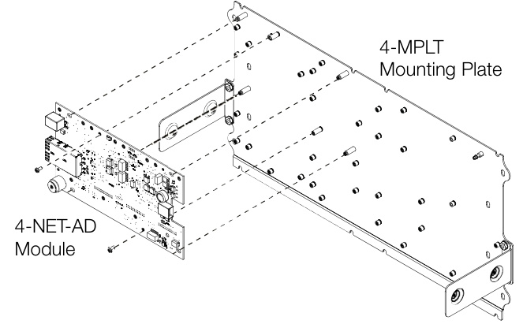

# EST4 Network Adder Module 4-NET-AD  

# Overview  

EST4’s 4-NET-AD Network Adder Module resides on EST4’s selfconfiguring IPv6 network. It provides two supplementary Small Form Factor Pluggable (SFP) network ports and two USB connectors. The SFP ports allow wiring to branch out of an EST4 cabinet to create star or mesh network configurations. The USB ports connect the adder module to the node’s 4-CPU board, establishing a communications link between the SFP ports and the life safety network. The USB interconnect may also act as an interface for local printers.  

Adding SFP and USB capacity to the EST4 network provides the system designer with significant flexibility when it comes to engineering a network that matches the needs of the project. The 4-NET-AD may be mounted in a number of locations including the back or side of a 3-CHAS7 chassis, on the 4-MPLT mounting plate, or within an annunciator enclosure.  

# Standard Features  

SFP-style Network Communications Media Options Two network communications SFP ports support twisted pair, CAT5, single- and multi-mode fiber in any combination. •	 Simple Mounting Mounting options include the EST4 chassis and annunciator enclosures, as well as the 4-MPLT mounting plate. On-board USB Ports One USB Type A host and one USB Type B device port.  

# Application  

The 4-NET-AD provides two SFP slots that support standard hotswappable EST4 network controller modules. The selection of the controller module determines the media type, i.e., fiber, copper, or CAT. Eight network controller models are available. Each one offers a different kind of connection.  

The network controller ports provided by the 4-NET-AD act as connection points to life safety network branches. This branching capability eliminates the limits of Class B or Class A configurations.  

# Extra ports add System Capacity  

The 4-NET-AD adds connections that transmit multiple types of data. In fact, a single network cable carries all panel-to-panel services: data, voice audio, and firefighters’ telephone. No separate interconnections are needed. This powerful feature reduces cable costs and installation time.  

Additional network controller ports provided by the 4-NET-AD facilitate a range of liberating network capacities. Twisted pair copper at 2 Mbps supports distances of up to 5,000 ft. $(1.5\,\mathsf{k m})$ between any two panels; up to 50,000 ft. $(15\;\mathsf{k m})$ at 0.2 Mbps. Single-mode, multimode, and even CAT5 cable solutions are also available.  

# End-to-end Network Security and Survivability  

Cabling options satisfy even the most demanding redundancy and survivability requirements. The EST4 network can be configured for Class A, Class B, Class X, and Class N wiring. CAT5 installations are not limited to Class N wiring style: the network can be designed to meet Class A, Class B, and Class X configuration with CAT5 cable.  

Failsafe mechanisms are built right into EST4 network controllers. Should a network controller or its connected adder module go offline, the input and output ports automatically connect directly to one another. This operation provides a pass-through degraded mode that maintains basic connectivity in the event of something as mundane as a routine power-down for servicing, or as critical as the catastrophic failure of a control panel. For further information on EST4 pass-through, see catalog sheet 85014-0008.  

4-NET-AD installation on 4-BRKT-CS  

  

4-NET-AD module installation on 4-BRKT-CB  

  

4-NET-AD module Installation on 4-MPLT  

  

# Engineering Specification  

The panel network shall communicate on a TCP/IP based, multicast IPv6 network that supports mesh configuration. The network shall support physical media connections via fiber, twisted pair or CAT5 in any combination. The Network shall support data transmission of panel-to-panel data, voice audio, and fire fighter telephone data on a single twisted pair or single fiber optic cable. The Network shall be configured as Class A or Class B or Class X configuration. Networks restricted to Class N wiring shall not be acceptable.  

The network shall support a back-to-back pass-through degraded-mode for any media type to any media type that shall maintain network connectivity on power down or catastrophic failure of a single panel.  

Communications outside the life safety network shall meet the requirements of FIPS publication 197. Security relevant information, such as failed login attempts, failed unauthorized accesses, and user modification shall be logged to panel history. Unsuccessful authentication attempts shall not leak information regarding the presence of the system or users. Credentials shall only be transmitted that are encrypted. The system shall provide for multiple users, roles shall be provided for users to ensure proper access by user for the role they perform on the system. All passwords shall use a Cypher Algorithm. Passwords must use a hash. No password or authentication shall be exposed in any format in the system database viewable as plain text.  

Sensitive information shall not be logged to history or displayed on service tools (e.g. passwords, PINs etc.).  

<html><body><table><tr><td>Voltage 16 to 32 Vdc</td><td></td></tr><tr><td>Current</td><td></td></tr><tr><td>Standby</td><td>128mAat16VDC 92 mA at 24 VDC</td></tr><tr><td>Alarm/Active</td><td>77mA at32VDC 129 mA at 16VDC 92 mA at 24 VDC 79mAat32VDC</td></tr><tr><td>Universal Serial Bus ports (USB)</td><td>1 USB 3.0,Type A connector 1 USB 3.0, Type B connector</td></tr><tr><td>Network Connection</td><td>TwoSFPslots(orderSFPmodulesseparately)</td></tr><tr><td>Mounting</td><td>Side or back of EST4 chassis, on the 4-MPLT mountingplate,inCAB and RCCseries enclosures. Also mounts directly to the back of 4-16ANNMTand4-24ANNMTenclosures.</td></tr><tr><td>Agency Listings</td><td>UL, ULC, FM, CSFM</td></tr><tr><td>Operating Environment Temperature Relative Humidity</td><td>32 to 120F (0 to 49°C) 0 to 93% noncondensing</td></tr></table></body></html>  

# Ordering Information  

<html><body><table><tr><td>Model # (SKU)</td><td>Description</td><td>Shipping Weight</td></tr><tr><td>4-NET-AD</td><td>NetworkAdderModule</td><td>1.0lb (0.43kg)</td></tr><tr><td colspan="3">Accessories andrelated equipment</td></tr><tr><td>4-NET-MM</td><td>SFP Network Controller, Multimode, Dual-Fiber, 100Base-FX 1310nm</td><td>0.248lb (0.11kg)</td></tr><tr><td>4-NET-SM</td><td>SFP Network Controller, Single- Mode, Dual-Fiber, 100Base-LX10 1310nm</td><td>0.25lb (0.11kg)</td></tr><tr><td>4-NET-SMH</td><td>SFP Network Controller, Single- Mode, high power output, Dual-Fiber, 100Base-LX40 1310nm</td><td>0.25lb (0.11kg)</td></tr><tr><td>4-NET-TP</td><td>SFP Network Controller, 2Mbps Shared TX/RX, Twisted Pair</td><td>0.2b (0.09kg)</td></tr><tr><td>4-NET-TP-HC</td><td>SFP Network Controller, 0.3Mbps Shared TX/RX, High Capacitance Twisted Pair</td><td>0.2lb (0.09kg)</td></tr><tr><td>4-NET-CAT</td><td>SFP Network Controller, CAT5 UTP Copper, 100Base-TX</td><td>0.2lb (0.09kg)</td></tr><tr><td>4-NET-SMD</td><td>SFP Network Controller, Single- Mode, Single-Fiber, Downlink, 100Base-BX10-D 1550nm/1310nm Tx/Rx</td><td>0.25lb (0.11kg)</td></tr><tr><td>4-NET-SMU</td><td>SFP Network Controller, Single- Mode, Single-Fiber, Uplink, 100Base- BX10-U 1310nm/1550nm Tx/Rx,</td><td>0.25lb (0.11kg)</td></tr><tr><td>4-USBHUB</td><td>USB Multiport Hub Module</td><td>0.9 (0.39kg)</td></tr><tr><td>4-CABLUSBLG</td><td>Cable,USB 3.0 A-B, Male, Long</td><td>0.3lb (0.14kg)</td></tr></table></body></html>

For further details on Network Controllers please refer to catalog sheet 85014-0008. For details on 4-USBHUB please refer to catalog sheet 850104-0016.  