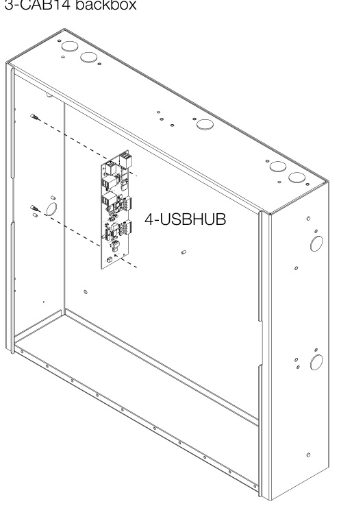
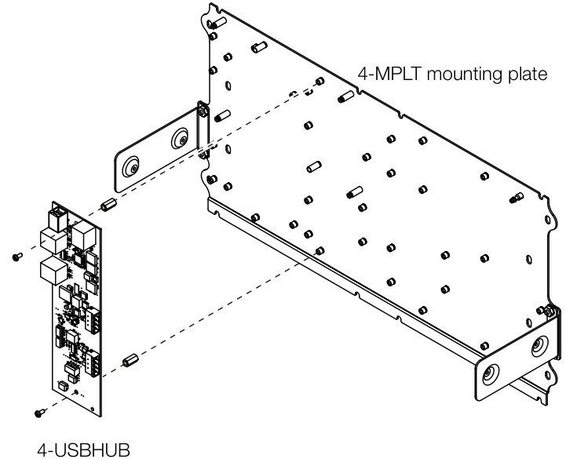
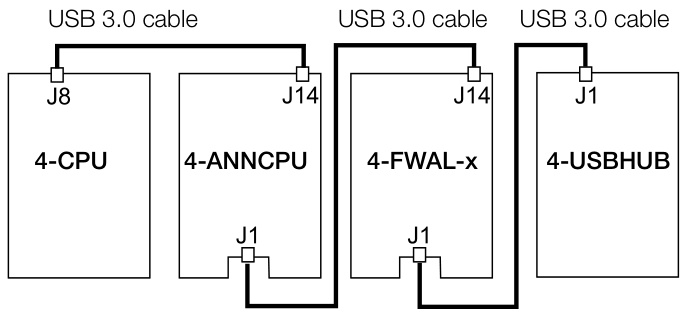
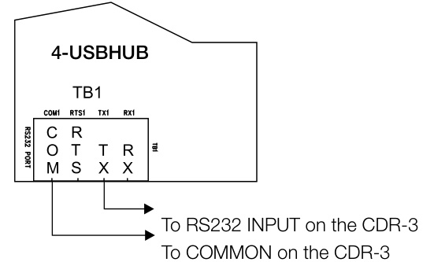

# EST4 USB Hub 4-USBHUB  

# Overview  

EST4 takes full advantage of high speed USB technology with internal modules supporting Type A and Type B connectors. When additional connections are needed, the 4-USBHUB provides an easily-implemented solution with two Type A isolated host ports, four Type A Non-isolated host ports, and one Type B device port.  

The 4-USBHUB is used to connect printers, and coders to the EST4 network. It may be installed in any network control panel or annunciator enclosure.  

# Standard Features  

Extends the number of USB Ports Available   
Efficient way to add USB ports for printers and laptops   
Isolated and Non-isolated USB Ports   
Extends ground fault detection to system printers   
One-half-footprint Mounted   
Multiple options for mounting within a cabinet   
CDR-3 Support   
RS-232 support for CDR-3 coders  

# Application  

The 4-USBHUB Multi-port USB Hub Module makes it easy to connect EST4 to external devices. It does away with special cables and RS232-to-USB conversion dongles, and allows direct high-speed connection with laptops for the exchange of configuration data. It does so quickly and efficiently with data transfer rates of up to 480 Mbps.  

Use the 4-USBHUB to connect printers to panels or remote annunciators for on-site event and report printouts. The printer is connected to one of the hub’s isolated Type A connectors. The 4-USBHUB can also be interfaced to a CDR-3 coder via RS-232 terminal connection. Terminal connections leave all USB ports available for use.  

# Mounting  

4-USBHUB installation in a 3-RCC7R The system shall provide USB connections for external peripheral devices including printers. Where a system printer is required to meet code the printer shall communicate to the system via USB, be supervised and support ground isolation.  

<The event and status printer shall be a nine-pin, impact, dot matrix printer with a minimum print speed of 232 characters per second. Print parameters shall be set up with a menu drive program in the printer. The printer shall be capable of serial or USB communications protocol. The communications speed for RS-232 communications protocol shall be adjustable from 300 to 9600 Baud. The connection to the printer from the panel shall be supervised. The printer shall list the time, date, type and user defined message for each event printed.> Alarm messages shall have a special character printed at the beginning of the message to allow easier location of alarm events on the print out.  

# Engineering Specification  

< Audible notification appliances shall be coded using a microprocessor based Positive, Successive, Non Interfering (PSNI) coder module. The coder shall have a capacity for 1,000,000 unique codes and be capable of storing pending codes without a loss of an active code or interference from a new code. The coder shall output four rounds of two, three, or four digit code sequences. The coder shall provide both 1 KHz audio tone output as well as a dry relay contact output. The coder shall output a continuous <temporal> <60/90 BPM march time> output at the end of the PSNI code sequence. In the event of a failure of the microprocessor, the coder shall automatically output a temporal code.  

  
4-USBHUB installation on a 4-MPLT  

  

# Typical Wiring  

# CPU connections to the 4-USBHUB  

  

The 4-USBHUB’s J1 connector may be connected directly to a 4-CPU, 4-ANNCPU, 4-NET-AD, 4-CPUGRPH, or 4-FWAL and must always be the last device on the data bus.  

RS-232 wiring to CDR-3  

  

<html><body><table><tr><td colspan="2">Current</td></tr><tr><td>Standby/Active</td><td>44 mA (zero nonisolated ports used) 129 mAper nonisolated ports used. 560mAforafullyloaded4-USBHUB. All fournon-isolatedportsused.</td></tr><tr><td>RS-232Ports</td><td>24 to 12 AWG (0.2 to 2.5 mm2)</td></tr><tr><td>USB Ports</td><td>TwoUSBTypeA-isolated hostports [1], FourUSBTypeA-non-isolatedhost</td></tr><tr><td>Mounting</td><td>ports, One USB Type B - device port MountsinhalffootprintspaceinCAB seriesand 4-ANNMTseriesenclosures.</td></tr><tr><td>Agencyapprovals</td><td>UL,ULC,FM, CSFM</td></tr><tr><td>Operating Environment</td><td></td></tr><tr><td>Temperature</td><td>32to120°F(0to49°C)</td></tr><tr><td>Relative Humidity</td><td>0 to 93% noncondensing</td></tr></table></body></html>

[1] For USB printer connections a USB Type 2 cable (sourced locally) is needed with Type A to Type B connectors. The maximum length supported is 16ft (5m). [2] Maximum USB cable length is 5 meters per the USB standard. For ancillary printer applications a USB extender may be used to extend the distance from the panel to the printer. For proprietary applications the printer must be located within 5 meters of the panel.  

# Ordering Information  

<html><body><table><tr><td>Model # (SKU)</td><td>Description</td><td>Shipping Weight</td></tr><tr><td>4-USBHUB</td><td>The4-USBHUBMulti-portUSB Hubmodule mounts ina12footprint modulespaceandprovidesisolated RS-232USBandterminalblock connectionsforRS-232toCDR connections.</td><td>0.9Ib (0.39kg)</td></tr><tr><td colspan="2">Accessoriesandrelatedequipment</td><td></td></tr><tr><td>4-CABLUSBLG</td><td>Optional Cable,USB3.0A-B,Male, length approx. 51in (1300 mm).</td><td>0.3lb (0.14kg)</td></tr><tr><td>4-CABLUSBSM</td><td>Cable,USB3.0A-B,Male,supplied with4-USBHUB,cablelength approx.29 in (750 mm).</td><td>0.3lb (0.14kg)</td></tr></table></body></html>  