# Conventional Fire Alarm Systems FX-10RD, FX-10R, FX-5RD, FX-5R  

# Overview  

Kidde brand conventional fire alarm systems consist of 5 and 10 zone fire alarm control panels (FACP), an optional integrated upload/download DACT (dialer), intelligent/analog type detector features, serial annunciator modules, and serial remote relay modules.  All FACPs and components are Listed to the 10th edition of the ANSI/UL 864 standard and CSFM/FDNY approved.  

These systems incorporate features designed to simplify installation, operation and maintenance, including front panel programming, one person walk testing, and selectable IDC and NAC types. In addition, when used with CleanMe -compatible smoke detectors, these con-trol panels provide intelligent type features such as remote mainte-nance alert and automatic drift compensation that significantly reduce the chance of a false alarm and simplify maintenance calls.  

Kidde systems are powerful enough to meet the demands of today’s life safety installations while leaving plenty of room to grow in the future. They support Class A operation by combining pairs of onboard IDCs or NACs to provide the necessary Class A circuits.  For example, the FX-10RD comes factory set to support 10 Class B IDCs and 4 NACs.  But it can be field-configured to provide 5 Class A IDCs (no Class B IDC’s), and 2 Class A NACs – or any other combination of circuits that fall within the circuit-pairing parameters.  

<html><body><table><tr><td>FX-10R(D)</td><td>FX-5R(D)</td></tr><tr><td>ClassBIDCs Up to 10</td><td>Up to 5</td></tr><tr><td>ClassAIDCs Up to 5</td><td>Up to 2</td></tr><tr><td>ClassBNACs Up to 4</td><td>Up to 2</td></tr><tr><td>ClassANACs Up to 2</td><td>1</td></tr><tr><td>NACPower 7.0 amps</td><td>3.5amps</td></tr><tr><td>Auxiliarypower 0.5amps</td><td>0.5amps</td></tr></table></body></html>

Notes:	Class A operation will reduce the number of available Class B IDCs and/or NACs, depending on the panel configuration. See Specifications for details.  

# Standard Features  

•	 Available in 5 and 10 zone (IDC) models   
•	 CleanMe® feature provides remote annunciation of a dirty detector   
•	 Automatic drift compensation with select detectors reduces false alarms and extends dust life   
•	 Listed to ANSI/UL 864 10th Edition Models with fully integrated upload/download DACT enables PC programming   
•	 Zone or NAC pairs convertible to single Class A circuits   
•	 Combination Waterflow and Supervisory IDCs NACs programmable by zone and individually selectable for notification appliances, continuous, temporal outputs, or coded   
•	 Front panel programmable simplifies installation and servicing Precision synchronization with compatible notification appliances and optional audible silence over two wires   
•	 On-board relays for Alarm, Supervisory and Trouble Optional serial bus relay modules are programmable for Common, Zone, or Matrix activation Optional serial bus remote annunciator family   
•	 One person walk-test (audible or silent) Optional City Tie and Reverse Polarity Modules   
Trim ring available for semi-flush mounting  

# Application  

Kidde conventional fire alarm systems provide smoke and fire detection, occupant notification and off-premises signaling for smallto medium-sized buildings.  

Each IDC can be configured for either Class B or Class A operation and one of eight operating modes:  

•	 Alarm –with or without smoke detector verification including discrimination of contact devices   
•	 Waterflow Alarm;   
•	 Waterflow Alarm/Supervisory (Combination IDC);   
•	 Supervisory (Latching/non-latching);   
•	 Monitor (non alarm or supervisory)   
•	 Signal Silence   
•	 Drill   
•	 Cross zoning  

NACs may also be configured for either Class B or Class A operation. Additionally, NACs can be individually configured for one of six outputs. These are Genesis, Genesis (A/V silenceable), Continuous, Temporal, Coded, and City Tie. The Genesis selection allows independent horn control over two wires and provides precision synchronization of notification appliances, all without the need for a signal master accessory.  

When configured for compatible notification appliances, the Alarm Silence function will silence connected audible appliances but strobes will remain active until the panel is reset. When Genesis Mode is selected, both the horns and strobes on compatible notification appliances will be synchronized across all NACs.  

Note:	 Zones may be selected for either latching or non-latching operation. Always check with your AHJ regarding approval of silencing audible while leaving strobes flashing.  

# Detectors with intelligent features at a conventional price  

When combined CleanMe® -compatible smoke detectors, Kidde systems provide intelligent features at a conventional price.  If a CleanMe® detector drifts out of the UL sensitivity range, Kidde’s patented remote maintenance reporting sends an alert to the control panel. This feature reduces the chance of a false alarm and simplifies service calls. In addition, CleanMe®  

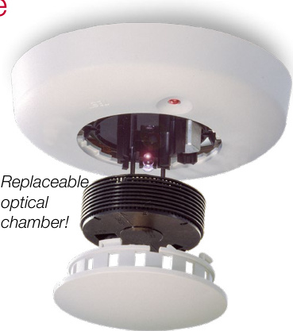  

-compatible smoke detectors have built-in drift compensation that extends the time between cleanings. If cleaning is ever necessary, it is literally a snap with the Kidde exclusive replaceable optical chamber. For a complete list of CleanMe® compatible smoke detectors, visit http://Kidde-fire.com.  

# Panel LED Display  

The following system LEDs display the panel’s status:  

•	 Alarm – panel is in the alarm state;   
•	 Trouble – panel is in the trouble state;   
•	 Supervisory – panel is in the supervisory state;   
•	 Power – indicates the status of the AC power source;   
•	 Disable – indicates when any IDC, NAC, relay or the DACT is disabled;   
•	 Annunciator Trouble – indicates trouble on the remote annunciator bus;   
•	 Battery Trouble – indicates battery or charging problems;   
•	 Ground Fault – indicates a short between any panel circuit and ground;   
•	 Walk Test – indicates that one or more IDCs are in the walk test mode;   
•	 Alarms Silenced – indicates that the panel is in the alarm state with one or more NACs silenced.   
•	 Waterflow – indicates that one or more circuits have detected an active waterflow switch.   
•	 Service Detector – indicates the presence of a dirty detector with CleanMe compatible ESL smoke detectors.   
•	 Remote Disconnect – indicates off site communication has been disabled.  

Each IDC has a disable switch and three LEDs:  

•	 Alarm – red – indicates that the IDC is in the alarm state; •	 Trouble – yellow – indicates that the IDC is in the trouble state or is disabled (when flashing); •	 Supervisory/Monitor – yellow – indicates that the IDC is in the supervisory state or the monitor state (when flashing).  

Each NAC also has a disable switch and a trouble/disable LED.  

# Status indication with the DACT/Dialer installed  

The optional upload/download dialer’s LCD display provides two lines $\times16$ characters of text.  For programming, the top line displays the programming step and the lower line displays the selected option. All system events are displayed on the LCD with custom zone messages. During normal operation, the LCD will display any off-normal condition present in the panel.  

# IP and Cellular Communications  

Several popular third-party IP/Cellular communicators have been tested with the FX conventional control panels and are compatibility listed to UL864. The IP/Cellular communicators meet NFPA72 2013 edition requirements for sole or secondary transmission paths. Using IP/Cellular communicators can reduce the cost of ownership by eliminating POTS lines. Please see the FX conventional control panel compatibility documentation part number 3101019-EN for a full list of compatible communicators.  

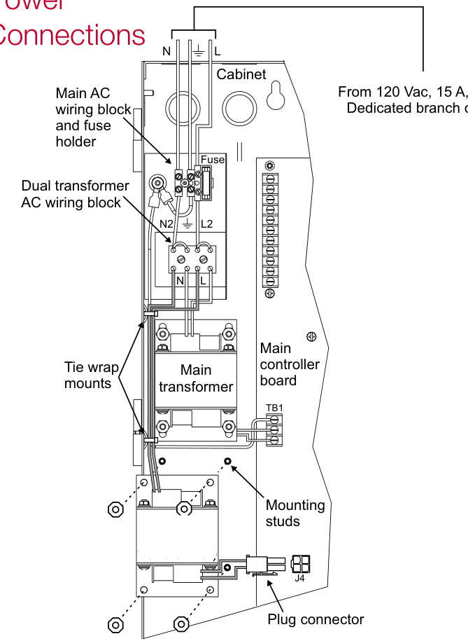  

# Upload/Download DACT/Dialer  

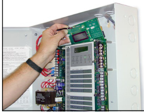  

The built-in DACT/Dialer is a multifunction module that provides communications, modem capability, and LCD display functions. Its primary function is as a Digital Alarm Communicator Transmitter (DACT). As a DACT, it transmits event messages to a Digital Alarm Communicator Receiver (DACR) at a monitoring facility. The monitoring facility then notifies the fire department and other responsible parties of the event. Programmable options include split or dual reporting to two DACRs.  

The DACT/Dialer installs behind the front panel display.  

The DACT module can also be used as a modem to connect the panel to both local and remote computers for uploading and downloading of configuration data (programming), panel status and event history. For security, the modem can be configured to accept programming on incoming calls or it can be required to call a preprogrammed number before accepting downloads and sending uploads.  

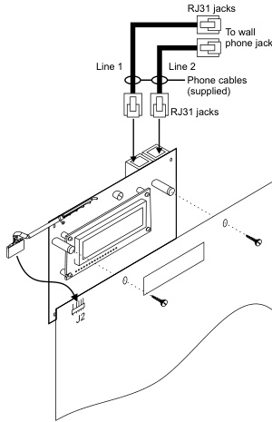  
Note: All panel versions are available with factory installed DACT. See order table for ordering information.  

The DACT module can be configured to work as all of the above, or as only an LCD display or LCD display and modem.  

# Options  

# Off-premise communication  

A fully integrated upload/download dialer is available for reporting events to a monitoring facility. The DACT also supports uploading or downloading of system configuration, status and event history. The DACT is programmable for either single or dual line operation. It also supports split and dual reporting for two digital alarm receivers.  

The DACT brings additional features to the panel including a 32-character alphanumeric LCD display, local or remote PC programming and an event history log.  

# Remote Annunciators and Relays  

The serial bus standard on Kidde conventional control panels is another installation time-saver. This circuit allows the connection of Remote System Indicators (FSRSI), Remote Zone Indicators  (FSRZIA, FSRZI-SA) and Remote Relay Modules (FSRRM24) over a fourwire (data and power) circuit. Annunciator and relay modules can be installed up to 1,000 feet from the panel on 18-gauge wire.  

Modules are also available for City Tie (CTM) and Reverse Polarity (RPM) connections.  

# Remote Relay Module  

The Remote Relay Module (FSRRM24) is one feature of the system that sets these systems apart from other panels in their class. This module has five Form C relays rated at 1 amp each. It can be configured to function in either a zone relay mode or a common system mode.  

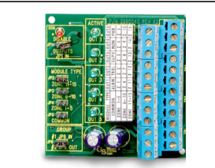  
The Remote Relay Module mounts on a plastic track inside an MFC-A cabinet.  

When configured in the zone relay mode, relays energize when the associated IDC is active. The module can be configured for activation by IDCs 1 through 5 or IDCs 6 through 10. One relay is automatically associated with each IDC.  

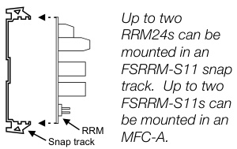  

When configured in the common system mode, relays energize or de-energize when the panel changes state. One relay is available for each of the following functions: Alarm, Supervisory, Trouble, Power Loss, Monitor.  

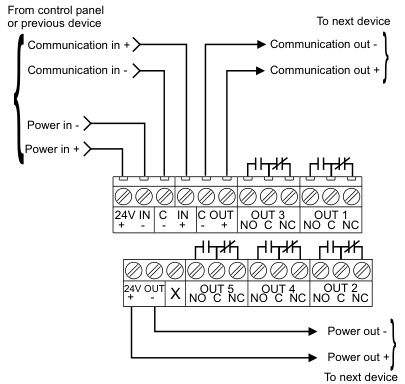  

The FSRRM24 mounts on a plastic snap track and can be installed in an MFC-A enclosure. The panel will support two RRMs of each configuration for a total of six on the 10-zone panel.  

# Remote Annunciators  

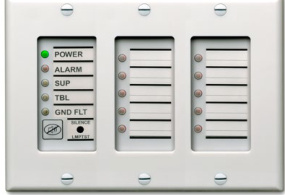  

This family of systems has several remote annunciation options. The serial remote annunciator bus can be run up to 1000 feet $(305\;\mathsf{m})$ on untwisted non-shielded 18-gauge cable. Several annunciator models round out the family to provide a range of features and functions. As many as three annunciator modules may be mounted in a standard electrical box, sharing an attractive trim plate that blends with any decor.  

The FSRSI can be installed alone or with one or more FSRZI-As. The FSRSI and FSRZI-A require trim plates (ordered separately). These are available in one, two or three gang models. Each panel will support two FSRSIs.  

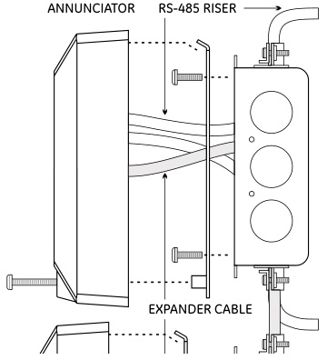  

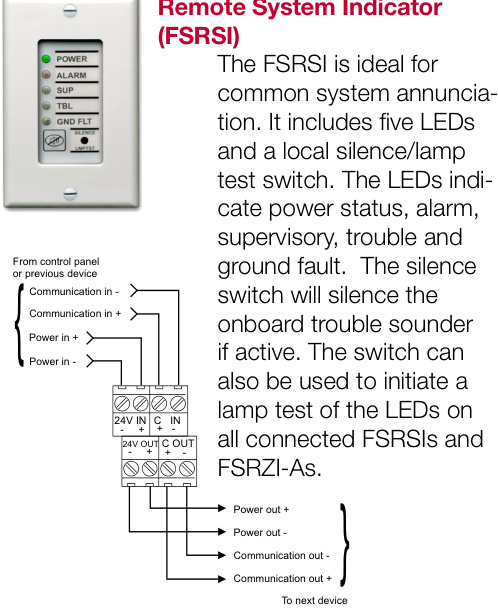  

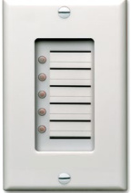  

# Remote Zone Indicator (FSRZI-A)  

The FSRZI-A is used to indicate zones in the alarm state. It contains five red LEDs. Depending on the jumper setting selected, the LEDs will indicate either IDCs 1 through 5 or IDCs 6 through 10. The panel can support two modules programmed for each selection.  

# Remote Zone Indicator (FSRZI-SA)  

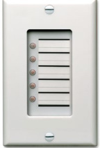  

The FSRZI-SA indicates zones in the Alarm or Supervisory state. It contains five red anMOdU yNTeIlNlGo RwIN GLEDs for EXCPAoNmDERmon, Zone, or ELMECaTtRrIiCxA activation. Depending on the jumper setting, the LEDs will indicate either IDCs 1- 5 or 6 - 10. The panel supports two modules for each selection, and can be jumper selected to provide Alarm or Supervisory indications.  

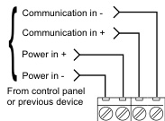  

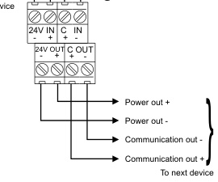  

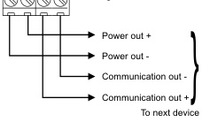  

# FSRA10, FSRA10C Remote LED annunciators  

The FSRA10 is a remote annunciator with capacity for up to ten zones. It includes ten bi-color LEDs  (red/yellow) for indicating active zones, and ten yellow LEDs for indicating zone troubles. The (C) option adds common control switches. Both versions mount to standard North American 4-inch square electrical boxes.  A surface box is also available. Works only with 10 zone panel.  

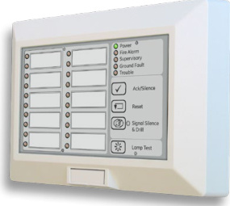  

# FSUIM Graphic Driver/Interface  

The FSUIM is a universal interface module that can be used by to drive graphic annunciators. It also allows control panels to control, or be controlled by, other control panels. The FSUIM provides five supervised switch inputs and nine dry contact relay outputs. Nine LEDs provide visual confirmation when each relay is energized. The FSUIM is shipped with a plastic snap track for mounting in an MFC-A enclosure.  

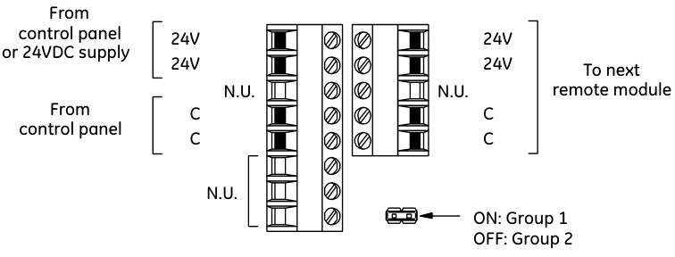  
FSRA10, FSRA10C Wiring  

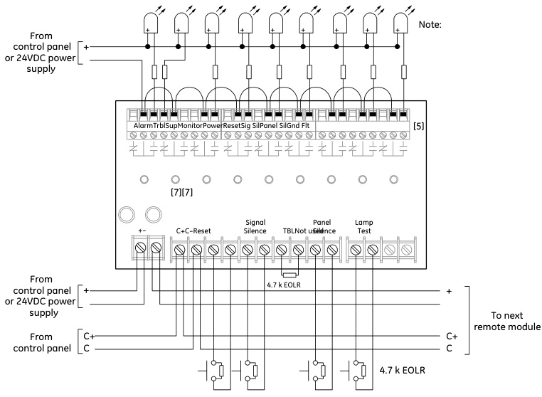  

<html><body><table><tr><td>General</td></tr><tr><td>AgencyListings UL864(S3000),ULC,CSFM,FDNY</td></tr><tr><td></td></tr></table></body></html>  

<html><body><table><tr><td>RemoteAnnunciators</td><td>FSRSlRemoteSystemIndicator</td><td>FSRZI-A/FSRZI-SARemoteZoneIndicator</td><td></td></tr><tr><td>MaximumperSystem</td><td>All panels: 2</td><td>10 zone panel:4</td><td>5 zone panel:2</td></tr><tr><td>CurrentRequirements</td><td>Standby:17mA Alarm:56mA</td><td>Standby:8mA</td><td>Alarm76mA</td></tr><tr><td>VoltageRange</td><td colspan="3">Minimum:18.8Vdc;Maximum:27.3Vdc</td></tr><tr><td>MaximumCircuitCapacitance</td><td colspan="3">0.03 μF</td></tr><tr><td>MaximumCircuitResistance</td><td colspan="3">13Ohms</td></tr><tr><td>WireSize</td><td colspan="3">18-12AWG (0.75mm2-2.5mm2)</td></tr><tr><td>Mounting</td><td>ANSI/NEMAOS1-19961-3gangelectricalbox</td><td></td><td></td></tr><tr><td>OperatingEnvironment</td><td colspan="3">Temperature:32-120°F(0-49°C);Humidity:93%RH,non-condensing</td></tr></table></body></html>  

<html><body><table><tr><td>RemoteRelayModule-FSRRM24</td><td>ConfiguredforZoneMode</td><td>ConfiguredforCommonMode</td></tr><tr><td>Maximumpersystem</td><td>10zonepanel:4;5zonepanel:2</td><td>All panels: 2</td></tr><tr><td>CurrentRequirements</td><td>Standby:10mA;Alarm:70mA</td><td>Standby:26mA; ；Alarm:70mA</td></tr><tr><td>VoltageRange</td><td>Minimum:18.8Vdc;Maximum:27.3Vdc</td><td></td></tr><tr><td>ContactRating</td><td colspan="2">1A@30Vdc</td></tr><tr><td>MaximumCircuitCapacitance</td><td colspan="2">0.03 μF</td></tr><tr><td>MaximumCircuitResistance</td><td colspan="2">13Ohms</td></tr><tr><td>WireSize</td><td colspan="2">18-12AWG(0.75mm2-2.5mm2)</td></tr><tr><td>Mounting</td><td colspan="2">Single FSRRM24 mounts in plastic track (included) or up to two FSRRM24s in an FSRRM-S11 11" trackorderedseparately.FSRRM24sshouldbeinstalledinanMFC-Aenclosure.</td></tr><tr><td>OperatingEnvironment</td><td colspan="2">Temperature:32-120°F (0-49°C);Humidity:93%RH,non-condensing</td></tr><tr><td>Dimensions</td><td colspan="2">2-3/4"W×3-3/8"H×1-1/2"D(65.9mmW×85.7mmHx38.1mmD)</td></tr></table></body></html>  

<html><body><table><tr><td>F-SeriesRemoteAnnunciators</td><td>FSRA10</td><td>FSRA10C</td></tr><tr><td>CommonControls</td><td>No</td><td>Yes</td></tr><tr><td>Compatibility</td><td>10-ZonePanelsOnly</td><td></td></tr><tr><td>Dimensions</td><td>5-5/8"×8/2"x112"in(14.3cmx21.4cmx3.8cm)</td><td></td></tr><tr><td>Mounting</td><td>NorthAmerican4-inchsquareelectricalbox</td><td></td></tr><tr><td>PowerWiring</td><td></td><td>18to12AWG(0.75to2.50sqmm)</td></tr><tr><td>DataWiring</td><td colspan="2">18 to 12 AWG(0.75 to 2.50 sq mm) twistedpair (6 twists perfoot minimum)</td></tr><tr><td>Operatingvoltage</td><td colspan="2">18.8to27.3Vdc SupplymustbeUL/ULClistedforfireprotectivesignalingsystems.</td></tr><tr><td>Standbycurrent</td><td colspan="2">Do not use FACPaccessory power outputs that are interrupted when the panel is reset. 17 mA</td></tr><tr><td>Alarmcurrent</td><td colspan="2">98mA</td></tr><tr><td>Operatingenvironment</td><td colspan="2"></td></tr><tr><td></td><td colspan="2">Temperature:32 to 120°F(0 to 49°C);Humidity:0 to93%RH,noncondensing at 90°F (32°C)</td></tr></table></body></html>  

<html><body><table><tr><td colspan="2">FSUiMUniversal InputModule</td></tr><tr><td>Mounting</td><td>MFC-Aenclosure</td></tr><tr><td>Wiresize</td><td>12 to 18 AWG (0.75 to 2.5 sq mm)</td></tr><tr><td>Operatingvoltage</td><td>21.2to27.3Vdc</td></tr><tr><td>Circuitcapacitance</td><td>0.03 μF, max.</td></tr><tr><td>Circuitresistance</td><td>13 ohms,max</td></tr><tr><td>Switch inputs</td><td>Quantity:5 End-of-lineresistor:4.7kohms12W</td></tr><tr><td>Relayoutputs</td><td>Quantity:9 Type:Common Style:Form C</td></tr><tr><td>Contactrating</td><td>30Vdcat1A(resistiveload)</td></tr><tr><td>StandbyCurrent</td><td>53 mA</td></tr><tr><td>AlarmCurrent</td><td>114 mA</td></tr><tr><td>Operatingenvironment</td><td></td></tr></table></body></html>  

<html><body><table><tr><td colspan="3">Control Panels</td><td colspan="5">FX-10R(D)</td><td colspan="3">FX-5R(D)</td></tr><tr><td colspan="2">Initiating Device Circuits - IDCs</td><td>Class B</td><td>10</td><td>8 6</td><td>4</td><td>2</td><td>0</td><td>5</td><td>3</td><td>1</td></tr><tr><td rowspan="2">(Available combinations shown at right) Notification Appliance Circuits - NACs (Available</td><td>Class A</td><td>0</td><td></td><td>1 2</td><td>3</td><td>4</td><td>5</td><td>0</td><td>1</td><td>2</td></tr><tr><td>Class B</td><td>4</td><td>2</td><td>2</td><td></td><td>0</td><td></td><td>2</td><td>0 1</td><td></td></tr><tr><td colspan="2">combinations shown at right)</td><td>Class A</td><td>0 1 1 2</td><td colspan="7">0</td></tr><tr><td colspan="3">Power Supply</td><td colspan="9">7.5 amps total 4.25 amps total</td></tr><tr><td colspan="3">NAC Voltage Rating</td><td colspan="6">24 Vfwr</td><td colspan="3">2.0 amps each</td></tr><tr><td>Maximum NAC current AC Input 120 Vac 60 Hz...</td><td colspan="2"></td><td colspan="5">2.0 amps each, 7.0 amps total</td><td colspan="3">3.5 amps total 1.25 amps</td></tr><tr><td colspan="3">230 Vac 50/60Hz...</td><td colspan="6">2.2 amps 1.1 amps</td><td colspan="4">0.6 amps</td></tr><tr><td colspan="3">BasePanel CurrentDraw Standby... Alarm...</td><td colspan="6">128 mA</td><td colspan="4">104 mA 224 mA</td></tr><tr><td colspan="3">Panel Battery Charge Capacity (sealed lead acid only)</td><td colspan="6">242 mA</td><td colspan="4">Up to 24 Ah, 10 Ah max in cabinet *</td></tr><tr><td colspan="4">Auxiliary Current</td><td colspan="6">Up to two24 Ah batteries, 18 Ah in cabinet</td><td>0.5 amps max. May be programmed as resettable.</td><td colspan="2"></td></tr><tr><td colspan="4">Auxiliary Output</td><td colspan="6"></td><td>24 Vdc regulated</td><td colspan="3"></td></tr><tr><td colspan="4">IDC Alarm Current</td><td colspan="6">3.0mA(Consultdetector compatibility listp/n3101019-EN</td><td colspan="4"></td></tr><tr><td colspan="4">IDC Circuit</td><td colspan="6">for maximum detectors per circuit)</td><td colspan="4"></td></tr><tr><td colspan="4">IDC Operating Voltage</td><td colspan="6">Maximum loop resistance: 26 Ohms; Maximum loop capacitance: 0.03 μF</td><td colspan="4">16.9 to 29 Vdc</td></tr><tr><td colspan="4">UL Detector ID</td><td colspan="6"></td><td colspan="4">100</td></tr><tr><td colspan="4">Alarm Contact (normally open Form C)</td><td colspan="6"></td><td colspan="4"></td></tr><tr><td colspan="4">Trouble Contact (Form C)</td><td colspan="6">30 Vdc @ 1 A (resistive load)</td><td colspan="4">30 Vdc @ 1 A (resistive load)</td></tr><tr><td colspan="4">Supervisory Contact (normally open Form C)</td><td colspan="6">30 Vdc @ 1 A (resistive load)</td><td colspan="4"></td></tr><tr><td colspan="4">Operating Environment</td><td colspan="6">Temperature: 32 - 120° F (0 - 49° C); Humidity: 5 - 93% RH, non-condensing</td><td colspan="4"></td></tr><tr><td colspan="4">Terminals (wire gauge)</td><td colspan="6">18 -12 AWG (0.75 mm2 - 2.5 mm2)</td><td colspan="4">Maximum resistance:13 Ohms;Maximum capacitance:0.03μF</td></tr><tr><td colspan="18">AsynchronousSerialCommunications</td></tr><tr><td colspan="4">Agency Listings</td><td colspan="5">UL864 (S3000), ULC-S527, CSFM, FDNY</td><td colspan="4"></td><td colspan="4"></td></tr></table></body></html>

\* If larger batteries are required, use an external battery cabinet.  

<html><body><table><tr><td>DACT-F-DACT (mountsinpanel)</td><td></td></tr><tr><td>Receivers</td><td>Supportstworeceiverswithtwophonenumberseach</td></tr><tr><td>CommunicationsProtocol</td><td>ContactID(SIADC-05),4/2(SIADC-02P3)</td></tr><tr><td>Programming</td><td>FrontpanelcontrolsorPCwithappropriatesoftware</td></tr><tr><td>Telephonelineconnection</td><td>Two RJ31X (plug-to-plug) cords supplied with DACT</td></tr><tr><td>Telephonelines</td><td>Twooroneloopstartlinesonthepublicswitchedtelephonenetwork.PulseorDTMF.</td></tr><tr><td>Telephonewallconnector</td><td>RJ31X/CA31Xequiv.orRJ38X/CA38Xequiv.</td></tr><tr><td>CommunicationsCompliance</td><td></td></tr><tr><td>OperatingEnvironment</td><td></td></tr><tr><td>Currentrequirements</td><td>Standby:65mA;Alarm:107mA</td></tr><tr><td>AgencyListings</td><td>UL864(S3000),CSFM,FDNY</td></tr></table></body></html>  

Dimensions   

<html><body><table><tr><td>Model</td><td>D1*</td><td>D2</td><td>D3</td><td>D4</td><td>D5*</td></tr><tr><td>Five- zone</td><td>19.5in (49.5 cm)</td><td>3.75 in (9.5 cm)</td><td>9.13 in (23.2 cm)</td><td>10.5in (26.67 cm)</td><td>14.23in (36.14 cm)</td></tr><tr><td>Ten- zone</td><td>30 in (76.2 cm)</td><td>3.75 in (9.5 cm)</td><td>7.75 in (19.7 cm)</td><td>21.27 in (54.0 cm)</td><td>15.0 in (38.1 cm)</td></tr></table></body></html>

\*Add 1½ inches (3.81 cm) to D1 and D5 dimensions for trim kit.  

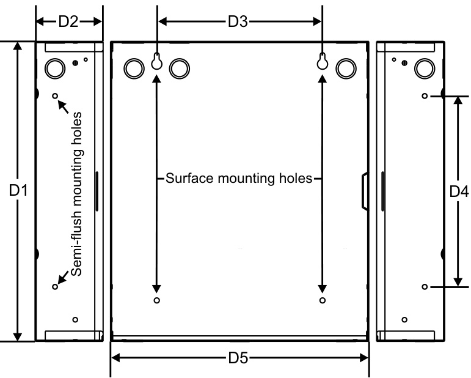  

<html><body><table><tr><td>Number</td><td>Description</td><td>(kg.)</td></tr><tr><td colspan="2"></td><td></td></tr><tr><td colspan="2">Control Panels</td><td></td></tr><tr><td>FX-10R</td><td>IDCs andNACsconvertibletosingleClassAcircuits),120VACpowersource,24VDCoutput</td><td></td></tr><tr><td>FX-10RD</td><td>IDCs and NACs convertible to single Class A circuits), upload/download DACT/modem, 120VAC power source, 24VDCoutput</td><td>30.5 (13.8)</td></tr><tr><td>FX-10RF</td><td>ConventionalFireAlarmControlPanel,Red-10ClassBIDCsand 4ClassBNACs,7.OANACpower,(Pairsof IDCsandNACsconvertibletosingleClassAcircuits),120VACpowersource,24VDCoutput,FrenchCanada</td><td></td></tr><tr><td>FX-5R</td><td>andNACsconvertibletosingleClassAcircuits)，120VACpowersource,24VDCoutput</td><td></td></tr><tr><td>FX-5RD</td><td>ConventionalFireAlarmControlPanel,Red-5ClassBIDCsand2ClassBNACs,3.5ANACpower,(Pairsof IDCs and NACs convertible to single Class A circuits),upload/download DACT/modem, 120VAC power source, 24VDC ndino</td><td>24.4 (11.1)</td></tr><tr><td>FX-5RF</td><td>ConventionalFireAlarmControlPanel,Red,5ClassBIDCsand2ClassBNACs,3.5ANACPower,120V,24Vdc Output,FrenchCanada</td><td></td></tr><tr><td>F-TRIM35R</td><td>Semi-flushtrimringforFX-5R(D)</td><td>1.7 (0.8)</td></tr><tr><td>F-TRIM10R</td><td>Semi-flushtrimringforFX-10R(D)</td><td>2.2 (1.0)</td></tr></table></body></html>  

Related Items   

<html><body><table><tr><td>F-XTR120</td><td></td></tr><tr><td>ExpanderTransformer,120Vac-ForFX-10only</td><td>4.0 (1.8)</td></tr><tr><td>EOL3.6-1.1 EOL-P1</td><td>RequiredULlistedEndofLineResistors-One3.6KOhmandone1.1KOhm.</td></tr><tr><td>Onerequired foreachIDCconfigured as combinationwaterflow and supervisory.</td><td>0.1 (0.5) RequiredULClistedEndofLineResistorPlate-includesone1.1K,3.6Kand4.7KOhmresistor 1.0 (0.5)</td></tr></table></body></html>  

<html><body><table><tr><td colspan="3">OffPremisesCommunications</td></tr><tr><td>F-DACT</td><td>Upload/dowloaddigitalCommunicator/modem/LCDmodule(Mountsincontrolpanel)</td><td>1.0 (0.5)</td></tr><tr><td>F-DACT1</td><td>Digital Communicator/Modem/LCD module (Compatible with new v4.0 control panels)</td><td></td></tr><tr><td>F-DACT1F</td><td>Digital Communicator/Modem/LCDmodule(Compatiblewithnewv4.0controlpanels),French</td><td></td></tr><tr><td>CTM</td><td>CityTieModule(Requires4”squareor2-gangNorthAmericanelectricalbox)</td><td>1.0 (0.5)</td></tr><tr><td>RPM</td><td>ReversePolarityModule(RequiresMFC-Aorotherlisted firealarmenclosure)</td><td>3.0 (1.4)</td></tr></table></body></html>  

<html><body><table><tr><td colspan="3">RemoteAnnunciation</td></tr><tr><td>FSRSI</td><td>RemoteSystemIndicator-IncludesLEDsfordisplayofPower,Alarm,Supervisory,TroubleandGroundFault, trouble sounder and silence/lamp test switch. Single gang trim plate included, multi-gang plates ordered separately.Mountsinasingleormulti-gangNorthAmericanelectricalbox.</td><td>0.3 (0.1)</td></tr><tr><td>FSRZI-A</td><td>Remote Zone Indicator - Includes red LEDs for five IDCs.Single gang trim plate included, multi-gang plates orderedseparately.Mounts insingleormulti-gangNorthAmericanelectrical box.</td><td>0.3 (0.1)</td></tr><tr><td>FSRZI-SA</td><td>Remote Zone Indicator - Includes LEDs for five IDCs. Single gang trim plate included, multi-gang plates ordered separately. Mounts in single or multi-gang North American electrical box. Jumper selected Alarm (red) or Supervisory (amber) indications.</td><td>0.3 (0.1)</td></tr><tr><td>FSAT1 FSAT2</td><td>Annunciator Trim Plate, 1 gang</td><td>0.1 (0.05)</td></tr><tr><td>FSAT3</td><td>Annunciator Trim Plate, 2 gang</td><td>0.1 (0.05) 0.1 (0.05)</td></tr><tr><td></td><td>Annunciator Trim Plate, 3 gang</td><td></td></tr><tr><td>FSAT4</td><td>Annunciator Trim Plate, 4 gang</td><td>0.1 (0.05)</td></tr><tr><td>K-FSRA10</td><td>SingleUnit10zoneremoteannunciatorforFX-10</td><td></td></tr><tr><td>K-FSRA10F</td><td>SingleUnit10zoneremoteannunciatorforFX-10,French</td><td></td></tr><tr><td>K-FSRA10C</td><td>SingleUnit10zoneremoteannunciatorforFX-10(withcommoncontrols)</td><td></td></tr><tr><td>K-FSRA10CF</td><td></td><td></td></tr><tr><td>FSUIM</td><td>CommonFunctionGraphicDriver/lnterface-9relays and5switchinputsforcommonsystemindicators&controls</td><td></td></tr></table></body></html>  

# Remote Relay Module  

<html><body><table><tr><td>FSRRM24</td><td></td><td>0.4(0.2)</td></tr><tr><td>FSRRM-S11</td><td>matrixmode.RequiresMFC-Aorotherlistedfirealarmenclosure. 11"Mountingtrack.HoldsuptotwoFSRRM24s.</td><td>0.4(0.2)</td></tr><tr><td></td><td></td><td></td></tr></table></body></html>  

# Accessories  

<html><body><table><tr><td colspan="2">MFC-A 7.0 (3.2)</td></tr><tr><td></td><td></td></tr></table></body></html>  

<html><body><table><tr><td>ProgrammingTools</td><td></td></tr><tr><td>FA-CU</td><td>Firealarmconfigurationutility.ThisCU is availablefordownloadonly.Visitwww.kiddefx.kidde.com.</td></tr></table></body></html>  