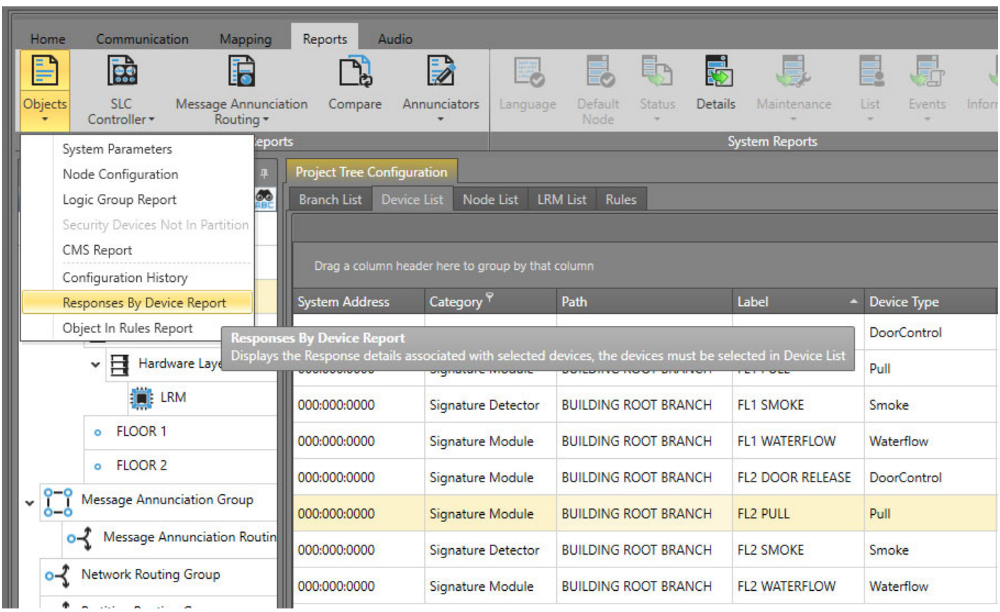
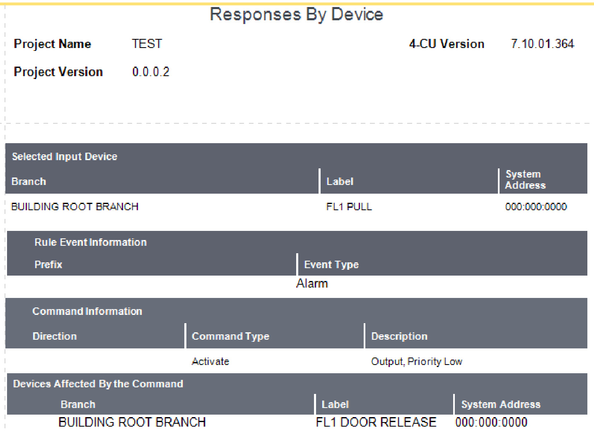
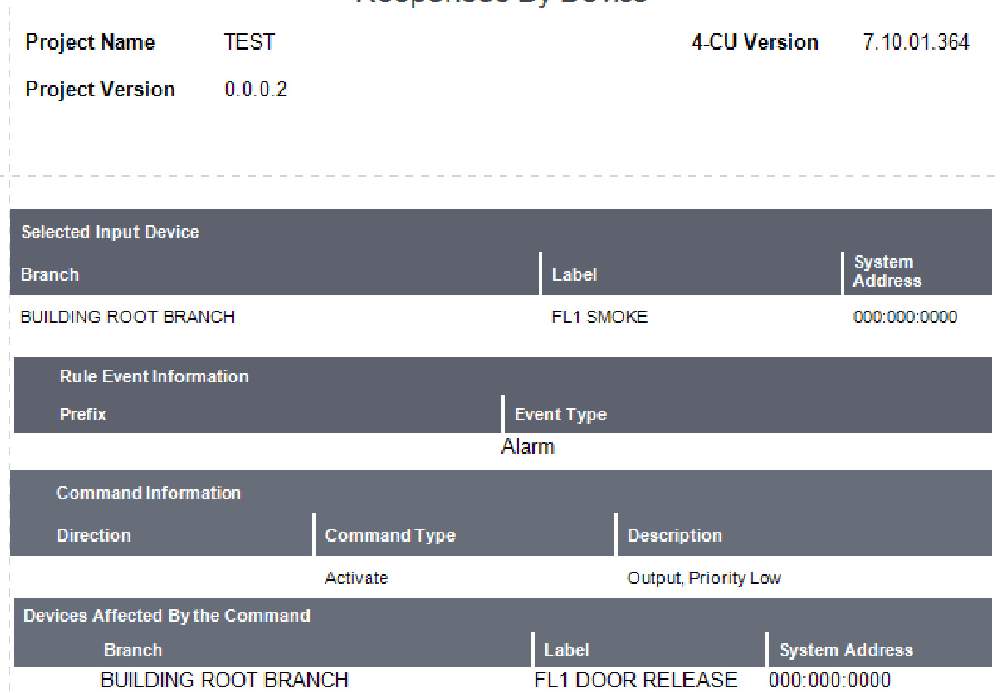
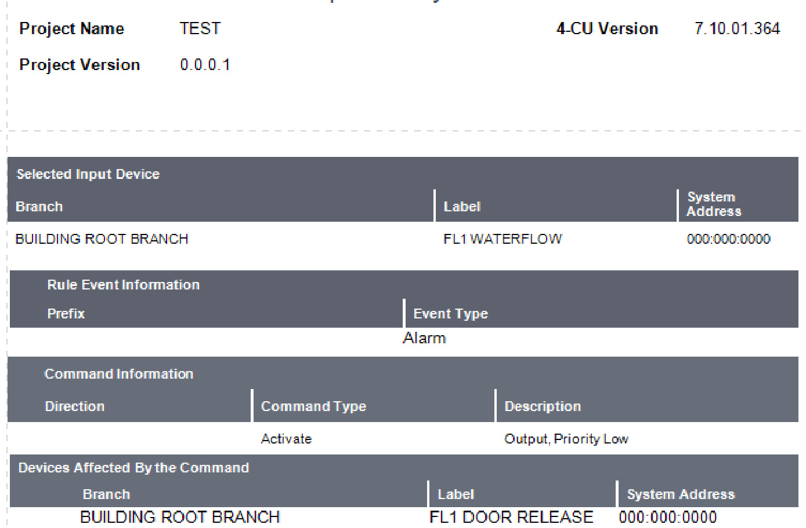

# Technical Issue Notification  

# EST4: N Var functionality in rule scripts  

Introduction  

This Technical Issue Notification is to inform you that the Edwards business is aware of an issue with N Variables. Currently when writing rules in the 4-CU which contain N Variables can result in those rules not capturing all devices within the specified range, when the device type is not specified on the input side of the rule.  

# Issue  

N Variable objects are not being found when a rule is written to include devices within the specified numerical value range  

When using the N Variable feature in the EST4 4-CU there are times based on how the rule is formatted, it will not capture devices in the rule. During these scenarios the “Input/Output Objects Rules Report” may incorrectly show that the input and output objects are being pulled from the actual rule. The examples below  show the issue being present and what you are likely to encounter.  

Example numbered list:  

1.  Device type not specified with issue present. Rule Example: //FLOOR ALARM DOOR RELEASE $@$ Alarm 'FL $<$ n:1- $.2>$ \*' : On .DoorControl 'FL $<_{\mathrm{n}>}$ DOOR RELEASE';  

The Input/Output Objects Report for the Door Release rule example:  

<html><body><table><tr><td colspan="14">Input Output Objects</td></tr><tr><td colspan="11">Inspectin: Selected Branch Inspect/Refresh</td></tr><tr><td colspan="12">Drag a column header here to group by that column</td></tr><tr><td colspan="12">Line No. Rulescript Label</td></tr><tr><td>RuleId</td><td></td><td>ROOT RULES</td><td>Rulescript Path BUILDING ROOT BRANCH</td><td>Input Label FL1 SMOKE</td><td>Input Path BUILDING ROOT</td><td>Output Label FL1DOORRELEASE</td><td>Output Path BRANCH</td><td>BUILDING ROOT On</td><td>Command</td><td>Event Alarm</td><td>Rule @Alarm'FL<n:1-2>*:On.DoorControl'FL<n>DOOR</td><td></td></tr><tr><td>田</td><td>2</td><td>ROOTRULES</td><td>BUILDING ROOT</td><td>FL1WATERFLOW</td><td>BRANCH BUILDING ROOT</td><td>FL1DOORRELEASE</td><td></td><td>BUILDING ROOT On</td><td></td><td>Alam</td><td>RELEASE'; @Alarm'FL<n:1-2>*:On.DoorControl'FL<n>DOOR</td></tr><tr><td>1 田</td><td>2</td><td>ROOT RULES</td><td>BRANCH BUILDING ROOT</td><td>FL1PULL</td><td>BRANCH BUILDING ROOT</td><td>FL1DOORRELEASE</td><td>BRANCH BUILDING ROOT</td><td>On</td><td></td><td>Alam</td><td>RELEASE; @Alarm'FL<n:1-2>*:On.DoorControlFL<n>DOOR</td></tr><tr><td>田</td><td></td><td>ROOT RULES</td><td>BRANCH BUILDING ROOT</td><td>FL2 PULL</td><td>BRANCH BUILDING ROOT</td><td>FL2DOORRELEASE</td><td>BRANCH BUILDING ROOT</td><td>On</td><td>Alam</td><td>RELEASE';</td><td>@Alarm‘FL<n:1-2>*:On.DoorControl'FL<n>DOOR</td></tr><tr><td>田</td><td>2</td><td>ROOTRULES</td><td>BRANCH BUILDING ROOT BRANCH</td><td>FL2 SMOKE</td><td>BRANCH BUILDING ROOT</td><td>FL2DOORRELEASE</td><td>BRANCH BUILDING ROOT</td><td>On</td><td>Alam</td><td>RELEASE';</td><td>@Alarm'FL<n:1-2>*:On.DoorControl'FL<n>DOOR</td></tr><tr><td></td><td></td><td>ROOT RULES</td><td>BUILDING ROOT</td><td>FL2 WATERFLOW</td><td>BRANCH BUILDING ROOT</td><td>FL2 DOOR RELEASE</td><td>BRANCH BUILDING ROOT</td><td>On</td><td>Alam</td><td>RELEASE;</td><td>@AlarmFL<n:1-2>*:On.DoorControl'FL<n>DOOR</td></tr><tr><td>田</td><td></td><td></td><td>BRANCH</td><td></td><td>BRANCH</td><td></td><td>BRANCH</td><td></td><td></td><td>RELEASE;</td><td></td></tr></table></body></html>  

(FIG.1)  

In Fig. 1 above noƟce that a check of the Input/Output Objects report shows Input devices on Floors 1&2 turning On the Door Release relays for Floors 1&2.  

In Fig.2 below running the Responses by Device Report for the Floor 1 Waterflow, only has one line. The Input device is listed but no Output devices. Based on this report we can now see that Door Release relay on Floor 1 will not acƟvate.  

<html><body><table><tr><td colspan="4">Responses By Device</td></tr><tr><td>Project Name TEST</td><td></td><td>4-CU Version</td><td>7.10.01.364</td></tr><tr><td>Project Version</td><td>0.0.0.1</td><td></td><td></td></tr><tr><td colspan="4"></td></tr><tr><td colspan="4">Selected InputDevice</td></tr><tr><td colspan="3">Branch</td></tr><tr><td colspan="3"></td></tr><tr><td colspan="3"></td></tr><tr><td colspan="3">System Label</td></tr><tr><td colspan="3">Address BUILDINGROOTBRANCH</td></tr><tr><td colspan="3">FL1WATERFLOWW 0000:000:000</td></tr></table></body></html>  

# Solution  

The technical issue is still under investigation and the Edwards business will provide you with a solution once the issue is resolved.  

Run the Responses by Device Report in the 4-CU to verify that the rulescripts is working as intended.  

How to run the Responses by Device Report:  

1.  Select an object in your branch, can be a smoke, heat, etc.   
2.  Go to the Objects button on the ribbon bar in the top left.   
3.  Select Responses by Device Report in the drop down and let the report run, picture below.  

  

Adding the Device type into the rulescript will prevent the issue. In the rules example below we are using the same rule script shown in the Issue section but have edited the rules to include the device types.  

Rule Example:  

//FLOOR ALARM DOOR RELEASE SPECIFYING INPUT EVENT BY DEVICE TYPE $@$ Alarm .Smoke 'FL $<$ n:1-2>\*' : On .DoorControl 'FL $<\mathtt{n}>$ DOOR RELEASE';  

$@$ Alarm .Pull 'FL<n:1-2>\*' : On .DoorControl 'FL $<_{\mathrm{n}>}$ DOOR RELEASE';  

$@$ Alarm .Waterflow 'FL $<$ n:1-2>\*' : On .DoorControl 'FL $<_{\mathrm{n}>}$ DOOR RELEASE';  

Once again running the Input/Output Objects Report will show our input and output devices being activated.  

(Fig.3)   

<html><body><table><tr><td colspan="11"></td></tr><tr><td>InputOutputObjects</td><td colspan="11">Inspect/Refresh</td></tr><tr><td colspan="11">Inspectin: Selected Branch</td></tr><tr><td colspan="11">Draga column headerhere togroup by thatcolumn</td></tr><tr><td>Rule Id</td><td>Line No. 7</td><td>Rulescript Label ROOTRULES</td><td>Rulescript Path BUILDINGROOT</td><td>Input Label FL1SMOKE</td><td>InputPath BUILDINGROOT</td><td>Output Label FL1DOORRELEASE</td><td>Output Psth BUILDING ROOT</td><td>Command On</td><td>Event Alarm</td><td>Rule Alarm.Smoke'FL<n:1-2>*:On.DoorControl'FL<n></td></tr><tr><td></td><td></td><td></td><td>BRANCH BUILDINGROOT</td><td>FL2SMOKE</td><td>BRANCH BUILDINGROOT</td><td></td><td>BRANCH</td><td></td><td></td><td>DOORRELEASE:</td></tr><tr><td></td><td></td><td>ROOTRULES</td><td>BRANCH</td><td></td><td>BRANCH</td><td>FL2DOORRELEASE</td><td>BUILDINGROOT BRANCH</td><td>On</td><td>Alarm</td><td>Alarm.Smoke'FL<n:1-2>*:On.DoorControl'FL<n> DOORRELEASE':</td></tr><tr><td></td><td></td><td>ROOTRULES</td><td>BUILDINGROOT BRANCH</td><td>FL1PULL</td><td>BUILDINGROOT BRANCH</td><td>FL1DOORRELEASE</td><td>BUILDINGROOT BRANCH</td><td>On</td><td>Alarm</td><td>Alarm.PullFL<n:1-2>*:On.DoorControlFL<n>DOOR RELEASE':</td></tr><tr><td></td><td></td><td>ROOTRULES</td><td>BUILDINGROOT BRANCH</td><td>FL2PULL</td><td>BUILDINGROOT BRANCH</td><td>FL2DOORRELEASE</td><td>BUILDINGROOT BRANCH</td><td>On</td><td>Alarm</td><td>Alarm.PullFL<n：1-2>":On.DoorControl'FL<n>DOOR RELEASE;</td></tr><tr><td></td><td>11</td><td>ROOTRULES</td><td>BUILDINGROOT BRANCH</td><td>FL1WATERFLOW</td><td>BUILDINGROOT BRANCH</td><td>FL1DOORRELEASE</td><td>BUILDINGROOT BRANCH</td><td>On</td><td>Alarm</td><td>Alarm.Waterlow‘FL<n:1-2>:On.DoorControl'FL<n> DOOR RELEASE':</td></tr><tr><td></td><td>11</td><td>ROOTRULES</td><td>BUILDINGROOT BRANCH</td><td>FL2WATERFLOW</td><td>BUILDINGROOT BRANCH</td><td>FL2DOORRELEASE</td><td>BUILDINGROOT BRANCH</td><td>On</td><td>Alarm</td><td>Alarm.Waterflow'FL<n:1-2>*:On.DoorControl'FL<n> DOORRELEASE</td></tr></table></body></html>  

Responses by Device Report with Device types in rule shows the input and output devices:  

Figures 4,5 &6 below  now show the door relays as part of the rule script when running the Response by Device report..  

  
(Fig.4 Response report for Pull)  

# Responses By Device  

  

(Fig.5 Response by Device Report for Smoke)  

# Responses By Device  

  

(Fig.6 Response by Device Report for Waterflow)  